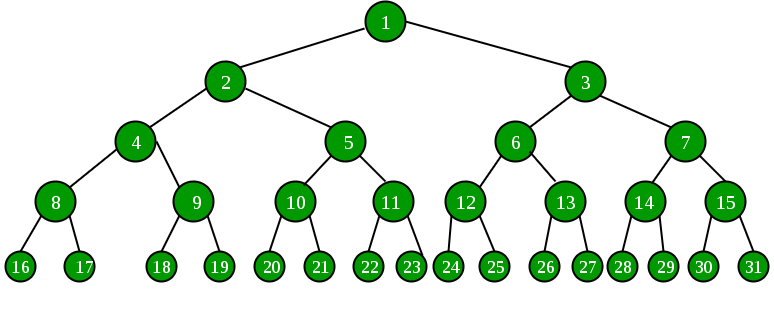

## 1. 问题描述

给出一个完全二叉树，如下所示：



按以下具体方式打印节点的层序顺序：

```
1 2 3 4 7 5 6 8 15 9 14 10 13 11 12 16 31 17 30 18 29 19 28 20 27 21 26  22 25 23 24
```

即按层序顺序打印节点，但节点应该从左侧和右侧交替。在这里，第一和第二层跟原始的层序遍历并没有区别。

而第3层：打印4(左)、7(右)、5(左)、6(右)。

而第4层：打印8(左)、15(右)、9(左)、14(右)。

而第5层：打印16(左)、31(右)、17(左)、30(右)。

## 2. 算法分析

在标层序遍历中，我们首先将根节点添加进队列，然后从队列中取出一个节点，处理(打印)它，将其子节点添加进队列。我们重复这个过程，直到队列为空。

在这里，标准的层序遍历思想将略有改变。我们将一次处理两个节点，而不是一次处理一个节点。并且在将子节点添加进队列时，
添加的顺序为：第一个节点的左子节点、第二个节点的右子节点、第一个节点的右子节点和第二个节点的左子节点。

## 3. 算法实现

```java
public class SpecificLevelOrderTraversal {
  Node root;

  public SpecificLevelOrderTraversal(Node root) {
    this.root = root;
  }

  public void printSpecificLevelOrder(Node root) {
    if (root == null)
      return;
    System.out.print(root.key);
    // 因为是完全二叉树，所以不需要检查右子节点
    if (root.left != null)
      System.out.print(" " + root.left.key + " " + root.right.key);
    // 因为是完全二叉树，所以如果左子节点为null，直接return
    if (root.left.left == null)
      return;
    Queue<Node> nodes = new LinkedList<>();
    // 将根节点的左右子节点添加进队列
    nodes.add(root.left);
    nodes.add(root.right);
    // 我们一次处理两个节点，所以我们需要两个变量来存储队列弹出的节点
    Node first;
    Node second;
    while (!nodes.isEmpty()) {
      // 弹出两个节点
      first = nodes.peek();
      nodes.remove();
      second = nodes.peek();
      nodes.remove();
      // 以相反的顺序打印first和second的子节点
      System.out.print(" " + first.left.key + " " + second.right.key);
      System.out.print(" " + first.right.key + " " + second.left.key);
      // 如果first和second节点的子节点有子节点，则以相反的顺序将它们添加进队列
      if (first.left.left != null) {
        nodes.add(first.left);
        nodes.add(second.right);
        nodes.add(first.right);
        nodes.add(second.left);
      }
    }
  }
}
```

## 4. 扩展

上面使用特定的层序遍历完全二叉树。遍历是从上到下的。在这节中，我们介绍从下到上的遍历。

对于之前案例中完全二叉树。

我们的输出应该为：

```
16 31 17 30 18 29 19 28 20 27 21 26 22 25 23 24 8 15 9 14 10 13 11 12 4 7 5 6 2 3 1
```

我们的任务是按层序顺序打印节点，但节点应从左侧和右侧交替以及从下往上的方式打印。

```
第5层：打印16(左)、31(右)、17(左)、30(右)。

第4层：打印8(左)、15(右)、9(左)、14(右)。

第3层：打印4(左)、7(右)、5(左)、6(右)。

第一和第二层跟原始的层序遍历并没有区别。
```

### 4.1 方法一

标准层序遍历思想在这里略有变化。

1. 我们将一次处理两个节点，而不是一次处理一个节点。
2. 对于弹出的节点，我们按以下方式将节点的左右子节点压入栈--第二个节点的左子节点、第一个节点的右子节点、第二个节点的右子节点和第一个节点的左子节点。
3. 并且在将子节点添加到队列时，添加的顺序将是：第一个节点的右子节点，第二个节点的左子节点，第一个节点的左子节点和第二个节点的右子节点。此外，当我们处理两个队列节点时。
4. 最后从栈中弹出所有节点并打印它们。

```java
public class SpecificLevelOrderTraversal {
  Node root;

  public SpecificLevelOrderTraversal(Node root) {
    this.root = root;
  }

  public void printReverseSpecificLevelOrder(Node root) {
    Stack<Node> stack = new Stack<>();
    stack.push(root);
    if (root.left != null) {
      stack.push(root.right);
      stack.push(root.left);
    }
    if (root.left.left != null)
      printReverseSpecificLevelOrderUtil(root, stack);
    while (!stack.isEmpty()) {
      System.out.print(stack.peek().key + " ");
      stack.pop();
    }
  }

  private void printReverseSpecificLevelOrderUtil(Node root, Stack<Node> stack) {
    if (root == null)
      return;
    Queue<Node> queue = new LinkedList<>();
    queue.add(root.left);
    queue.add(root.right);
    Node first;
    Node second;
    while (!queue.isEmpty()) {
      first = queue.peek();
      queue.remove();
      second = queue.peek();
      queue.remove();
      stack.push(second.left);
      stack.push(first.right);
      stack.push(second.right);
      stack.push(first.left);
      if (first.left.left != null) {
        queue.add(first.right);
        queue.add(second.left);
        queue.add(first.left);
        queue.add(second.right);
      }
    }
  }
}
```