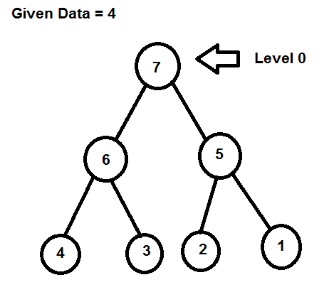
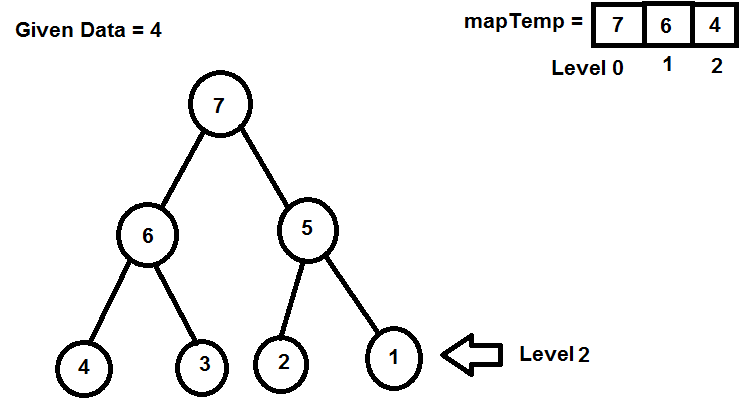
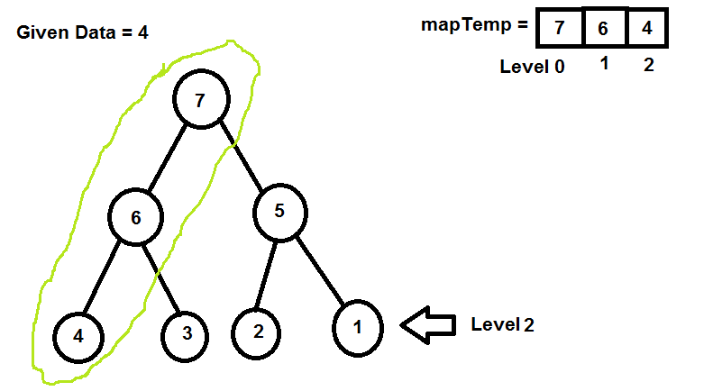
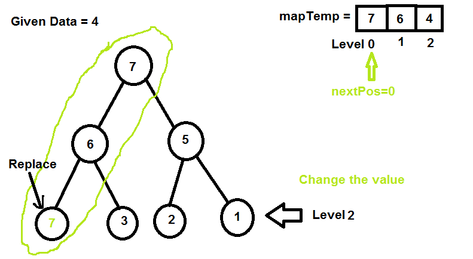
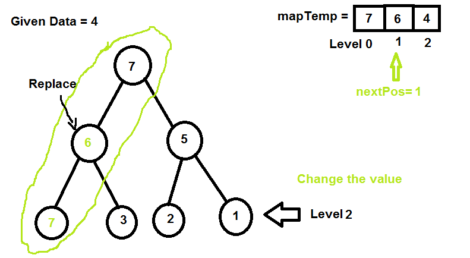
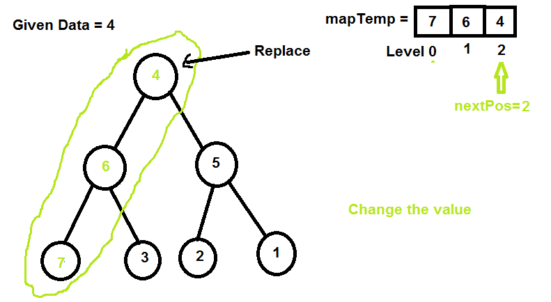

## 1. 问题描述

给定一棵树和节点数据，任务是反转到该特定节点的路径。

示例：

```
输入: 
            7
         /    
        6       5
       /      / 
      4  3     2  1    
Data = 4 
输出: 树的中序遍历为7 6 3 4 2 5 1


输入:
            7
         /    
        6       5
       /      / 
      4  3     2  1   
Data = 2 
输出: 树的中序遍历为4 6 3 2 7 5 1
```

## 2. 算法分析

其思想是使用map按路径层级存储。



找到节点路径并将其存储在map中



路径为



用map的nextPos索引值替换该位置



递增nextpos索引并替换下一个值



递增nextpos索引并替换下一个值



## 3. 算法实现

```java
public class ReverseTreePath {
  Node root;

  public ReverseTreePath(Node root) {
    this.root = root;
  }

  public void reverseTreePath(Node root, int data) {
    // 存储该路径在每一层的数据
    Map<Integer, Integer> temp = new HashMap<>();
    // 用于替换数据
    INT nextPos = new INT();
    nextPos.data = 0;
    reverseTreePathUtil(root, data, temp, 0, nextPos);
  }

  // 我们需要反转从root到data的路径
  // 'level'是当前层
  // 'temp'存储该路径每一层的节点
  // 'nextPos'用于选择下一个节点进行反转
  private Node reverseTreePathUtil(Node root, int data, Map<Integer, Integer> temp, int level, INT nextPos) {
    if (root == null)
      return null;
    // 最终条件，如果找到key为data的节点
    if (root.key == data) {
      // 存储当前节点的值，以及所在的层
      temp.put(level, root.key);
      // change the root value with the current next element of the map
      // 用map的当前下一个元素更改root的值
      root.key = temp.get(nextPos.data);
      nextPos.data++;
      return root;
    }
    // 按特定层存储数据
    temp.put(level, root.key);
    Node left, right = null;
    left = reverseTreePathUtil(root.left, data, temp, level + 1, nextPos);
    if (left == null)
      right = reverseTreePathUtil(root.right, data, temp, level + 1, nextPos);
    if (left != null || right != null) {
      root.key = temp.get(nextPos.data);
      nextPos.data++;
      return left != null ? left : right;
    }
    return null;
  }

  public void printInOrder(Node root) {
    if (root != null) {
      printInOrder(root.left);
      System.out.print(root.key + " ");
      printInOrder(root.right);
    }
  }

  static class INT {
    int data;
  }
}

class ReverseTreePathUnitTest {

  @Test
  void givenBinaryTree_whenReverseTreePath_thenCorrect() {
    ReverseTreePath tree = createTree();
    int data = 4;
    tree.reverseTreePath(tree.root, data);
    tree.printInOrder(tree.root);
  }

  private ReverseTreePath createTree() {
    Node root = new Node(7);
    root.left = new Node(6);
    root.right = new Node(5);
    root.left.left = new Node(4);
    root.left.right = new Node(3);
    root.right.left = new Node(2);
    root.right.right = new Node(1);
    return new ReverseTreePath(root);
  }
}
```