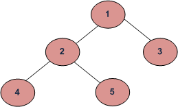
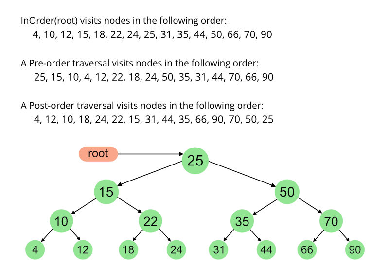

## 1. 简介

与只有一种逻辑遍历它们的线性数据结构(数组、链表、队列、栈等)不同，树可以以不同的方式遍历。以下是遍历树的常用方法。



深度优先遍历：

a): 中序(left root right)：4 2 5 1 3

a): 前序(root left right)：1 2 4 5 3

a): 后序(left right root)：4 5 2 3 1

广度优先(或层序)遍历：1 2 3 4 5

## 2. 中序遍历

```
algorithm inOrder(Node tree)
1. 遍历左子树，即调用inOrder(tree.left)
2. 访问根节点
1. 遍历右子树，即调用inOrder(tree.right)
```

在二叉搜索树(BST)的情况下，中序遍历以非递减顺序给出节点。为了以非递增顺序获取BST的节点，可以使用中序遍历的变体，其中中序遍历是反向的。

示例：上图中的中序遍历是4 2 5 1 3。

## 3. 前序遍历

```
algorithm preOrder(Node tree)
1. 访问根节点
2. 遍历左子树，即调用preOrder(tree.left)
3. 遍历右子树，即调用preOrder(tree.right)
```

前序遍历用于创建树的副本。前序遍历也可以用于获取表达式树上的前缀表达式。

示例：上图的前序遍历是1 2 4 5 3。

## 4. 后序遍历

```
algorithm postOrder(Node tree)
1. 遍历左子树，即调用postOrder(tree.left)
2. 遍历右子树，即调用postOrder(tree.right)
3. 访问根节点
```

后序遍历用于删除树。后序遍历对于获取表达式树的后缀表达式也很有用。

示例：上图的后序遍历是4 5 2 3 1。

## 5. 算法实现

```java
public class BinaryTraversal {
  Node root;

  BinaryTraversal() {
    root = null;
  }

  void preOrder(Node root) {
    if (root == null)
      return;
    System.out.print(root.key + " ");
    preOrder(root.left);
    preOrder(root.right);
  }

  void inOrder(Node root) {
    if (root == null)
      return;
    inOrder(root.left);
    System.out.print(root.key + " ");
    inOrder(root.right);
  }

  void postOrder(Node root) {
    if (root == null)
      return;
    postOrder(root.left);
    postOrder(root.right);
    System.out.print(root.key + " ");
  }
}
```

还有一个例子：



## 6. 复杂度分析

时间复杂度：O(n)

让我们看看不同的极端情况。

对于涉及树遍历的所有问题，复杂度函数T(n)可以定义为：

> T(n) = T(k) + T(n – k – 1) + c

其中k是根节点一侧的节点数，n-k-1是另一侧的节点数。

让我们来分析一下边界条件。

情况1：倾斜树(其中一个子树为空，另一个子树不为空)。

在这种情况下，k为0。

```
T(n) = T(0) + T(n-1) + c 
T(n) = 2T(0) + T(n-2) + 2c 
T(n) = 3T(0) + T(n-3) + 3c 
T(n) = 4T(0) + T(n-4) + 4c
………………………………………… 
…………………………………………
T(n) = (n-1)T(0) + T(1) + (n-1)c 
T(n) = nT(0) + (n)c

T(0)的值将是某个常数，例如d。(遍历一棵空树需要一些常量时间)

T(n) = n(c+d) 
T(n) = Θ(n) (Theta of n)
```

情况2：左右子树的节点数相等。

```
T(n) = 2T(|_n/2_|) + c
```

对于主方法，此递归函数采用标准形式(T(n) = aT(n/b) + (-)(n))。如果我们通过主方法解决它，我们得到(-)(n)

辅助空间：如果我们不考虑函数调用的堆栈大小，那么为O(1)，否则为O(h)，其中h是树的高度。

倾斜树的高度为n(元素个数)，因此最坏情况下的空间复杂度为O(n)，平衡树的高度为(Logn)，因此最佳情况下的空间复杂度为O(Log n)。