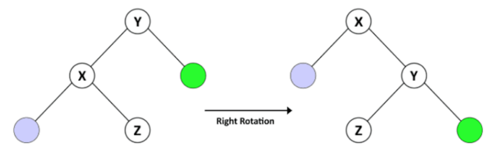
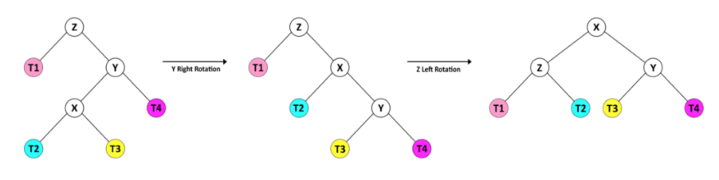
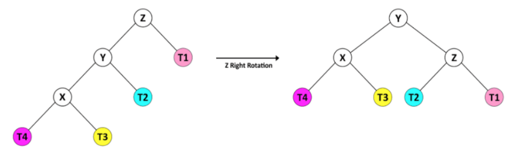
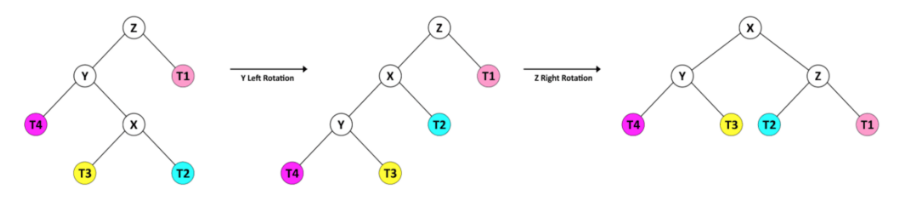

## 1. 概述

在本文中，我们将介绍AVL树，并介绍用于插入、删除和搜索值的算法。

## 2. 什么是AVL树？

AVL 树以其发明者Adelson-Velsky和Landis命名，是一种自平衡二叉搜索树(BST)。

自平衡树是一种二叉搜索树，它根据一些平衡规则来平衡插入和删除后树的高度。

BST的最坏情况下的时间复杂度是树高度的函数。具体来说，就是从树的根到节点的最长路径。对于具有N个节点的BST，假设每个节点只有0个或1个子节点。
因此它的高度等于N，最坏情况下的搜索时间为O(N)。所以我们在BST中的主要目标是保持树的最大高度接近log(N)。

节点N的平衡因子是height(right(N)) - height(left(N))。在AVL树中，节点的平衡因子只能是1、0或-1值之一。

让我们为树定义一个节点对象：

```java
public class Node {
  int key;
  int height;
  Node left;
  Node right;
  // ...
}
```

接下来，让我们定义AVLTree：

```java
public class AVLTree {
  private Node root;

  private void updateHeight(Node n) {
    n.height = 1 + Math.max(height(n.left), height(n.right));
  }

  private int height(Node n) {
    return n == null ? -1 : n.height;
  }

  public int getBalance(Node n) {
    return (n == null) ? 0 : height(n.right) - height(n.left);
  }
}
```

## 3. 如何平衡AVL树？

AVL树在插入或删除一个节点后检查其节点的平衡因子。如果节点的平衡因子大于1或小于-1，则树会重新平衡自身。

有两种操作可以重新平衡树：

+ 右旋
+ 左旋

### 3.1 右旋

假设我们有一个名为T1的BST，Y为根节点，X为Y的左子节点，Z为X的右子节点。鉴于BST的特征，我们知道 X < Z < Y。

在Y向右旋转之后，我们有一个名为T2的树，其中X作为根节点，Y作为X的右子节点，Z作为Y的左子节点。T2仍然是一个BST，因为它保持 X < Z < Y的顺序。



让我们看看AVLTree的右旋操作：

```
Node rotateRight(Node y) {
  Node x = y.left;
  Node z = x.right;
  x.right = y;
  y.left = z;
  updateHeight(y);
  updateHeight(x);
  return x;
}
```

### 3.2 左旋

假设一个名为T1的BST，以Y为根节点，X为Y的右子节点，Z为X的左子节点。鉴于此，我们知道 Y < Z < X。

在Y左旋之后，我们有一个名为T2的树，其中X作为根节点，Y作为X的左子节点，Z作为Y的右子节点。T2仍然是一个BST，因为它保持 Y < Z < X 的顺序。


让我们看看AVLTree的左旋操作：

```
private Node rotateLeft(Node y) {
  Node x = y.right;
  Node z = x.left;
  x.left = y;
  y.right = z;
  updateHeight(y);
  updateHeight(x);
  return x;
}
```

### 3.3 重新平衡

我们可以在更复杂的组合中使用右旋和左旋操作来保持AVL树在其节点发生任何变化后保持平衡。在不平衡结构中，至少一个节点的平衡因子等于2或-2。让我们看看如何在这些情况下平衡树。

当节点Z的平衡因子为2时，以Z为根节点的子树处于这两种状态之一，将Y视为Z的右子节点。

对于第一种情况，Y的右子节点(X)的高度大于左子节点(T2)的高度。我们可以通过Z的左旋轻松地重新平衡树。


对于第二种情况，Y的右子节点(T4)的高度小于左子节点(X)的高度。这种情况需要组合旋转操作。



在这种情况下，我们首先将Y向右旋转，因此树的形状与前一种情况相同。然后我们可以通过Z的左旋来重新平衡树。

另外，当节点Z的平衡因子为-2时，其子树处于这两种状态之一，因此我们将Z视为根节点，将Y视为其左子节点。

Y的左子节点的高度大于其右子节点的高度，所以我们用Z的右旋来平衡树。



或者在第二种情况下，Y的右子节点的高度大于其左子节点的高度。



因此，首先，我们将其转换为前一种形状，左旋Y，然后我们右旋Z平衡树。

让我们看看AVLTree的重新平衡操作：

```
Node rebalance(Node z) {
  updateHeight(z);
  int balance = getBalance(z);
  if (balance > 1) {
    if (height(z.right.right) > height(z.right.left)) {
      z = rotateLeft(z);
    } else {
      z.right = rotateRight(z.right);
      z = rotateLeft(z);
    }
  } else if (balance < -1) {
    if (height(z.left.left) > height(z.left.right)) {
      z = rotateRight(z);
    } else {
      z.left = rotateLeft(z.left);
      z = rotateRight(z);
    }
  }
  return z;
}
```

我们将在为从更改节点到根的路径中的所有节点插入或删除一个节点后使用重新平衡。

## 4. 插入节点

当我们要在树中插入一个键时，我们必须找到它的正确位置以遵循BST规则。所以我们从根节点开始，将根节点的值与新的键进行比较。如果key更大，我们继续向右--否则，我们继续找左子节点。

一旦我们找到合适的父节点，然后我们将新键作为节点添加到左侧或右侧，具体取决于值。

插入节点后，我们的树保持BST状态，但它可能不是AVL树。因此，我们检查平衡因子并为从新节点到根节点路径中的所有节点重新平衡BST。

让我们看一下插入操作：

```
public void insert(int key) {
  root = insert(root, key);
}

private Node insert(Node node, int key) {
  if (node == null) {
    return new Node(key);
  } else if (node.key > key) {
    node.left = insert(node.left, key);
  } else if (node.key < key) {
    node.right = insert(node.right, key);
  } else {
    throw new RuntimeException("duplicate key!");
  }
  return rebalance(node);
}
```

重要的是要记住一个key在树中是唯一的--没有两个节点共享同一个key。

插入算法的时间复杂度是高度的函数。由于我们的树是平衡的，假设在最坏情况下时间复杂度为O(log(N))。

## 5. 删除节点

要从树中删除key，首先必须在BST中找到它。

在我们找到节点(称为Z)之后，我们必须找到新的候选节点作为它在树中的替换节点。如果Z是叶子节点，则候选节点为空。
如果Z只有一个子节点，这个子节点就是候选节点，但如果Z有两个子节点，则过程有点复杂。

假设Z的右子节点称为Y。首先，我们找到Y的最左侧节点并将其称为X。然后，我们将Z的新值设置为X的值，并从Y中删除X。

最后，我们在最后调用rebalance()方法来保持BST为AVL树。

以下是我们的delete()方法：

```
public void delete(int key) {
  root = delete(root, key);
}

private Node delete(Node node, int key) {
  if (node == null) {
    return node;
  } else if (node.key > key) {
    node.left = delete(node.left, key);
  } else if (node.key < key) {
    node.right = delete(node.right, key);
  } else {
    if (node.left == null || node.right == null) {
      node = node.left != null ? node.left : node.right;
    } else {
      Node mostLeftChild = mostLeftChild(node.right);
      node.key = mostLeftChild.key;
      node.right = delete(node.right, node.key);
    }
  }
  if (node != null) {
    node = rebalance(node);
  }
  return node;
}
```

删除算法的时间复杂度是树的高度的函数。与插入方法类似，最坏情况下的时间复杂度为O(log(N))。

## 6. 搜索节点

在AVL树中搜索节点与使用任何BST相同。

从树的根节点开始，将key与根节点的值进行比较。如果key等于，则返回节点。如果key更大，则从右子树开始搜索，否则从左子树继续搜索。

搜索的时间复杂度是高度的函数。最坏情况下的时间复杂度为O(log(N))。

让我们看看示例代码：

```
public Node find(int key) {
  Node current = root;
  while (current != null) {
    if (current.key == key) {
      break;
    }
    current = current.key > key ? current.left : current.right;
  }
  return current;
}
```