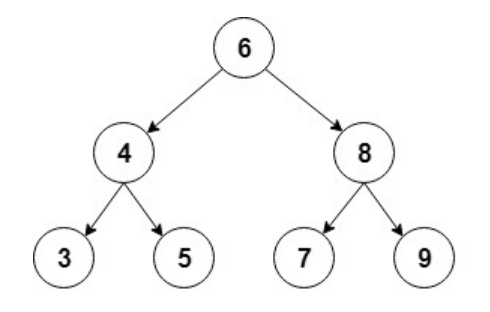

## 1. 概述

在本文中，我们将介绍二叉树在Java中的实现。我们将使用包含int值的排序二叉树。

## 2. 二叉树

二叉树是一种递归数据结构，其中每个节点最多可以有2个子节点。

二叉树的一种常见类型是二叉搜索树，其中每个节点的值都大于或等于左子树中的节点值，小于或等于右子树中的节点值。

以下是这种二叉树的直观表示：



对于实现，我们将使用一个辅助节点类来存储int值，并保留对每个子节点的引用：

```java
static class Node {
  int value;
  Node left;
  Node right;

  public Node(int value) {
    this.value = value;
    left = null;
    right = null;
  }
}
```

然后，我们将添加树的起始节点，通常称为根(root)节点：

```java
public class BinaryTree {

  Node root;
  // ...
}
```

## 3. 常见操作

现在让我们看看我们可以在二叉树上执行的最常见的操作。

### 3.1 插入元素

我们要介绍的第一个操作是插入新节点。

首先，我们必须找到要添加新节点的位置，以保持树的排序。我们将从根节点开始遵循以下规则：

+ 如果新节点的值小于当前节点的值，则转到左子节点
+ 如果新节点的值大于当前节点的值，则转到右子节点
+ 当当前节点为空时，我们到达了一个叶节点，我们可以在该位置插入新节点

然后，我们将创建一个递归方法来执行插入：

```
private Node addRecursive(Node current, int value) {
  if (current == null) {
    return new Node(value);
  }
  if (value < current.value) {
    current.left = addRecursive(current.left, value);
  } else if (value > current.value) {
    current.right = addRecursive(current.right, value);
  }
  return current;
}
```

接下来我们将创建从根节点开始递归的公共方法：

```
public void add(int value) {
  root = addRecursive(root, value);
}
```

让我们看看如何使用此方法从我们的示例中创建树：

```
private BinaryTree createBinaryTree() {
  BinaryTree binaryTree = new BinaryTree();
  binaryTree.add(6);
  binaryTree.add(4);
  binaryTree.add(8);
  binaryTree.add(3);
  binaryTree.add(5);
  binaryTree.add(7);
  binaryTree.add(9);
  return binaryTree;
}
```

### 3.2 查找元素

现在让我们添加一个方法来检查树中是否包含特定值。

与前面一样，我们将首先创建一个遍历树的递归方法：

```
private boolean containsNodeRecursive(Node current, int value) {
  if (current == null) {
    return false;
  }
  if (value == current.value) {
    return true;
  }
  return value < current.value 
      ? containsNodeRecursive(current.left, value) 
      : containsNodeRecursive(current.right, value);
}
```

在这里，我们通过将要查找的值与当前节点中的值进行比较来搜索该值；然后，我们将根据结果在左或右子节点中继续。

接下来，我们将创建从根节点开始的公共方法：

```
public boolean containsNode(int value) {
  return containsNodeRecursive(root, value);
}
```

然后，我们将创建一个简单的测试来验证树中是否确实包含插入的元素：

```
@Test
void givenABinaryTree_WhenAddingElements_ThenTreeContainsThoseElements() {
  BinaryTree bt = createBinaryTree();
  assertTrue(bt.containsNode(6));
  assertTrue(bt.containsNode(4));
  assertFalse(bt.containsNode(1));
}
```

所有添加的节点都应包含在树中。

### 3.3 删除元素

另一个常见操作是从树中删除节点。

首先，我们必须以与之前类似的方式找到要删除的节点：

```
  private Node deleteRecursive(Node current, int value) {
    if (current == null) {
      return null;
    }
    if (value == current.value) {
      // Case 1: no children
      if (current.left == null && current.right == null) {
        return null;
      }
      // Case 2: only 1 child
      if (current.right == null) {
        return current.left;
      }
      if (current.left == null) {
        return current.right;
      }
      // Case 3: 2 children
      int smallestValue = findSmallestValue(current.right);
      current.value = smallestValue;
      current.right = deleteRecursive(current.right, smallestValue);
      return current;
    }
    if (value < current.value) {
      current.left = deleteRecursive(current.left, value);
      return current;
    }
    current.right = deleteRecursive(current.right, value);
    return current;
  }
```

找到要删除的节点后，有三种主要的不同情况：

+ 节点没有子节点 - 这是最简单的情况；我们只需要在它的父节点中用null替换这个节点。
+ 一个节点只有一个子节点 - 在父节点中，我们将此节点替换为其唯一的子节点。
+ 节点有两个子节点 - 这是最复杂的情况，因为它需要树重组。

让我们看看当节点是叶节点(没有子节点)时如何实现第一种情况：

```
if (current.left == null && current.right == null) {
  return null;
}
```

现在，我们继续处理节点有一个子节点的情况：

```
if (current.right == null) {
  return current.left;
}
if (current.left == null) {
  return current.right;
}
```

在这里，我们返回非空子节点，以便将其分配给父节点。

最后，我们需要处理节点有两个子节点的情况。

首先，我们需要找到将替换已删除节点的节点。我们使用即将被删除节点的右子树的最小节点：

```
private int findSmallestValue(Node root) {
  return root.left == null ? root.value : findSmallestValue(root.left);
}
```

然后我们将最小值分配给要删除的节点，然后，我们将从右子树中删除它：

```
int smallestValue = findSmallestValue(current.right);
current.value = smallestValue;
current.right = deleteRecursive(current.right, smallestValue);
return current;
```

最后，我们将创建从根节点开始删除的公共方法：

```
public void delete(int value) {
  root = deleteRecursive(root, value);
}
```

现在，让我们检查删除操作是否按预期执行：

```
@Test
void givenABinaryTree_WhenDeletingElements_ThenTreeDoesNotContainThoseElements() {
  BinaryTree bt = createBinaryTree();
  assertTrue(bt.containsNode(9));
  bt.delete(9);
  assertFalse(bt.containsNode(9));
}
```

## 4. 遍历树

在本节中，我们将探讨遍历树的不同方法，详细介绍深度优先和广度优先搜索。

我们将使用之前创建的树，并检查每种情况的遍历顺序。

### 4.1 深度优先搜索

深度优先搜索是一种遍历方式，在搜索下一个兄弟节点之前，先在每个孩子节点身上深入的搜索。

有几种方法可以执行深度优先搜索：中序、前序和后序。

中序遍历首先访问左子树，然后访问根节点，最后访问右子树：

```
public void traverseInOrder(Node node) {
  if (node != null) {
    traverseInOrder(node.left);
    visit(node.value);
    traverseInOrder(node.right);
  }
}
```

如果调用此方法，控制台输出将显示中序(顺序)遍历：

```
3 4 5 6 7 8 9
```

前序遍历首先访问根节点，然后是左子树，最后是右子树：

```
public void traversePreOrder(Node node) {
  if (node != null) {
    visit(node.value);
    traversePreOrder(node.left);
    traversePreOrder(node.right);
  }
}
```

让我们检查前序遍历的控制台输出：

```
6 4 3 5 8 7 9
```

后序遍历访问左子树、右子树，最后访问根节点：

```
public void traversePostOrder(Node node) {
  if (node != null) {
    traversePostOrder(node.left);
    traversePostOrder(node.right);
    visit(node.value);
  }
}
```

以下后序遍历的输出：

```
3 5 4 7 9 8 6
```

### 4.2 广度优先搜索

这是另一种常见的遍历类型，它在进入下一层节点之前访问一层的所有节点。

这种遍历也称为层序顺序，从根开始，从左到右访问树的所有层。

对于实现，我们将使用队列来按顺序保存每层的节点。我们将从列表中提取每个节点，打印其值，然后将其子节点添加到队列中：

```
public void traverseLevelOrder() {
  if (root == null) {
    return;
  }
  Queue<Node> nodes = new LinkedList<>();
  nodes.add(root);
  while (!nodes.isEmpty()) {
    Node node = nodes.remove();
    System.out.print(" " + node.value);
    if (node.left != null) {
      nodes.add(node.left);
    }
    if (node.right != null) {
      nodes.add(node.right);
    }
  }
}
```

在这种情况下，节点的顺序为：

```
6 4 8 3 5 7 9
```