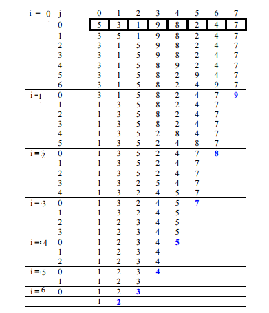

## 1. 概述

冒泡排序是最简单的排序算法，如果相邻元素的顺序错误，则通过重复交换相邻元素来工作。

该算法不适用于大型数据集，因为它平均和最坏情况下的时间复杂度都很高。

## 2. 算法思想

考虑一个数组arr[]={5，1，4，2，8}

第一步：

+ 冒泡排序从前两个元素开始，比较它们以检查哪个元素更大。
    + ( 5 1 4 2 8 ) => ( 1 5 4 2 8 ) 这里，算法比较前两个元素，因为5 > 1，因此开始交换。
    + ( 1 5 4 2 8 ) => ( 1 4 5 2 8 ) 因为5 > 4，交换4跟5。
    + ( 1 4 5 2 8 ) => ( 1 4 2 5 8 ) 因为5 > 2，交换2跟5。
    + ( 1 4 2 5 8 ) => ( 1 4 2 5 8 ) 现在，由于这些元素已经按顺序排列(8 > 5)，所以不需要交换它们。

第二步：

+ 在第二次迭代中，它应该是这样的：
    + ( 1 4 2 5 8 ) –> ( 1 4 2 5 8 )
    + ( 1 4 2 5 8 ) –> ( 1 2 4 5 8 ) 因为4 > 2，交换4跟2。
    + ( 1 2 4 5 8 ) –> ( 1 2 4 5 8 )
    + ( 1 2 4 5 8 ) –> ( 1 2 4 5 8 )

第三步：

+ 现在，数组已经排序，但我们的算法不知道它是否已完成。
+ 该算法需要一个完整的迭代过程，无需任何交换即可知道它已排序。
    + ( 1 2 4 5 8 ) –> ( 1 2 4 5 8 )
    + ( 1 2 4 5 8 ) –> ( 1 2 4 5 8 )
    + ( 1 2 4 5 8 ) –> ( 1 2 4 5 8 )
    + ( 1 2 4 5 8 ) –> ( 1 2 4 5 8 )

如下图所示：



## 3. 算法实现

以下是冒泡排序的实现。

```java
public class BubbleSort {

  public static void sort(int[] arr) {
    int n = arr.length;
    for (int i = 0; i < n - 1; i++) {
      for (int j = 0; j < n - i - 1; j++) {
        if (arr[j + 1] < arr[j]) {
          int temp = arr[j];
          arr[j] = arr[j + 1];
          arr[j + 1] = temp;
        }
      }
    }
  }
}
```

## 4. 冒泡排序的优化

+ 即使数组已排序，上述方法也始终运行O(n<sup>2</sup>)次。
+ 如果内循环没有发生任何交换，可以通过退出方法来优化它。

以下是上述方法的优化实现：

```
public static void optimizationSort(int[] arr) {
  int n = arr.length;
  for (int i = 0; i < n - 1; i++) {
    boolean isSwapped = false;
    for (int j = 0; j < n - i - 1; j++) {
      if (arr[j + 1] < arr[j]) {
        int temp = arr[j + 1];
        arr[j + 1] = arr[j];
        arr[j] = temp;
        isSwapped = true;
      }
    }
    if (!isSwapped) {
      return;
    }
  }
}
```

## 5. 复杂度分析

时间复杂度：O(N<sup>2</sup>)

辅助空间：O(1)

冒泡排序的最坏情况分析：

当数组的元素按降序排列时，会出现冒泡排序的最坏情况。

在最坏的情况下，对给定数组排序所需的迭代总数为(n-1)。其中，“n”是数组中存在的元素个数。

在第1次迭代时：比较次数=(n-1)；交换次数=(n-1)。

在第2次迭代时：比较次数=(n-2)；交换次数=(n-2)。

在第3次迭代时：比较次数=(n-3)；交换次数=(n-3)。

......

在第n-1次迭代时：比较次数=1；交换次数=1。

最坏情况下：

+ 总交换次数 = 总比较次数

+ 总比较次数 = n(n-1)/2

+ 总交换次数 = n(n-1)/2

最坏和平均情况时间复杂度：O(N<sup>2</sup>)。最坏的情况是对反向数组进行排序。

最佳情况时间复杂度：O(N)。最佳情况发生在数组已排序时。

辅助空间：O(1)

冒泡排序的边界情况是什么？

当元素已经排序时，冒泡排序所需的时间最短(n阶)。因此，最好先检查数组是否已经排序，以避免O(N<sup>2</sup>)时间复杂度。

冒泡排序中排序是否就地进行？

是的，冒泡排序在不使用任何主要数据结构的情况下执行相邻对元素的交换。因此，冒泡排序算法是一种就地算法。

冒泡排序算法是否稳定？

是的，气泡排序算法是稳定的。

什么情况下使用冒泡算法？

由于其简单性，冒泡排序通常用于引入排序算法的概念，作为学习排序算法的第一步。

在计算机图形学中，它能够在几乎排序的数组中检测到非常小的错误(如仅交换两个元素)，并以线性复杂度(2n)修复它，因此很受欢迎。

例如，它用于多边形填充算法，其中边界线在特定扫描线(平行于x轴的线)处按其x坐标排序，随着y的增加，其顺序更改(两个元素交换)仅在两条线的交点处(来源：维基百科)。