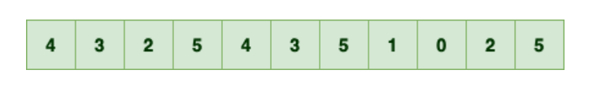
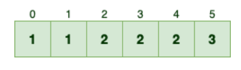
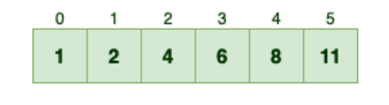
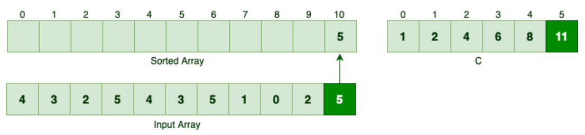
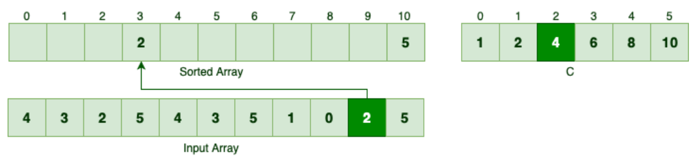
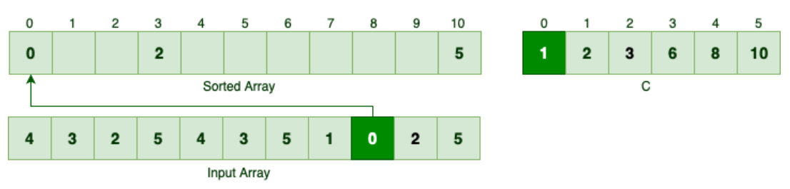
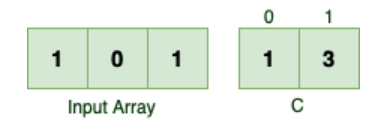
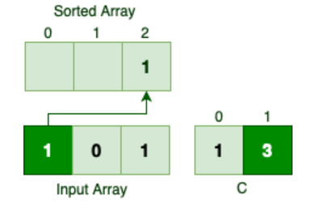
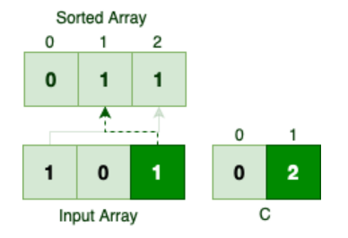
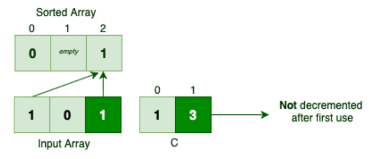

## 1. 概述

像归并排序这样的通用排序算法不对输入做任何假设，因此在最坏的情况下它们无法超过O(nlogn)。相反，计数排序对输入有一个假设，这使其成为线性时间排序算法。

在本文中，我们将了解计数排序的机制，然后用Java实现它。

## 2. 计数排序

与大多数经典排序算法相反，计数排序不会通过比较元素来对给定的输入进行排序。相反，它假设输入元素是[0, k]范围内的n个整数。
当k = O(n) 时，计数排序将在O(n)时间内运行。

请注意，我们不能将计数排序用作通用排序算法。然而，当输入与这个假设一致时，它非常快！

### 2.1 频率数组

假设我们要对输入数组进行排序，其值在[0，5]范围内：



首先，我们应该计算输入数组中每个数字的出现次数。如果我们用数组C表示count，那么C[i]表示输入数组中数字i的频率：



例如，由于5在输入数组中出现3次，因此索引5的值等于3。

现在给定数组C，我们应该确定有多少元素小于或等于每个输入元素。例如：

+ 一个元素小于或等于0，或者换句话说，只有一个零值，等于C[0]。
+ 两个元素小于或等于1，等于C[0]+C[1]。
+ 四个值小于或等于2，等于C[0]+C[1]+C[2]。

因此，如果我们继续计算C中n个连续元素的总和，我们可以知道输入数组中有多少元素小于或等于n-1。无论如何，通过应用这个简单的公式，我们可以将C更新如下：



### 2.2 算法思想

现在我们可以使用辅助数组C对输入数组进行排序。以下是计数排序的工作原理：

+ 它反向迭代输入数组
+ 对于每个元素i，C[i] – 1表示数字i在排序数组中的位置。这是因为有C[i]个元素小于或等于i。
+ 然后，它在每一轮结束时递减C[i]

为了对输入数组进行排序，我们应该首先从数字5开始，因为它是最后一个元素。根据C[5]，有11个元素小于或等于数字5。

因此，5应该是排序数组中的第11个元素，因此索引10：



因为我们将5移到了排序数组中，所以应该递减C[5]。倒序的下一个元素是2。由于有4个元素小于或等于2，因此该数字应为排序数组中的第4个元素：



类似地，我们可以找到下一个元素的正确位置，即0：



如果我们继续反向迭代并适当地移动每个元素，我们最终会得到如下结果：


## 3. 计数排序–Java实现

### 3.1 计算频率数组

首先，给定一个元素的输入数组和k，我们应该计算数组C：

```
static int[] countElements(int[] input, int k) {
  int[] c = new int[k + 1];
  Arrays.fill(c, 0);
  for (int i : input) {
    c[i] += 1;
  }
  for (int i = 1; i < c.length; i++) {
    c[i] += c[i - 1];
  }
  return c;
}
```

让我们说明该方法：

+ input表示要排序的数组
+ 输入数组是[0, k]范围内的整数数组-因此k表示input中的最大数
+ 返回值是表示C数组的整数数组

下面是countElements()方法的工作原理：

+ 首先，我们初始化了C数组。由于[0, k]范围包含k+1个数字，我们创建一个能够包含k+1个数字的数组。
+ 然后对于input中的每个数字，我们计算该数字的频率。
+ 最后，我们将连续的元素相加，以表明有多少元素小于或等于某个特定的数字。

现在，我们可以验证countElements()方法是否按预期工作：

```
@Test
void countElements_GivenAnArray_ShouldCalculateTheFrequencyArrayAsExpected() {
  int k = 5;
  int[] input = {4, 3, 2, 5, 4, 3, 5, 1, 0, 2, 5};
  int[] c = CountingSort.countElements(input, k);
  int[] expected = {1, 2, 4, 6, 8, 11};
  assertArrayEquals(expected, c);
}
```

### 3.2 对输入数组排序

现在我们可以计算频率数组，我们应该能够对任何给定的数字集进行排序：

以下是sort方法的工作原理：

+ 首先，它计算C数组
+ 然后，它反向迭代input数组，并针对input中的每个元素，在排序数组中找到其正确位置。input中的第i个元素应该是排序数组中的第C[i]个元素。由于Java数组是零索引的，因此C[i]-1条目是第C[i]
  个元素-例如，sorted[5]是排序数组中的第六个元素。
+ 每次我们找到匹配项时，它都会递减相应的C[i]值。

同样，我们可以验证sort()方法是否按预期工作：

```
@Test
void sort_GivenAnArray_ShouldSortTheInputAsExpected() {
  int k = 5;
  int[] input = {4, 3, 2, 5, 4, 3, 5, 1, 0, 2, 5};
  int[] sorted = CountingSort.sort(input, k);
  Arrays.sort(input);
  assertArrayEquals(input, sorted);
}
```

## 4. 重温计数排序算法

### 4.1 复杂度分析

大多数经典的排序算法，如归并排序，只需将输入元素相互比较即可对任何给定的输入进行排序。这些类型的排序算法称为比较排序。在最坏的情况下，比较排序至少需要O(nlogn)才能对n个元素进行排序。

另一方面，计数排序不通过比较输入元素对输入进行排序，因此它显然不是比较排序算法。

让我们看看对输入数组进行排序需要多少时间：

+ 它在O(n+k)时间内计算C数组：它在O(n)中迭代一个大小为n的输入数组，然后在O(k)中迭代C–0因此总共是O(n+k)。
+ 计算完C之后，它通过迭代输入数组并在每次迭代中执行一些基本操作来对输入进行排序。因此，实际排序操作需要O(n)。

总的来说，计数排序需要O(n+k)个时间来运行：

> O(n + k) + O(n) = O(2n + k) = O(n + k)

如果我们假设k=O(n)，那么计数排序算法将按线性时间对输入数组进行排序。与通用排序算法不同，计数排序是对输入数组进行假设的，执行时所需的时间小于O(nlogn)下限。

### 4.2 稳定性

之前，我们指定了一些关于计数排序机制的特殊规则，但从未澄清其背后的原因。更具体地说：

+ 为什么要反向迭代输入数组？
+ 为什么每次使用C[i]时，我们都会自减它？

让我们从头开始迭代，以更好地理解第一条规则。假设我们将对一个简单的整数数组进行排序，如下所示：



在第一次迭代中，我们应该找到第一个1在排序数组中的位置：



所以第一次出现的数字1位于排序数组中的最后一个索引。跳过数字0，让我们看看第二次出现数字1会发生什么：



相同值的元素在输入数组和排序数组中出现的顺序是不同的，所以当我们从头开始迭代时，算法是不稳定的。

如果每次使用后不递减C[i]的值会怎么样？让我们看看：



两次出现的数字1都在排序数组中排在最后。因此，如果我们在每次使用后不递减C[i]值，我们可能会在对它们进行排序时丢失一些数字！

## 5. 总结

在本文中，首先，我们了解了计数排序在内部的工作方式。然后，我们在Java中实现了这个排序算法，
并编写了一些测试来验证其行为。最后，我们证明了该算法是一种具有线性时间复杂度的稳定排序算法。