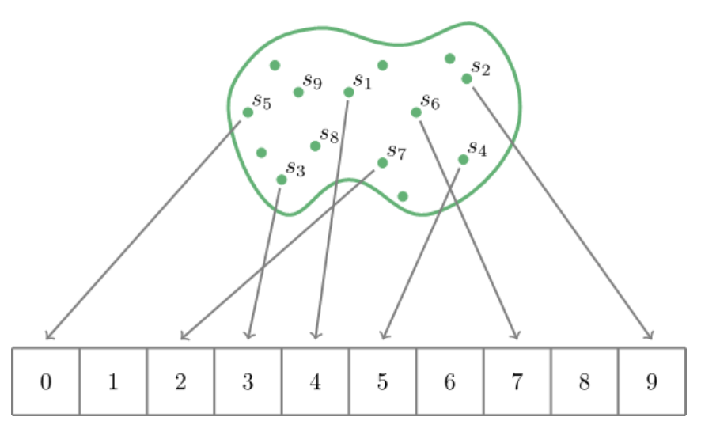
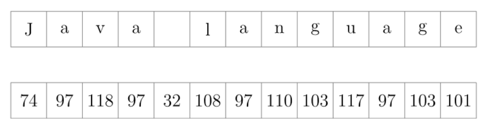
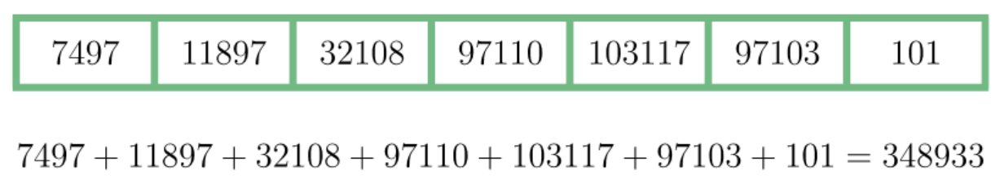
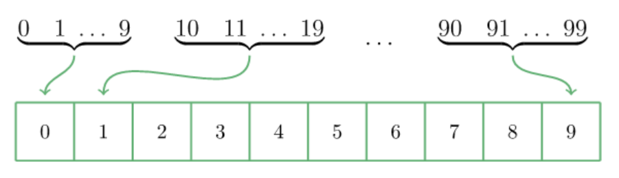
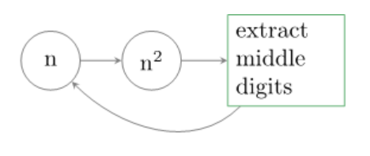

## 1. 概述

在本文中，我们将考虑各种数据结构中使用的哈希技术，这些技术提供对其元素的恒定时间访问。

我们更详细地讨论所谓的折叠技术，并简要介绍了中方和分箱技术。

## 2. 简介

当我们选择存储对象的数据结构时，需要考虑的一个问题是是否需要快速访问它们。

Java util包中为我们提供了大量用于存储对象的数据结构。

众所周知，其中一些数据结构允许我们在恒定的时间内检索它们的元素，而与它们包含的元素数量无关。

可能最简单的是数组。事实上，我们通过索引访问数组中的元素。访问时间自然不取决于数组的大小。事实上，在背后，许多数据结构大量使用数组。

问题是数组索引必须是数字，而我们通常更喜欢用对象操作这些数据结构。

为了解决这个问题，许多数据结构尝试分配一个数值，作为对象的数组索引。我们将此值称为哈希值或简单的哈希。

## 3. 哈希

散列是将对象转换为数值。执行这些转换的函数称为哈希函数。

为简单起见，让我们考虑将字符串转换为数组索引的散列函数，即转换为范围[0, N]中的整数，N为有限值。

当然，哈希函数适用于各种各样的字符串。因此，它的“global”属性变得很重要。

不幸的是，哈希函数不可能总是将不同的字符串转换为不同的数字。

我们可以很容易地想到，字符串的数量可能远远大于任何范围[0，N]内的整数数量。
因此，不可避免地会有一对不相等的字符串，哈希函数会为其生成相等的值。这种现象称为碰撞。

我们不会深入研究哈希函数背后的工作细节，但很明显，一个好的哈希函数应该尝试将定义它的字符串统一映射为数字。

另一个明显的要求是一个好的哈希函数应该是快速的。如果计算一个哈希值花费的时间太长，那么我们就无法快速访问元素。

在本文中，我们将考虑一种技术，该技术可以在快速维护map的同时使map统一。

## 4. 折叠技术

我们的目标是找到一个将字符串转换为数组索引的函数。为了阐明这个想法，假设我们希望这个数组能够容纳105个元素，让我们以字符串"Java language"为例。

### 4.1 描述

让我们首先将字符串的字符转换为数字。ASCII非常适合此操作：

现在，我们将刚刚得到的数字排列成一定大小的组。通常，我们根据数组的大小来选择组大小值，即105。由于我们将字符转换成的数字包含两到三位，在不失一般性的情况下，我们可以将组大小设置为2：

下一步是将每个组中的数字连接起来，就好像它们是字符串一样，并找到它们的总和：

现在我们必须进行最后一步。让我们检查一下数字348933是否可以作为我们大小为105的数组的索引。
自然，它超过了允许的最大值99999。我们可以通过应用取模运算符轻松克服这个问题，以找到最终结果：

> 348933 % 10000 = 48933

### 4.2 备注说明

我们看到，该算法不包括任何耗时的操作，因此速度非常快。输入字符串的每个字符都会产生最终结果。这一事实肯定有助于减少碰撞，但不能完全避免碰撞。

例如，如果我们想跳过折叠并将取模运算符直接应用于ASCII转换的输入字符串(忽略溢出问题)。

> 749711897321089711010311797103101 % 100000 = 3101

那么，这种哈希函数将为所有最后两个字符与输入字符串相同的字符串生成相同的值：age、page、large等等。

从对算法的描述中，我们可以很容易地看出它并非没有碰撞。例如，该算法为"Java language"和"vaJa language"字符串生成相同的哈希值。

## 5. 其他技术

折叠技术很常见，但不是唯一的一种。有时，分箱或中方技术也可能有用。

我们不使用字符串，而是使用数字来说明这些方法的思路(假设我们已经以某种方式将字符串转换为数字)。我们不会讨论它们的优缺点，但你可能会在看到算法后形成意见。

### 5.1 装箱技术

假设我们有100个整数，我们希望我们的哈希函数将它们映射到一个包含10个元素的数组中。
然后我们可以将这100个整数排列成10个组，这样前十个整数在第一个bin(箱)中结束，后十个整数在第二个箱中结束，依此类推：

### 5.2 中方技术

该算法由约翰·冯·诺依曼提出，它允许我们从给定的数字开始生成伪随机数。

让我们用一个具体的例子来说明。假设我们有一个四位数的数字1111，根据算法，我们将它平方，得到1234321。
现在，我们从中间提取四位数字，例如2343。算法允许我们重复这个过程，直到我们对结果满意为止。

## 6. 总结

在本文中，我们考虑了几种哈希技术。我们详细描述了折叠技术，并简要描述了如何实现装箱和中方技术。