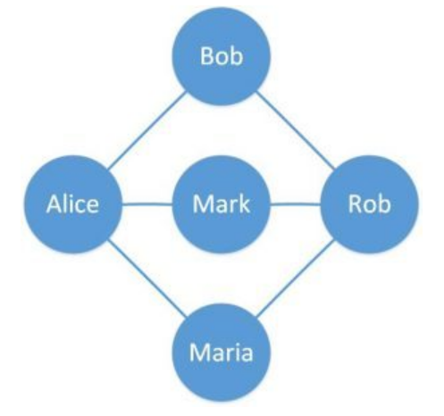
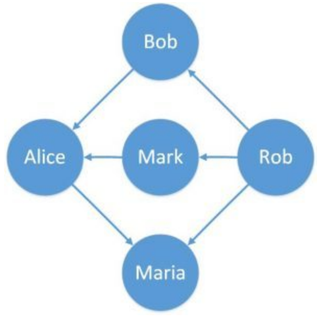
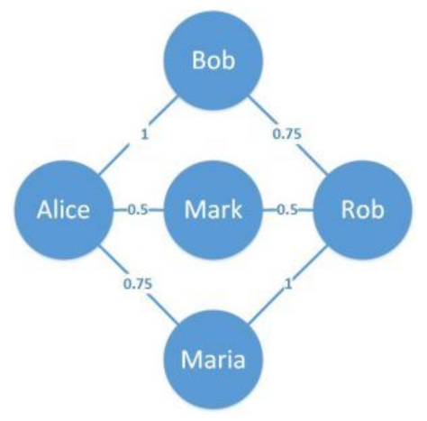
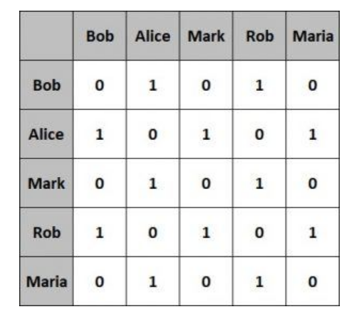
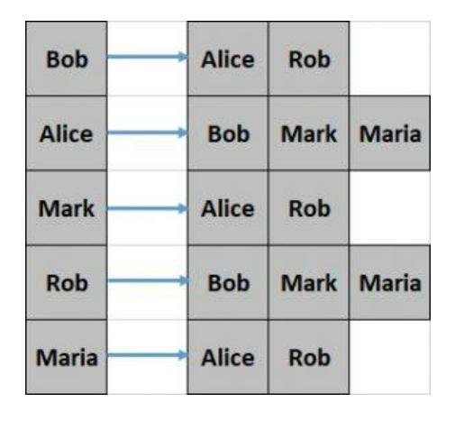

## 1. 概述

在本文中，我们将了解图数据结构的基本概念。

我们还将介绍它在Java中的实现以及图上可能的各种操作。我们还将介绍提供图实现的Java库。

## 2. 图数据结构

图是一种数据结构，用于存储连接数据，例如社交媒体平台上的人脉网络。

图由顶点和边组成。顶点代表实体(例如人)，边代表实体之间的关系(例如人的友谊)。

让我们定义一个简单的图来更好地理解这一点：



在这里，我们定义了一个具有五个顶点和六条边的简单图。圆圈是代表人的顶点，连接两个顶点的线是代表在线门户上的朋友的边。

根据边的属性，这个简单的图有一些变化。我们在接下来的部分中简要介绍它们。

### 2.1 有向图

到目前为止，我们定义的图为没有任何方向的边。如果这些边具有方向，则生成的图称为有向图。

这方面的一个例子可以表示在在线门户上以好友的形式发送好友请求：



在这里，我们可以看到边有一个固定的方向。边也可以是双向的。

### 2.2 加权图

同样，我们的简单图具有无偏或未加权的边。相反，如果这些边带有相对权重，则该图称为加权图。

这方面的一个实际应用示例可以表示在线门户上的友谊时间长短：



在这里，我们可以看到边具有与其关联的权重。这为这些边提供了相对含义。

## 3. 图表示法

图可以用不同的形式表示，如邻接矩阵和邻接表。每种方法都有各自的优缺点。

我们将在本节中介绍这些图表示。

### 3.1 邻接矩阵

邻接矩阵是一个方阵，其维度等于图中的顶点数。

矩阵的元素通常具有值“0”或“1”。值“1”表示行和列中顶点之间的邻接关系，否则为“0”。

让我们看看前面例子中的简单图的邻接矩阵是什么样子的：



这种表示方式更容易实现，查询也更高效。然而，就占用的空间而言，它的效率较低。

### 3.2 邻接表

邻接表只不过是一个列表数组。数组的大小相当于图中的顶点数。

数组特定索引处的列表表示由该数组索引表示的顶点的相邻顶点。

让我们看看前面例子中的简单图的邻接表是什么样子的：



这种表示相对难以创建并且查询效率较低。但是，它提供了更好的空间效率。

在本文中，我们将使用邻接表来表示图。

## 4. Java中的图

Java不提供图数据结构的默认实现。

但是，我们可以使用Java集合来实现图。

让我们从定义顶点(Vertex)开始：

```java
class Vertex {
  String label;

  Vertex(String label) {
    this.label = label;
  }
  // equals and hashCode
}
```

上面的顶点定义只有一个label，但这可以代表任何可能的实体，如人或城市。

另外，请注意，我们必须重写equals()和hashCode()方法，因为它们是使用Java集合所必需的。

正如我们前面所讨论的，图只不过是顶点和边的集合，可以表示为邻接矩阵或邻接表。

让我们看看如何在此处使用邻接表来定义它：

```java
class Graph {
  private Map<Vertex, List<Vertex>> adjVertices;

  // standard constructor, getters, setters
}
```

如上所示，Graph类使用Java集合中的Map来定义邻接表。

图数据结构上可能有多种操作，例如创建、更新或搜索图。

我们将介绍一些更常见的操作，看看我们如何在Java中实现它们。

## 5. 图更新操作

首先，我们将定义一些方法来改变图数据结构。

让我们定义添加和删除顶点的方法：

```
void addVertex(String label) {
  adjVertices.putIfAbsent(new Vertex(label), new ArrayList<>());
}

void removeVertex(String label) {
  Vertex v = new Vertex(label);
  adjVertices.values().stream().forEach(e -> e.remove(v));
  adjVertices.remove(new Vertex(label));
}
```

这些方法只是从顶点集合中添加和删除元素。

现在，让我们定义一个方法来添加边：

```
void addEdge(String label1, String label2) {
  Vertex v1 = new Vertex(label1);
  Vertex v2 = new Vertex(label2);
  adjVertices.get(v1).add(v2);
  adjVertices.get(v2).add(v1);
}
```

此方法创建一个新的边并更新相邻顶点Map。

以类似的方式，我们将定义removeEdge()方法：

```
void removeEdge(String label1, String label2) {
  Vertex v1 = new Vertex(label1);
  Vertex v2 = new Vertex(label2);
  List<Vertex> eV1 = adjVertices.get(v1);
  List<Vertex> eV2 = adjVertices.get(v2);
  if (eV1 != null) {
    eV1.remove(v2);
  }
  if (eV2 != null) {
    eV2.remove(v1);
  }
}
```

接下来，让我们看看如何使用我们目前为止定义的方法创建我们之前描述的简单图：

```
Graph createGraph() {
  Graph graph = new Graph();
  graph.addVertex("Bob");
  graph.addVertex("Alice");
  graph.addVertex("Mark");
  graph.addVertex("Rob");
  graph.addVertex("Maria");
  graph.addEdge("Bob", "Alice");
  graph.addEdge("Bob", "Rob");
  graph.addEdge("Alice", "Mark");
  graph.addEdge("Rob", "Mark");
  graph.addEdge("Alice", "Maria");
  graph.addEdge("Rob", "Maria");
  return graph;
}
```

最后，我们定义一种方法来获取特定顶点的相邻顶点：

```
List<Vertex> getAdjVertices(String label) {
  return adjVertices.get(new Vertex(label));
}
```

## 6. 遍历图

现在我们已经定义了图的创建和更新方法，我们可以定义一些额外的方法来遍历图。我们需要遍历一个图来执行任何有意义的操作，比如在图中进行搜索。

遍历图有两种可能的方法，深度优先遍历和广度优先遍历。

### 6.1 深度优先遍历

深度优先遍历从任意根顶点开始，在搜索相同级别的顶点之前，沿每个分支尽可能深入地搜索顶点。

让我们定义一个方法来执行深度优先遍历：

```
static Set<String> depthFirstTraversal(Graph graph, String root) {
  Set<String> visited = new LinkedHashSet<>();
  Stack<String> stack = new Stack<>();
  stack.push(root);
  while (!stack.isEmpty()) {
    String vertex = stack.pop();
    if (!visited.contains(vertex)) {
      visited.add(vertex);
      for (Graph.Vertex v : graph.getAdjVertices(vertex)) {
        stack.push(v.label);
      }
    }
  }
  return visited;
}
```

在这里，我们使用Stack来存储需要遍历的顶点。

使用上一小节中创建的图测试：

```
@Test
void givenAGraph_whenTraversingDepthFirst_thenExpectedResult() {
  Graph graph = createGraph();
  assertEquals("[Bob, Rob, Maria, Alice, Mark]", GraphTraversal.depthFirstTraversal(graph, "Bob").toString());
}
```

请注意，我们在这里使用顶点“Bob”作为遍历的根，但这可以是任何其他顶点。

### 6.2 广度优先遍历

相比之下，广度优先遍历从任意根顶点开始，并探索同一级别的所有相邻顶点，然后再深入图的下一层中。

现在，让我们定义一个方法来执行广度优先遍历：

```
static Set<String> breadthFirstTraversal(Graph graph, String root) {
  Set<String> visited = new LinkedHashSet<>();
  Queue<String> queue = new LinkedList<>();
  queue.add(root);
  visited.add(root);
  while (!queue.isEmpty()) {
    String vertex = queue.poll();
    for (Graph.Vertex v : graph.getAdjVertices(vertex)) {
      if (!visited.contains(v.label)) {
        visited.add(v.label);
        queue.add(v.label);
      }
    }
  }
  return visited;
}
```

注意，广度优先遍历使用Queue来存储需要遍历的顶点。

使用上一小节中创建的图测试：

```
@Test
void givenAGraph_whenTraversingBreadthFirst_thenExpectedResult() {
  Graph graph = createGraph();
  assertEquals("[Bob, Alice, Rob, Mark, Maria]",
      GraphTraversal.breadthFirstTraversal(graph, "Bob").toString());
}
```

同样，这里的根顶点“Bob”也可以是任何其他顶点。

## 7. 图的Java库

不必总是需要实现自己的图。有几个提供图实现的开源和成熟的库可用。

在接下来的几个小节中，我们将介绍其中的一些库。

### 7.1 JGraphT

JGraphT 是Java中最流行的图数据结构库之一。它允许创建简单图、有向图、加权图等。

此外，它在图数据结构上提供了许多可能的算法。

### 7.2 Google Guava

Google Guava是一组Java库，提供一系列功能，包括图数据结构及其相关算法。

它支持创建简单的Graph、ValueGraph和Network。这些可以定义为可变的或不可变的。

### 7.3 Apache Commons

Apache Commons是一个提供可重用Java组件的Apache项目。这包括Commons Graph，它提供了一个工具包来创建和管理图数据结构。这也提供了常用的图算法来对数据结构进行操作。

### 7.4 Sourceforge JUNG

Java Universal Network/Graph(JUNG)是一个Java框架，它提供可扩展的语言，用于对可以表示为图的任何数据进行建模、分析和可视化。

JUNG支持许多算法，包括聚类、分解和优化等例程。

这些库提供了许多基于图数据结构的实现。还有更强大的基于图的框架，例如Apache Giraph，目前在Facebook用于分析其用户形成的图，以及Apache TinkerPop，通常用于图数据库之上。