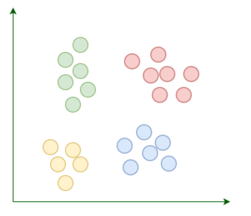
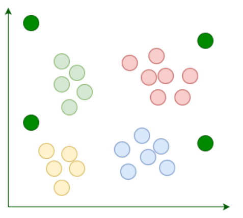
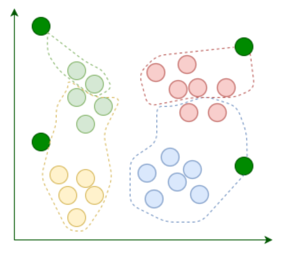
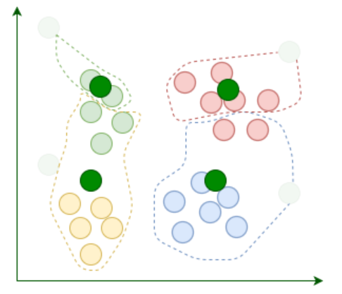
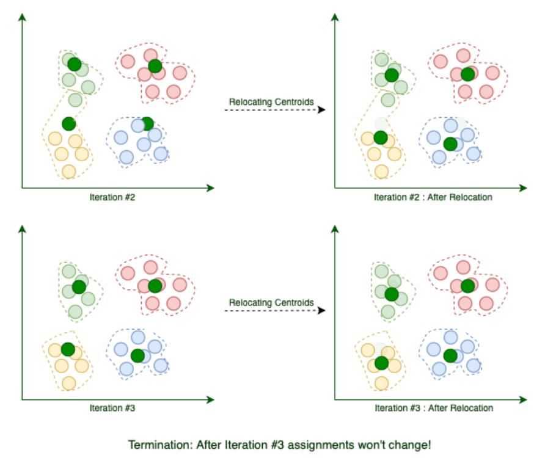
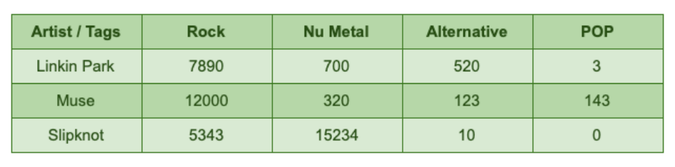
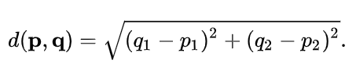

## 1. 概述

聚类是一类无监督算法的总称，用于发现相互密切相关的事物、人员或想法组。

在这个看似简单的定义中，我们看到了一些流行语。聚类到底是什么？什么是无监督算法？

在本文中，我们将首先阐明这些概念。然后，我们将看到它们如何在Java中实现。

## 2. 无监督算法

在我们使用大多数学习算法之前，我们应该以某种方式向它们提供一些样本数据，并允许算法从这些数据中学习。
在机器学习术语中，我们称该样本数据集为训练数据。此外，整个过程称为训练过程。

无论如何，我们可以根据学习算法在训练过程中需要的监督量对其进行分类。这类学习算法的两种主要类型是：

+ 监督学习(Supervised Learning)：在监督算法中，训练数据应该包括每个点的实际解。例如，如果我们要训练我们的垃圾邮件过滤算法，
  我们会将样本电子邮件及其标签(即垃圾邮件或非垃圾邮件)提供给算法。从数学上讲，我们将从包含xs和ys的训练集中推断f(x)。
+ 无监督学习(Unsupervised Learning)：当训练数据中没有标签时，该算法是无监督的。例如，我们有大量关于音乐家的数据，我们将在数据中发现相似的音乐家群体。

## 3. 聚类

聚类是一种无监督算法，用于发现相似事物、想法或人的群体。与监督算法不同，我们不使用已知标签的例子来训练聚类算法。
相反，聚类尝试在训练集中找到没有数据点是标签的结构。

### 3.1 K-Means聚类

K-Means是一种聚类算法，具有一个基本特性：聚类的数量是预先定义的。除了K-Means之外，还有其他类型的聚类算法，如层次聚类、亲和传播或谱聚类。

### 3.2 K-Means的工作原理

假设我们的目标是在数据集中找到几个类似的组，如：



K-Means 从k 随机放置的质心开始。顾名思义，质心是聚类的中心点。例如，这里我们添加了四个随机质心：



然后，我们将每个现有数据点指定给它最近的质心：



分配后，我们将质心移动到分配给它的点的平均位置。请记住，质心应该是聚类的中心点：



每次我们完成重定位质心时，当前迭代都会结束。我们重复这些迭代，直到多个连续迭代之间的分配停止变化：



当算法结束时，会按预期找到这四个聚类。现在我们知道了K-Means是如何工作的，让我们用Java来实现它。

### 3.3 特征表示法

在对不同的训练数据集进行建模时，我们需要一个数据结构来表示模型属性及其对应的值。例如，音乐家的genre属性可以具有类似于Rock的值。我们通常使用术语“特征”来指代属性及其值的组合。

为了为特定的学习算法准备数据集，我们通常使用一组通用的数字属性，来比较不同的项目。例如，如果我们让用户为每个艺术家标记一个流派，那么在一天结束时，我们可以计算每个艺术家被标记一个特定流派的次数：



像林肯公园这样的artist的特征向量是[rock->7890，nu-metal->700，alternative->520，pop->3]。
因此，如果我们能够找到一种将属性表示为数值的方法，那么我们可以通过比较两个不同的项目，例如artists，来比较他们相应的向量条目。

由于数值向量是如此通用的数据结构，我们将使用它们来表示特征。以下是我们在Java中实现特征向量的方法：

```java
public class Record {
  private final String description;
  private final Map<String, Double> features;

  // constructor, getter, toString, equals and hashcode
}
```

### 3.4 查找类似项

在K-Means的每次迭代中，我们需要一种方法来找到与数据集中每个项目最近的质心。
计算两个特征向量之间距离的最简单方法之一是使用欧几里得距离。 [p1, q1]和[p2, q2]等两个向量之间的欧几里得距离等于：



让我们用Java实现这个功能。

```java
public interface Distance {

  double calculate(Map<String, Double> f1, Map<String, Double> f2);
}
```

除了欧几里得距离之外，还有其他方法可以计算不同项目之间的距离或相似度，例如Pearson相关系数。这种抽象使得在不同距离度量之间切换变得容易。

让我们看看欧几里德距离的实现：

