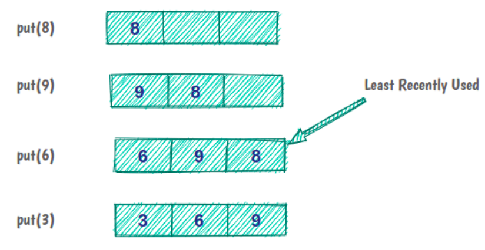
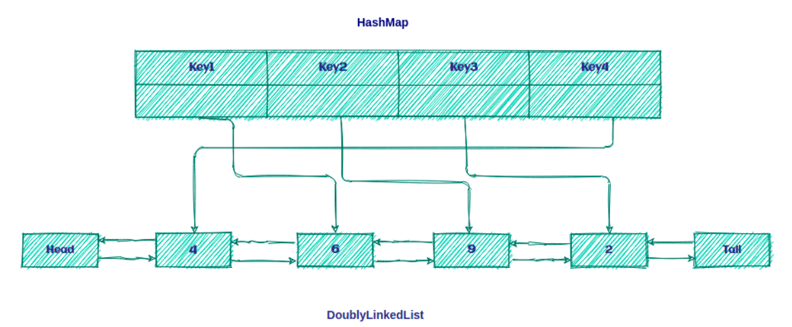

## 1. 概述

在本文中，我们将介绍LRU缓存并使用Java实现。

## 2. LRU缓存

最近最少使用(LRU)缓存是一种缓存逐出算法，它按使用顺序组织元素。顾名思义，在LRU中，最长时间未使用的元素将从缓存中逐出。

例如，如果我们有一个容量为3的缓存：



最初，缓存是空的，我们将元素8放在缓存中。元素9和6也可以正常被缓存。但现在，缓存容量已满，要放置下一个元素，我们必须逐出缓存中最近使用最少的元素。

在Java中实现LRU缓存之前，最好了解缓存的一些方面：

+ 所有操作都应按O(1)的复杂度运行
+ 缓存的大小有限
+ 所有缓存操作都必须支持并发
+ 如果缓存已满，添加新缓存元素必须调用LRU策略

### 2.1 LRU缓存的结构

现在，让我们考虑一个有助于我们设计缓存的问题。

我们如何设计一个可以在恒定时间内执行读取、排序(时间排序)和删除元素等操作的数据结构？

要找到这个问题的答案，我们需要深入思考一下已经说过的关于LRU缓存及其特性的内容：

+ 实际上，LRU缓存是一种队列-如果元素被重新访问，它将转到逐出顺序的末尾
+ 此队列将具有特定容量，因为缓存的大小有限。每当引入一个新元素时，它就会被添加到队列的头部。当逐出发生时，它发生在队列的尾部。
+ 命中缓存中的数据必须在恒定时间内完成，这在Queue中是不可能的！但是，可以使用Java的HashMap数据结构。
+ 必须在恒定时间内删除最近最少使用的元素，这意味着对于队列的实现，我们将使用DoublyLinkedList而不是SingleLinkedList或数组。

因此，根据上述说明，LRU缓存只不过是DoublyLinkedList和HashMap的组合使用，如下图所示：



其想法是将key保留在Map上，以便快速访问队列中的数据。

### 2.2 LRU算法

LRU算法非常简单！如果key存在于HashMap中，则为缓存命中；否则，就是缓存未命中。

发生缓存未命中后，我们将执行两个步骤：

1. 在列表前面添加新元素。
2. 在HashMap中添加一个新entry并引用列表的头。

在缓存命中后，我们将执行两个步骤：

1. 移除命中元素并将其添加到列表前面。
2. 使用对列表前面的新引用更新HashMap。

现在，我们来看看如何在Java中实现LRU缓存

## 3. Java实现

首先，我们将定义Cache接口：

```java
public interface Cache<K, V> {
  boolean put(K key, V value);

  Optional<V> get(K key);

  int size();

  boolean isEmpty();

  void clear();
}
```

现在，我们将定义表示缓存的LRUCache类：

```java
public class LRUCache<K, V> implements Cache<K, V> {
  private int size;
  private Map<K, LinkedListNode<CacheElement<K, V>>> linkedListNodeMap;
  private DoublyLinkedList<CacheElement<K, V>> doublyLinkedList;

  public LRUCache(int size) {
    this.size = size;
    this.linkedListNodeMap = new HashMap<>(maxSize);
    this.doublyLinkedList = new DoublyLinkedList<>();
  }
  // rest of the implementation
}
```

我们可以创建一个具有特定大小的LRUCache实例。在这个实现中，我们使用HashMap集合来存储对LinkedListNode的所有引用。

现在，让我们讨论一下LRUCache上的操作。

### Put操作

第一种是put方法：

```
public boolean put(K key, V value) {
  CacheElement<K, V> item = new CacheElement<>(key, value);
  LinkedListNode<CacheElement<K, V>> newNode;
  if (this.linkedListNodeMap.containsKey(key)) {
    LinkedListNode<CacheElement<K, V>> node = this.linkedListNodeMap.get(key);
    newNode = doublyLinkedList.updateAndMoveToFront(node, item);
  } else {
    if (this.size() >= this.size) {
      this.evictElement();
    }
    newNode = this.doublyLinkedList.add(item);
  }
  if (newNode.isEmpty()) {
    return false;
  }
  this.linkedListNodeMap.put(key, newNode);
  return true;
}
```

首先，我们在存储所有keys/references的linkedListNodeMap中查找key。如果key存在，则发生缓存命中，可以从DoublyLinkedList中检索CacheElement并将其移动到前面。

之后，我们使用新引用更新linkedListNodeMap，并将其移动到列表的前面：

```
public LinkedListNode<T> updateAndMoveToFront(LinkedListNode<T> node, T newValue) {
  if (node.isEmpty() || (this != (node.getListReference()))) {
    return dummyNode;
  }
  detach(node);
  add(newValue);
  return head;
}
```

首先，我们检查节点是否为空。此外，节点的引用必须与列表相同。之后，我们将节点从列表中分离出来，并向列表中添加newValue。

但是如果密钥不存在，就会发生缓存丢失，我们必须将新密钥放入linkedListNodeMap。在此之前，我们检查列表大小。如果列表已满，我们必须从列表中逐出最近使用最少的元素。