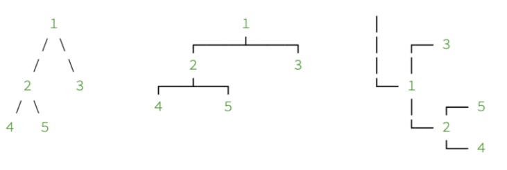
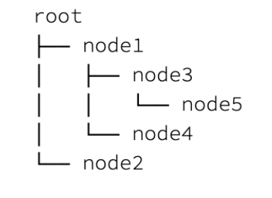

## 1. 概述

打印是一种非常常见的数据结构可视化技术。然而，由于树的层次结构，它可能会很棘手。

在本文中，我们将学习Java中二叉树的一些打印技术。

## 2. 树图

尽管在控制台上仅使用字符进行绘制存在局限性，但仍有许多不同的图表形状来表示树结构。选择其中之一主要取决于树的大小和平衡。

让我们看看我们可以打印的一些可能的图类型：



但是，我们将解释一个更容易实现的实用方法。通过考虑树的生长方向，我们可以称它为水平树：



由于水平树的流动方向始终与文本流动方向相同，因此选择水平图比其他图有一些好处：

1. 我们也可以可视化大型且不平衡的树
2. 节点值的长度不影响显示结构
3. 它更容易实现

因此，我们将在接下来的部分中使用水平图并实现一个简单的二叉树打印类。

## 3. 二叉树模型

首先，我们应该建立一个基本的二叉树模型，我们只需要几行代码就可以做到这一点。

让我们定义一个简单的BinaryTreeModel类：

```java
public class BinaryTreeModel {
  private Object value;
  private BinaryTreeModel left;
  private BinaryTreeModel right;

  public BinaryTreeModel(Object value) {
    this.value = value;
  }
  // standard getters and setters
}
```

## 4. 样品测试数据

在开始实现二叉树打印机之前，我们需要创建一些示例数据来增量测试可视化效果：

```
private BinaryTreeModel createBalancedTree() {
  BinaryTreeModel root = new BinaryTreeModel("root");
  BinaryTreeModel node1 = new BinaryTreeModel("node1");
  BinaryTreeModel node2 = new BinaryTreeModel("node2");
  root.setLeft(node1);
  root.setRight(node2);
  BinaryTreeModel node3 = new BinaryTreeModel("node3");
  BinaryTreeModel node4 = new BinaryTreeModel("node4");
  node1.setLeft(node3);
  node1.setRight(node4);
  node2.setLeft(new BinaryTreeModel("node5"));
  node2.setRight(new BinaryTreeModel("node6"));
  BinaryTreeModel node7 = new BinaryTreeModel("node7");
  node3.setLeft(node7);
  node7.setLeft(new BinaryTreeModel("node8"));
  node7.setRight(new BinaryTreeModel("node9"));
  return root;
}
```

## 5. 二叉树打印

当然，出于单一责任原则的考虑，我们需要一个单独的类来保持BinaryTreeModel的简单性。

现在，我们可以使用访问者模式，以便树处理层次结构，而我们的打印机只处理打印。但是对于本文，我们将它们放在一起以保持简单。

因此，我们定义了一个名为BinaryTreePrinter的类并开始实现它。

### 5.1 前序遍历

考虑到我们的水平图，为了正确地打印它，我们可以通过使用前序遍历进行简单的开始。

因此，要执行前序遍历，我们需要实现一种递归方法，首先访问根节点，然后访问左子树，最后访问右子树。

让我们定义一个遍历树的方法：

```
public void traversePreOrder(StringBuilder sb, BinaryTreeModel node) {
  if (node != null) {
    sb.append(node.getValue());
    sb.append("n");
    traversePreOrder(sb, node.getLeft());
    traversePreOrder(sb, node.getRight());
  }
}
```

接下来，让我们定义print()方法：

```
public void print(PrintStream os) {
  StringBuilder sb = new StringBuilder();
  traversePreOrder(sb, this.tree);
  os.print(sb.toString());
}
```

因此，我们可以简单地打印测试树：

```
new BinaryTreePrinter(root).print(System.out);
```

输出将是按遍历顺序排列的树节点列表：

```
root
node1
node3
node7
node8
node9
node4
node2
node5
node6
```

### 5.2 添加树边

为了正确打印图表，我们使用了三种类型的字符“├──”, “”└──”, 和“│” 可视化节点。前两个用于指针，最后一个用于填充边并连接指针。

让我们更新traversePreOrder()方法，添加两个参数作为padding和pointer，并分别使用以下字符：

```
private String traversePreOrder(BinaryTreeModel root) {
  if (root == null) {
    return "";
  }
  StringBuilder sb = new StringBuilder();
  sb.append(root.getValue());
  String pointerRight = "└──";
  String pointerLeft = (root.getRight() != null) ? "├──" : "└──";
  traverseNodes(sb, "", pointerLeft, root.getLeft(), root.getRight() != null);
  traverseNodes(sb, "", pointerRight, root.getRight(), false);
  return sb.toString();
}
```

此外，我们还修改了print()方法：

```
public void print(PrintStream os) {
  StringBuilder sb = new StringBuilder();
  traversePreOrder(sb, "", "", this.tree);
  os.print(sb.toString());
}
```

让我们再次测试BinaryTreePrinter：

