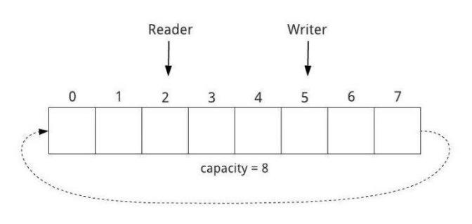
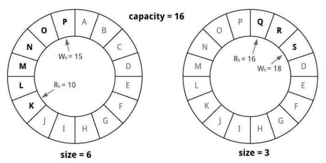
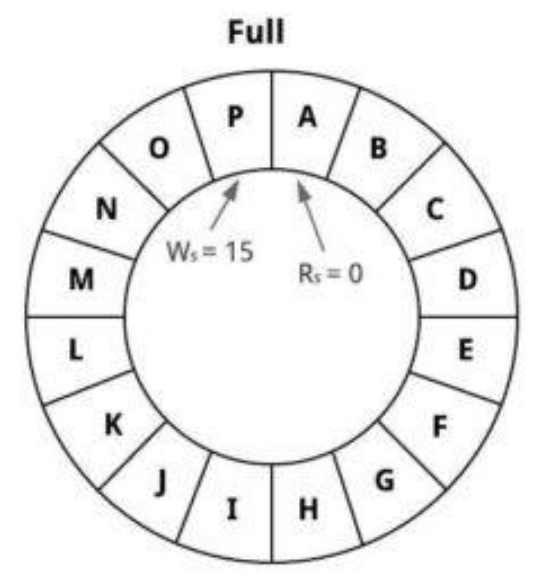
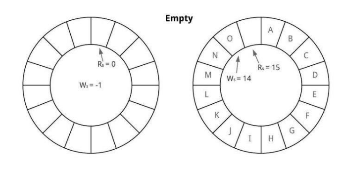

## 1. 概述

在本文中，我们将学习如何在Java中实现环形缓冲区。

## 2. 环形缓冲区

环形缓冲区(或循环缓冲区)是一种有界的循环数据结构，用于在两个或多个线程之间缓冲数据。当我们继续写入环形缓冲区时，它会在到达末尾时回绕。

### 2.1 工作原理

环形缓冲区是使用固定大小的数组实现的，该数组在边界处环绕。

除了数组之外，它还三件事：

+ 缓冲区中用于插入元素的下一个可用插槽
+ 缓冲区中的下一个未读元素
+ 数组的结尾--缓冲区环绕到数组开头的点



环形缓冲区处理这些需求的机制因实现而异。例如，关于该主题的Wikipedia条目介绍了一个使用四个指针的方法。

我们将借用Disruptor使用序列实现环形缓冲区的方法。

我们首先需要知道的是容量--缓冲区的固定最大大小。接下来，我们将使用两个单调递增的序列：

+ 写序列：从-1开始，插入元素时递增1
+ 读序列：从0开始，在消费元素时递增1

我们可以使用mod操作将序列映射到数组中的索引：

```
arrayIndex = sequence % capacity
```

mod操作将序列围绕边界进行包装，以导出缓冲区中的插槽：



让我们看看如何插入元素：

```
buffer[++writeSequence % capacity] = element
```

我们在插入元素之前预先递增写序列。

为了消费一个元素，我们做一个后++：

```
element = buffer[readSequence++ % capacity]
```

在这种情况下，我们对序列执行后++。消费一个元素并不会将其从缓冲区中删除--它只是保留在数组中直到被覆盖。

### 2.2 空缓冲区和满缓冲区

当我们环绕数组时，我们将开始覆盖缓冲区中的数据。如果缓冲区已满，我们可以选择覆盖最旧的数据，无论消费者是否已使用它，也可以阻止覆盖尚未读取的数据。

如果消费者可以忽略中间值或旧值(例如，股票价格代码)，我们可以覆盖数据而无需等待数据被消费。
另一方面，如果消费者必须消费所有值(例如电子商务交易)，我们应该等待(阻塞/忙碌等待)，直到缓冲区有可用的插槽。

如果缓冲区的大小等于其容量，则缓冲区已满，其中其大小等于未读元素的数量：

```
size = (writeSequence - readSequence) + 1
isFull = (size == capacity)
```



如果写序列小于读序列，则缓冲区为空：

```
isEmpty = writeSequence < readSequence
```



如果缓冲区为空，则返回空值。

### 2.3 优缺点

环形缓冲区是一种高效的FIFO缓冲区。它使用可以预先分配的固定大小的数组，并允许高效的内存访问模式。
所有缓冲区操作都是常数时间O(1)，包括消费一个元素，因为它不需要移动元素。

另一方面，确定环形缓冲区的正确大小至关重要。例如，如果缓冲区过小并且读取速度很慢，则写入操作可能会阻塞很长时间。
我们可以使用动态调整大小，但它需要移动数据，会错失上面讨论的大部分优势。

## 3. Java实现

现在我们了解了环形缓冲区的工作原理，让我们看看在Java中实现它。

### 3.1 初始化

首先，让我们定义一个构造函数，用预定义的容量初始化缓冲区：

```java
public class CircularBuffer<E> {
  private static final int DEFAULT_CAPACITY = 8;
  private final int capacity;
  private final E[] data;
  private int writeSequence, readSequence;

  @SuppressWarnings("unchecked")
  public CircularBuffer(int capacity) {
    this.capacity = (capacity < 1) ? DEFAULT_CAPACITY : capacity;
    this.data = (E[]) new Object[capacity];
    this.readSequence = 0;
    this.writeSequence = -1;
  }
}
```

这将创建一个空缓冲区并初始化前面讨论的序列字段，其中写序列从-1开始。

### 3.2 Offer

接下来，我们将实现offer操作，在下一个可用槽处将元素插入缓冲区，并在成功时返回true。如果缓冲区找不到空槽，则返回false，也就是说，我们不能覆盖未读取的值。

```
public boolean offer(E element) {
  boolean isFull = (writeSequence - readSequence) + 1 == capacity;
  if (isFull) {
    int nextWriteSeq = writeSequence + 1;
    data[nextWriteSeq % capacity] = element;
    writeSequence++;
    return true;
  }
  return false;
}
```

因此，我们递增写序列并计算数组中下一个可用插槽的索引。然后，我们将数据写入缓冲区并存储更新后的写序列。

让我们测试一下：

```
@Test
public void givenCircularBuffer_whenAnElementIsEnqueued_thenSizeIsOne() {
  CircularBuffer<String> buffer = new CircularBuffer<>(defaultCapacity);
  assertTrue(buffer.offer("Square"));
  assertEquals(1, buffer.size());
}
```

### 3.3 Poll

最后，我们将实现获取并删除下一个未读元素的poll操作。poll操作不会删除元素，但会增加读序列。

```
public E poll(){
  boolean isEmpty = writeSequence < readSequence;
  if (!isEmpty) {
    E nextValue = data[readSequence % capacity];
    readSequence++;
    return nextValue;
  }
  return null;
}
```

在这里，我们通过计算数组中的索引来读取当前读序列的数据。然后，如果缓冲区不为空，我们将递增序列并返回值。

以下是测试：

```
@Test
void givenCircularBuffer_whenAnElementIsDequeued_thenElementMatchesEnqueuedElement() {
  CircularBuffer<String> buffer = new CircularBuffer<>(defaultCapacity);
  buffer.offer("Triangle");
  String shape = buffer.poll();
  assertEquals("Triangle", shape);
}
```

## 4. 生产者-消费者问题

我们已经介绍了使用环形缓冲区在两个或多个线程之间交换数据，这是称为生产者-消费者问题的同步问题的一个示例。
在Java中，我们可以使用信号量、有界队列、环形缓冲区等以各种方式解决生产者-消费者问题。

让我们实现一个基于环形缓冲区的解决方案。

### 4.1 volatile序列字段

我们的环形缓冲区实现不是线程安全的。对于简单的单一生产者和单一消费者的情况，让我们让它成为线程安全的。

生产者将数据写入缓冲区并递增writeSequence，而消费者仅从缓冲区读取数据并递增readSequence。所以，后备数组是无争用的，我们可以在没有任何同步的情况下离开。

但是我们仍然需要确保消费者可以看到writeSequence字段的最新值(可见性)，并且在缓冲区中的数据实际可用之前不会更新writeSequence(排序)。

在这种情况下，我们可以通过使用volatile修饰序列字段来使环形缓冲区并发且无锁：

```
private volatile int writeSequence = -1, readSequence = 0;
```

在offer方法中，对volatile字段writeSequence的写入保证了对缓冲区的写入发生在更新writeSequence之前。
同时，volatile可见性保证确保消费者始终看到writeSequence的最新值。

### 4.2 生产者

让我们实现一个简单的生产者，用于写入环形缓冲区：

```java
static class Producer<T> implements Runnable {
  private CircularBuffer<T> buffer;
  private T[] items;

  public Producer(CircularBuffer<T> buffer, T[] items) {
    this.buffer = buffer;
    this.items = items;
  }

  @Override
  public void run() {
    for (int i = 0; i < items.length; ) {
      if (buffer.offer(items[i])) {
        System.out.println("Produced: " + items[i]);
        i++;
        LockSupport.parkNanos(5);
      }
    }
  }
}
```

生产者线程将在循环中等待一个空插槽(忙等)。

### 4.3 消费者

我们将实现一个从缓冲区读取的消费者(实现Callable)：

```java

@SuppressWarnings("unchecked")
static class Consumer<T> implements Callable<T[]> {
  private CircularBuffer<T> buffer;
  private int expectedCount;

  public Consumer(CircularBuffer<T> buffer, int expectedCount) {
    this.buffer = buffer;
    this.expectedCount = expectedCount;
  }

  @Override
  public T[] call() {
    T[] items = (T[]) new Object[expectedCount];
    for (int i = 0; i < items.length; ) {
      T item = buffer.poll();
      if (item != null) {
        items[i++] = item;
        LockSupport.parkNanos(5);
        System.out.println("Consumed: " + item);
      }
    }
    return items;
  }
}
```

如果消费者线程从缓冲区接收到空值，则它将继续而不打印。

测试以上实例将产生类似如下输出：

```
Produced: Circle
Produced: Triangle
Consumed: Circle
Consumed: Triangle
Produced: Rectangle
Produced: Square
Consumed: Rectangle
Consumed: Square
Produced: Rhombus
```