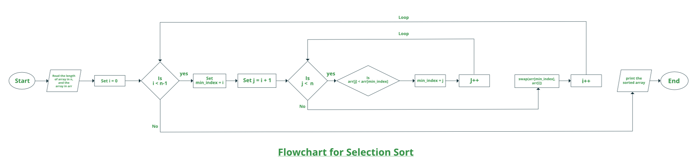

## 1. 算法思想

选择排序算法通过从未排序的部分重复查找最小元素(考虑升序)并将其放在开头来对数组进行排序。该算法在给定数组中维护两个子数组。

+ 已排序元素的子数组
+ 剩余未排序元素的子数组

在选择排序的每次迭代中，未排序的子数组中的最小元素(考虑升序)被挑选出来并移动到已排序的子数组中。

选择排序流程图：



## 2. 具体步骤

让我们以以下数组为例：arr[] = {64, 25, 12, 22, 11}

第一步：

+ 对于排序数组中的第1个位置，将按顺序从索引0到4遍历整个数组。当前存储64的第一个位置，遍历整个数组后，很明显11是最小值。

> 64, 25, 12, 22, 11

+ 因此，交换64跟11。在一次迭代之后，11(恰好是数组中的最小值)往往出现在排序数组的第一个位置。

> 11, 25, 12, 22, 64

第二步：

+ 对于第2个位置，为25，再次以顺序方式遍历数组的其余部分。

> 11, 25, 12, 22, 64

+ 遍历之后，我们发现12是数组中第二小的值，它应该出现在数组的第二位，因此交换12跟25。

> 11, 12, 25, 22, 64

第三次：

+ 对于第3个位置，为25，再次以顺序方式遍历数组的其余部分。

> 11, 12, 25, 22, 64

+ 遍历之后，22是第三个最小值，它应该出现在数组的第三位，因此将22与25交换。

> 11, 12, 22, 25, 64

第四次：

+ 类似地，对于第四个位置，遍历数组的其余部分并找到数组中最小的第四个元素。
+ 由于25是第四个最小的值，因此它将位于第四个位置。

> 11, 12, 22, 25, 64

第五次：

+ 最后，数组中存在的最大值会自动放置在数组的最后一个位置。
+ 结果数组是排序后的数组。

> 11, 12, 22, 25, 64

方法：

+ 将索引0(min_index)所在元素初始作为最小值(min)
+ 遍历数组以查找数组中的最小元素
+ 遍历时，如果找到任何小于min的元素，则交换两个值
+ 然后，增加min_index以指向下一个元素
+ 重复此操作，直到数组排序完毕

## 3. 算法实现

以下是上述方法的具体实现：

```java
public class SelectionSort {

  public static void sort(int[] arr) {
    int n = arr.length;
    for (int i = 0; i < n - 1; i++) {
      int min_index = i;
      for (int j = i + 1; j < n; j++) {
        if (arr[j] < arr[min_index])
          min_index = j;
      }
      int temp = arr[i];
      arr[i] = arr[min_index];
      arr[min_index] = temp;
    }
  }
}
```

## 4. 复杂度分析

时间复杂度：选择排序的时间复杂度为O(N<sup>2</sup>)，因为有两个嵌套for循环：

+ 第一个循环，逐个选择数组元素=O(N)
+ 第二个循环将该元素与数组其他每个元素进行比较=O(N)

因此，总体复杂度=O(N) x O(N) = O(N x N) = O(N<sup>2</sup>)

辅助空间：O(1)作为唯一使用的额外内存用于临时变量，同时交换数组中的两个值。选择排序的好处是，它不会进行超过O(n)次的交换，并且在内存写入是一项昂贵的操作时很有用。

稳定性：默认实现不稳定。然而，它可以变得稳定。可以参考稳定选择排序。

选择排序执行就地排序，不需要额外的空间。