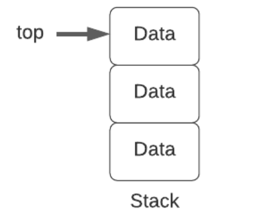
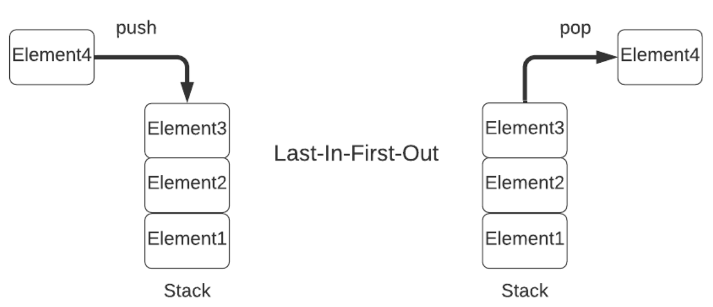
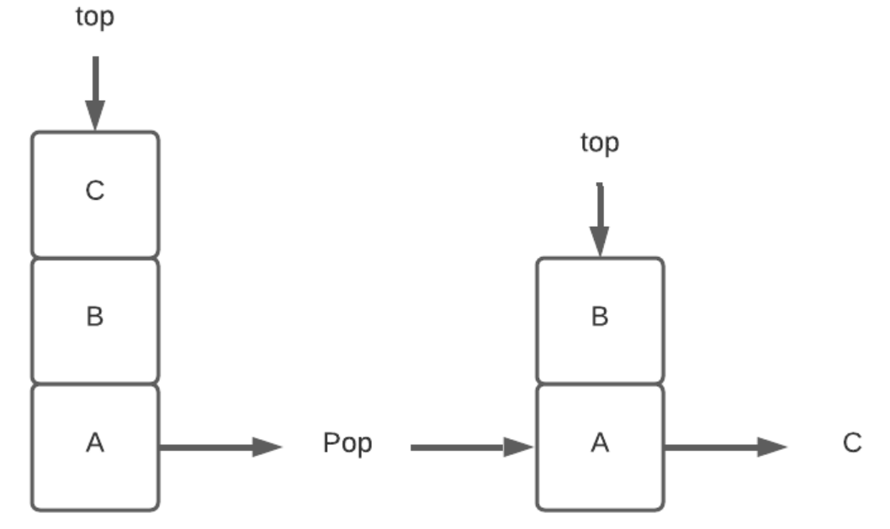

## 1. 概述

在本文中，我们将学习什么是栈，并了解其工作原理。此外，我们将给出栈数据结构及其基本操作的一般描述。

## 2. 栈

栈出现在日常生活中的很多地方。例如，一堆书、盘子、光盘。让我们以一堆书为例。它允许你执行诸如插入书本或仅从栈一端移除书本之类的操作。

类似地，栈是一个列表，其中仅允许在列表的一端进行插入和删除。这一端称为栈顶。

由于堆顶部的元素是使用insert操作插入的最新元素，并且也是要通过delete操作首先删除的元素，因此栈称为后进先出(LIFO)列表。

换句话说，这意味着最先插入栈的元素也是最后从栈中删除的元素。因此，堆栈也称为先进后出(FILO)列表。



栈对于任何需要LIFO存储的应用程序都很有用。例如，解析上下文无关语言、计算算术表达式和函数调用管理。

## 3. 表示

此外，让我们看一下栈的表示。

下图描述了栈在内存中的表示。如前所述，栈遵循LIFO顺序，你只能访问栈顶部。



接下来，让我们看看可以在栈上执行的基本操作。

## 4. 操作

我们可以在栈上执行的常见操作包括insert、delete、peek和检查栈是满还是空。

让我们看看所有这些操作的伪代码。

### 4.1 push()

首先，让我们看一下insert操作。将新元素插入栈顶部称为push操作。

以下伪代码显示push操作的详细信息：

```
算法1：插入一个新元素到栈中
数据: stack, data_element
结果: 如果stack不为满，则插入data_element; 否则失败。

if stack is full then
    return null;
else
    top <—— top + 1;
    stack[top] <—— data_element;
end
```

让我们看一个将A、B和C插入空栈的例子。首先，我们push A并将pop指向A。接下来，当我们将B压入栈时，pop会更新为指向B。最后，当我们将C压入栈时，pop会更新为指向C：


### 4.2 pop()

其次，让我们看看delete操作。从栈顶部删除元素称为pop操作。

以下伪代码显示pop操作的详细信息：

```
算法2：从栈顶移除一个元素
数据：stack
结果：从栈顶移除data_element

if stack is empty then
    return null;
else 
    data_element <—— stack[top];
    top <—— top - 1;
    return data_element;
end
```

让我们看一个从包含A、B和C的栈中删除顶部元素的例子：



我们可以看到，一旦移除顶部的元素，即C，top开始指向B。

### 4.3 peek()

第三，peek操作检索栈顶部的元素，而不将其从栈中删除。

以下伪代码显示了peek操作的详细信息：

```
算法3：检索栈顶的元素
数据：stack
结果：从栈顶检索元素data_element

if stack in empty then
    return null;
else
    data_element <—— stack[top];
    return data_element;
end
```

### 4.4 isFull()

它检查栈是否满。

以下伪代码显示isFull操作的详细信息：

```
算法4：检查栈是否满
数据：stack
结果：栈满返回true，否则返回false

if top == MAX_SIZE then
    return ture;
else
    return false;
end
```

### 4.5 isEmpty()

最后，我们看一下isEmpty操作。它检查栈是否为空。

以下伪代码显示isEmpty操作的详细信息：

```
算法5：检查栈是否为空
数据：stack
结果：如果栈为空返回true，否则返回false

if top < 0 then
    return true;
else 
    return false;
end
```

## 5. 时间复杂度分析

栈遵循所有操作的LIFO顺序，这意味着top始终指向最顶部的元素。因此，所有常见操作的时间复杂度都为O(1)。