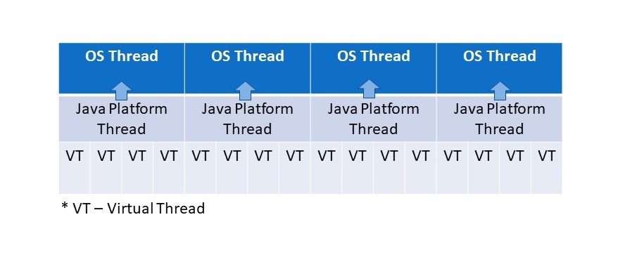

## 1. Java线程模型和虚拟线程

### 1.1 经典线程或平台线程

在Java中，经典的线程是java.lang.Thread类的实例。在本文的后面，我们也将称它们为平台线程。

传统上，Java将平台线程视为操作系统(OS)线程的薄包装器。创建此类平台线程的成本一直很高(由于操作系统维护的大量堆栈和其他资源)，因此Java一直使用[线程池](https://howtodoinjava.com/java/multi-threading/java-thread-pool-executor-example/)来避免线程创建的开销。

平台线程的数量也必须受到限制，因为这些资源匮乏的线程会影响整台机器的性能。这主要是因为平台线程1:1映射到操作系统线程。

### 1.2 平台线程的可扩展性问题

平台线程一直很容易建模、编程和调试，因为它们使用平台的并发单位来表示应用程序的并发单位。它被称为thread-per-request模式。

但是这种模式限制了服务器的吞吐量，因为并发请求的数量(服务器可以处理)与服务器的硬件性能成正比。因此，即使在多核处理器中，可用线程的数量也必须受到限制。

除了线程数量，延迟也是一个大问题。如果你仔细观察，在当今的[微服务](https://howtodoinjava.com/microservices/microservices-definition-principles-benefits/)世界中，请求是通过在多个系统和服务器上获取/更新数据来处理的。当应用程序等待来自其他服务器的信息时，当前平台线程保持空闲状态。这是对计算资源的浪费，也是实现高吞吐量应用程序的主要障碍。

### 1.3 响应式编程的问题

[响应式编程](https://howtodoinjava.com/tag/reactive-programming/)解决了平台线程等待其他系统响应的问题。异步API不等待响应，而是通过回调来工作。每当线程调用异步API时，平台线程都会返回到池中，直到响应从远程系统或数据库返回。稍后，当响应到达时，JVM将从池中分配另一个线程来处理响应，依此类推。这样，多个线程参与处理单个异步请求。

在异步编程中，延迟被移除，但由于硬件限制，平台线程的数量仍然有限，所以我们在可扩展性上有一个限制。另一个大问题是这样的异步程序在不同的线程中执行，因此很难调试或分析它们。

此外，我们必须采用一种不同于[典型循环](https://howtodoinjava.com/java/flow-control/enhanced-for-each-loop-in-java/)和[条件语句](https://howtodoinjava.com/java/flow-control/control-flow-statements/)的新编程风格。新的[Lambda风格的语法](https://howtodoinjava.com/java8/lambda-expressions/)使得理解现有代码和编写程序变得困难，因为我们现在必须将我们的程序分解成多个可以独立和异步运行的较小单元。

所以我们可以说，虚拟线程还通过适应传统语法提高了代码质量，同时具有响应式编程的好处。

### 1.4 虚拟线程看起来很有前途

与传统线程类似，虚拟线程也是java.lang.Thread的一个实例，它在底层OS线程上运行其代码，但它不会在代码的整个生命周期内阻塞OS线程。保持OS线程空闲意味着许多虚拟线程可以在同一个OS线程上运行它们的Java代码，从而有效地共享它。



值得一提的是，我们可以在应用程序中创建非常多的虚拟线程(数百万)，而无需依赖于平台线程的数量。这些虚拟线程由JVM管理，因此它们也不会增加额外的上下文切换开销，因为它们作为普通Java对象存储在RAM中。

与传统线程类似，应用程序的代码在整个请求期间都在虚拟线程中运行(以每个请求一个线程的方式)，但虚拟线程仅在CPU上执行计算时才使用操作系统线程。它们在等待或睡眠时不会阻塞操作系统线程。

虚拟线程有助于实现与具有相同硬件配置的异步API相同的高可扩展性和吞吐量，而不会增加语法复杂性。

>   虚拟线程最适合执行大部分时间都被阻塞的代码，例如等待数据到达网络套接字或等待队列中的元素。

## 2. 平台线程和虚拟线程的区别

-   虚拟线程始终是守护线程。该Thread.setDaemon(false)方法不能将虚拟线程更改为非守护线程。请注意，当所有启动的非守护线程都终止时，JVM终止。这意味着JVM在退出之前不会等待虚拟线程完成。

    ```java
    Thread virtualThread = ...; // create virtual thread
    
    // virtualThread.setDaemon(true);  // it has no effect
    ```

-   虚拟线程始终具有正常优先级，并且即使使用setPriority(n)方法也无法更改优先级。在虚拟线程上调用此方法没有任何效果。

    ```java
    Thread virtualThread = ...;
    
    // virtualThread.setPriority(Thread.MAX_PRIORITY);  // it has no effect
    ```

-   虚拟线程不是线程组的活动成员。在虚拟线程上调用Thread.getThreadGroup()时，它返回一个名为“VirtualThreads”的占位符线程组。
-   虚拟线程不支持stop()、suspend()或resume()方法。这些方法在虚拟线程上调用时抛出UnsupportedOperationException。

## 3. 比较平台线程和虚拟线程的性能

让我们了解这两种线程在提交相同的可执行代码时的区别。

为了演示它，我们有一个非常简单的任务，在控制台中打印消息之前等待1秒。我们正在创建此任务以保持示例简单，以便我们可以专注于概念。

```java
final AtomicInteger atomicInteger = new AtomicInteger();
Runnable runnable = () -> {
  	try {
    	Thread.sleep(Duration.ofSeconds(1));
  	} catch(Exception e) {
      	System.out.println(e);
  	}
  	System.out.println("Work Done - " + atomicInteger.incrementAndGet());
};
```

现在我们将从这个[Runnable](https://howtodoinjava.com/java/multi-threading/java-runnable-vs-thread/)创建10000个线程，并使用虚拟线程和平台线程来执行它们，以比较两者的性能。我们将使用[Duration.between()](https://howtodoinjava.com/java/date-time/calculate-difference-between-two-dates-in-java/) API来测量执行所有任务[所用的时间](https://howtodoinjava.com/java/date-time/execution-elapsed-time/)。

首先，我们使用包含100个平台线程的池。这样[Executor](https://howtodoinjava.com/java/multi-threading/executor-service-example/)就可以同时运行100个任务，其他任务将需要等待。由于我们有10000个任务，因此完成执行的总时间约为100秒。

```java
Instant start = Instant.now();
try (var executor = Executors.newFixedThreadPool(100)) {
    for(int i = 0; i < 10_000; i++) {
        executor.submit(runnable);
    }
}

Instant finish = Instant.now();
long timeElapsed = Duration.between(start, finish).toMillis();
System.out.println("Total elapsed time : " + timeElapsed);
```

输出：

```shell
Total elapsed time : 101152 //Approx 101 seconds
```

>   截至目前，虚拟线程是一个预览API，默认情况下是禁用的。使用java --source 19 --enable-preview Main.java来运行代码。

接下来，我们将Executors.newFixedThreadPool(100)替换为Executors.newVirtualThreadPerTaskExecutor()。这将在虚拟线程而不是平台线程中执行所有任务。

```java
Instant start = Instant.now();
try (var executor = Executors.newVirtualThreadPerTaskExecutor()) {
    for(int i = 0; i < 10_000; i++) {
        executor.submit(runnable);
    }
}

Instant finish = Instant.now();
long timeElapsed = Duration.between(start, finish).toMillis();
System.out.println("Total elapsed time : " + timeElapsed);
```

输出：

```shell
Total elapsed time : 1589 //Approx 1.5 seconds
```

请注意，虚拟线程的超快性能将执行时间从100秒减少到1.5秒，而Runnable代码没有发生变化。

## 4. 如何创建虚拟线程

### 4.1 使用Thread.startVirtualThread()

此方法创建一个新的虚拟线程来执行给定的Runnable任务并安排它执行。

```java
Runnable runnable = () -> System.out.println("Inside Runnable");
Thread.startVirtualThread(runnable);

// or
      
Thread.startVirtualThread(() -> {
	// code to execute in virtual thread
	System.out.println("Inside Runnable");
});
```

### 4.2 使用Thread.Builder

如果我们想在创建线程后显式启动它，我们可以使用Thread.ofVirtual()返回一个VirtualThreadBuilder实例。它的start()方法启动一个虚拟线程。

值得注意的是Thread.ofVirtual().start(runnable)等同于Thread.startVirtualThread(runnable)。

```java
Runnable runnable = () -> System.out.println("Inside Runnable"); 
Thread virtualThread = Thread.ofVirtual().start(runnable);
```

我们可以使用Thread.Builder引用来创建和启动多个线程。

```java
Runnable runnable = () -> System.out.println("Inside Runnable");

Thread.Builder builder = Thread.ofVirtual().name("JVM-Thread");

Thread t1 = builder.start(runnable);
Thread t2 = builder.start(runnable);
```

Thread.ofPlatform()也存在用于创建平台线程的类似API。

```java
Thread.Builder builder = Thread.ofPlatform().name("Platform-Thread");

Thread t1 = builder.start(() -> {...});
Thread t2 = builder.start(() -> {...});
```

### 4.3 使用Executors.newVirtualThreadPerTaskExecutor()

此方法为每个任务创建一个新的虚拟线程。Executor创建的线程数是无限的。

在下面的示例中，我们提交了10000个任务并等待它们全部完成。该代码将创建10000个虚拟线程来完成这10000个任务。

请注意，以下语法是[结构化并发](https://howtodoinjava.com/java/multi-threading/structured-concurrency/)的一部分，这是Project Loom中提出的另一个新功能。我们将在另一篇文章中讨论它。

```java
try (var executor = Executors.newVirtualThreadPerTaskExecutor()) {
    IntStream.range(0, 10_000).forEach(i -> {
        executor.submit(() -> {
            Thread.sleep(Duration.ofSeconds(1));
            return i;
        });
    });
}
```

## 5. 最佳实践

### 5.1 不要池化虚拟线程

Java线程池旨在避免创建新操作系统线程的开销，因为创建它们是一项成本高昂的操作。但是创建虚拟线程并不昂贵，因此永远不需要将它们池化。建议每次需要时创建一个新的虚拟线程。

请注意，在使用虚拟线程后，我们的应用程序可能能够处理数百万个线程，但其他系统或平台一次只能处理几个请求。例如，我们可以只有几个数据库连接或到其他服务器的网络连接。

在这些情况下，也不要使用线程池。相反，使用[信号量](https://howtodoinjava.com/java/multi-threading/throttling-task-submission-rate-using-threadpoolexecutor-and-semaphore/)来确保只有指定数量的线程正在访问该资源。

```java
private static final Semaphore SEMAPHORE = new Semaphore(50);

SEMAPHORE.acquire();

try {
  // semaphore limits to 50 concurrent access requests access the database or resource
} finally {
  SEMAPHORE.release();
}
```

### 5.2 避免使用线程局部变量

虚拟线程以与平台线程相同的方式支持线程局部行为，但由于可以创建数百万个虚拟线程，因此只有在仔细考虑后才应使用线程局部变量。

例如，如果我们在应用程序中扩展一百万个虚拟线程，就会有一百万个[ThreadLocal](https://howtodoinjava.com/java/multi-threading/when-and-how-to-use-thread-local-variables/)实例及其引用的数据。如此大量的实例会给物理内存带来足够的负担，应避免这种情况。

[Extent-Local变量](https://openjdk.org/jeps/429)，如果包含在Java中，可能会被证明是一个更好的选择。

### 5.3 使用ReentrantLock代替同步块

在两种特定情况下，虚拟线程可以阻塞平台线程(称为OS线程固定)。

-   当它在[同步块](https://howtodoinjava.com/java/keywords/java-synchronized/)或方法中执行代码时，或者
-   当它执行本地方法或外部函数时

这样的synchronized块不会使应用程序不正确，但它限制了类似于平台线程的应用程序的可扩展性。

作为最佳实践，如果某个方法被非常频繁地使用并且它使用了同步块，那么考虑用ReentrantLock机制替换它。

因此，不要像这样使用同步块：

```java
public synchronized void m() {
	try {
	 	// ... access resource
	} finally {
	 	//
	}
}
```

而是像这样使用ReentrantLock：

```java
private final ReentrantLock lock = new ReentrantLock();

public void m() {
	lock.lock();  // block until condition holds
	try {
	 	// ... access resource
	} finally {
	 	lock.unlock();
	}
}
```

建议不需要替换不经常使用(例如，仅在启动时执行)或保护内存操作的同步块和方法。

## 6. 总结

长期以来，传统的Java线程一直运行良好。随着微服务领域对可扩展性和高吞吐量的需求不断增长，虚拟线程将被证明是Java历史上的一个里程碑式特性。

使用虚拟线程，程序可以用少量的物理内存和计算资源处理数百万个线程，否则传统平台线程是不可能的。当与结构化并发相结合时，它还可以促使编写出更好的程序。