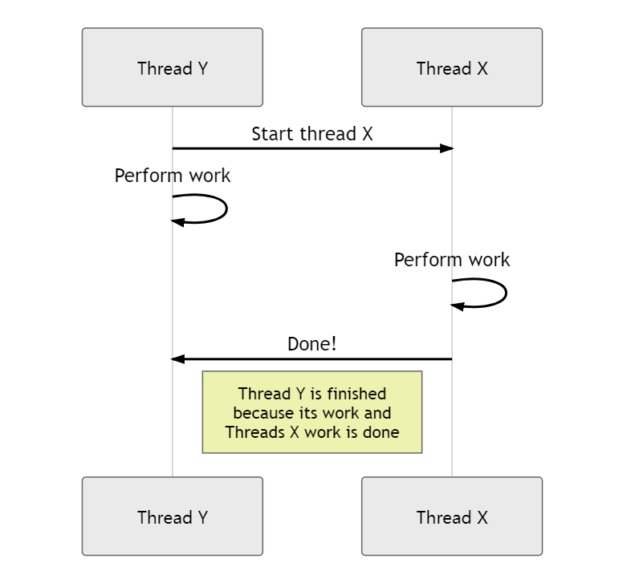

## 1. 简介-为什么使用Loom

当你在Java中创建一个新的线程时，会对操作系统进行系统调用，告诉它创建一个新的系统线程。创建一个系统线程是昂贵的，因为调用会占用很多时间，并且每个线程都会占用一些内存。你的线程也共享同一个CPU，因此你不希望它们阻塞它，从而导致其他线程不必要地等待。

你可以使用异步编程来防止这种情况发生。你启动一个线程并告诉它在数据到达时该怎么做。在数据可用之前，其他线程可以使用CPU资源来完成它们的任务。在下面的示例中，我们使用CompletableFuture来获取一些数据并告诉它在数据可用时将其打印到控制台。

```java
CompletableFuture.supplyAsync(() -> "some data")
    .thenAccept(System.out::println);
```

异步编程工作正常，但还有另一种工作方法可以考虑在Loom中实现的并发性，称为“结构化并发”。Loom是用于开发并发应用程序的Java增强提案(JEP)，它旨在使在Java中编写和调试多线程代码变得更加容易。

## 2. 什么是虚拟线程

Project Loom将虚拟线程引入Java。虚拟线程看起来与我们在Java中已经熟悉的线程一样，但它们的工作方式不同。我们已经知道的Thread类只是一个围绕创建成本高昂的系统线程的微小包装器。虚拟线程由Java虚拟机(JVM)创建和管理。Java不会为你需要的每个虚拟线程创建一个系统线程。相反，许多虚拟线程在称为载体线程的单个系统线程上运行。使用载体线程使阻塞非常便宜！当你的虚拟线程正在等待数据可用时，另一个虚拟线程可以在载体线程上运行。

## 3. 什么是结构化并发

通过Project Loom，我们还获得了一个名为“结构化并发”的新模型来处理和思考线程。结构化并发背后的想法是让线程的生命周期与结构化编程中的代码块一样工作。例如，在像Java这样的结构化编程语言中，如果你在方法A中调用方法B，那么方法B必须先完成，然后才能退出方法A。方法B的生命周期不能超过方法A的生命周期。

对于结构化并发，我们需要与结构化编程相同的规则。当你在虚拟线程Y中创建虚拟线程X时，线程X的生命周期不能超过线程Y的生命周期。结构化并发使线程的工作和思考变得更加容易。当你停止父线程Y时，它的所有子线程也将被取消，所以你不必担心失控线程仍在运行。该模式的关键是避免火灾并忘记并发。



线程Y启动一个新的线程X；两者彼此独立工作，但在线程Y完成之前，它必须等待线程X完成其工作。让我们看看它在Java中是什么样子的！

## 4. 使用Loom在Java中实现结构化并发

结构化并发将线程的生命周期绑定到创建它们的代码块。此绑定是通过使ExecutorService Autocloseable来实现的，这使得在try-with-resources中使用ExecutorServices成为可能。当所有任务都提交后，当前线程会一直等待，直到任务完成并且ExecutorService的close方法完成。

在下面的示例中，我们有一个try-with-resources作为线程的作用域。我们使用newVirtualThreadPerTaskExecutor()创建两个线程。当前线程将等待，直到提交的两个线程完成并且我们离开了try语句。

```java
try (ExecutorService e = Executors.newVirtualThreadPerTaskExecutor()) {
    e.submit(() -> System.out.println("first virtual thread"));
    e.submit(() -> System.out.println("second virtual thread"));
} // all tasks were submitted and are finished at this point and the parent thread can continue
```

## 5. 顺序取消

结构化并发将你的线程绑定到一个作用域，但是当你退出该作用域时，你的所有线程都将被并行取消。这很好但并不总是最佳行为。例如，我们在同一作用域内创建一个线程，将值写入数据库(DB)，然后，我们启动一些线程为DB线程生成值。当我们退出作用域时，所有这些线程都将并行关闭。如果先关闭DB线程，则其他线程在关闭之前无处可写。

在关闭DB线程之前，我们首先要关闭生成值的线程。这个问题是通过在try-with-resources中提供一个额外的ExecutorService来解决的。在下面的示例中，我们为每个ExecutorService启动一个线程。但是在示例中，我们在executorServices之间创建了依赖关系；ExecutorService X无法在Y之前完成。此示例之所以有效，是因为try中的资源以相反的顺序关闭。首先，我们等待ExecutorService Y关闭，然后调用X上的close方法。

```java
try (ExecutorService x = Executors.newVirtualThreadPerTaskExecutor();
     ExecutorService y = Executors.newVirtualThreadPerTaskExecutor()) {
    x.submit(() -> y.awaitTermination(1L, TimeUnit.DAYS));
    y.submit(() -> System.out.println("is Y shutdown? " + y.isShutdown()));
} // both threads are done at this point
```

## 6. 异常和结构化并发

异常和中断是或至少感觉上仍在开发中的东西。特别是当你查看像[这样的](https://cr.openjdk.java.net/~rpressler/loom/loom/sol1_part2.html#structured-concurrency)早期示例时，你可以在其中使用CompletableFuture.stream。这些方法不再可用，因此我们必须做其他事情。

让我们从一个小例子开始。在下面的代码中，我们有一个启动三个虚拟线程的作用域，其中第二个在启动时抛出异常。该异常不会传播到其父线程，其他两个线程将继续运行。当我们离开这个作用域时，所有三个线程都被认为已完成运行。

```java
try (ExecutorService e = Executors.newVirtualThreadPerTaskExecutor()) {
    e.submit(() -> System.out.println("first thread"));
    e.submit(() -> {throw new RuntimeException();});
    e.submit(() -> System.out.println("third thread"));
}
```

在下面的示例中，我尝试从[这篇](https://cr.openjdk.java.net/~rpressler/loom/loom/sol1_part2.html#structured-concurrency)文章中重新创建一个示例。和前面的例子一样，我们启动三个线程，其中一个会抛出错误。但是这一次，我们将使用一个流来从futures中获取结果，并查看是否有一个线程失败了。

```java
try (ExecutorService e = Executors.newVirtualThreadPerTaskExecutor()) {
    List<Future<String>> futures = e.invokeAll(List.of(
        () -> "first task",
        () -> "second task",
        () -> {
            throw new RuntimeException();
        }
    ));

    String s = futures.stream()
        .map(future -> {
            try {
                return future.get();
            } catch (InterruptedException | ExecutionException ex) {
                System.out.println("exception = " + ex);
            }
            return null;
        })
        .filter(Objects::nonNull)
        .collect(Collectors.joining(","));

    System.out.println("s = " + s);
}
```

在这种情况下，异常也不会传播到父线程。当我们离开try-with-resources的作用域时，所有线程都将被调用并完成。

## 7. 总结

这篇文章探讨了结构化并发对Java语言的好处以及它是如何在Loom中实现的。我们讨论了如何为你的线程创建作用域并让它们按特定顺序关闭。我们还看到了当作用域中的一个虚拟线程抛出错误时会发生什么。