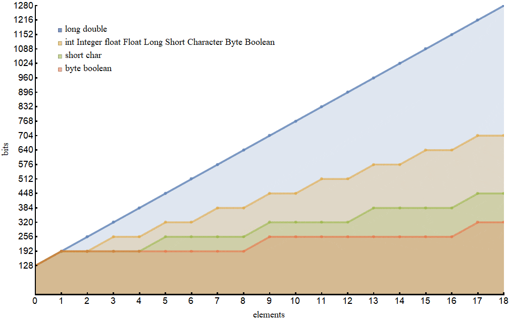
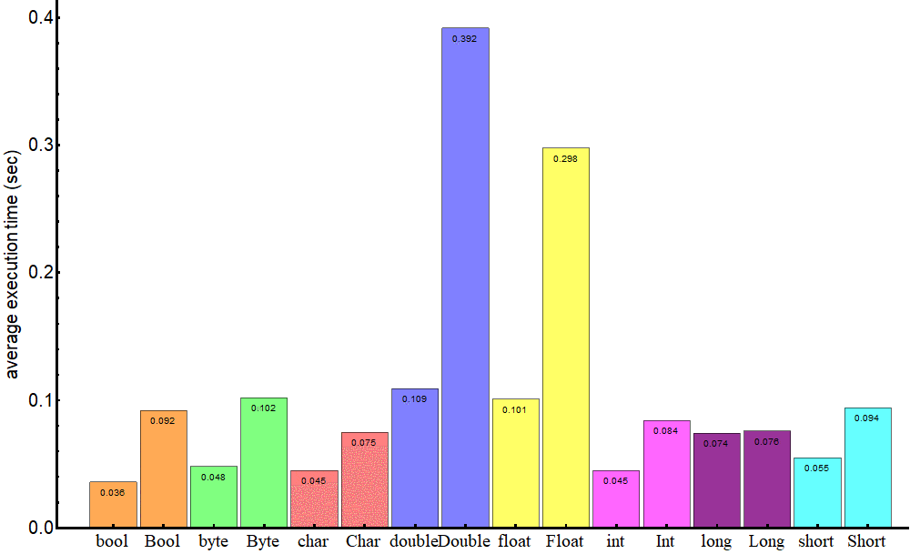

## 1. 概述

在本教程中，我们将展示使用Java基本类型及其包装对应物的优缺点。

## 2. Java类型系统

Java有一个双重类型系统，由int、boolean等基本类型和Integer、Boolean等引用类型组成。每个基本类型都对应一个引用类型。

每个对象都包含相应原始类型的单个值。**包装类是不可变的**(因此一旦对象被构造它们的状态就不能改变)并且是最终的(因此我们不能从它们继承)。

在底层，如果实际类型与声明的类型不同，Java会在原始类型和引用类型之间进行转换：

```java
Integer j = 1;          // autoboxing
int i = new Integer(1); // unboxing
```

将原始类型转换为引用类型的过程称为自动装箱，相反的过程称为拆箱。

## 3. 优点和缺点

决定使用什么对象取决于我们尝试实现的应用程序性能、我们有多少可用内存、可用内存量以及我们应该处理的默认值。

如果我们不面对这些，我们可能会忽略这些考虑因素，尽管了解它们是值得的。

### 3.1 单项内存占用

仅供参考，[原始类型变量](https://docs.oracle.com/javase/tutorial/java/nutsandbolts/datatypes.html)对内存的影响如下：

-   boolean：1位
-   byte：8位
-   short、char：16位
-   int、float：32位
-   long、double：64位

实际上，这些值可能因虚拟机实现而异。例如，在Oracle的VM中，boolean类型映射到int值0和1，因此它需要32位，如此处所述：[原始类型和值](https://docs.oracle.com/javase/specs/jvms/se7/html/jvms-2.html#jvms-2.3.4)。

这些类型的变量存在于堆栈中，因此可以快速访问。有关详细信息，推荐我们关于[Java内存模型的](https://www.baeldung.com/java-stack-heap)教程。

引用类型是对象，它们存在于堆中并且访问速度相对较慢。因此与它们的原始对应物相比有一定的开销。

开销的具体值通常是特定于JVM的。在这里，我们展示了具有以下参数的64位虚拟机的结果：

```shell
java 10.0.1 2018-04-17
Java(TM) SE Runtime Environment 18.3 (build 10.0.1+10)
Java HotSpot(TM) 64-Bit Server VM 18.3 (build 10.0.1+10, mixed mode)
```

要获取对象的内部结构，我们可以使用[Java对象布局](https://openjdk.java.net/projects/code-tools/jol/)工具(请参阅我们的另一篇关于如何[获取对象大小](https://www.baeldung.com/java-size-of-object)的教程)。

事实证明，此JVM上引用类型的单个实例占用128位，但Long和Double占用192位：

-   Boolean：128位
-   Byte：128位
-   Short、Character：128位
-   Integer、Float：128位
-   Long、Double：192位

可以看到，单个Boolean类型变量占用的空间相当于128个原始变量，而单个Integer变量占用的空间相当于4个int型变量。

### 3.2 数组的内存占用

如果我们比较所考虑类型的数组占用多少内存，情况就会变得更有趣。

当我们为每种类型创建具有不同数量元素的数组时，我们得到一个图：



这表明类型根据内存m(s)如何取决于数组的元素数量s分为四个系列：

-   long、double：m(s) = 128 + 64 s
-   short、char：m(s) = 128 + 64 [s/4]
-   byte、boolean：m(s) = 128 + 64 [s/8]
-   其余：m(s) = 128 + 64 [s/2]

其中方括号表示标准上限函数。

令人惊讶的是，基本类型long和double的数组比它们的包装类Long和Double消耗更多的内存。

我们可以看到，**原始类型的单元素数组几乎总是比相应的引用类型更昂贵(long和double除外)**。

### 3.3 性能

Java代码的性能是一个非常微妙的问题，它在很大程度上取决于运行代码的硬件、可能执行某些优化的编译器、虚拟机的状态以及操作系统中其他进程的活动。

正如我们已经提到的，原始类型存在于栈中，而引用类型存在于堆中。这是决定访问对象的速度的主要因素。

为了演示基本类型的操作比包装类的操作快多少，让我们创建一个500万个元素的数组，其中除最后一个元素外所有元素都相等；然后我们对该元素执行查找：

```java
while (!pivot.equals(elements[index])) {
    index++;
}
```

并比较此操作在数组包含基本类型变量和数组包含引用类型对象的情况下的性能。

我们使用著名的[JMH](https://openjdk.java.net/projects/code-tools/jmh/)基准测试工具(请参阅我们的[教程](https://www.baeldung.com/java-microbenchmark-harness)了解如何使用它)，查找操作的结果可以总结在这张图表中：



即使对于这样一个简单的操作，我们也可以看到包装类需要更多时间来执行该操作。

在求和、乘法或除法等更复杂的运算的情况下，速度差异可能会飙升。

### 3.4 默认值

对于数值类型，基本类型的默认值为0(在相应的表示中，即0、0.0d等)，对于boolean类型是false，对于char类型是\u0000。对于包装器类，默认值为null。

这意味着原始类型只能从它们的域中获取值，而引用类型可能会获取在某种意义上不属于它们的域的值(null)。

尽管让变量未初始化被认为不是一个好习惯，但有时我们可能会在创建变量后为其赋值。

在这种情况下，当原始类型变量的值等于其类型默认值时，我们应该查明该变量是否已真正初始化。

包装类变量没有这样的问题，因为null值非常明显地表明变量尚未初始化。

## 4. 用法

正如我们所看到的，原始类型速度更快，需要的内存也更少。因此，我们可能更倾向使用它们。

另一方面，当前的Java语言规范不允许在参数化类型(泛型)、Java集合或反射API中使用原始类型。

当我们的应用程序需要包含大量元素的集合时，我们应该考虑使用尽可能“经济”类型的数组，如上图所示。

## 5. 总结

在本教程中，我们说明了Java中的对象比它们的原始对应物更慢并且对内存的影响更大。