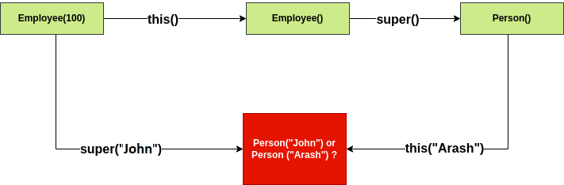

## 1. 概述

在本教程中，我们将学习Java如何处理[构造函数](https://www.baeldung.com/java-constructors)，并回顾[Java语言规范](https://docs.oracle.com/javase/specs/)中与构造函数相关的一些规则。

## 2. 构造函数声明

在Java中，每个类都必须有一个构造函数。它的结构看起来类似于一个方法，但它有不同的用途。

让我们看看构造函数的规范：

```java
<Constructor Modifiers> <Constructor Declarator> [Throws Clause] <Constructor Body>
```

让我们分别看一下每一部分。

### 2.1 构造函数修饰符

构造函数声明以访问修饰符开头：它们可以是public、private、protected或包访问，基于其他访问修饰符。

**为了防止编译错误，构造函数声明不能有多个private、protected或public访问修饰符**。

与方法不同，构造函数不能是abstract、static、final、native或synchronized：

-   没有必要将构造函数声明为final，因为它们不是类成员并且它们不继承
-   抽象是不必要的，因为我们必须实现构造函数
-   不需要静态构造函数，因为每个构造函数都是用一个对象调用的
-   正在构造的对象不应同步，因为它会在构造对象时锁定该对象，而在所有构造函数完成其工作之前，该对象通常不可供其他线程使用
-   Java中没有本机构造函数，因为这是一种语言设计决策，旨在确保在对象创建期间始终调用超类构造函数

### 2.2 构造函数声明符

让我们检查一下构造函数声明符的语法：

```java
Constrcutor Name (Parameter List)
```

声明符中的构造函数名称必须与包含构造函数声明的类的名称匹配，否则将发生编译时错误。

### 2.3 Throws子句

方法和构造函数的[throws](https://www.baeldung.com/java-throw-throws#throws-in-java)子句的结构和行为都是相同的。

### 2.4 构造函数体

构造函数主体的语法是：

```java
Constructor Body: { [Explicit Constructor Invocation] [Block Statements] }
```

我们可以显式调用同一类或直接超类的另一个构造函数作为构造函数主体中的第一条语句。不允许直接或间接调用同一个构造函数。

## 3. 显式构造函数调用

我们可以将构造函数的调用分为两种类型：

-   备用构造函数调用以关键字this开头。它们用于调用同一类的备用构造函数。
-   超类构造函数调用以关键字super开头。

让我们看一个示例，说明如何使用this和super关键字来调用另一个构造函数：

```java
class Person {
    String name;

    public Person() {
        this("Arash");   // ExplicitConstructorInvocation
    }

    public Person(String name) {
        this.name = name;
    }
}
```

在这里，Employee的第一个构造函数调用其超类Person的构造函数，并传递id：

```java
class Person {
    int id;

    public Person(int id) {
        this.id = id;
    }
}

class Employee extends Person {
    String name;

    public Employee(int id) {
        super(id);
    }

    public Employee(int id, String name) {
        super(id);
        this.name = name;
    }
}
```

## 4. 构造函数调用规则

### 4.1 this或super必须是构造函数中的第一条语句

每当我们调用构造函数时，它都必须调用其基类的构造函数。此外，你可以在类中调用另一个构造函数。**Java通过使构造函数中的第一个调用是this或super来强制执行此规则**。

让我们看一个例子：

```java
class Person {
    Person() {
        //
    }
}

class Employee extends Person {
    Employee() {
        // 
    }
}
```

这是构造函数编译的示例：

```java
.class Employee
.super Person
; A constructor taking no arguments
.method <init>()V
aload_0
invokespecial Person/<init>()V
return
.end method
```

构造函数编译类似于编译任何其他方法，只是生成的方法具有名称<init\>。验证<init\>方法的要求之一是调用超类构造函数(或当前类中的其他构造函数)必须是该方法的第一步。

正如我们在上面看到的，Person类必须调用其超类构造函数，依此类推直至java.lang.Object。

**当类必须调用它们的超类构造函数时，它可确保在没有正确初始化的情况下永远不会使用它们。JVM的安全性取决于此，因为某些方法在类初始化之前不起作用**。

### 4.2 不要在构造函数中同时使用this和super

想象一下，如果我们可以在构造函数体中同时使用this和super。

让我们通过一个例子看看会发生什么：

```java
class Person {
    String name;

    public Person() {
        this("Arash");
    }

    public Person(String name) {
        this.name = name;
    }
}

class Employee extends Person {
    int id;

    public Employee() {
        super();
    }

    public Employee(String name) {
        super(name);
    }

    public Employee(int id) {
        this();
        super("John"); // syntax error
        this.id = id;
    }

    public static void main(String[] args) {
        new Employee(100);
    }
}
```

我们无法执行上面的代码，因为**会出现编译时错误**。Java编译器当然有其合乎逻辑的解释。

我们来看看构造函数调用顺序：



**Java编译器不允许编译该程序，因为初始化不清楚**。

### 4.3 递归构造函数调用

如果构造函数调用自身，编译器将抛出错误。例如，在下面的Java代码中，编译器将抛出错误，因为我们试图在构造函数中调用相同的构造函数：

```java
public class RecursiveConstructorInvocation {
    public RecursiveConstructorInvocation() {
        this();
    }
}
```

尽管有Java编译器的限制，但我们可以通过稍微改变代码来编译程序，但是这样会遇到堆栈溢出：

```java
public class RecursiveConstructorInvocation {
    public RecursiveConstructorInvocation() {
        RecursiveConstructorInvocation rci = new RecursiveConstructorInvocation();
    }

    public static void main(String[] args) {
        new RecursiveConstructorInvocation();
    }
}
```

**我们创建了一个通过调用构造函数初始化的RecursiveConstructorInvocation对象。然后构造函数创建另一个RecursiveConstructorInvocation对象，该对象通过再次调用构造函数进行初始化，直到堆栈溢出**。

现在，让我们看看输出：

```java
Exception in thread "main" java.lang.StackOverflowError
	at cn.tuyucheng.taketoday.RecursiveConstructorInvocation.<init>(RecursiveConstructorInvocation.java:29)
	at cn.tuyucheng.taketoday.RecursiveConstructorInvocation.<init>(RecursiveConstructorInvocation.java:29)
	at cn.tuyucheng.taketoday.RecursiveConstructorInvocation.<init>(RecursiveConstructorInvocation.java:29)
//...
```

## 5. 总结

在本教程中，我们讨论了Java中构造函数的规范，并回顾了一些用于理解类和超类中构造函数调用的规则。