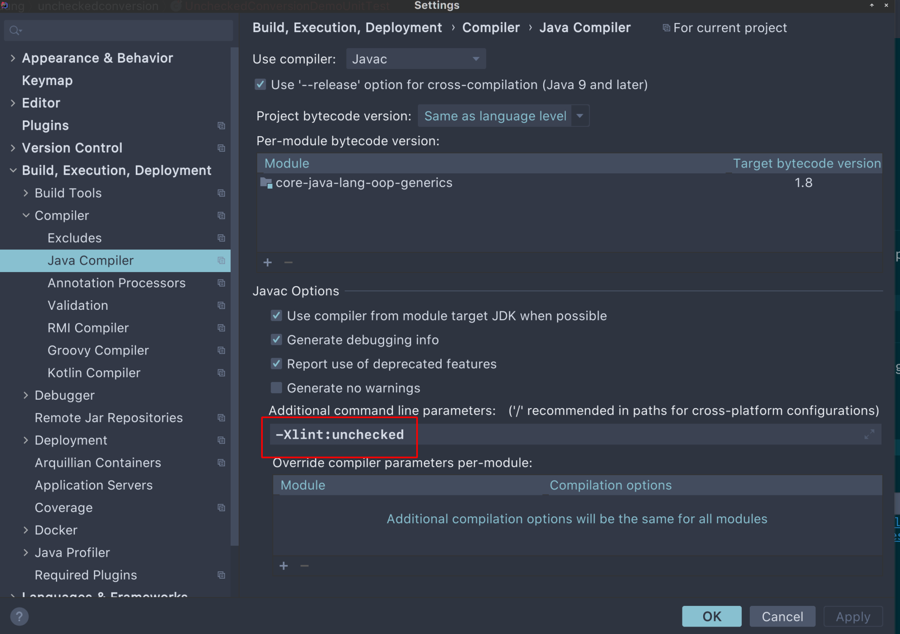

## 1. 概述

有时，当我们编译Java源代码时，编译器可能会打印一条警告消息“unchecked conversion”或“The expression of type List needs unchecked conversion”。

在本教程中，我们将更深入地了解警告消息。我们将讨论此警告的含义、它可能导致的问题以及如何解决潜在问题。

## 2. 启用Unchecked警告选项

在我们查看“unchecked conversion”警告之前，让我们确保打印此警告的Java编译器选项已启用。

如果我们使用的是[Eclipse JDT Compiler](https://www.eclipse.org/jdt/core/)，则默认情况下会启用此警告。

**当我们使用Oracle或OpenJDK javac编译器时，我们可以通过添加编译器选项-Xlint:unchecked来启用此警告**。

通常，我们在IDE中编写和构建Java程序。我们可以在IDE的编译器设置中添加这个选项。

例如，下面的屏幕截图显示了如何在[JetBrains IntelliJ](https://www.jetbrains.com/idea/)中启用此警告：



[Apache Maven](https://www.baeldung.com/maven)是一种广泛使用的用于构建Java应用程序的工具。我们可以配置maven-compiler-plugin的compilerArguments来启用这个选项：

```xml
<build>
    ...
    <plugins>
        ...
        <plugin>
            <groupId>org.apache.maven.plugins</groupId>
            <artifactId>maven-compiler-plugin</artifactId>
            ...
            <configuration>
                ...
                <compilerArguments>
                    <Xlint:unchecked/>
                </compilerArguments>
            </configuration>
        </plugin>
    </plugins>
</build>
```

现在我们已经确认我们的Java编译器启用了这个警告选项，让我们仔细看看这个警告。

## 3. 编译器什么时候会警告我们：“unchecked conversion”？

在上一节中，我们学习了如何通过设置Java编译器选项来启用警告。因此，**不难想象“unchecked conversion”是一个编译时警告。通常，在不进行类型检查的情况下将原始类型分配给参数化类型时，我们会看到此警告**。

编译器允许此赋值，因为**编译器必须允许此赋值以保持与不支持泛型的旧Java版本的向后兼容性**。

一个例子将快速解释它。假设我们有一个简单的方法来返回原始类型List：

```java
public class UncheckedConversion {
    public static List getRawList() {
        List result = new ArrayList();
        result.add("I am the 1st String.");
        result.add("I am the 2nd String.");
        result.add("I am the 3rd String.");
        return result;
    }
    // ...
}
```

接下来，让我们创建一个测试方法，调用该方法并将结果分配给类型为List<String\>的变量：

```java
@Test
public void givenRawList_whenAssignToTypedList_shouldHaveCompilerWarning() {
    List<String> fromRawList = UncheckedConversion.getRawList();
    Assert.assertEquals(3, fromRawList.size());
    Assert.assertEquals("I am the 1st String.", fromRawList.get(0));
}
```

现在，如果我们编译上面的测试，我们将看到来自Java编译器的警告。

让我们使用Maven构建和测试我们的程序：

```shell
$ mvn clean test
...
[WARNING] .../UncheckedConversionDemoUnitTest.java:[12,66] unchecked conversion
  required: java.util.List<java.lang.String>
  found:    java.util.List
...
[INFO] -------------------------------------------------------
[INFO] T E S T S
[INFO] -------------------------------------------------------
...
[INFO] Tests run: 13, Failures: 0, Errors: 0, Skipped: 0
[INFO] ------------------------------------------------------------------------
[INFO] BUILD SUCCESS
...
```

如上面的输出所示，我们已经重现了编译器警告。

现实世界中的一个典型示例是当我们使用[Java Persistence API](https://www.baeldung.com/hibernate-entitymanager)的[Query.getResultList()](https://docs.oracle.com/javaee/7/api/javax/persistence/Query.html#getResultList--)方法时。该方法返回一个原始类型的List对象。

但是，当我们尝试将原始类型列表分配给具有参数化类型的列表时，我们将在编译时看到此警告：

```java
List<MyEntity> results = entityManager.createNativeQuery("... SQL ...", MyEntity.class).getResultList();
```

而且，我们知道，如果编译器警告我们一些事情，就意味着存在潜在的风险。如果我们查看上面的Maven输出，我们会看到虽然我们收到“unchecked conversion”警告，但我们的测试方法没有任何问题。

自然地，我们可能想问为什么编译器会用这个消息警告我们，我们可能有什么潜在的问题？

接下来，让我们弄清楚。

## 4. 为什么Java编译器会警告我们？

我们的测试方法在上一节中运行良好，即使我们收到“unchecked conversion”警告。这是因为getRawList()方法仅将String添加到返回的列表中。

现在，让我们稍微改变一下方法：

```java
public static List getRawListWithMixedTypes() {
    List result = new ArrayList();
    result.add("I am the 1st String.");
    result.add("I am the 2nd String.");
    result.add("I am the 3rd String.");
    result.add(new Date());
    return result;
}
```

在新的getRawListWithMixedTypes()方法中，我们将一个Date对象添加到返回的列表中。这是允许的，因为我们返回的是一个可以包含任何类型的原始类型列表。

接下来，让我们创建一个新的测试方法来调用getRawListWithMixedTypes()方法并测试返回值：

```java
@Test(expected = ClassCastException.class)
public void givenRawList_whenListHasMixedType_shouldThrowClassCastException() {
    List<String> fromRawList = UncheckedConversion.getRawListWithMixedTypes();
    Assert.assertEquals(4, fromRawList.size());
    Assert.assertFalse(fromRawList.get(3).endsWith("String."));
}
```

如果我们运行上面的测试方法，我们将再次看到“unchecked conversion”警告，测试将通过。

这意味着当我们通过调用get(3)获取Date对象并尝试将其类型转换为String时，抛出了ClassCastException。

**在现实世界中，根据需求，有时抛出异常为时已晚**。

例如，我们分配List<String\> strList = getRawListWithMixedTypes()。对于strList中的每个String对象，假设我们在相当复杂或昂贵的过程中使用它，例如外部API调用或事务数据库操作。

当我们在strList中的某个元素上遇到ClassCastException时，一些元素已经被处理了。因此，ClassCastException来得太晚，可能会导致一些额外的恢复或数据清理过程。

到目前为止，我们已经了解了“unchecked conversion”警告背后的潜在风险。接下来，让我们看看我们可以做些什么来规避风险。

## 5. 我们应该如何处理警告？

如果允许我们更改返回原始类型集合的方法，我们应该考虑将其转换为泛型方法。这样，将确保类型安全。

然而，当我们遇到“unchecked conversion”警告时，我们很可能正在使用来自外部库的方法。让我们看看在这种情况下我们能做什么。

### 5.1 抑制警告

我们可以使用注解@SuppressWarnings("unchecked")来抑制警告。

但是，**只有当我们确定类型转换是安全的时，我们才应该使用@SuppressWarnings("unchecked")注解**，因为它只是在没有任何类型检查的情况下抑制警告消息。

让我们看一个例子：

```java
Query query = entityManager.createQuery("SELECT e.field1, e.field2, e.field3 FROM SomeEntity e");
@SuppressWarnings("unchecked")
List<Object[]> list = query.list();
```

正如我们之前提到的，JPA的Query.getResultList()方法返回一个原始类型化的List对象。根据我们的查询，我们确信原始类型列表可以转换为List<Object[]\>。因此，我们可以在赋值语句上方添加@SuppressWarnings来抑制“unchecked conversion”警告。

### 5.2 在使用原始类型集合之前检查类型转换

警告消息“unchecked conversion”暗示我们应该在赋值之前检查转换。

为了检查类型转换，我们可以遍历原始类型集合并将每个元素强制转换为我们的参数化类型。这样，如果有一些元素的类型错误，我们可以在真正使用该元素之前得到ClassCastException。

我们可以构建一个泛型方法来进行类型转换。根据具体要求，我们可以通过不同的方式处理ClassCastException。

首先，假设我们将过滤掉类型错误的元素：

```java
public static <T> List<T> castList(Class<? extends T> clazz, Collection<?> rawCollection) {
    List<T> result = new ArrayList<>(rawCollection.size());
    for (Object o : rawCollection) {
        try {
            result.add(clazz.cast(o));
        } catch (ClassCastException e) {
            // log the exception or other error handling
        }
    }
    return result;
}
```

让我们通过一个单元测试方法测试上面的castList()方法：

```java
@Test
public void givenRawList_whenAssignToTypedListAfterCallingCastList_shouldOnlyHaveElementsWithExpectedType() {
    List rawList = UncheckedConversion.getRawListWithMixedTypes();
    List<String> strList = UncheckedConversion.castList(String.class, rawList);
    Assert.assertEquals(4, rawList.size());
    Assert.assertEquals("One element with the wrong type has been filtered out.", 3, strList.size());
    Assert.assertTrue(strList.stream().allMatch(el -> el.endsWith("String.")));
}
```

当我们构建并执行测试方法时，“unchecked conversion”警告消失了，测试通过。

当然，如果需要的话，我们可以改变我们的castList()方法来跳出类型转换并在检测到错误类型时立即抛出ClassCastException：

```java
public static <T> List<T> castList2(Class<? extends T> clazz, Collection<?> rawCollection) throws ClassCastException {
    List<T> result = new ArrayList<>(rawCollection.size());
    for (Object o : rawCollection) {
        result.add(clazz.cast(o));
    }
    return result;
}
```

像往常一样，让我们创建一个单元测试方法来测试castList2()方法：

```java
@Test(expected = ClassCastException.class)
public void givenRawListWithWrongType_whenAssignToTypedListAfterCallingCastList2_shouldThrowException() {
    List rawList = UncheckedConversion.getRawListWithMixedTypes();
    UncheckedConversion.castList2(String.class, rawList);
}
```

如果我们运行上面的测试方法，它就会通过。这意味着一旦rawList中出现类型错误的元素，castList2()方法将停止类型转换并抛出ClassCastException。

## 6. 总结

在本文中，我们了解了“unchecked conversion”编译器警告是什么。此外，我们还讨论了此警告的原因以及如何避免潜在风险。