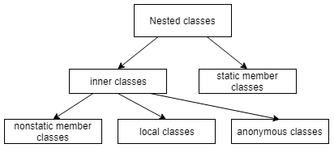

## 1. 概述

在本教程中，我们将研究Java中的匿名类。

我们将描述如何声明和创建它们的实例。我们还将简要讨论它们的属性和局限性。

## 2. 匿名类声明

**匿名类是没有名字的内部类**。因为它们没有名字，我们不能使用它们来创建匿名类的实例。因此，我们必须在使用时在单个表达式中声明和实例化匿名类。

我们可以扩展现有类或实现接口。

### 2.1 扩展类

当我们从一个存在的类实例化一个匿名类时，我们使用以下语法：


在括号中，我们指定了我们正在扩展的类的构造函数所需的参数：

```java
new Book("Design Patterns") {
    @Override
    public String description() {
        return "Famous GoF book.";
    }
}
```

当然，如果父类构造函数不接收任何参数，我们应该将括号保留空。

### 2.2 实现接口

我们也可以从接口实例化一个匿名类：


显然，Java的接口没有构造函数，因此括号始终为空。这是我们实现接口方法的唯一方法：

```java
new Runnable() {
    @Override
    public void run() {
        // ...
    }
}
```

一旦我们实例化了一个匿名类，我们就可以将该实例分配给一个变量，以便以后能够在某个地方引用它。

我们可以使用Java表达式的标准语法来做到这一点：

```java
Runnable action = new Runnable() {
    @Override
    public void run() {
        // ...
    }
};
```

正如我们已经提到的，**匿名类声明是一个表达式，因此它必须是语句的一部分**。这就解释了为什么我们在语句末尾加了一个分号。

显然，如果我们内联创建该实例，就可以避免将实例分配给变量：

```java
List<Runnable> actions = new ArrayList<Runnable>();
actions.add(new Runnable() {
    @Override
    public void run() {
        // ...
    }
});
```

我们应该非常小心地使用这种语法，因为它很容易影响代码的可读性，尤其是当run()方法的实现占用大量空间时。

## 3. 匿名类属性

相对于通常的顶级类，使用匿名类存在一些特殊性。在这里，我们简要地谈谈最实际的问题。要获得最准确和最新的信息，我们可以随时查看[Java语言规范](https://docs.oracle.com/javase/specs/jls/se8/html/index.html)。

### 3.1 构造函数

匿名类的语法不允许我们让它们实现多个接口。在构造过程中，**可能只存在一个匿名类的实例**。因此，它们永远不可能是抽象的。由于它们没有名称，我们无法扩展它们。出于同样的原因，匿名类不能有显式声明的构造函数。

事实上，没有构造函数对我们来说并不代表有任何问题，原因如下：

1.  我们在声明匿名类实例的同时创建它们
2.  从匿名类实例，我们可以访问局部变量和封闭类的成员

### 3.2 静态成员

除了常量之外，匿名类不能有任何静态成员。

例如，这不会编译：

```java
new Runnable() {
    static final int x = 0;
    static int y = 0; // compilation error!

    @Override
    public void run() {...}
};
```

相反，我们会收到以下错误：

```shell
The field y cannot be declared static in a non-static inner type, unless initialized with a constant expression
```

### 3.3 变量作用域

匿名类捕获在我们声明类的块范围内的局部变量：

```java
int count = 1;
Runnable action = new Runnable() {
    @Override
    public void run() {
        System.out.println("Runnable with captured variables: " + count);
    }           
};
```

如我们所见，局部变量count和action定义在同一个块中。出于这个原因，我们可以从类声明中访问count。

**请注意，为了能够使用局部变量，它们必须是有效的最终变量**。从JDK 8开始，我们不再需要使用关键字final声明变量。然而，这些变量必须是最终的。否则，我们会得到一个编译错误：

```shell
[ERROR] local variables referenced from an inner class must be final or effectively final
```

为了让编译器确定一个变量实际上是不可变的，在代码中，我们应该只有一个地方给它赋值。我们可能会在我们的文章[“为什么在Lambda中使用的局部变量必须是最终的或实际上是最终的?](https://www.baeldung.com/java-lambda-effectively-final-local-variables)”中找到更多关于有效最终变量的信息。”

让我们提一下，与每个内部类一样，**匿名类可以访问其封闭类的所有成员**。

## 4. 匿名类用例

匿名类的应用可能有很多种。让我们探讨一些可能的用例。

### 4.1 类层次结构和封装

我们应该在一般用例中使用内部类，在非常具体的用例中使用匿名类，以便在我们的应用程序中实现更清晰的类层次结构。当使用内部类时，我们可以对封闭类的数据进行更精细的封装。如果我们在顶级类中定义内部类功能，那么封闭类应该对其某些成员具有公共或包可见性。当然，也有不被欣赏甚至不被接受的情况。

### 4.2 更干净的项目结构

当我们必须动态修改某些类的方法的实现时，我们通常使用匿名类。在这种情况下，我们可以避免在项目中添加新的*.java文件来定义顶级类。如果该顶级类仅使用一次，则尤其如此。

### 4.3 UI事件监听器

在具有图形界面的应用程序中，匿名类最常见的用例是创建各种事件监听器。例如，在以下代码段中：

```java
button.addActionListener(new ActionListener() {
    public void actionPerformed(ActionEvent e) {
        // ...
    }
}
```

我们创建一个实现接口ActionListener的匿名类的实例。它的actionPerformed方法在用户单击按钮时被触发。

从Java 8开始，[lambda表达式](https://www.baeldung.com/java-streams)似乎是更受欢迎的方式。

## 5. 总体情况

我们上面讨论的匿名类只是[嵌套类](https://www.baeldung.com/java-nested-classes)的一个特例。通常，**嵌套类是在另一个类或接口中声明的类**：



查看上图，我们看到匿名类与局部和非静态成员类一起形成了所谓的内部类。它们与静态成员类一起构成嵌套类。

## 6. 总结

在本文中，我们研究了Java匿名类的各个方面。我们还描述了嵌套类的一般层次结构。