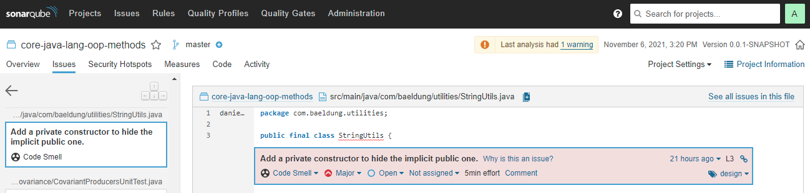
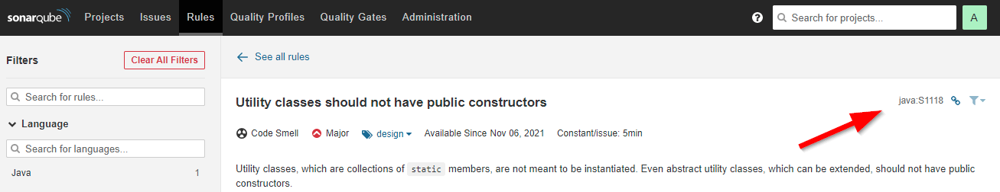
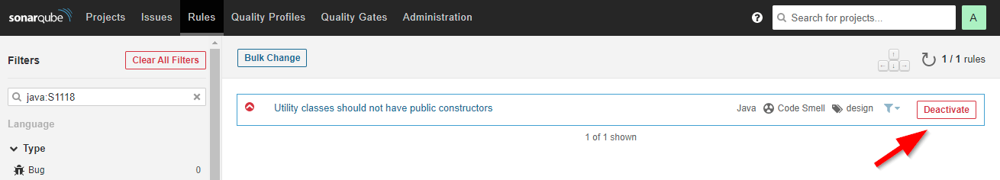

## 1. 概述

**实用程序类仅包含我们围绕特定主题组合在一起的静态成员**。因此，类本身是无状态的，而它们的成员包含可以跨多个层重用的代码。

在本教程中，我们将解释为什么静态代码分析器报告实用程序类不应具有公共构造函数。我们将着眼于通过实现私有构造函数来解决该问题。此外，我们将探讨哪些Lombok注解可以帮助我们生成一个。我们还将演示如何禁用这些警告。

最后，我们将评估在Java中实现实用程序类的一些替代方法。

## 2. 实用程序类

与定义对象的类不同，**实用程序类不保存任何数据或状态。它们只包含行为**。实用程序仅包含静态成员。它们的所有方法都是静态的，而数据仅作为方法参数传递。

### 2.1 为什么要实用类？

在面向对象的编程中，我们希望对我们的问题域进行建模并将类似功能的系列组合在一起。

我们也可以选择**编写纯函数来模拟我们代码库中的常见行为，尤其是在使用函数式编程时**。与对象方法不同，这些纯函数与任何对象的实例无关。但是，他们确实需要一个家(类)。Java没有为容纳一组函数而预留的特定类型，因此我们通常创建一个实用程序类。

Java中流行的实用程序类的重要示例是java.util中的Arrays和Collections，以及org.apache.commons.lang3中的StringUtils。

### 2.2 Java中的实现

Java不提供特殊关键字或创建实用程序类的方法。因此，我们通常**将实用程序类创建为普通Java类，但只有静态成员**：

```java
public final class StringUtils {

    public static boolean isEmpty(String source) {
        return source == null || source.length() == 0;
    }

    public static String wrap(String source, String wrapWith) {
        return isEmpty(source) ? source : wrapWith + source + wrapWith;
    }
}
```

在我们的示例中，我们将实用程序类标记为public和final。实用程序通常是公开的，因为它们旨在跨多个层重用。

final关键字用于防止子类化。由于**实用程序类不是为继承而设计的**，因此我们不应该对它们进行子类化。

### 2.3 公共构造函数警告

让我们尝试使用流行的静态代码分析工具[SonarQube](https://www.baeldung.com/sonar-qube)来分析我们的示例实用程序类。我们可以使用构建工具插件对Java项目运行SonarQube分析，在本例中为Maven：

```shell
mvn clean verify sonar:sonar -Dsonar.host.url=http://localhost:9000 -Dsonar.login=XYXYXYXY
```

静态代码分析会产生主要的代码异味。SonarQube警告我们**在实用程序类中隐藏隐式公共构造函数**：



虽然我们没有向实用程序类添加构造函数，但Java隐式添加了一个默认的公共构造函数。因此，使API用户能够创建它的实例：

```java
StringUtils utils = new StringUtils();
```

这是对我们实用程序类的误用，因为它不是为实例化而设计的。因此，SonarQube规则建议我们添加一个私有构造函数以隐藏默认的公共构造函数。

## 3. 添加私有构造函数

现在让我们通过在实用程序类中添加[私有构造函数](https://www.baeldung.com/java-private-constructors)来解决报告的代码异味。

### 3.1 默认私有构造函数

让我们向我们的实用程序类添加一个不带参数的私有构造函数。我们**永远不会真正使用这个私有构造函数**。因此，在调用异常时抛出异常是一个好习惯：

```java
public final class StringUtils {

    private StringUtils() {
        throw new UnsupportedOperationException("This is a utility class and cannot be instantiated");
    }

    // public static methods
}
```

我们应该注意到私有构造函数也不能被测试。因此，这种方法将导致在我们的代码覆盖率测量中产生一行未覆盖的代码。

### 3.2 使用Lombok @NoArgsConstructor

我们可以**使用[Lombok](https://www.baeldung.com/intro-to-project-lombok) @NoArgsConstructor注解来自动生成私有构造函数**：

```java
@NoArgsConstructor(access= AccessLevel.PRIVATE)
public final class StringUtils {

    // public static methods
}
```

这样，我们就可以避免手动添加一行额外的未覆盖代码。

### 3.3 使用Lombok @UtilityClass

我们还可以**使用Lombok @UtilityClass注解将整个类标记为实用程序**：

```java
@UtilityClass
public class StringUtils {

    // public static methods
}
```

在这种情况下，Lombok会自动：

-   生成一个抛出异常的私有构造函数
-   将我们添加的任何显式构造函数标记为错误
-   标记类为final

我们应该注意到，此时，UtilityClass注解仍然是一个实验特性。

## 4. 禁用警告

如果我们决定不遵循推荐的解决方案，我们还可以选择禁用公共构造函数警告。

### 4.1 抑制警告

让我们**使用Java的@SuppressWarnings注解来禁用单个类级别的警告**：

```java
@SuppressWarnings("java:S1118")
public final class StringUtils {

    // public static methods
}
```

我们应该将正确的SonarQube规则ID作为值参数传递。我们可以在SonarQube服务器UI中找到它：



### 4.2 停用规则

在SonarQube开箱即用的质量配置文件中，我们无法停用任何预定义的规则。因此，为了**在整个项目级别禁用警告**，我们首先需要创建一个自定义质量配置文件：



在我们的自定义质量配置文件中，我们可以搜索并停用任何预定义的Java规则。

## 5. 替代实现

让我们看看除了使用类之外如何创建实用程序的一些可能的替代方法。

### 5.1 静态接口方法

**从Java 8开始，我们可以在接口中定义和实现[静态方法](https://www.baeldung.com/java-static-default-methods)**：

```java
public interface StringUtils {

    static boolean isEmpty(String source) {
        return source == null || source.length() == 0;
    }

    static String wrap(String source, String wrapWith) {
        return isEmpty(source) ? source : wrapWith + source + wrapWith;
    }
}
```

由于我们无法实例化接口，因此我们消除了实用程序类实例化问题。但是，我们正在制造另一个问题。由于接口被设计为由其他类实现，因此API用户可能会错误地实现该接口。

此外，接口不能包含私有常量和静态初始值设定项。

### 5.2 静态枚举方法

枚举是托管实例的容器。但是，我们可以创建一个实用程序作为一个枚举，其中**只有零个实例并仅包含静态方法**：

```java
public enum StringUtils {
    ;

    public static boolean isEmpty(String source) {
        return source == null || source.length() == 0;
    }

    public static String wrap(String source, String wrapWith) {
        return isEmpty(source) ? source : wrapWith + source + wrapWith;
    }
}
```

由于我们无法实例化枚举类型，因此我们消除了实用程序类实例化问题。另一方面，顾名思义，枚举类型是为创建实际枚举而设计的，而不是实用程序类。

## 6. 总结

在本文中，我们探讨了实用程序类并解释了为什么它们不应该有公共构造函数。

在示例中，我们介绍了手动实现私有构造函数和使用Lombok注解。接下来，我们看到了如何抑制和禁用相关的SonarQube警告。最后，我们研究了使用接口和枚举创建实用程序的两种替代方法。