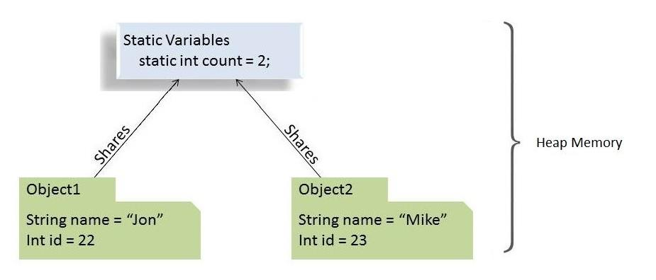

## 1. 概述

在本教程中，我们将详细探讨Java语言的static关键字。

我们将了解如何将static关键字应用于变量、方法、块和嵌套类，以及它有何不同。

### 延伸阅读

### [Java中的final关键字](https://www.baeldung.com/java-final)

了解Java中的final关键字应用于类、方法和变量时的含义。

[阅读更多](https://www.baeldung.com/java-final)→

### [Java中的Volatile关键字指南](https://www.baeldung.com/java-volatile)

了解Java volatile关键字及其功能。

[阅读更多](https://www.baeldung.com/java-volatile)→

### [Java this关键字指南](https://www.baeldung.com/java-this)

了解如何使用Java的this关键字来引用当前对象。

[阅读更多](https://www.baeldung.com/java-this)→

## 2. static关键字剖析

在Java编程语言中，**关键字static意味着特定成员属于某个类型本身，而不属于该类型的实例**。

这意味着我们将只创建该静态成员的一个实例，该实例在该类的所有实例之间共享。



我们可以将关键字应用于变量、方法、块和嵌套类。

## 3. 静态字段(或类变量)

在Java中，**当我们声明一个字段为static时，会创建该字段的一个副本，并在该类的所有实例之间共享**。

我们实例化一个类多少次并不重要，始终只有一个属于它的静态字段副本。此静态字段的值在同一类的所有对象之间共享。

从内存的角度来看，**静态变量存储在堆内存中**。

### 3.1 静态字段示例

假设我们有一个具有多个属性(实例变量)的Car类。

每当我们从这个Car蓝图中实例化新对象时，每个新对象都会有这些实例变量的不同副本。

然而，假设我们想要一个变量来保存实例化Car对象的数量，并在所有实例之间共享，以便它们可以访问它并在初始化时递增它。

这就是静态变量的用武之地：

```java
public class Car {
    private String name;
    private String engine;

    public static int numberOfCars;

    public Car(String name, String engine) {
        this.name = name;
        this.engine = engine;
        numberOfCars++;
    }

    // getters and setters
}
```

现在，对于我们实例化的此类的每个对象，都会递增numberOfCars变量的相同副本。

因此，对于这种情况，这些将为true：

```java
@Test
public void whenNumberOfCarObjectsInitialized_thenStaticCounterIncreases() {
    new Car("Jaguar", "V8");
    new Car("Bugatti", "W16");
 
    assertEquals(2, Car.numberOfCars);
}
```

### 3.2 使用静态字段的令人信服的理由

以下是我们何时想要使用静态字段的一些原因：

-   当变量的值独立于对象时
-   当值应该在所有对象之间共享时

### 3.3 要记住的要点

由于静态变量属于一个类，我们可以直接使用类名来访问它们。因此，**我们不需要任何对象引用**。

我们只能在类级别声明静态变量。

**我们可以在没有对象初始化的情况下访问静态字段**。

最后，我们可以使用对象引用(例如ford.numberOfCars++)访问静态字段。但是我们应该避免这种情况，因为很难判断它是实例变量还是类变量。相反，**我们应该始终使用类名(Car.numberOfCars++)来引用静态变量**。

## 4. 静态方法(或类方法)

与静态字段类似，静态方法也属于类而不是对象。因此，我们可以在不创建它们所在类的对象的情况下调用它们。

### 4.1 静态方法示例

我们通常使用静态方法来执行不依赖于实例创建的操作。

为了在该类的所有实例之间共享代码，我们将其编写在一个静态方法中：

```java
static void setNumberOfCars(int numberOfCars) {
    Car.numberOfCars = numberOfCars;
}
```

我们还通常使用静态方法来创建实用程序或辅助类，这样我们就可以在不创建这些类的新对象的情况下获取它们。

例如，我们可以查看JDK的[Collections](https://docs.oracle.com/en/java/javase/11/docs/api/java.base/java/util/Collections.html)或[Math](https://docs.oracle.com/en/java/javase/11/docs/api/java.base/java/lang/Math.html)实用程序类、Apache的[StringUtils](https://commons.apache.org/proper/commons-lang/apidocs/org/apache/commons/lang3/StringUtils.html)或Spring框架的[CollectionUtils](https://docs.spring.io/spring/docs/current/javadoc-api/org/springframework/util/CollectionUtils.html)，并注意到它们的所有实用程序方法都是静态的。

### 4.2 使用静态方法的令人信服的理由

让我们看看我们想要使用静态方法的几个原因：

-   访问/操作不依赖于对象的静态变量和其他静态方法
-   静态方法广泛用于实用程序和辅助类

### 4.3 要记住的要点

Java中的静态方法在编译时解析。由于方法覆盖是运行时多态性的一部分，因此**静态方法不能被覆盖**。

**抽象方法不能是静态的**。

**静态方法不能使用this或super关键字**。

以下实例、类方法和变量的组合是有效的：

1.  实例方法可以直接访问实例方法和实例变量
2.  实例方法也可以直接访问静态变量和静态方法
3.  静态方法可以访问所有静态变量和其他静态方法
4.  **静态方法不能直接访问实例变量和实例方法**，他们需要一些对象引用才能这样做

## 5. 静态块

我们使用静态块来初始化静态变量。虽然我们可以在声明的时候直接初始化静态变量，但是有些情况下我们需要做多行处理。在这种情况下，静态块就派上用场了。

**如果静态变量在初始化期间需要额外的多语句逻辑，我们可以使用静态块**。

### 5.1 静态块示例

例如，假设我们想用一些预定义的值初始化一个List对象。

使用静态块，这变得很容易：

```java
public class StaticBlockDemo {
    public static List<String> ranks = new LinkedList<>();

    static {
        ranks.add("Lieutenant");
        ranks.add("Captain");
        ranks.add("Major");
    }

    static {
        ranks.add("Colonel");
        ranks.add("General");
    }
}
```

不可能使用所有初始值和声明来初始化List对象。所以，这就是我们在这里使用静态块的原因。

### 5.2 使用静态块的令人信服的理由

以下是使用静态块的几个原因：

-   如果静态变量的初始化除了赋值之外还需要一些额外的逻辑
-   如果静态变量的初始化容易出错，需要异常处理

### 5.3 要记住的要点

**一个类可以有多个静态块**。

静态字段和静态块的解析和运行顺序与它们在类中的顺序相同。

## 6. 静态类

Java允许我们在类中创建一个类。它提供了一种对我们只会在一个地方使用的元素进行分组的方法，这有助于使我们的代码更有组织性和可读性。

一般来说，嵌套类架构分为两种：

-   我们声明为静态的嵌套类称为**静态嵌套类**
-   非静态的嵌套类称为**内部类**

这两者之间的主要区别在于内部类可以访问封闭类的所有成员(包括私有成员)，而静态嵌套类只能访问外部类的静态成员。

事实上，**静态嵌套类的行为与任何其他顶级类完全相同，但包含在唯一将访问它的类中，以提供更好的打包便利性**。

### 6.1 静态类示例

创建单例对象最广泛使用的方法是通过静态嵌套类：

```java
public class Singleton {
    private Singleton() {
    }

    private static class SingletonHolder {
        public static final Singleton instance = new Singleton();
    }

    public static Singleton getInstance() {
        return SingletonHolder.instance;
    }
}
```

我们使用这种方法是因为它不需要任何同步并且易于学习和实现。

### 6.2 使用静态内部类的令人信服的理由

让我们来看看在我们的代码中使用静态内部类的几个原因：

-   将仅在一个位置使用的类分组可增加封装性
-   我们使代码更接近将使用它的唯一地方。这增加了可读性，并且代码更易于维护
-   如果嵌套类不需要对其封闭类实例成员进行任何访问，最好将其声明为static。这样，它就不会耦合到外部类，因此更加优化，因为它们不需要任何堆或堆栈内存

### 6.3 要记住的要点

**基本上，静态嵌套类无权访问封闭外部类的任何实例成员**。它只能通过对象的引用访问它们。

静态嵌套类可以访问封闭类的所有静态成员，包括私有成员。

**Java编程规范不允许我们将顶级类声明为static**。只能将类中的类(嵌套类)设置为static。

## 7. 理解错误“Non-static variable cannot be referenced from a static context”

通常，当我们在静态上下文中使用非静态变量时，会发生此错误。

正如我们之前看到的，静态变量属于类并且在类加载时被加载。另一方面，我们需要创建一个对象来引用非静态变量。

因此，**Java编译器会抱怨，因为需要一个对象来调用或使用非静态变量**。

现在我们知道了导致错误的原因，让我们用一个例子来说明它：

```java
public class MyClass {
    int instanceVariable = 0;

    public static void staticMethod() {
        System.out.println(instanceVariable);
    }

    public static void main(String[] args) {
        MyClass.staticMethod();
    }
}
```

正如我们所看到的，我们在静态方法staticMethod内部使用了instanceVariable，它是一个非静态变量。

结果，我们将得到错误Non-static variable cannot be referenced from a static context。

## 8. 总结

在本文中，我们看到了static关键字的作用。

我们还讨论了使用静态字段、静态方法、静态块和静态内部类的原因和优势。

最后，我们了解了导致编译器失败并出现错误“Non-static variable cannot be referenced from a static context”的原因。