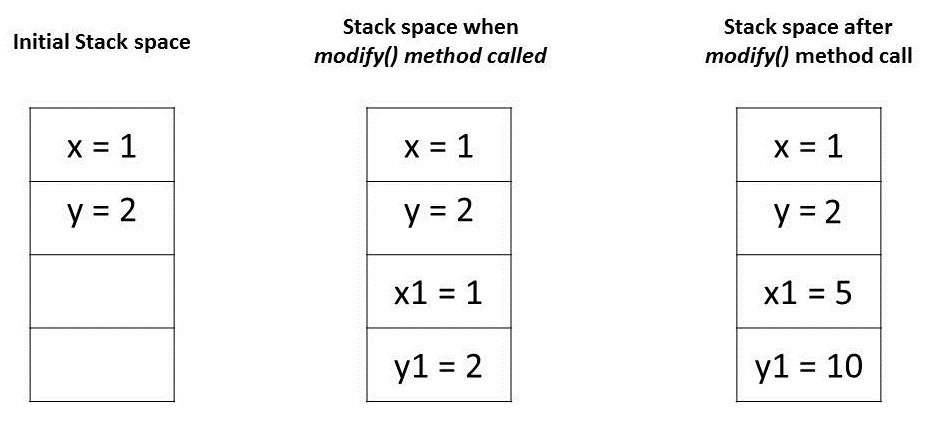
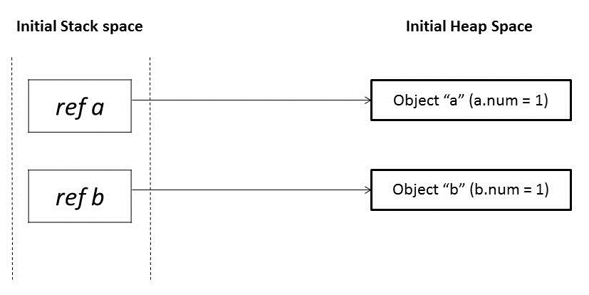
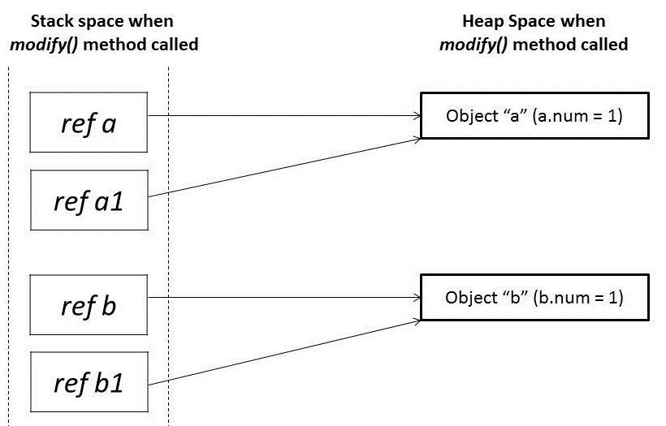
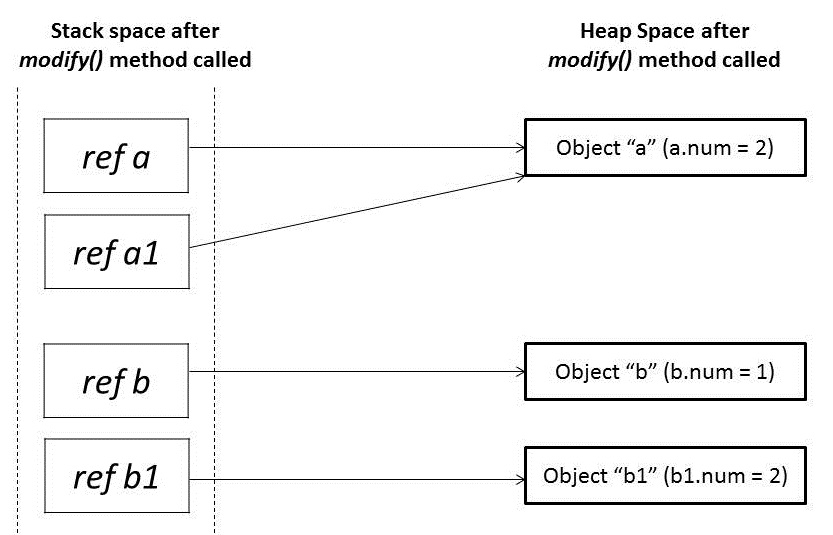

## 1. 概述

将参数传递给方法的两种最普遍的模式是“按值传递”和“按引用传递”。不同的编程语言以不同的方式使用这些概念。就Java而言，一切都是严格意义上的按值传递。

在本教程中，我们将说明Java如何为各种类型传递参数。

## 2. 按值传递与按引用传递

让我们从一些将参数传递给函数的不同机制开始：

-   value
-   reference
-   result
-   value-result
-   name

现代编程语言中最常见的两种机制是“按值传递”和“按引用传递”。在我们继续之前，让我们先讨论这些：

### 2.1 按值传递

当参数是按值传递时，调用方和被调用方方法对两个不同的变量进行操作，这两个变量是彼此的副本。对一个变量的任何更改都不会修改另一个变量。

这意味着在调用方法时，传递给被调用方方法的参数将是原始参数的克隆。在被调用方方法中所做的任何修改都不会影响调用方方法中的原始参数。

### 2.2 按引用传递

当参数是按引用传递时，调用者和被调用者对同一个对象进行操作。

这意味着当一个变量通过引用传递时，对象的唯一标识符被发送到方法。对参数实例成员的任何更改都将导致对原始值进行更改。

## 3. Java中的参数传递

任何编程语言的基本概念都是“值”和“引用”。在Java中，原始变量存储实际值，而非原始变量存储引用变量，这些引用变量指向它们所引用的对象的地址。值和引用都存储在堆栈内存中。

Java中的参数始终按值传递。在方法调用期间，每个参数的副本，无论是值还是引用，都会在堆栈内存中创建，然后传递给方法。

在原始类型的情况下，值只是简单地复制到堆栈内存中，然后传递给被调用方方法；在非原始类型的情况下，堆栈内存中的引用指向驻留在堆中的实际数据。当我们传递一个对象时，栈内存中的引用被复制，新的引用被传递给方法。

现在让我们在一些代码示例的帮助下看看它的实际应用。

### 3.1 传递原始类型

Java编程语言具有[八种原始数据类型](https://www.baeldung.com/java-primitives)。原始变量直接存储在堆栈内存中。每当将任何原始数据类型的变量作为参数传递时，实际参数都会被复制到形式参数中，并且这些形式参数会在堆栈内存中累积自己的空间。

只要该方法正在运行，这些形式参数的生命周期就会持续，并且在返回时，这些形式参数将从堆栈中清除并被丢弃。

让我们尝试借助代码示例来理解它：

```java
public class PrimitivesUnitTest {

    @Test
    public void whenModifyingPrimitives_thenOriginalValuesNotModified() {
        int x = 1;
        int y = 2;

        // Before Modification
        assertEquals(x, 1);
        assertEquals(y, 2);

        modify(x, y);

        // After Modification
        assertEquals(x, 1);
        assertEquals(y, 2);
    }

    public static void modify(int x1, int y1) {
        x1 = 5;
        y1 = 10;
    }
}
```

让我们通过分析这些值在内存中的存储方式来尝试理解上述程序中的断言：

1.  main方法中的变量“x”和“y”是原始类型，它们的值直接存储在栈内存中
2.  当我们调用方法modify()时，会为这些变量中的每一个创建一个精确的副本，并将其存储在堆栈内存中的不同位置
3.  对这些副本的任何修改只会影响它们，而不会改变原始变量



### 3.2 传递对象引用

在Java中，所有对象都动态存储在底层的堆空间中。这些对象是从称为引用变量的引用中引用的。

与原始类型相比，Java对象分两个阶段存储。引用变量存储在堆栈内存中，它们所引用的对象存储在堆内存中。

每当将对象作为参数传递时，都会创建引用变量的精确副本，该副本指向对象在堆内存中与原始引用变量相同的位置。

因此，每当我们在方法中对同一对象进行任何更改时，该更改都会反映在原始对象中。但是，如果我们为传递的引用变量分配一个新对象，那么它就不会反映在原始对象中。

让我们尝试借助代码示例来理解这一点：

```java
public class NonPrimitivesUnitTest {

    @Test
    public void whenModifyingObjects_thenOriginalObjectChanged() {
        Foo a = new Foo(1);
        Foo b = new Foo(1);

        // Before Modification
        assertEquals(a.num, 1);
        assertEquals(b.num, 1);

        modify(a, b);

        // After Modification
        assertEquals(a.num, 2);
        assertEquals(b.num, 1);
    }

    public static void modify(Foo a1, Foo b1) {
        a1.num++;

        b1 = new Foo(1);
        b1.num++;
    }
}

class Foo {
    public int num;

    public Foo(int num) {
        this.num = num;
    }
}
```

让我们来分析一下上面程序中的断言。我们在modify()方法中传递了对象a和b，它们有相同的值1。最初，这些对象引用指向堆空间中两个不同的对象位置：



当这些引用a和b被传递到modify()方法时，它会创建这些引用a1和b1的镜像副本，它们指向相同的旧对象：



在modify()方法中，当我们修改引用a1时，它会更改原始对象。但是，对于引用b1，我们已经分配了一个新对象。所以它现在指向堆内存中的一个新对象。

对b1所做的任何更改都不会反映原始对象中的任何内容：



## 4. 总结

在本文中，我们研究了在原始类型和非原始类型的情况下如何处理参数传递。

我们了解到，Java中的参数传递始终是按值传递地。但是，上下文会根据我们处理的是原始类型还是对象而变化：

1.  对于原始类型，参数是按值传递的
2.  对于对象类型，对象引用是按值传递的