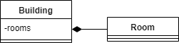
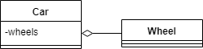
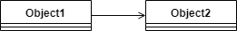
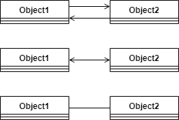
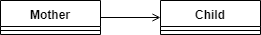
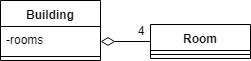
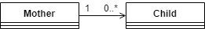

## 1. 概述

对象之间存在关系，无论是在现实生活中还是在编程中。有时很难理解或实现这些关系。

在本教程中，我们将重点关注Java对三种有时容易混淆的关系类型的处理：组合、聚合和关联。

## 2. 组合

组合是一种“属于”类型的关系。这意味着其中一个对象是逻辑上更大的结构，其中包含另一个对象。换句话说，它是另一个对象的一部分或成员。

或者，**我们通常称其为“has-a”关系**(与“is-a”关系相对，后者是[继承](https://www.baeldung.com/java-inheritance))。

例如，一个房间属于一个建筑物，或者换句话说，一个建筑物有一个房间。所以基本上，我们称它为“属于”还是“拥有”只是一个观点问题。

组合是一种强“has-a”关系，因为包含对象拥有它。因此，**对象的生命周期是联系在一起的。这意味着如果我们销毁所有者对象，它的成员也将随之销毁**。例如，在我们前面的例子中，房间和建筑物一起被摧毁。

请注意，这并不意味着没有其任何部分就不能存在包含对象。例如，我们可以拆除建筑物内的所有墙壁，从而摧毁房间。但建筑物仍将存在。

就基数而言，一个包含对象可以有我们想要的任意多个部分。但是，**所有部分都需要恰好有一个容器**。

### 2.1 UML

在UML中，我们用以下符号表示组合：


请注意，菱形位于包含对象处并且是线条的底部，而不是箭头。为了清楚起见，我们也经常画箭头：


因此，我们可以将这个UML构造用于我们的建筑物-房间示例：



### 2.2 源代码

在Java中，我们可以使用非静态内部类对其进行建模：

```java
class Building {
    class Room {
    }
}
```

或者，我们也可以在方法体中声明该类。无论是命名类、匿名类还是lambda，都无关紧要：

```java
class Building {
    Room createAnonymousRoom() {
        return new Room() {
            @Override
            void doInRoom() {}
        };
    }

    Room createInlineRoom() {
        class InlineRoom implements Room {
            @Override
            void doInRoom() {}
        }
        return new InlineRoom();
    }

    Room createLambdaRoom() {
        return () -> {};
    }

    interface Room {
        void doInRoom();
    }
}
```

请注意，我们的内部类应该是非静态的，这一点很重要，因为它将所有实例绑定到包含类。

通常，包含对象想要访问它的成员。因此，我们应该存储它们的引用：

```java
class Building {
    List<Room> rooms;

    class Room {
    }
}
```

请注意，所有内部类对象都存储对其包含对象的隐式引用。因此，我们不需要手动存储它来访问它：

```java
class Building {
    String address;

    class Room {
        String getBuildingAddress() {
            return Building.this.address;
        }
    }
}
```

## 3. 聚合

聚合也是一种“has-a”关系。它与组合的区别在于它不涉及拥有。因此，对象的生命周期没有联系：它们中的每一个都可以彼此独立存在。

例如，汽车及其车轮。**我们可以卸下轮子，它们仍然存在**。我们可以安装其他(预先存在的)车轮，或将它们安装到另一辆车上，一切都会正常工作。

当然，没有轮子或车轮分离的汽车不如有轮子的汽车有用。但这正是这种关系最初存在的原因：**将零件组装成一个更大的结构，它能够比它的零件做更多的事情**。

由于聚合不涉及拥有，**因此一个成员不需要只绑定到一个容器**。例如，三角形是由线段组成的。但是三角形可以共享线段作为它们的边。

### 3.1 UML

聚合与组合非常相似。唯一的逻辑区别是聚合是一种较弱的关系。

因此，UML表示也非常相似。唯一的区别是钻石是空的：


那么，对于汽车和车轮，我们会这样做：



### 3.2 源代码

在Java中，我们可以使用普通的旧引用对聚合进行建模：

```java
class Wheel {
}

class Car {
    List<Wheel> wheels;
}
```

该成员可以是任何类型的类，但非静态内部类除外。

在上面的代码片段中，两个类都有各自的源文件。但是，我们也可以使用静态内部类：

```java
class Car {
    List<Wheel> wheels;

    static class Wheel {
    }
}
```

请注意，Java只会在非静态内部类中创建隐式引用。因此，我们必须在需要的地方手动维护关系：

```java
class Wheel {
    Car car;
}

class Car {
    List<Wheel> wheels;
}
```

## 4. 关联

关联是三者之间最弱的关系。**它不是“has-a”关系**，没有一个对象是另一个对象的部分或成员。

**关联仅意味着对象彼此“认识”**。例如，一位母亲和她的孩子。

### 4.1 UML

在UML中，我们可以用箭头标记关联：



如果关联是双向的，我们可以使用两个箭头，一个两端都有箭头的箭头，或者一条没有任何箭头的线：



我们可以用UML表示一位母亲和她的孩子，那么：



### 4.2 源代码

在Java中，我们可以像聚合一样对关联进行建模：

```java
class Child {
}

class Mother {
    List<Child> children;
}
```

但是等等，**我们如何判断引用是指聚合还是关联**？

**好吧，我们不能**。区别只是逻辑上的：一个对象是否是另一个对象的一部分。

此外，我们必须像处理聚合一样在两端手动维护引用：

```java
class Child {
    Mother mother;
}

class Mother {
    List<Child> children;
}
```

## 5. UML旁注

为了清楚起见，有时我们想在UML图上定义关系的基数。我们可以通过将它写到箭头的末端来做到这一点：



请注意，将零写为基数是没有意义的，因为这意味着没有关系。唯一的例外是当我们想要使用范围来指示可选关系时：



另请注意，由于在组合中恰好只有一个所有者，因此我们没有在图表上指出它。

## 6. 一个复杂的例子

让我们看一个(稍微)更复杂的例子！

我们将模拟一所大学，它有自己的院系。教授在每个系工作，彼此之间也有朋友。

我们关闭大学后，这些系还会存在吗？当然不是，因此它是一个组合。

但是教授们仍然会存在(希望如此)。我们必须决定哪个更符合逻辑：我们是否将教授视为院系的一部分。或者：他们是不是院系的成员？对，他们是。因此它是一个聚合。最重要的是，一位教授可以在多个系工作。

教授之间的关系是关联，因为说一位教授是另一位教授的一部分没有任何意义。

因此，我们可以使用以下UML图对这个示例进行建模：


Java 代码如下所示：

```java
class University {
    List<Department> department;
}

class Department {
    List<Professor> professors;
}

class Professor {
    List<Department> department;
    List<Professor> friends;
}
```

请注意，**如果我们依赖于“has-a”、“belongs-to”、“member-of”、“part-of”等术语，我们可以更轻松地识别对象之间的关系**。

## 7. 总结

在本文中，我们看到了组合、聚合和关联的属性和表示。我们还看到了如何在UML和Java中对这些关系建模。