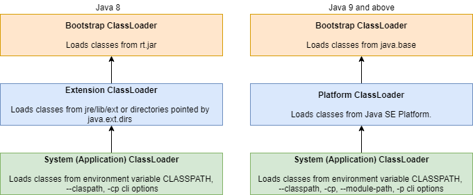

## 1. 概述

有时，我们希望获得有关应用程序运行时行为的信息，例如查找运行时可用的所有类。

在本教程中，我们将探讨如何在运行时查找Java包中的所有类的几个示例。

## 2. 类加载器

首先，我们将从[Java类加载器](https://www.baeldung.com/java-classloaders)开始讨论。Java类加载器是Java运行时环境(JRE)的一部分，可将Java类动态加载到Java虚拟机(JVM)中。Java类加载器将JRE与了解文件和文件系统分离开来，**并非所有类都由单个类加载器加载**。

让我们通过图示来了解Java中可用的类加载器：



Java 9对类加载器进行了一些重大更改。随着模块的引入，我们可以选择在类路径旁边提供模块路径。系统类加载器加载存在于模块路径上的类。

**类加载器是动态的**，它们不需要告诉JVM它可以在运行时提供哪些类。因此，在包中查找类本质上是一种文件系统操作，而不是使用[Java反射](https://www.baeldung.com/java-reflection)完成的操作。

但是，我们可以编写自己的类加载器或检查类路径以在包中查找类。

## 3. 在Java包中查找类

为了便于说明，让我们创建一个包`cn.tuyucheng.taketoday.reflection.access.packages.search`。

现在，让我们定义一个示例类：

```java
public class ClassExample {
    class NestedClass {
    }
}
```

接下来，让我们定义一个接口：

```java
public interface InterfaceExample {
}
```

在下一节中，我们将了解如何使用系统类加载器和一些第三方库查找类。

### 3.1 系统类加载器

首先，我们将使用内置的系统类加载器。**系统类加载器加载在类路径中找到的所有类**，这发生在JVM的早期初始化期间：

```java
public class AccessingAllClassesInPackage {

    public Set<Class> findAllClassesUsingClassLoader(String packageName) {
        InputStream stream = ClassLoader.getSystemClassLoader()
              .getResourceAsStream(packageName.replaceAll("[.]", "/"));
        BufferedReader reader = new BufferedReader(new InputStreamReader(stream));
        return reader.lines()
              .filter(line -> line.endsWith(".class"))
              .map(line -> getClass(line, packageName))
              .collect(Collectors.toSet());
    }

    private Class getClass(String className, String packageName) {
        try {
            return Class.forName(packageName + "."
                  + className.substring(0, className.lastIndexOf('.')));
        } catch (ClassNotFoundException e) {
            // handle the exception
        }
        return null;
    }
}
```

在上面的示例中，我们使用静态getSystemClassLoader()方法加载系统类加载器。

接下来，我们将在给定的包中找到资源。我们将使用getResourceAsStream方法将资源作为URL流读取。要获取包下的资源，我们需要将包名转换为URL字符串。因此，我们必须用路径分隔符(“/”)替换所有的点(.)。

之后，我们将把流输入到BufferedReader并过滤所有具有.class扩展名的URL。获得所需资源后，我们将构建类并将所有结果收集到一个Set中。**由于Java不允许lambda抛出异常，我们必须在getClass方法中处理它**。

现在让我们测试这个方法：

```java
@Test
public void when_findAllClassesUsingClassLoader_thenSuccess() {
    AccessingAllClassesInPackage instance = new AccessingAllClassesInPackage();
 
    Set<Class> classes = instance.findAllClassesUsingClassLoader("cn.tuyucheng.taketoday.reflection.access.packages.search");
 
    Assertions.assertEquals(3, classes.size());
}
```

包中只有两个Java文件。但是，我们声明了三个类-包括嵌套类NestedExample。结果，我们的测试产生了三个类。

请注意，搜索包与当前工作包不同。

### 3.2 Reflections库

[Reflections](https://www.baeldung.com/reflections-library)是一个流行的库，它扫描当前类路径并允许我们在运行时查询它。

让我们首先将[reflections依赖项](https://search.maven.org/artifact/org.reflections/reflections/0.9.12/jar)添加到我们的Maven项目中：

```xml
<dependency>
    <groupId>org.reflections</groupId>
    <artifactId>reflections</artifactId> 
    <version>0.9.12</version>
</dependency>
```

现在，让我们深入研究代码示例：

```java
public Set<Class> findAllClassesUsingReflectionsLibrary(String packageName) {
    Reflections reflections = new Reflections(packageName, new SubTypesScanner(false));
    return reflections.getSubTypesOf(Object.class)
        .stream()
        .collect(Collectors.toSet());
}
```

在此方法中，我们启动SubTypesScanner类并获取Object类的所有子类型。通过这种方法，我们在获取类时获得了更多的粒度。

再一次，让我们测试一下：

```java
@Test
public void when_findAllClassesUsingReflectionsLibrary_thenSuccess() {
    AccessingAllClassesInPackage instance = new AccessingAllClassesInPackage();
 
    Set<Class> classes = instance.findAllClassesUsingReflectionsLibrary("cn.tuyucheng.taketoday.reflection.access.packages.search");
 
    Assertions.assertEquals(3, classes.size());
}
```

与我们之前的测试类似，此测试查找在给定包中声明的类。

现在，让我们继续下一个例子。

### 3.3 Google Guava库

在本节中，我们将了解如何使用Google Guava库查找类。Google Guava提供了一个ClassPath实用类，它扫描类加载器的源代码并找到所有可加载的类和资源。

首先，让我们将[Guava依赖项](https://search.maven.org/artifact/com.google.guava/guava/30.1.1-jre/jar)添加到我们的项目中：

```xml
<dependency>
    <groupId>com.google.guava</groupId>
    <artifactId>guava</artifactId>
    <version>31.0.1-jre</version>
</dependency>
```

让我们深入研究代码：

```java
public Set<Class> findAllClassesUsingGoogleGuice(String packageName) throws IOException {
    return ClassPath.from(ClassLoader.getSystemClassLoader())
        .getAllClasses()
        .stream()
        .filter(clazz -> clazz.getPackageName()
            .equalsIgnoreCase(packageName))
        .map(clazz -> clazz.load())
        .collect(Collectors.toSet());
}
```

在上面的方法中，我们提供系统类加载器作为ClassPath#from方法的输入。ClassPath扫描的所有类都根据包名进行过滤。然后加载过滤的类(但不链接或初始化)并将其收集到Set中。

现在让我们测试这个方法：

```java
@Test
public void when_findAllClassesUsingGoogleGuice_thenSuccess() throws IOException {
    AccessingAllClassesInPackage instance = new AccessingAllClassesInPackage();
 
    Set<Class> classes = instance.findAllClassesUsingGoogleGuice("cn.tuyucheng.taketoday.reflection.access.packages.search");
 
    Assertions.assertEquals(3, classes.size());
}
```

此外，Google Guava库提供了getTopLevelClasses()和getTopLevelClassesRecursive()方法。

重要的是要注意，在上述所有示例中，**如果package-info存在于包下并使用一个或多个包级注解进行标注，则它包含在可用类列表中**。

下一节将讨论如何在模块化应用程序中查找类。

## 4. 在模块化应用程序中查找类

**Java平台模块系统(JPMS)通过**[模块](https://www.baeldung.com/java-9-modularity)**向我们介绍了一个新级别的访问控制**。每个包都必须显式导出才能在模块外部访问。

在模块化应用程序中，每个模块都可以是命名、未命名或自动模块之一。

对于命名模块和自动模块，内置系统类加载器将没有类路径。系统类加载器将使用应用程序模块路径搜索类和资源。

对于未命名的模块，它将类路径设置为当前工作目录。

### 4.1 在模块内

一个模块中的所有包都对该模块中的其他包可见。模块内的代码享有对所有类型及其所有成员的反射访问。

### 4.2 在模块外

由于Java强制执行最严格的访问，我们必须使用export或open模块声明显式声明包，以获取对模块内部类的反射访问。

对于普通模块，导出包(而不是开放包)的反射访问仅提供对公共和受保护类型及其声明包的所有成员的访问。

我们可以构造一个模块，导出需要查找的包：

```java
module my.module {
    exports cn.tuyucheng.taketoday.reflection.access.packages.search;
}
```

对于普通模块，打开包的反射访问提供对声明包的所有类型及其成员的访问：

```java
module my.module {
    opens cn.tuyucheng.taketoday.reflection.access.packages.search;
}
```

同样，开放模块授予对所有类型及其成员的反射访问，就好像所有包都已打开一样。现在让我们打开我们的整个反射访问模块：

```java
open module my.module {
}
```

最后，在确保为模块提供了用于访问包的正确模块化描述之后，可以使用上一节中的任何方法来查找包内的所有可用类。

## 5. 总结

总之，我们了解了类加载器以及在包中查找所有类的不同方法。此外，我们还讨论了在模块化应用程序中访问包。