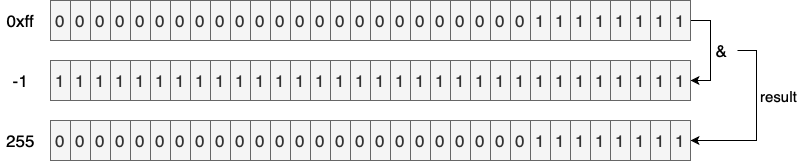
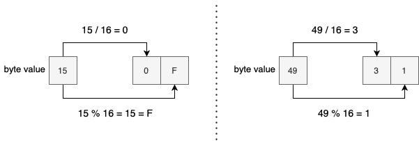

## 1. 概述

在本教程中，我们将熟悉在Kotlin中将ByteArray转换为十六进制字符串的几种方法。

首先，我们将列出此转换的一般算法，一旦我们知道了算法，我们就可以利用Kotlin甚至[Java](https://www.baeldung.com/java-byte-arrays-hex-strings)标准库来实现转换。最后，作为补充，我们将看到一种额外的方法，使用普通循环和按位运算来实现相同的逻辑。

## 2. 算法

为了将字节数组转换为其十六进制等效值，我们可以遵循一个简单的过程：

1.  将数组**每个字节的无符号值**转换为其对应的十六进制值
2.  拼接所有计算的十六进制值

由于四位足以表示每个十六进制值，因此每个字节(8位)应等于两个十六进制值。因此，**如果一个字节的十六进制等价物只是一个字符，那么我们应该添加一个前导零以使解码过程成为可能**。

现在我们知道了这种转换的大致思路，让我们在Kotlin中实现它。

## 3. Kotlin标准库

### 3.1 Formatter

[ByteArray](https://kotlinlang.org/api/latest/jvm/stdlib/kotlin/-byte-array/)上的[joinToString()](https://kotlinlang.org/api/latest/jvm/stdlib/kotlin.collections/join-to-string.html)扩展函数将字节数组转换为String，更具体地说，**这个函数允许我们将每个字节转换为**[CharSequence](https://kotlinlang.org/api/latest/jvm/stdlib/kotlin/-char-sequence/)，**然后使用分隔符将它们拼接起来**，这正是我们实现上述算法所需要的： 

```kotlin
fun ByteArray.toHex(): String = joinToString(separator = "") { eachByte -> "%02x".format(eachByte) }
```

如上所示，转换函数使用“%02x”[格式说明符](https://docs.oracle.com/en/java/javase/11/docs/api/java.base/java/util/Formatter.html)将给定字节转换为其对应的十六进制值。此外，如有必要，它会用前导零填充十六进制值。转换每个字节后，我们使用空字符串作为分隔符来连接生成的数组。

让我们验证此函数是否按预期运行：

```kotlin
val md5 = MessageDigest.getInstance("md5")
md5.update("tuyucheng".toByteArray())

val digest: ByteArray = md5.digest()
assertEquals("0e80037b831803baadee4249e398328b", digest.toHex())
```

在这里，我们要确保编码过程确实适用于MD5十六进制摘要。

### 3.2 无符号整数

从Kotlin 1.3开始，我们也可以使用[无符号类型](../../kotlin-core-2/docs/Kotlin中的无符号整数.md)来实现相同的逻辑：

```kotlin
@ExperimentalUnsignedTypes
fun ByteArray.toHex2(): String = asUByteArray().joinToString("") { it.toString(radix = 16).padStart(2, '0') }
```

现在，我们正在使用更详细且更易读的转换函数。也就是说，**我们不使用格式说明符，而是将字节转换为base-16字符串，然后填充结果**。除此之外，为了避免负数的尴尬，我们在开始时将数组转换为其无符号等价物。

尽管无符号整数[在Kotlin 1.5中是稳定的](https://blog.jetbrains.com/kotlin/2021/05/kotlin-1-5-0-released/#library-improvements)，但无符号数组仍处于测试阶段。因此，我们必须添加[@ExperimentalUnsignedTypes](https://kotlinlang.org/api/latest/jvm/stdlib/kotlin/-experimental-unsigned-types/)注解以明确选择加入此功能。

也可以在不使用实验性API的情况下使用java.lang.Byte API进行类似的实现：

```kotlin
fun ByteArray.toHex3(): String = joinToString("") {
    java.lang.Byte.toUnsignedInt(it).toString(radix = 16).padStart(2, '0')
}
```

在这里，[toUnsignedInt()](https://docs.oracle.com/en/java/javase/11/docs/api/java.base/java/lang/Byte.html#toUnsignedInt(byte))方法负责查找每个字节的无符号值。

## 4. Java 17

**从Java 17(撰写本文时处于早期访问阶段)开始**，[java.util.HexFormat](https://download.java.net/java/early_access/jdk17/docs/api/java.base/java/util/HexFormat.html)**工具类是将字节数组转换为十六进制值的惯用方法，反之亦然**。如果我们的Kotlin代码以Java 17为目标，那么我们鼓励使用此工具类而不是我们自己的实现：

```kotlin
val hex = HexFormat.of().formatHex(digest)
assertEquals("0e80037b831803baadee4249e398328b", hex)
```

这种抽象非常易于使用，并提供了一个丰富的API来处理字节数组到十六进制的转换。

## 5. 循环和位运算

正如我们所承诺的，现在是时候使用循环和按位运算来实现转换了：

```kotlin
val hexChars = "0123456789abcdef".toCharArray()

fun ByteArray.toHex4(): String {
    val hex = CharArray(2 * this.size)
    this.forEachIndexed { i, byte ->
        val unsigned = 0xff and byte.toInt()
        hex[2 * i] = hexChars[unsigned / 16]
        hex[2 * i + 1] = hexChars[unsigned % 16]
    }

    return hex.joinToString("")
}
```

我们可以用两个十六进制字符表示每个字节，因此，我们分配了一个大小是接收字节数组两倍的CharArray。

之后，我们遍历字节数组。**在每次迭代中，首先，我们提取当前字节的无符号值**，为此，我们用0xff and-ing当前字节值。由于十六进制值始终为正值(它们的符号位为零)，因此0xff将翻转负数的符号位，同时保持正数不变：



在上图中，我们可以看到“-1 & 0xff”的结果是如何变成255的。

**除以16时，商和余数将分别确定第一个和第二个十六进制字符**，这就是为什么我们用除法和取余运算的结果填充CharArray元素的原因：



我们可能认为用按位运算符替换“/”和“%”运算符会产生更好的性能，但是，我们希望像C2这样的现代JVM编译器能够在运行时在后台应用此类优化。所以，我们不要再破坏可读性了！

## 6. 总结

在本教程中，我们看到了将字节数组转换为其十六进制表示形式的不同方法。此外，为了更好地理解每个实现背后的逻辑，我们从一个简单的算法描述开始。