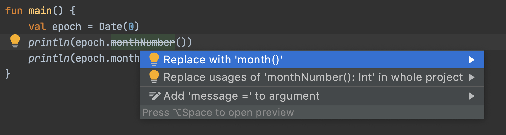

## 1. 概述

来自Java背景，我们可能熟悉过[@Deprecated注解](https://www.baeldung.com/java-deprecated)及其在Java领域的工作方式。

在本教程中，我们将了解Kotlin如何从Java中汲取这种简单的弃用思想并将其提升到一个全新的水平。

## 2. 弃用

当谈到JVM生态系统中的弃用时，可爱的[java.util.Date](https://docs.oracle.com/en/java/javase/11/docs/api/java.base/java/util/Date.html)类及其所有已弃用的方法总是值得一提！

为了重复这个古老的错误，让我们在Kotlin中实现这个日期：

```kotlin
data class Date(val millisSinceEpoch: Long) {

    private val internal = LocalDateTime.ofInstant(Instant.ofEpochMilli(millisSinceEpoch), ZoneId.of("UTC"))

    fun monthNumber(): Int = internal.get(ChronoField.MONTH_OF_YEAR)
}
```

如上所示，Date数据类应该封装Kotlin中的日期时间信息，这里的monthNumber()方法返回当前日期的月份数：

```kotlin
val epoch = Date(0)
println(epoch.monthNumber()) // prints 1
```

一段时间后，为了避免从零开始与从一开始的月份数字混淆，我们将添加一个新方法来返回枚举而不是数字：

```kotlin
fun month(): Month = internal.month
```

此外，为了防止开发人员使用monthNumber()方法，我们可以弃用它。**要在Kotlin中做到这一点，我们可以使用**[@Deprecated](https://kotlinlang.org/api/latest/jvm/stdlib/kotlin/-deprecated/)**注解对方法进行标注**：

```kotlin
@Deprecated("Use the new month() method")
fun monthNumber(): Int = internal.get(ChronoField.MONTH_OF_YEAR)
```

[message](https://kotlinlang.org/api/latest/jvm/stdlib/kotlin/-deprecated/message.html)属性在@Deprecated注解中始终是必需的，**现在，如果我们使用旧的且现已弃用的方法，Kotlin编译器将警告我们弃用**：

```bash
'monthNumber(): Int' is deprecated. Use the new month() method
```

如上所示，编译器显示消息以及自动生成的弃用说明。

## 3. 弃用级别

默认情况下，如果我们使用已弃用的方法，Kotlin编译器只会打印一条警告消息。但是，**可以通过**[level](https://kotlinlang.org/api/latest/jvm/stdlib/kotlin/-deprecated/level.html)**注解属性配置此编译器操作**。

默认级别等于[Deprecation.WARNING](https://kotlinlang.org/api/latest/jvm/stdlib/kotlin/-deprecation-level/-w-a-r-n-i-n-g.html)，因此该程序将继续编译，但会出现烦人的警告消息。

除了简单的警告之外，**还可以指示编译器在编译期间为已弃用的方法生成错误**。为此，我们可以使用[DeprecationLevel.ERROR](https://kotlinlang.org/api/latest/jvm/stdlib/kotlin/-deprecation-level/#kotlin.DeprecationLevel)值：

```kotlin
@Deprecated("Use the new month() method", level = DeprecationLevel.ERROR)
fun monthNumber(): Int = internal.get(ChronoField.MONTH_OF_YEAR)
```

现在，如果我们使用已弃用的方法，Kotlin编译器将失败并显示以下错误消息：

```bash
Using 'monthNumber(): Int' is an error. Use the new month() method
```

**也可以完全隐藏已弃用的方法，就好像该方法一开始就不存在一样**：

```kotlin
@Deprecated("Use the new month() method", level = DeprecationLevel.HIDDEN)
fun monthNumber(): Int = internal.get(ChronoField.MONTH_OF_YEAR)
```

当级别为[DeprecationLevel.HIDDEN](https://kotlinlang.org/api/latest/jvm/stdlib/kotlin/-deprecation-level/-h-i-d-d-e-n.html)时，编译器甚至无法找到已弃用的方法：

```bash
Unresolved reference: monthNumber
```

**尽管编译器不允许我们使用HIDDEN或ERROR方法，但它们也存在于字节码级别**，让我们通过使用javap查看生成的字节码来检查这个参数：

```bash
$ javap -c -p -v cn.tuyucheng.taketoday.deprecation.Date
  // truncated
  public final int monthNumber();
    descriptor: ()I
    flags: (0x1011) ACC_PUBLIC, ACC_FINAL, ACC_SYNTHETIC
    Code:
      stack=2, locals=1, args_size=1
         0: aload_0
         1: getfield      #27     // Field internal:LLocalDateTime;
         4: getstatic     #33     // Field ChronoField.MONTH_OF_YEAR:LChronoField;
         7: checkcast     #35     // class TemporalField
        10: invokevirtual #41     // Method LocalDateTime.get:(LTemporalField;)I
        13: ireturn
    Deprecated: true
```

这使我们能够假装该方法在编译时不存在，同时保持二进制兼容性。简而言之，已经编译的代码将继续成功调用此类已弃用的方法。但是，编译器不允许我们在新代码中使用这些方法。

## 4. 更换

甚至可以使用[replaceWith](https://kotlinlang.org/api/latest/jvm/stdlib/kotlin/-deprecated/replace-with.html)注解属性指定已弃用方法的替换，**此值(如果指定)表示应该用作替代已弃用的API用法的代码片段**。

例如，这里我们指定month()函数作为monthNumber()的替代品：

```kotlin
@Deprecated("Use the new month() method", replaceWith = ReplaceWith("month()"))
fun monthNumber(): Int = internal.get(ChronoField.MONTH_OF_YEAR)
```

IDE和其他工具可以使用此信息并自动应用替换；例如，在IntelliJ IDEA上：



我们会看到它建议用新的month()函数替换monthNumber()用法。

默认情况下，**替换表达式在所使用的符号的上下文中进行解释**，并且可以引用封闭类的成员。更具体地说，当我们说ReplaceWith("month()")时，我们的意思是month()应该在同一个对象实例上调用。

**尽管在相同的上下文中进行解释，但替换表达式无法访问包含已弃用方法的文件中的import语句**。因此，如果我们需要任何这些import语句，我们应该在[ReplaceWith](https://kotlinlang.org/api/latest/jvm/stdlib/kotlin/-replace-with/)中使用[imports](https://kotlinlang.org/api/latest/jvm/stdlib/kotlin/-replace-with/imports.html)注解属性，例如：

```kotlin
companion object {

    @Deprecated("Use java.time instead",
        replaceWith = ReplaceWith("LocalDateTime.now()", imports = ["java.time.LocalDateTime"]))
    fun now(): Date = Date(0)
}
```

在这里我们建议使用LocalDateTime.now()而不是Date.now()。此外，由于LocalDateTime在当前上下文中不可用，我们使用imports属性指定所需的imports-在本例中为java.time.LocalDateTime。

现在，如果我们在IntelliJ IDEA上应用替换，除了替换已弃用的函数调用外，它还会添加指定的import：


如前所述，**replaceWith属性的存在是为了提供更好的工具化机会，例如我们在IntelliJ IDEA中看到的工具集成**。

## 5. 灵活的目标

到目前为止，我们只弃用了Kotlin中的函数或方法，除了方法之外，我们还可以对Kotlin中的许多其他构造应用弃用。

例如，我们可以弃用实例变量：

```kotlin
@Deprecated("No longer valid")
private val zeroBased = true
```

也可以弃用类型别名：

```kotlin
@Deprecated("Use plain string instead")
typealias DateFormat = String
```

让我们看一下[@Deprecated注解的源代码](https://github.com/JetBrains/kotlin/blob/6efa7a51c6fa9e6c90448bc98ca8f926edfd26b6/core/builtins/src/kotlin/Annotations.kt#L32)，以了解所有可能的目标。

```kotlin
@Target(CLASS, FUNCTION, PROPERTY, ANNOTATION_CLASS, CONSTRUCTOR, PROPERTY_SETTER, PROPERTY_GETTER, TYPEALIAS)
public annotation class Deprecated(
    val message: String,
    val replaceWith: ReplaceWith = ReplaceWith(""),
    val level: DeprecationLevel = DeprecationLevel.WARNING
)
```

所以，除了提到的目标之外，**我们可以看到这个注解也适用于类、其他注解、setter/getter、函数和构造函数**。

## 6. 总结

在本教程中，我们了解了如何弃用Kotlin中的不同编程结构，我们还了解到，我们可以控制弃用的程度，甚至可以建议替换特定的弃用结构。