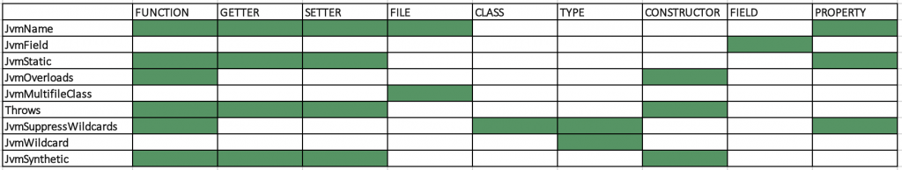

## 1. 简介

Kotlin提供了几个注解来促进Kotlin类与Java的兼容性。

在本教程中，我们将具体探讨Kotlin的JVM注解，我们如何使用它们，以及它们在我们在Java中使用Kotlin类时有什么影响。

## 2. Kotlin的JVM注解

**Kotlin的JVM注解会影响Kotlin代码编译为字节码的方式以及生成的类在Java中的使用方式**。

当我们仅使用Kotlin时，大多数JVM注解都不会产生影响。但是，@JvmName和@JvmDefault在纯粹使用Kotlin时也有影响。

## 3. @JvmName

**我们可以将@JvmName注解应用于文件、函数、属性、getter和setter**。

**在所有情况下，@JvmName都定义了字节码中目标的名称，这也是我们在从Java中引用目标时可以使用的名称**。

当我们从Kotlin本身调用它时，注解不会更改类、函数、getter或setter的名称。

**让我们更详细地看看每个可能的目标**。

### 3.1 文件名

默认情况下，Kotlin文件中的所有顶级函数和属性都编译为filenameKt.class，所有类都编译为className.class。

假设我们有一个名为message.kt的文件，其中包含顶级声明和一个名为Message的类：

```kotlin
package jvmannotation

fun getMyName() : String {
    return "myUserId"
}

class Message {
}
```

编译器将创建两个类文件：MessageKt.class和Message.class，我们现在可以从Java调用两者：

```java
Message m = new Message();
String me = MessageKt.getMyName();
```

**如果我们想给MessageKt.class起一个不同的名字，我们可以在文件的第一行添加@JvmName注解**：

```java
@file:JvmName("MessageHelper") 
package jvmannotation
```

在Java中，我们现在可以使用注解中定义的名称：

```java
String me = MessageHelper.getMyName();
```

**注解不会更改类文件的名称，它将保留为Message.class**。

### 3.2 函数名称

**@JvmName注解更改字节码中函数的名称**，我们可以调用以下函数：

```kotlin
@JvmName("getMyUsername")
fun getMyName() : String {
    return "myUserId"
}
```

然后在Java中，我们可以使用我们在注解中提供的名称：

```java
String username = MessageHelper.getMyUsername();
```

在Kotlin中，我们将使用实际名称：

```kotlin
val username = getMyName()
```

有两个有趣的用例，@JvmName可以派上用场——函数和类型擦除。

### 3.3 函数名称冲突

**第一个用例是一个与自动生成的getter或setter方法同名的函数**。

以下代码：

```kotlin
val sender = "me" 
fun getSender() : String = "from:$sender"
```

会产生编译时错误：

```bash
Platform declaration clash: The following declarations have the sameJVMsignature (getSender()Ljava/lang/String;)
public final fun <get-sender>(): String defined in jvmannotation.Message
public final fun getSender(): String defined in jvmannotation.Message
```

报错的原因是Kotlin自动生成了一个getter方法，我们不能再有一个同名的函数。

如果我们想要一个具有该名称的函数，我们可以使用@JvmName告诉Kotlin编译器在字节码级别重命名该函数：

```kotlin
@JvmName("getSenderName")
fun getSender() : String = "from:$sender"
```

我们现在可以通过实际名称从Kotlin调用函数并像往常一样访问成员变量：

```kotlin
val formattedSender = message.getSender()
val sender = message.sender
```

在Java中，我们可以通过注解中定义的名称调用函数，并通过生成的getter方法访问成员变量：

```java
String formattedSender = m.getSenderName();
String sender = m.getSender();
```

在这一点上，我们可能要注意，应该尽可能避免像这样进行getter解析，因为它可能会导致命名混乱。

### 3.4 类型擦除冲突

**第二个用例是由于泛型**[类型擦除](https://www.baeldung.com/java-type-erasure)**导致名称冲突**。

在这里，我们将看一个简单的例子，以下两个方法不能在同一个类中定义，因为它们的方法签名在JVM中是相同的：

```kotlin
fun setReceivers(receiverNames : List<String>) {
}

fun setReceivers(receiverNames : List<Int>) {
}
```

我们会看到一个编译错误：

```bash
Platform declaration clash: The following declarations have the sameJVMsignature (setReceivers(Ljava/util/List;)V)
```

如果我们想在Kotlin中为两个函数使用相同的名称，我们可以使用@JvmName注解其中一个函数：

```kotlin
@JvmName("setReceiverIds")
fun setReceivers(receiverNames : List<Int>) {
}
```

现在我们可以使用声明的名称setReceivers()从Kotlin调用这两个函数，因为Kotlin认为这两个签名是不同的。在Java中，我们可以通过两个不同的名称调用这两个函数，setReceivers()和setReceiverIds()。

### 3.5 getter和setter

**我们还可以应用@JvmName注解来更改默认getter和setter的名称**。

让我们看一下Kotlin中的以下类定义：

```kotlin
class Message {
    val sender = "me"
    var text = ""
    private val id = 0
    var hasAttachment = true
    var isEncrypted = true
}
```

在Kotlin中，我们可以直接引用类成员，例如，我们可以为text赋值：

```kotlin
val message = Message()
message.text = "my message"
val copy = message.text
```

然而，在Java中，我们调用由Kotlin编译器自动生成的getter和setter方法：

```java
Message m = new Message();
m.setText("my message");
String copy = m.getText();
```

**如果我们想更改生成的getter或setter方法的名称，我们可以在类成员上添加@JvmName注解**：

```kotlin
@get:JvmName("getContent")
@set:JvmName("setContent")
var text = ""
```

现在，我们可以通过定义的getter和setter名称访问Java中的文本：

```java
Message m = new Message();
m.setContent("my message");
String copy = m.getContent();
```

但是，@JvmName注解不会改变我们从Kotlin访问类成员的方式，我们仍然可以直接访问变量：

```kotlin
message.text = "my message"
```

在Kotlin中，以下仍然会导致编译错误：

```java
m.setContent("my message");
```

### 3.6 命名约定

**当我们希望在从Java调用我们的Kotlin类时符合某些命名约定时，@JvmName注解也会派上用场**。

正如我们所见，编译器将前缀get添加到生成的getter方法中。但是，对于名称以is开头的字段，情况并非如此。在Java中，我们可以通过以下方式访问消息类中的两个boolean：

```java
Message message = new Message();
boolean isEncrypted = message.isEncrypted();
boolean hasAttachment = message.getHasAttachment();
```

正如我们所见，编译器没有为isEncrypted的getter方法添加前缀。这似乎是人们所期望的，因为使用getIsEncrypted()吸气剂听起来很不自然。

但是，这仅适用于以is开头的属性，我们还有getHasAttachment()。在这里，我们可以添加@JvmName注解：

```kotlin
@get:JvmName("hasAttachment")
var hasAttachment = true
```

我们将得到一个更Java惯用的getter：

```java
boolean hasAttachment = message.hasAttachment();
```

### 3.7 访问修饰符限制

**请注意，注解只能应用于具有适当访问权限的类成员**。

如果我们尝试将@set:JvmName添加到不可变成员：

```kotlin
@set:JvmName("setSender")
val sender = "me"
```

我们会得到一个编译时错误：

```bash
Error:(11, 5) Kotlin: '@set:' annotations could be applied only to mutable properties
```

如果我们尝试将@get:JvmName或@set:JvmName添加到私有成员：

```kotlin
@get:JvmName("getId")
private id = 0
```

我们只会看到一个警告：

```bash
An accessor will not be generated for 'id', so the annotation will not be written to the class file
```

并且Kotlin编译器会忽略注解，不会生成任何getter或setter方法。

## 4. @JvmStatic和@JvmField

我们已经有两篇文章描述了[@JvmField](https://www.baeldung.com/kotlin-jvm-field-annotation)和[@JvmSynthetic](https://www.baeldung.com/kotlin-jvm-synthetic)注解，因此我们不会在这里详细介绍。

但是，我们将快速查看@JvmField以指出常量和@JvmStatic注解之间的区别。

### 4.1 @JvmStatic

@JvmStatic注解可以应用于命名对象或伴生对象的函数或属性。

让我们从一个未注解的MessageBroker开始：

```kotlin
object MessageBroker {
    var totalMessagesSent = 0
    fun clearAllMessages() { }
}
```

在Kotlin中，我们可以通过静态方式访问这些属性和函数：

```kotlin
val total = MessageBroker.totalMessagesSent
MessageBroker.clearAllMessages()
```

但是，如果我们想在Java中做同样的事情，我们需要通过该对象的INSTANCE来实现：

```java
int total = MessageBroker.INSTANCE.getTotalMessagesSent();
MessageBroker.INSTANCE.clearAllMessages();
```

这在Java中看起来不是很地道，因此，我们可以使用@JvmStatic注解：

```kotlin
object MessageBroker {
    @JvmStatic
    var totalMessagesSent = 0
    @JvmStatic
    fun clearAllMessages() { }
}
```

现在我们也看到了Java中的静态属性和方法：

```java
int total = MessageBroker.getTotalMessagesSent();
MessageBroker.clearAllMessages();
```

### 4.2 @JvmField、@JvmStatic和常量

为了更好地理解@JvmField、@JvmStatic和Kotlin中的常量之间的区别，让我们看一下下面的例子：

```kotlin
object MessageBroker {
    @JvmStatic
    var totalMessagesSent = 0

    @JvmField
    var maxMessagePerSecond = 0

    const val maxMessageLength = 0
}
```

命名对象是单例的Kotlin实现，它被编译为具有私有构造函数和公共静态实例字段的最终类，上述类的Java等价物是：

```java
public final class MessageBroker {
    private static int totalMessagesSent = 0;
    public static int maxMessagePerSecond = 0;
    public static final int maxMessageLength = 0;
    public static MessageBroker INSTANCE = new MessageBroker();

    private MessageBroker() {
    }

    public static int getTotalMessagesSent() {
        return totalMessagesSent;
    }

    public static void setTotalMessagesSent(int totalMessagesSent) {
        this.totalMessagesSent = totalMessagesSent;
    }
}
```

我们看到用@JvmStatic注解的属性相当于一个私有静态字段和相应的getter 和setter 方法。用@JvmField注解的字段相当于公共静态字段，常量相当于公共静态最终字段。

## 5. @JvmOverloads

**在Kotlin中，我们可以为函数的参数提供默认值**，这有助于减少必要的重载次数并保持函数调用简短。

让我们看看下面的命名对象：

```kotlin
object MessageBroker {
    @JvmStatic
    fun findMessages(sender : String, type : String = "text", maxResults : Int = 10) : List {
        return ArrayList()
    }
}
```

我们可以通过从右到左依次省略具有默认值的参数，以多种不同的方式调用findMessages：

```java
MessageBroker.findMessages("me", "text", 5);
MessageBroker.findMessages("me", "text");
MessageBroker.findMessages("me");
```

请注意，我们不能跳过第一个参数sender的值，因为我们没有默认值。

但是，在Java中，我们需要提供所有参数的值：

```java
MessageBroker.findMessages("me", "text", 10);
```

**我们看到，在Java中使用Kotlin函数时，我们并没有从默认参数值中受益，而是需要显式提供所有值**。

如果我们也想在Java中有多个方法重载，我们可以添加@JvmOverloads注解：

```kotlin
@JvmStatic
@JvmOverloads
fun findMessages(sender : String, type : String = "text", maxResults : Int = 10) : List {
    return ArrayList()
}
```

**该注解指示Kotlin编译器为具有默认值的n个参数生成(n + 1)个重载方法**：

1.  一种具有所有参数的重载方法。
2.  通过从右到左连续省略具有默认值的参数，每个默认参数一种方法。

这些函数的Java等价物是：

```java
public static List<Message> findMessages(String sender, String type, int maxResults)
public static List<Message> findMessages(String sender, String type)
public static List<Message> findMessages(String sender)
```

由于我们的函数有两个带默认值的参数，我们现在可以用相同的方式从Java中调用它：

```java
MessageBroker.findMessages("me", "text", 10);
MessageBroker.findMessages("me", "text");
MessageBroker.findMessages("me");
```

## 6. @JvmDefault

在Kotlin中，就像在Java 8中一样，我们可以为接口定义默认方法：

```kotlin
interface Document {
    fun getType() = "document"
}

class TextDocument : Document

fun main() {
    val myDocument = TextDocument()
    println("${myDocument.getType()}")
}
```

如果我们在Java 7 JVM上运行，这甚至可以工作，Kotlin通过实现一个实现默认方法的静态内部类来实现这一点。

在本教程中，我们不会深入研究生成的字节码；相反，我们将关注如何**在Java中使用这些接口**。此外，我们将看到**@JvmDefault对接口委托的影响**。

在进一步讨论之前，**我们应该提到，从Kotlin 1.5开始，@JvmDefault注解已被弃用，取而代之的是使用新的-Xjvm-default模式，即all或all-compatibility**，这些模式指定应为非抽象Kotlin接口成员生成JVM默认方法。

### 6.1 Kotlin默认接口方法和Java

让我们看一下实现接口的Java类：

```java
public class HtmlDocument implements Document {
}
```

我们会得到一个编译错误，说：

```bash
Class 'HtmlDocument' must either be declared abstract or implement abstract method 'getType()' in 'Document'
```

如果我们在Java 7或更低版本中执行此操作，我们希望如此，因为默认接口方法是Java 8中的一项新功能。但是，在Java 8中，我们希望有可用的默认实现，我们可以通过注解方法来实现这一点：

```kotlin
interface Document {
    @JvmDefault
    fun getType() = "document"
}
```

为了能够使用@JvmDefault注解，我们需要向Kotlin编译器添加以下两个参数之一：

-   **xjvm-default=enable**：只生成接口的默认方法
-   **xjvm-default=compatibility**：生成默认方法和静态内部类

### 6.2 @JvmDefault和接口委托

**用@JvmDefault注解的方法被排除在接口委托之外，这意味着注解也改变了我们在Kotlin本身中使用这种方法的方式**。

让我们看看这到底意味着什么。

类TextDocument实现接口Document并覆盖getType()：

```kotlin
interface Document {
    @JvmDefault
    fun getTypeDefault() = "document"

    fun getType() = "document"
}

class TextDocument : Document {
    override fun getType() = "text"
}
```

我们可以定义另一个类，将实现委托给TextDocument：

```kotlin
class XmlDocument(d : Document) : Document by d
```

这两个类都将使用在我们的TextDocument类中实现的方法：

```kotlin
@Test
fun testDefaultMethod() {
    val myDocument = TextDocument()
    val myTextDocument = XmlDocument(myDocument)

    assertEquals("text", myDocument.getType())
    assertEquals("text", myTextDocument.getType())
    assertEquals("document", myTextDocument.getTypeDefault())
}
```

我们看到两个类的方法getType()返回相同的值，而使用@JvmDefault注解的方法getTypeDefault()返回不同的值。这是因为**getType()未被委托**，并且由于XmlDocument未覆盖该方法，因此调用了默认实现。

## 7. @Throws

### 7.1 Kotlin中的异常

Kotlin没有受检异常，这意味着周围的try-catch始终是可选的：

```java
fun findMessages(sender : String, type : String = "text", maxResults : Int = 10) : List<Message> {
    if(sender.isEmpty()) {
        throw IllegalArgumentException()
    }
    return ArrayList()
}
```

我们看到两个类的方法getType()返回相同的值，而使用@JvmDefault注解的方法getTypeDefault返回不同的值。

我们可以在有或没有周围的try-catch的情况下调用该函数：

```kotlin
MessageBroker.findMessages("me")
    
try {
    MessageBroker.findMessages("me")
} catch(e : IllegalArgumentException) {
}
```

如果我们从Java调用Kotlin函数，try-catch也是可选的：

```java
MessageBroker.findMessages("");

try {
    MessageBroker.findMessages("");
} catch (Exception e) {
    e.printStackTrace();
}
```

### 7.2 创建在Java中使用的受检异常

**如果我们想在Java中使用我们的函数时有一个受检异常，我们可以添加@Throws注解**：

```kotlin
@Throws(Exception::class)
fun findMessages(sender : String, type : String = "text", maxResults : Int = 10) : List<Message> {
    if(sender.isEmpty()) {
        throw IllegalArgumentException()
    }
    return ArrayList()
}
```

此注解指示Kotlin编译器创建以下等价物：

```java
public static List<Message> findMessage(String sender, String type, int maxResult) throws Exception {
    if(sender.length() == 0) {
        throw new Exception();
    }
    return  new ArrayList<>();
}
```

如果我们现在省略Java中的try-catch，我们会得到一个编译时错误：

```bash
Unhandled exception: java.lang.Exception
```

**但是，如果我们在Kotlin中使用该函数，我们仍然可以省略try-catch，因为注解仅更改从Java调用它的方式**。

## 8. @JvmWildcard和@JvmSuppressWildcards

### 8.1 泛型通配符

在Java中，我们需要通配符来结合继承来处理泛型，即使Integer扩展了Number，以下赋值也会导致编译错误：

```java
List<Number> numberList = new ArrayList<Integer>();
```

我们可以通过使用通配符来解决这个问题：

```java
List<? extends Number> numberList = new ArrayList<Integer>();
```

在Kotlin中，没有通配符，我们可以简单地写：

```kotlin
val numberList : List<Number> = ArrayList<Int>()
```

这就引出了一个问题，**如果我们使用包含这样一个列表的Kotlin类会发生什么**。

作为示例，让我们看一个将列表作为参数的函数：

```kotlin
fun transformList(list : List<Number>) : List<Number>
```

在Kotlin中，我们可以使用参数扩展为Number的任何列表调用此函数：

```kotlin
val list = transformList(ArrayList<Long>())
```

当然，如果我们想从Java调用这个函数，我们希望这也是可能的。这确实有效，因为从Java的角度来看，该函数如下所示：

```java
public List<Number> transformList(List<? extends Number> list)
```

Kotlin编译器隐式创建了一个带有通配符的函数。

让我们看看这种情况何时发生，何时不发生。

### 8.2 Kotlin的通配符规则

这里的基本规则是，默认情况下，Kotlin只在必要时生成通配符。

**如果类型参数是final类，则没有通配符**：

```kotlin
fun transformList(list : List<String>) // Kotlin
public void transformList(List<String> list) // Java
```

在这里，不需要“？extends Number”，因为没有类可以扩展String。但是，如果类可以扩展，我们将有一个通配符，Number不是最终类，所以我们将有：

```java
fun transformList(list : List<Number>) // Kotlin
public void transformList(List<? extends Number> list) // Java
```

**此外，返回类型没有通配符**：

```java
fun transformList() : List<Number> //Kotlin
public List<Number> transformList() // Java
```

### 8.3 通配符配置

**但是，在某些情况下，我们可能想要更改默认行为**。为此，我们可以使用JVM注解。JvmWildcard确保带注解的类型参数始终获得通配符，JvmSuppressWildcards确保它不会获得通配符。

让我们注解上面的函数：

```kotlin
fun transformList(list : List<@JvmSuppressWildcards Number>) : List<@JvmWildcard Number>
```

看看从Java中看到的方法签名，它显示了注解的效果：

```java
public List<? extends Number> transformListInverseWildcards(List<Number> list)
```

**最后，我们应该注意，**[返回类型中的通配符在Java中通常是不好的做法](https://docs.oracle.com/javase/tutorial/java/generics/wildcardGuidelines.html)，但是，在某些情况下我们可能需要它们，那么Kotlin JVM注解就派上用场了。

## 9. @JvmMultifileClass

我们已经看到了如何将@JvmName注解应用于文件，以便定义所有顶级声明被编译到的类的名称。当然，**我们提供的名称必须是唯一的**。

假设我们在同一个包中有两个Kotlin文件，都带有@JvmName注解和相同的目标类名，第一个文件MessageConverter.kt包含以下代码：

```kotlin
@file:JvmName("MessageHelper")
package jvmannotation
convert(message: Message) = // conversion code
```

第二个文件Message.kt包含以下代码：

```kotlin
@file:JvmName("MessageHelper") 
package jvmannotation
fun archiveMessage() =  // archiving code
```

如果我们这样做，我们会得到一个错误：

```bash
// Error:(1, 1) Kotlin: DuplicateJVMclass name 'jvmannotation/MessageHelper' 
//  generated from: package-fragment jvmannotation, package-fragment jvmannotation
```

这是因为Kotlin编译器试图创建两个同名的类。

**如果我们想将两个文件的所有顶级声明合并到一个名为MessageHelper.class的类中，我们可以将@JvmMultifileClass添加到两个文件中**。

让我们将@JvmMultifileClass添加到MessageConverter.kt：

```kotlin
@file:JvmName("MessageHelper")
@file:JvmMultifileClass
package jvmannotationfun 
convert(message: Message) = // conversion code
```

然后，我们也将它添加到Message.kt中：

```kotlin
@file:JvmName("MessageHelper") 
@file:JvmMultifileClass
package jvmannotation
fun archiveMessage() =  // archiving code
```

在Java中，我们可以看到来自两个Kotlin文件的所有顶级声明现在都统一到MessageHelper中：

```java
MessageHelper.archiveMessage();
MessageHelper.convert(new Message());
```

**注解不会影响我们如何从Kotlin调用函数**。

## 10. @JvmPackageName

所有JVM平台注解都在包kotlin.jvm中定义，当我们查看这个包时，我们注意到还有另一个注解：@JvmPackageName。

**此注解可以更改包名称，就像@file:JvmName更改生成的类文件的名称一样**。

但是，注解被标记为内部，这意味着它不能在Kotlin库类之外使用。因此，我们不会在本文中探讨更多细节。

## 11. 注解目标备忘单

**找到关于Kotlin中可用的JVM注解的所有信息的一个很好的来源是**[官方文档](https://kotlinlang.org/api/latest/jvm/stdlib/kotlin.jvm/index.html)，**找到所有细节的另一个好地方是代码本身**，定义(包括JavaDoc)可以在kotlin-stdlib.jar中的包kotlin.jvm中找到。

下表总结了哪些注解可以与哪些目标一起使用：



## 12. 总结

在本文中，我们了解了Kotlin的JVM注解。