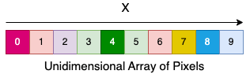
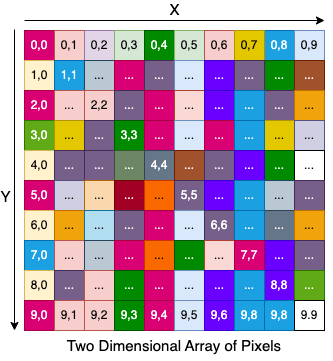

## 1. 概述

在本快速教程中，我们将了解如何使用Kotlin语言处理多维数组，我们将从Array Kotlin数据类型的简短介绍开始，然后我们将讨论多维数组、如何创建它们以及如何访问它们的值。

## 2. 一维数组

Kotlin中的[数组](https://www.baeldung.com/kotlin/arrays)是基本类型的一部分，由表示相似项集合的内置类处理。在本教程中，我们将使用通用的Array<T\> Kotlin类，因为它是我们创建多维数组所需的类。

可以使用Array泛型类[提供的构造函数](https://kotlinlang.org/api/latest/jvm/stdlib/kotlin/-array/)分配一维数组，它“创建一个具有指定[size]的新数组，其中每个元素都是通过调用指定的[init]函数计算的”：

```java
public class Array<T> {
   //...
   public inline constructor(size: Int, init: (Int) -> T)
}
```

尖括号中的**T**称为“类型参数”，并使此类成为[泛型类](https://www.baeldung.com/kotlin/generics)，这允许我们将Array与我们喜欢的任何类一起使用。例如，让我们创建一个数组，其中包含刚刚定义的Pixel[数据类](https://www.baeldung.com/kotlin/data-classes)的十个元素：

```kotlin
data class Pixel(val red: Int, val green: Int, val blue: Int)

val pixelArray: Array<Pixel> = Array(10) { Pixel(
    (0..255).random(),
    (0..255).random(),
    (0..255).random())
}
```

要在特定位置访问PixelArray的值，我们可以使用getter和setter函数或类似C的方括号重载函数，让我们遍历数组并打印他的对象的值：

```kotlin
for (i in 0..9) {
    print(pixelArray[i]) // this will print "Pixel(red=..., green=..., blue=...)"
    Assertions.assertThat((pixelArray[i].red in 0..255))
    Assertions.assertThat((pixelArray[i].blue in 0..255))
    Assertions.assertThat((pixelArray[i].green in 0..255))
}
```

红色、绿色和蓝色的组合，从0到255，给出了1600万种颜色的原点，为了更好地理解多维数组，让我们将刚刚创建的数组想象成一个随机颜色的行：



## 3. 多维数组

要创建多维数组，我们必须利用使用另一个Array的泛型类型参数。

例如，现在让我们创建一个像素矩阵(二维数组)：

```kotlin
val matrix: Array<Array<Pixel>> = Array(10) {
    Array(10) {
        Pixel(
            (0..255).random(),
            (0..255).random(),
            (0..255).random()
        )
    }
}
```

该矩阵将由10 x 10个不同颜色的像素组成，我们也可以将这种奇特的结构称为“图像”。现在让我们打印单个像素的值：

```kotlin
for (i in 0..9) {
    for (j in 0..9) {
        print(matrix[i][j]) // this will print "Pixel(red=..., green=..., blue=...)"
        Assertions.assertThat((matrix[i][j].red in 0..255))
        Assertions.assertThat((matrix[i][j].blue in 0..255))
        Assertions.assertThat((matrix[i][j].green in 0..255))
    }
    println()
}
```

可以通过指定两个维度X和Y的坐标来访问矩阵的单个元素，现在让我们看一下刚刚创建的数据结构的可视化表示：



向数组添加另一个维度就像用另一个数组再次替换数组的内部可参数化类一样简单，要访问特定值，我们现在应该为X(i)、Y(j)和Z(k)提供三个特定坐标：

```kotlin
val video: Array<Array<Array<Pixel>>> = Array(10) {
    Array(10) {
        Array(10) {
            Pixel(
                (0..255).random(),
                (0..255).random(),
                (0..255).random()
            )
        }
    }
}
for (i in 0..9) {
    for (j in 0..9) {
        for(k in 0..9) {
            print(video[i][j][k]) // this will print "Pixel(red=..., green=..., blue=...)"
            Assertions.assertThat((video[i][j][k].red in 0..255))
            Assertions.assertThat((video[i][j][k].blue in 0..255))
            Assertions.assertThat((video[i][j][k].green in 0..255))
        }
        println()
    }
    println("---")
}
```

我们可以将这个数据结构想象成一个10(X) * 10(Y)的图像，它随时间(Z)演化。

## 3. 基本类型的多维数组

如果我们必须处理Kotlin基本类型的多维数组，我们可以依赖各种原始库函数和其他类。事实上，Kotlin将其他类定义为IntArray、BooleanArray、LongArray等，以及用于实例化这些类型的库函数。

作为示例，让我们看看如何使用“arrayOf”和“intArrayOf”方法定义一个简单的二维整数数组：

```kotlin
val first: Array<IntArray> = arrayOf(
    intArrayOf(2, 4, 6), // we can also use shortArrayOf or doubleArrayOf... 
    intArrayOf(1, 3, 5)
)
```

最后，使用arrayOfNulls可以用空值初始化数组，因此，使用此方法可以使用不同的数组大小初始化每一行：

```kotlin
val arrayNulls = arrayOfNulls<Array<Int>>(2)
arrayNulls[0] = Array(3) { 0 }
arrayNulls[1] = Array(2) { 1 }
```

此代码段将生成一个包含两行的二维数组：第一行包含三个值为0的元素，第二行包含两个值为1的元素。

## 4. 总结

在本教程中，我们了解了使用Kotlin编程语言的一维数组和多维数组之间的区别，在文章的最后一部分，我们还看到了如何依靠库函数用几行代码实例化一个多维数组。