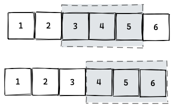

## 1. 概述

在本快速教程中，我们将介绍Kotlin的集合API，并讨论Kotlin中的不同集合类型以及对集合的一些常见操作。

## 2. 集合与可变集合

首先，让我们看一下Kotlin中不同类型的集合，我们将看到如何初始化集合的基本类型。

**Collection接口支持只读方法，而MutableCollection支持读/写方法**。

### 2.1 List

我们可以使用listOf()方法创建一个简单的只读列表，并使用mutableListOf()创建读写MutableList：

```kotlin
val theList = listOf("one", "two", "three")    

val theMutableList = mutableListOf("one", "two", "three")
```

### 2.2 Set

类似地，我们可以使用setOf()方法创建只读Set并使用mutableSetOf()创建读写MutableSet：

```kotlin
val theSet = setOf("one", "two", "three")  

val theMutableSet = mutableSetOf("one", "two", "three")
```

### 2.3 Map

我们还可以使用mapOf()方法创建只读Map并使用mutableMapOf()创建读写MutableMap：

```kotlin
val theMap = mapOf(1 to "one", 2 to "two", 3 to "three")

val theMutableMap = mutableMapOf(1 to "one", 2 to "two", 3 to "three")
```

## 3. 有用的运算符

Kotlin的Collections API比我们在Java中可以找到的API丰富得多-它带有一组重载运算符。

### 3.1 “in”运算符

我们可以使用表达式“x in collection”，它可以被翻译成collection.contains(x)：

```kotlin
@Test
fun whenSearchForExistingItem_thenFound () {
    val theList = listOf("one", "two", "three")

    assertTrue("two" in theList)        
}
```

### 3.2 “+”运算符

我们可以使用“+”运算符将一个元素或整个集合转换为另一个：

```kotlin
@Test
fun whenJoinTwoCollections_thenSuccess () {
    val firstList = listOf("one", "two", "three")
    val secondList = listOf("four", "five", "six")
    val resultList = firstList + secondList

    assertEquals(6, resultList.size)   
    assertTrue(resultList.contains("two"))        
    assertTrue(resultList.contains("five"))        
}
```

### 3.3 “-”运算符

同样，我们可以使用“-”运算符删除一个或多个元素：

```kotlin
@Test
fun whenExcludeItems_thenRemoved () {
    val firstList = listOf("one", "two", "three")
    val secondList = listOf("one", "three")
    val resultList = firstList - secondList

    assertEquals(1, resultList.size)        
    assertTrue(resultList.contains("two"))        
}
```

## 4. 其他方法

最后，我们将探讨一些常用的收集方法。在Java中，如果我们想利用高级方法，我们需要使用Stream API。

在Kotlin中，我们可以在Collections API中找到类似的方法。

### 4.1 切片

我们可以从给定的列表中获取子列表：

```kotlin
@Test
fun whenSliceCollection_thenSuccess () {
    val theList = listOf("one", "two", "three")
    val resultList = theList.slice(1..2)

    assertEquals(2, resultList.size)        
    assertTrue(resultList.contains("two"))        
}
```

### 4.2 删除

我们可以轻松地从列表中删除所有空值：

```kotlin
@Test
fun whenFilterNullValues_thenSuccess () {
    val theList = listOf("one", null, "two", null, "three")
    val resultList = theList.filterNotNull()

    assertEquals(3, resultList.size)        
}
```

### 4.3 过滤

我们可以使用filter()轻松地过滤集合项，它的工作方式类似于Java Stream API中的filter()方法：

```kotlin
@Test
fun whenFilterNonPositiveValues_thenSuccess () {
    val theList = listOf(1, 2, -3, -4, 5, -6)
    val resultList = theList.filter{ it > 0}

    assertEquals(3, resultList.size)  
    assertTrue(resultList.contains(1))
    assertFalse(resultList.contains(-4))      
}
```

### 4.4 移除

我们可以删除前N项：

```kotlin
@Test
fun whenDropFirstItems_thenRemoved () {
    val theList = listOf("one", "two", "three", "four")
    val resultList = theList.drop(2)

    assertEquals(2, resultList.size)        
    assertFalse(resultList.contains("one"))        
    assertFalse(resultList.contains("two"))        
}
```

如果前几项满足给定条件，我们可以删除它们：

```kotlin
@Test
fun whenDropFirstItemsBasedOnCondition_thenRemoved () {
    val theList = listOf("one", "two", "three", "four")
    val resultList = theList.dropWhile{ it.length < 4 }

    assertEquals(2, resultList.size)        
    assertFalse(resultList.contains("one"))        
    assertFalse(resultList.contains("two"))        
}
```

### 4.5 分组

我们可以对元素进行分组：

```kotlin
@Test
fun whenGroupItems_thenSuccess () {
    val theList = listOf(1, 2, 3, 4, 5, 6)
    val resultMap = theList.groupBy{ it % 3}

    assertEquals(3, resultMap.size)

    assertTrue(resultMap[1]!!.contains(1))
    assertTrue(resultMap[2]!!.contains(5))
}
```

### 4.6 映射

我们可以使用提供的函数映射所有元素：

```kotlin
@Test
fun whenApplyFunctionToAllItems_thenSuccess () {
    val theList = listOf(1, 2, 3, 4, 5, 6)
    val resultList = theList.map{ it * it }
    
    assertEquals(4, resultList[1])
    assertEquals(9, resultList[2])
}
```

我们可以使用flatMap()来展平嵌套集合，在这里，我们将字符串转换为List<String>并避免以List<List<String>>结尾：

```kotlin
@Test
fun whenApplyMultiOutputFunctionToAllItems_thenSuccess () {
    val theList = listOf("John", "Tom")
    val resultList = theList.flatMap{ it.toLowerCase().toList() }
    
    assertEquals(7, resultList.size)
}
```

### 4.7 归约

我们可以执行折叠/规约操作：

```kotlin
@Test
fun whenApplyFunctionToAllItemsWithStartingValue_thenSuccess () {
    val theList = listOf(1, 2, 3, 4, 5, 6)
    val finalResult = theList.fold(0, {acc, i -> acc + (i * i)})
    
    assertEquals(91, finalResult)
}
```

### 4.8 分块

要将集合分成给定大小的块，我们可以使用chunked()方法：

```kotlin
@Test
fun whenApplyingChunked_thenShouldBreakTheCollection() {
    val theList = listOf(1, 2, 3, 4, 5)
    val chunked = theList.chunked(2)

    assertThat(chunked.size).isEqualTo(3)
    assertThat(chunked.first()).contains(1, 2)
    assertThat(chunked[1]).contains(3, 4)
    assertThat(chunked.last()).contains(5)
}
```

由于该集合有五个元素，chunked(2)方法调用返回两个各有两个元素的集合和一个单元素集合。

也可以在分解集合后将每个块映射到其他对象：

```kotlin
@Test
fun whenApplyingChunkedWithTransformation_thenShouldBreakTheCollection() {
    val theList = listOf(1, 2, 3, 4, 5)
    val chunked = theList.chunked(3) { it.joinToString(", ") }

    assertThat(chunked.size).isEqualTo(2)
    assertThat(chunked.first()).isEqualTo("1, 2, 3")
    assertThat(chunked.last()).isEqualTo("4, 5")
}
```

创建大小为3的块后，我们将每个块转换为逗号分隔的字符串。

### 4.9 窗口化

windowed()函数通过在元素集合上移动给定大小的滑动窗口来返回元素范围列表。

为了更好地理解这一点，让我们看看windowed(3)如何处理6个元素的集合：


起初，窗口大小为3，因此第一个列表将包含1、2和3。然后滑动窗口进一步移动一个元素：


滑动窗口向前移动，直到无法创建另一个给定大小的列表：



这种转换序列在Kotlin代码中表现为：

```kotlin
@Test
fun whenApplyingWindowed_thenShouldCreateSlidingWindowsOfElements() {
    val theList = (1..6).toList()
    val windowed = theList.windowed(3)

    assertThat(windowed.size).isEqualTo(4)
    assertThat(windowed.first()).contains(1, 2, 3)
    assertThat(windowed[1]).contains(2, 3, 4)
    assertThat(windowed[2]).contains(3, 4, 5)
    assertThat(windowed.last()).contains(4, 5, 6)
}
```

**默认情况下，滑动窗口每次移动一步。当然，我们可以通过传递自定义步长值来更改它**：

```kotlin
@Test
fun whenApplyingWindowedWithTwoSteps_thenShouldCreateSlidingWindowsOfElements() {
    val theList = (1..6).toList()
    val windowed = theList.windowed(size = 3, step = 2)

    assertThat(windowed.size).isEqualTo(2)
    assertThat(windowed.first()).contains(1, 2, 3)
    assertThat(windowed.last()).contains(3, 4, 5)
}
```

**默认情况下，windowed()函数始终且仅创建给定大小的范围。要更改它，我们可以将partialWindows参数设置为true**：

```kotlin
@Test
fun whenApplyingPartialWindowedWithTwoSteps_thenShouldCreateSlidingWindowsOfElements() {
    val theList = (1..6).toList()
    val windowed = theList.windowed(size = 3, step = 2, partialWindows = true)

    assertThat(windowed.size).isEqualTo(3)
    assertThat(windowed.first()).contains(1, 2, 3)
    assertThat(windowed[1]).contains(3, 4, 5)
    assertThat(windowed.last()).contains(5, 6)
}
```

与chunked()函数类似，可以将每个范围映射到其他内容：

```kotlin
@Test
fun whenApplyingTransformingWindows_thenShouldCreateSlidingWindowsOfElements() {
    val theList = (1..6).toList()
    val windowed = theList.windowed(size = 3, step = 2, partialWindows = true) { it.joinToString(", ") }

    assertThat(windowed.size).isEqualTo(3)
    assertThat(windowed.first()).isEqualTo("1, 2, 3")
    assertThat(windowed[1]).isEqualTo("3, 4, 5")
    assertThat(windowed.last()).isEqualTo("5, 6")
}
```

## 5. 总结

我们探索了Kotlin的集合API和一些最有趣的方法。