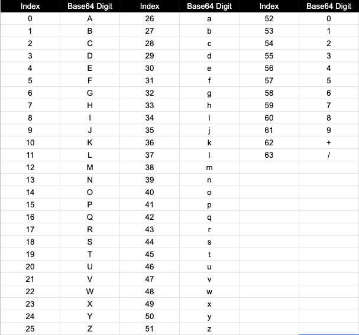

## 1. 概述

在本教程中，我们将探索在Kotlin中将字符串编码和解码为[Base64](https://en.wikipedia.org/wiki/Base64)的几种流行方法。

## 2. 基础知识

Base64是一种二进制到文本的编码方案，主要用于现代Web应用程序，以将二进制数据作为文本传输。顾名思义，**Base64数字系统中有64个符号，映射到[A-Za-z0-9+/]字符集**：



假设我们要使用Base64编码对字符串“Tuyucheng”进行编码。

首先，我们需要将原始字符串中的每个字符表示为其ASCII表示的8位二进制值；然后，我们将8位流分组为6位流，并获取每个6位值的Base64索引；最后我们利用Base64映射表得到索引对应的Base64数字：


**我们可以注意到3个字节的二进制数据可以用4个Base64数字来表示**，此外，流末尾的每个6位零填充由=符号表示。

最后，我们可以得出总结，“VHV5dWNoZW5n”是字符串“Tuyucheng”的Base64表示。

## 3. Base64工具类

**我们可以使用java.util.Base64库在Kotlin中编码和解码字符串**。

首先，让我们使用编码器对“Tuyucheng”字符串进行编码：

```kotlin
val originalString = "Tuyucheng"
val encodedString: String = Base64.getEncoder().encodeToString(originalString.toByteArray())
assertEquals("VHV5dWNoZW5n", encodedString)
```

在内部，Base64类的getEncoder()方法为我们提供了一个符合[RFC4648](https://datatracker.ietf.org/doc/html/rfc4648)中描述的编码标准的编码器。

接下来，让我们使用Base64类的getDecoder()方法将Base64字符串表示形式解码为原始文本：

```kotlin
val encodedString = "VHV5dWNoZW5n"
val decodedString: String = String(Base64.getDecoder().decode(encodedString))
assertEquals("Tuyucheng", decodedString)
```

我们刚刚验证了“VHV5dWNoZW5n”是字符串“Tuyucheng”的正确Base64表示形式。

与getEncoder()方法类似，getDecoder()方法也返回符合RFC4648标准的Base64解码器。

## 4. Apache Commons Base64 Codec

让我们学习如何使用Apache Commons Base64来编码和解码字符串。

首先，我们需要将[commons-codec](https://search.maven.org/artifact/commons-codec/commons-codec)依赖项添加到项目的pom.xml中：

```xml
<dependency>
    <groupId>commons-codec</groupId>
    <artifactId>commons-codec</artifactId>
    <version>1.15</version>
</dependency>
```

接下来，**我们需要在我们的Kotlin类中显式导入org.apache.commons.codec.binary.Base64，并使用ApacheBase64等别名，以防止与java.util.Base64类发生名称冲突**：

```kotlin
import org.apache.commons.codec.binary.Base64 as ApacheBase64
```

现在，让我们创建一个ApacheBase64类的实例，并使用它来编码字符串“Tuyucheng”：

```kotlin
val originalString = "Tuyucheng"
val base64: ApacheBase64 = ApacheBase64()
val encodedStr = String(base64.encode(originalString.toByteArray()))
assertEquals("VHV5dWNoZW5n", encodedStr)
```

我们必须注意，在将字符串传递给encode()方法之前，我们使用了[toByteArray()](https://kotlinlang.org/api/latest/jvm/stdlib/kotlin.text/to-byte-array.html)方法来获取字符串的字节数组表示形式。

同样，让我们也使用decode()方法验证字符串“VHV5dWNoZW5n”的解码：

```kotlin
val encodedString = "VHV5dWNoZW5n"
val base64: ApacheBase64 = ApacheBase64()
val decodedString: String = String(base64.decode(encodedString))
assertEquals("Tuyucheng", decodedString)
```

这里，decode()方法返回一个字节数组表示形式。因此，我们需要获取一个String对象来验证原始String对象。

## 5. 总结

在本文中，我们学习了Base64编码的基础知识，并使用java.util.Base64和Apache Commons Base64 Codec等库对字符串进行编码和解码。