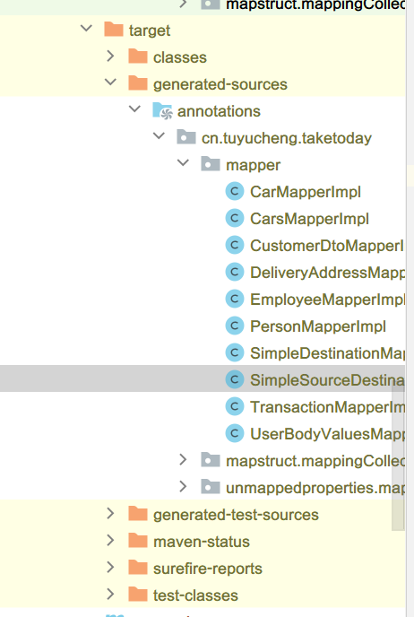

## 1. 概述

在本教程中，我们将介绍MapStruct的使用，简单地说，就是一个Java Bean映射器。

此API包含在两个Java Bean之间自动映射的方法。有了MapStruct，我们只需要创建接口，它会在编译时自动创建一个具体的实现。

## 2. MapStruct和传输对象模式

对于大多数应用程序，你会注意到许多将POJO转换为其他POJO的样板代码。

例如，一种常见类型的转换发生在持久层支持的实体和发送到客户端的DTO之间。

所以，这就是MapStruct解决的问题：手动创建bean映射器非常耗时。但是该库可以自动生成bean映射器类。

## 3. Maven依赖

让我们在Maven pom.xml中添加以下依赖项：

```xml
<dependency>
    <groupId>org.mapstruct</groupId>
    <artifactId>mapstruct</artifactId>
    <version>1.4.2.Final</version>
</dependency>
```

我们还将<annotationProcessorPaths>添加到maven-compiler-plugin插件的<configuration>部分。

mapstruct-processor用于在构建期间生成映射器实现：

```xml
<build>
    <finalName>mapstruct</finalName>
    <plugins>
        <plugin>
            <groupId>org.apache.maven.plugins</groupId>
            <artifactId>maven-compiler-plugin</artifactId>
            <version>3.8.1</version>
            <configuration>
                <source>${maven.compiler.source}</source>
                <target>${maven.compiler.target}</target>
                <annotationProcessorPaths>
                    <path>
                        <groupId>org.mapstruct</groupId>
                        <artifactId>mapstruct-processor</artifactId>
                        <version>${org.mapstruct.version}</version>
                    </path>
                    <path>
                        <groupId>org.projectlombok</groupId>
                        <artifactId>lombok</artifactId>
                        <version>1.18.22</version>
                    </path>
                    <path>
                        <groupId>org.projectlombok</groupId>
                        <artifactId>lombok-mapstruct-binding</artifactId>
                        <version>${lombok.mapstruct.binding.version}</version>
                    </path>
                </annotationProcessorPaths>
            </configuration>
        </plugin>
    </plugins>
</build>
```

## 4. 基础映射

### 4.1 创建一个POJO

我们首先创建一个简单的Java POJO:

```java
@Data
public class SimpleSource {
    private String name;
    private String description;
}
```

```java
@Data
public class SimpleDestination {
    private String name;
    private String description;
}
```

### 4.2 Mapper接口

```java

@Mapper
public interface SimpleSourceDestinationMapper {
    SimpleDestination sourceToDestination(SimpleSource source);

    SimpleSource destinationToSource(SimpleDestination destination);
}
```

请注意，我们没有为SimpleSourceDestinationMapper创建一个实现类，因为MapStruct会为我们创建它。

### 4.3 Mapper实现类

我们可以通过执行mvn clean install来触发MapStruct processing。

这将在/target/generated-sources/annotations/目录下生成mapper接口实现类：



下面使MapStruct为我们自动创建的类：

```java

@Generated(
        value = "org.mapstruct.ap.MappingProcessor",
        date = "2022-09-12T01:42:36+0800",
        comments = "version: 1.4.2.Final, compiler: javac, environment:Java17.0.1 (Oracle Corporation)"
)
@Component
public class SimpleSourceDestinationMapperImpl implements SimpleSourceDestinationMapper {

    @Override
    public SimpleDestination sourceToDestination(SimpleSource source) {
        if (source == null) {
            return null;
        }

        SimpleDestination simpleDestination = new SimpleDestination();

        simpleDestination.setName(source.getName());
        simpleDestination.setDescription(source.getDescription());

        return simpleDestination;
    }

    @Override
    public SimpleSource destinationToSource(SimpleDestination destination) {
        if (destination == null) {
            return null;
        }

        SimpleSource simpleSource = new SimpleSource();

        simpleSource.setName(destination.getName());
        simpleSource.setDescription(destination.getDescription());

        return simpleSource;
    }
}
```

### 4.4 测试用例

最后，生成所有内容后，让我们编写一个测试用例，测试SimpleSource中的值与SimpleDestination中的值匹配：

```java

class SimpleSourceDestinationMapperIntegrationTest {

    private SimpleSourceDestinationMapper mapper = Mappers.getMapper(SimpleSourceDestinationMapper.class);

    @Test
    void givenSourceToDestination_whenMaps_thenCorrect() {
        SimpleSource simpleSource = new SimpleSource();
        simpleSource.setName("SourceName");
        simpleSource.setDescription("SourceDescription");
        SimpleDestination destination = simpleSourceDestinationMapper.sourceToDestination(simpleSource);
        
        assertEquals(simpleSource.getDescription(), destination.getDescription());
        assertEquals(simpleSource.getName(), destination.getName());
    }

    @Test
    void givenDestinationToSource_whenMaps_thenCorrect() {
        SimpleDestination destination = new SimpleDestination();
        destination.setName("DestinationName");
        destination.setDescription("DestinationDescription");
        SimpleSource source = simpleSourceDestinationMapper.destinationToSource(destination);
        
        assertEquals(destination.getName(), source.getName());
        assertEquals(destination.getDescription(), source.getDescription());
    }
}
```

## 5. 使用依赖注入

接下来，我们通过调用Mappers.getMapper(YourClass.class)在MapStruct中获取一个映射器的实例。

当然，这是获取实例的一种非常手动的方式。然而，一个更好的选择是直接在我们需要的地方注入映射器。

幸运的是，MapStruct对Spring和CDI(上下文和依赖注入)都有可靠的支持。

要在我们的映射器中使用Spring IoC，我们需要设置@Mapper注解的componentModel属性，其值为spring，对于CDI，它将是cdi。

### 5.1 修改Mapper接口

将以下代码添加到SimpleSourceDestinationMapper:

```java

@Mapper(componentModel = "spring")
public interface SimpleSourceDestinationMapper {
}
```

### 5.2 将Spring Bean注入Mapper

有时，我们需要在映射逻辑中使用其他Spring组件。在这种情况下，我们必须使用抽象类而不是接口：

```java

@Mapper(componentModel = "spring")
public abstract class SimpleDestinationMapperUsingInjectedService {

}
```

然后，我们可以使用@Autowired注解注入所需的组件，并在我们的代码中使用它：

```java

@Mapper(componentModel = "spring")
public abstract class SimpleDestinationMapperUsingInjectedService {

    @Autowired
    protected SimpleService simpleService;

    @Mapping(target = "name", expression = "java(simpleService.enrichName(source.getName()))")
    public abstract SimpleDestination sourceToDestination(SimpleSource source);
}

@Service
public class SimpleService {

    public String enrichName(String name) {
        return "-:: " + name + " ::-";
    }
}
```

我们必须记住不要将注入的bean设为private，这是因为MapStruct必须访问生成的实现类中的对象。

## 6. 映射具有不同字段名称的字段

在我们之前的示例中，MapStruct能够自动映射我们的bean，因为它们具有相同的字段名称。
那么，如果我们要映射的bean的字段名称不同怎么办？

在本例中，我们将创建一个名为Employee和EmployeeDTO的新bean。

### 6.1 POJO

```java

@Data
public class Employee {
    private int id;
    private String name;
}

@Data
public class EmployeeDTO {
    private int employeeId;
    private String employeeName;
}
```

### 6.2 Mapper接口

当映射不同的字段名称时，我们需要将其source字段配置为其target字段，为此，我们需要为每个字段添加@Mapping注解。

在MapStruct中，我们还可以使用点表示法来定义bean的成员：

```java

@Mapper
public interface EmployeeMapper {

    @Mapping(target = "employeeId", source = "entity.id")
    @Mapping(target = "employeeName", source = "entity.name")
    EmployeeDTO employeeToEmployeeDTO(Employee entity);

    @Mapping(target = "id", source = "dto.employeeId")
    @Mapping(target = "name", source = "dto.employeeName")
    Employee employeeDTOtoEmployee(EmployeeDTO dto);
}
```

### 6.3 测试用例

同样，我们需要测试源对象值和目标对象值是否匹配：

```java
class EmployeeMapperUnitTest {
    
    EmployeeMapper mapper = Mappers.getMapper(EmployeeMapper.class);

    @Test
    void givenEmployeeDTOWithDiffNameToEmployee_whenMaps_thenCorrect() {
        EmployeeDTO dto = new EmployeeDTO();
        dto.setEmployeeId(1);
        dto.setEmployeeName("John");

        Employee entity = mapper.employeeDTOtoEmployee(dto);
        
        assertEquals(dto.getEmployeeId(), entity.getId());
        assertEquals(dto.getEmployeeName(), entity.getName());
    }

    @Test
    void givenEmployeeWithDiffNameToEmployeeDTO_whenMaps_thenCorrect() {
        Employee entity = new Employee();
        entity.setId(1);
        entity.setName("John");

        EmployeeDTO dto = mapper.employeeToEmployeeDTO(entity);
        
        assertEquals(dto.getEmployeeId(), entity.getId());
        assertEquals(dto.getEmployeeName(), entity.getName());
    }
}
```

## 7. 映射带有引用类型字段的Bean

接下来，我们将展示如何将一个bean与对其他bean的引用进行映射。

### 7.1 修改POJO

让我们向Employee对象添加一个新的Division字段：

```java

@Data
public class Employee {
    private int id;
    private String name;
    private Division division;
}

@Data
public class EmployeeDTO {
    private int employeeId;
    private String employeeName;
    private DivisionDTO division;
}

@Data
@NoArgsConstructor
@AllArgsConstructor
public class Division {
    private int id;
    private String name;
}

@Data
@NoArgsConstructor
@AllArgsConstructor
public class DivisionDTO {
    private int id;
    private String name;
}
```

### 7.2 修改Mapper

这里我们需要添加两个方法，将Division与DivisionDTO相互转换；
如果MapStruct检测到需要转换的对象类型且转换的方法存在于同一个类中，它会自动使用它们。

让我们将它添加到映射器中：

```java

@Mapper
public interface EmployeeMapper {

    DivisionDTO divisionToDivisionDTO(Division entity);

    Division divisionDTOtoDivision(DivisionDTO dto);
}
```

### 7.3 修改测试用例

```java
class EmployeeMapperUnitTest {

    @Test
    void givenEmpDTONestedMappingToEmp_whenMaps_thenCorrect() {
        EmployeeDTO dto = new EmployeeDTO();
        dto.setDivision(new DivisionDTO(1, "Division1"));
        Employee entity = mapper.employeeDTOtoEmployee(dto);
        
        assertEquals(dto.getDivision().getId(), entity.getDivision().getId());
        assertEquals(dto.getDivision().getName(), entity.getDivision().getName());
    }

    @Test
    void givenEmployeeWithNestedMappingToEmployeeDTO_whenMaps_thenCorrect() {
        Employee entity = new Employee();
        entity.setDivision(new Division(1, "Division1"));
        EmployeeDTO dto = mapper.employeeToEmployeeDTO(entity);
        
        assertEquals(dto.getDivision().getId(), entity.getDivision().getId());
        assertEquals(dto.getDivision().getName(), entity.getDivision().getName());
    }
}
```

## 8. 带有类型转换的映射

MapStruct还提供了一些现成的隐式类型转换，对于我们的示例，我们将尝试将String日期转换为实际的Date对象。

### 8.1 修改Employee bean

我们为Employee类添加一个新的Date字段：

```java

@Data
public class Employee {
    private int id;
    private String name;
    private Division division;
    private Date startDt;
}

@Data
public class EmployeeDTO {
    private int employeeId;
    private String employeeName;
    private DivisionDTO division;
    private String employeeStartDt;
}
```

### 8.2 修改Mapper

我们修改Mapper接口并为Date字段提供日期格式：

```java

@Mapper
public interface EmployeeMapper {

    @Mappings({
            @Mapping(target = "employeeId", source = "entity.id"),
            @Mapping(target = "employeeName", source = "entity.name"),
            @Mapping(target = "employeeStartDt", source = "entity.startDt", dateFormat = "yyyy-MM-dd HH:mm:ss")
    })
    EmployeeDTO employeeToEmployeeDTO(Employee entity);

    @Mappings({
            @Mapping(target = "id", source = "dto.employeeId"),
            @Mapping(target = "name", source = "dto.employeeName"),
            @Mapping(target = "startDt", source = "dto.employeeStartDt", dateFormat = "yyyy-MM-dd HH:mm:ss")
    })
    Employee employeeDTOtoEmployee(EmployeeDTO dto);
}
```

### 8.3 修改测试用例

让我们再添加几个测试用例来验证转换是否正确：

```java
class EmployeeMapperUnitTest {

    @Test
    void givenEmpStartDtMappingToEmpDTO_whenMaps_thenCorrect() throws ParseException {
        Employee entity = new Employee();
        entity.setStartDt(new Date());

        EmployeeDTO dto = mapper.employeeToEmployeeDTO(entity);
        SimpleDateFormat format = new SimpleDateFormat(DATE_FORMAT);
        
        assertEquals(format.parse(dto.getEmployeeStartDt()).toString(), entity.getStartDt().toString());
    }

    @Test
    void givenEmpDTOStartDtMappingToEmp_whenMaps_thenCorrect() throws ParseException {
        EmployeeDTO dto = new EmployeeDTO();
        dto.setEmployeeStartDt("01-04-2016 01:00:00");

        Employee entity = mapper.employeeDTOtoEmployee(dto);
        SimpleDateFormat format = new SimpleDateFormat(DATE_FORMAT);
        
        assertEquals(format.parse(dto.getEmployeeStartDt()).toString(), entity.getStartDt().toString());
    }
}
```

## 9. 使用抽象类进行映射

有时，我们可能希望以超出@Mapping功能的方式自定义我们的映射器。

例如，除了类型转换之外，我们可能还想以某种方式转换值，如下面的示例所示。

在这种情况下，我们可以创建一个抽象类并实现我们想要自定义的方法，而将那些应该由MapStruct生成的方法保留为抽象。

### 9.1 基础模型

在本例中，我们将使用以下类：

```java

@Data
public class Transaction {
    private Long id;
    private String uuid = UUID.randomUUID().toString();
    private BigDecimal total;
}
```

和匹配的DTO：

```java

@Data
public class TransactionDTO {
    private String uuid;
    private Long totalInCents;
}
```

这里棘手的部分是将BigDecimal的total转换为Long类型的totalInCents。

### 9.2 定义Mapper

我们可以通过将Mapper创建为抽象类来实现这一点：

```java

@Mapper
abstract class TransactionMapper {

    public TransactionDTO toTransactionDTO(Transaction transaction) {
        TransactionDTO transactionDTO = new TransactionDTO();
        transactionDTO.setUuid(transaction.getUuid());
        transactionDTO.setTotalInCents(transaction.getTotal().multiply(new BigDecimal("100")).longValue());
        return transactionDTO;
    }

    public abstract List<TransactionDTO> toTransactionDTO(Collection<Transaction> transactions);
}
```

在这里，我们为单个对象转换实现了完全自定义的映射方法。

另一方面，我们将Collection映射到List的方法保留为抽象，因此MapStruct将为我们实现它。

### 9.3 生成结果

由于我们已经实现了将单个Transaction映射到TransactionDTO的方法，我们希望MapStruct在第二个方法中使用它。

生成的内容如下：

```java

@Generated(
        value = "org.mapstruct.ap.MappingProcessor",
        date = "2022-09-12T01:56:25+0800",
        comments = "version: 1.4.2.Final, compiler: javac, environment:Java17.0.1 (Oracle Corporation)"
)
class TransactionMapperImpl extends TransactionMapper {

    @Override
    public List<TransactionDTO> toTransactionDTO(Collection<Transaction> transactions) {
        if (transactions == null) {
            return null;
        }

        List<TransactionDTO> list = new ArrayList<TransactionDTO>(transactions.size());
        for (Transaction transaction : transactions) {
            list.add(toTransactionDTO(transaction));
        }

        return list;
    }
}
```

正如我们在第15行中看到的，MapStruct在生成的方法中使用了我们的实现。

## 10. @BeforeMapping和AfterMapping

使用@BeforeMapping和@AfterMapping注解是自定义@Mapping功能的另一种方法。
这些注解用于标注在映射逻辑之前和之后调用的方法。

它们在我们可能希望将此行为应用于所有映射的父类的场景中非常有用。

我们来看一个将Car ElectricCar和BioDieselCar的子类型映射到CarDTO的示例。

在映射时，我们希望将类型的概念映射到DTO中的FuelType枚举字段。然后在映射完成后，我们想将DTO的name更改为大写。

### 10.1 基本模型

我们将使用以下类：

```java

@Getter
@Setter
public class Car {
    private int id;
    private String name;
}
```

Car的子类：

```java
public class BioDieselCar extends Car {

}

public class ElectricCar extends Car {

}
```

带有枚举字段类型FuelType的CarDTO：

```java

@Getter
@Setter
public class CarDTO {
    private int id;
    private String name;
    private FuelType fuelType;
}

public enum FuelType {
    ELECTRIC, BIO_DIESEL
}
```

### 10.2 定义映射器

现在让我们编写将Car映射到CarDTO的抽象映射器类：

```java

@Mapper
public abstract class CarsMapper {

    @BeforeMapping
    protected void enrichDTOWithFuelType(Car car, @MappingTarget CarDTO carDto) {
        if (car instanceof ElectricCar)
            carDto.setFuelType(FuelType.ELECTRIC);
        if (car instanceof BioDieselCar)
            carDto.setFuelType(FuelType.BIO_DIESEL);
    }

    @AfterMapping
    protected void convertNameToUpperCase(@MappingTarget CarDTO carDto) {
        carDto.setName(carDto.getName().toUpperCase());
    }

    public abstract CarDTO toCarDto(Car car);
}
```

@MappingTarget是一个参数注解，在@BeforeMapping的情况下，在映射逻辑执行之前填充目标映射DTO，
在@AfterMapping注解方法的情况下填充目标映射DTO。

### 10.3 结果

上面定义的CarsMapper生成的实现如下所示：

```java

@Generated(
        value = "org.mapstruct.ap.MappingProcessor",
        date = "2022-09-12T01:56:25+0800",
        comments = "version: 1.4.2.Final, compiler: javac, environment:Java17.0.1 (Oracle Corporation)"
)
public class CarsMapperImpl extends CarsMapper {

    @Override
    public CarDTO toCarDto(Car car) {
        if (car == null) {
            return null;
        }

        CarDTO carDTO = new CarDTO();

        enrichDTOWithFuelType(car, carDTO);

        carDTO.setId(car.getId());
        carDTO.setName(car.getName());

        convertNameToUpperCase(carDTO);

        return carDTO;
    }
}
```

注意带注解的方法调用如何围绕实现中的映射逻辑。

## 11. lombok的支持

在最新版本的MapStruct中，宣布了对Lombok的支持。因此，我们可以使用Lombok轻松映射源实体和目标实体。

要启用Lombok支持，我们需要在注解处理器路径中添加依赖项。从Lombok版本1.18.22开始，
我们还必须添加对lombok-mapstruct-binding的依赖。现在我们在Maven编译器插件中有mapstruct-processor和Lombok：

```xml
<build>
    <finalName>mapstruct</finalName>
    <plugins>
        <plugin>
            <groupId>org.apache.maven.plugins</groupId>
            <artifactId>maven-compiler-plugin</artifactId>
            <version>3.8.1</version>
            <configuration>
                <source>${maven.compiler.source}</source>
                <target>${maven.compiler.target}</target>
                <annotationProcessorPaths>
                    <path>
                        <groupId>org.mapstruct</groupId>
                        <artifactId>mapstruct-processor</artifactId>
                        <version>${org.mapstruct.version}</version>
                    </path>
                    <path>
                        <groupId>org.projectlombok</groupId>
                        <artifactId>lombok</artifactId>
                        <version>1.18.22</version>
                    </path>
                    <path>
                        <groupId>org.projectlombok</groupId>
                        <artifactId>lombok-mapstruct-binding</artifactId>
                        <version>${lombok.mapstruct.binding.version}</version>
                    </path>
                </annotationProcessorPaths>
            </configuration>
        </plugin>
    </plugins>
</build>
```

