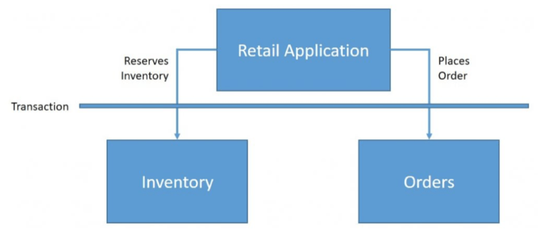
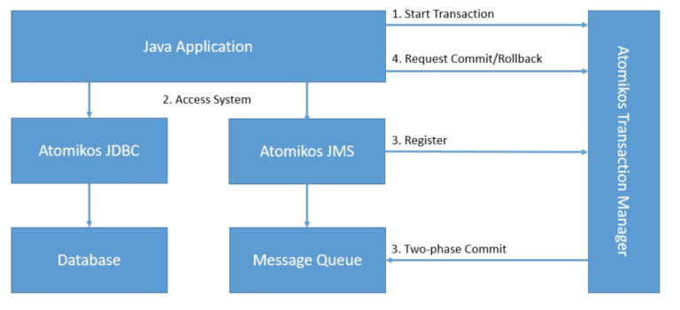

## 1. 简介

**[Atomikos](https://www.atomikos.com/)是一个用于Java应用程序的事务库**。在本教程中，我们将了解为什么以及如何使用Atomikos。

在此过程中，我们还将了解事务的基础知识以及我们需要它们的原因。

然后，我们将创建一个简单的应用程序，其中包含利用Atomikos的不同API的事务。

## 2. 了解基础知识

在我们讨论Atomikos之前，让我们先了解一下事务到底是什么以及与之相关的一些概念。简而言之，**事务是一个逻辑工作单元，其效果在事务之外完全可见或根本不可见**。

让我们举个例子来更好地理解这一点。一个典型的零售应用程序会保留库存然后下订单：



在这里，我们希望这两个操作要么同时发生，要么根本不发生。我们可以通过将这些操作包装到一个事务中来实现这一点。

### 2.1 本地与分布式事务

一个事务可以涉及多个独立的操作。这些操作**可以在相同的资源或不同的资源上执行**。我们在这里将数据库等事务中的参与组件称为资源。

单个资源内的事务称为本地事务，而跨多个资源产生的事务称为分布式事务：


在这里，库存和订单可以是同一数据库中的两个表，也可以是两个不同的数据库-可能完全运行在不同的机器上。

### 2.2 XA规范和Java事务API

XA指的是[eXtended Architecture](https://pubs.opengroup.org/onlinepubs/009680699/toc.pdf)，是分布式事务处理的规范。XA的目标是**在涉及异构组件的全局事务中提供原子性**。

XA规范通过称为两阶段提交的协议提供完整性。两阶段提交是一种广泛使用的分布式算法，用于帮助决定提交或回滚分布式事务。

[Java Transaction API(JTA)](https://www.oracle.com/technetwork/java/javaee/jta/index.html)是在JCP(Java Community Process)下开发的Java企业级API。**它使Java应用程序和应用程序服务器能够跨XA资源执行分布式事务**。

JTA是围绕XA架构建模的，利用了两阶段提交。JTA指定了事务管理器和分布式事务中其他各方之间的标准Java接口。

## 3. Atomikos简介

现在我们已经了解了事务的基础知识，我们已经准备好学习Atomikos。在本节中，我们将了解Atomikos到底是什么以及它与XA和JTA等概念的关系。我们还将了解Atomikos的架构并介绍其产品。

### 3.1 什么是Atomikos

正如我们所看到的，JTA在Java中提供了用于构建具有分布式事务的应用程序的接口。现在，JTA只是一个规范，不提供任何实现。**为了运行我们利用JTA的应用程序，我们需要JTA的实现**。这样的实现称为事务管理器。

通常，应用程序服务器提供事务管理器的默认实现。例如，对于Enterprise Java Beans(EJB)，EJB容器管理事务行为而无需应用程序开发人员的任何显式干预。然而，在很多情况下，这可能并不理想，我们可能需要独立于应用程序服务器直接控制事务。

**Atomikos是一个用于Java的轻量级事务管理器**，它使使用分布式事务的应用程序成为自包含的。本质上，我们的应用程序不需要依赖像应用服务器这样的重量级组件来进行事务。这使分布式事务的概念更接近于云原生架构。

### 3.2 Atomikos架构

Atomikos主要作为JTA事务管理器构建，因此**使用两阶段提交协议实现XA架构**。让我们看看Atomikos的高级架构：



在这里，Atomikos促进跨数据库和消息队列的基于两阶段提交的事务。

### 3.3 Atomikos产品供应

Atomikos是一个分布式事务管理器，它提供的功能比JTA/XA规定的更多。它有一个开源产品和一个更全面的商业产品：

-   TransactionsEssentials：**Atomikos的开源产品，为使用数据库和消息队列的Java应用程序提供JTA/XA事务管理器**。这主要用于测试和评估目的。
-   ExtremeTransactions：**Atomikos的商业产品，它提供跨复合应用程序的分布式事务，包括除数据库和消息队列之外的REST服务**。这对于构建执行极端事务处理(XTP)的应用程序很有用。

在本教程中，我们将使用TransactionsEssentials库来构建和演示Atomikos的功能。

## 4. 设置Atomikos

正如我们之前看到的，Atomikos的亮点之一**是它是一种嵌入式事务服务**。这意味着我们可以在与我们的应用程序相同的JVM中运行它。因此，设置Atomikos非常简单。

### 4.1 依赖

首先，我们需要设置依赖项。在这里，我们所要做的就是在我们的Maven pom.xml文件中声明依赖项：

```xml
<dependency>
    <groupId>com.atomikos</groupId>
    <artifactId>transactions-jdbc</artifactId>
    <version>5.0.6</version>
</dependency>
<dependency>
    <groupId>com.atomikos</groupId>
    <artifactId>transactions-jms</artifactId>
    <version>5.0.6</version>
</dependency>
```

在这种情况下，我们对[JDBC](https://search.maven.org/artifact/com.atomikos/transactions-jdbc)和[JMS](https://search.maven.org/artifact/com.atomikos/transactions-jms)使用Atomikos依赖项，但Maven Central上也有类似的[依赖项](https://search.maven.org/search?q=g:com.atomikos)可用于其他XA兼容资源。

### 4.2 配置

Atomikos提供了几个配置参数，每个参数都有合理的默认值。覆盖这些参数的最简单方法是**在类路径中提供一个transactions.properties文件**。我们可以为事务服务的初始化和运行添加几个参数。让我们看一个简单的配置来覆盖创建日志文件的目录：

```properties
com.atomikos.icatch.file=path_to_your_file
```

同样，我们可以使用其他参数来控制事务超时、为我们的应用程序设置唯一名称或定义关闭行为。

### 4.3 数据库

在我们的教程中，我们将构建一个简单的零售应用程序，就像我们之前描述的那样，它会保留库存然后下订单。为简单起见，我们将使用关系型数据库。此外，我们将使用多个数据库来演示分布式事务。但是，**这可以很好地扩展到其他XA兼容资源，如消息队列和主题**。

我们的库存数据库将有一个简单的表来存放产品库存：

```sql
CREATE TABLE INVENTORY (
    productId VARCHAR PRIMARY KEY,
    balance INT
);
```

而且，我们的订单数据库将有一个简单的表来存放订单：

```sql
CREATE TABLE ORDERS (
    orderId VARCHAR PRIMARY KEY,
    productId VARCHAR,
    amount INT NOT NULL CHECK (amount <= 5)
);
```

这是一个非常基本的数据库模式，仅用于演示。但是，请务必注意，我们的模式约束不允许产品数量超过5个的订单。

## 5. Atomikos实践

现在，我们已准备好使用Atomikos库之一来构建具有分布式事务的应用程序。在接下来的小节中，我们将使用内置的Atomikos资源适配器来连接我们的后端数据库系统。**这是开始使用Atomikos的最快和最简单的方法**。

### 5.1 实例化UserTransaction

我们将利用JTA UserTransaction来划分事务边界。**与事务服务相关的所有其他步骤将自动处理**。这包括使用事务服务登记和删除资源。

首先，我们需要从Atomikos实例化一个UserTransaction：

```java
UserTransactionImp utx = new UserTransactionImp();
```

### 5.2 实例化DataSource

然后，我们需要从Atomikos实例化一个DataSource。**Atomikos提供了两个可用的DataSource版本**。

第一个AtomikosDataSourceBean知道底层的XADataSource：

```java
AtomikosDataSourceBean dataSource = new AtomikosDataSourceBean();
```

而AtomikosNonXADataSourceBean使用任何常规JDBC驱动程序类：

```java
AtomikosNonXADataSourceBean dataSource = new AtomikosNonXADataSourceBean();
```

顾名思义，AtomikosNonXADataSource不符合XA标准。因此，不能保证使用此类数据源执行的事务是原子的。那么我们为什么要使用它呢？我们可能有一些不支持XA规范的数据库。Atomikos并不禁止我们使用这样的数据源，如果事务中只有一个这样的数据源，它仍然会尝试提供原子性。此技术类似于最后资源策略，这是两阶段提交过程的一种变体。

此外，我们需要根据数据库和驱动程序适当地配置数据源。

### 5.3 执行数据库操作

配置完成后，在我们的应用程序的事务上下文中使用DataSource就相当容易了：

```java
public void placeOrder(String productId, int amount) throws Exception {
    String orderId = UUID.randomUUID().toString();
    boolean rollback = false;
    try {
        utx.begin();
        Connection inventoryConnection = inventoryDataSource.getConnection();
        Connection orderConnection = orderDataSource.getConnection();
        
        Statement s1 = inventoryConnection.createStatement();
        String q1 = "update Inventory set balance = balance - " + amount + " where productId ='" + productId + "'";
        s1.executeUpdate(q1);
        s1.close();
        
        Statement s2 = orderConnection.createStatement();
        String q2 = "insert into Orders values ( '" + orderId + "', '" + productId + "', " + amount + " )";
        s2.executeUpdate(q2);
        s2.close();
        
        inventoryConnection.close();
        orderConnection.close();
    } catch (Exception e) {
        rollback = true;
    } finally {
        if (!rollback)
            utx.commit();
        else
            utx.rollback();
    }
}
```

在这里，我们更新事务边界内库存和订单的数据库表。这会自动提供以原子方式发生的这些操作的好处。

### 5.4 测试事务行为

最后，我们必须能够使用简单的单元测试来测试我们的应用程序，以验证事务行为是否符合预期：

```java
@Test
public void testPlaceOrderSuccess() throws Exception {
    int amount = 1;
    long initialBalance = getBalance(inventoryDataSource, productId);
    Application application = new Application(inventoryDataSource, orderDataSource);
    
    application.placeOrder(productId, amount);
    
    long finalBalance = getBalance(inventoryDataSource, productId);
    assertEquals(initialBalance - amount, finalBalance);
}
  
@Test
public void testPlaceOrderFailure() throws Exception {
    int amount = 10;
    long initialBalance = getBalance(inventoryDataSource, productId);
    Application application = new Application(inventoryDataSource, orderDataSource);
    
    application.placeOrder(productId, amount);
    
    long finalBalance = getBalance(inventoryDataSource, productId);
    assertEquals(initialBalance, finalBalance);
}
```

在这里，**我们期望有效订单减少库存，而期望无效订单保持库存不变**。请注意，根据我们的数据库限制，任何数量超过5件产品的订单都被视为无效订单。

### 5.5 高级Atomikos用法

上面的示例是使用Atomikos的最简单方法，可能足以满足大多数需求。但是，我们可以通过其他方式使用Atomikos来构建我们的应用程序。虽然其中一些选项使Atomikos易于使用，但其他选项提供了更大的灵活性。选择取决于我们的要求。

当然，**不必总是为JDBC/JMS使用Atomikos适配器**。我们可以选择在直接使用XAResource时使用Atomikos事务管理器。但是，在这种情况下，我们必须明确处理使用事务服务登记和删除XAResource实例。

**Atomikos还可以通过专有接口UserTransactionService使用更多高级功能**。使用此接口，我们可以显式注册要恢复的资源。这使我们能够细粒度地控制应恢复哪些资源、应如何恢复以及应何时进行恢复。

## 6. 集成Atomikos

虽然Atomikos为分布式事务提供了出色的支持，但使用此类低级API并不总是很方便。为了专注于业务领域，避免样板代码的混乱，我们往往需要不同框架和库的支持。**Atomikos支持大多数与后端集成相关的流行Java框架**。我们将在这里探索其中的几个。

### 6.1 Atomikos与Spring和DataSource

Spring是Java中流行的框架之一，它提供了控制反转(IoC)容器。值得注意的是，它对事务也有很好的支持。它使用面向切面的编程(AOP)技术提供声明式事务管理。

Spring支持多种事务API，包括用于分布式事务的JTA。我们可以毫不费力地**将Atomikos用作Spring中的JTA事务管理器**。最重要的是，得益于Spring，我们的应用程序对Atomikos仍然非常不可知。

让我们看看如何解决我们之前的问题，这次是利用Spring。我们将从重写Application类开始：

```java
public class Application {
	private DataSource inventoryDataSource;
	private DataSource orderDataSource;

	public Application(DataSource inventoryDataSource, DataSource orderDataSource) {
		this.inventoryDataSource = inventoryDataSource;
		this.orderDataSource = orderDataSource;
	}

	@Transactional(rollbackFor = Exception.class)
	public void placeOrder(String productId, int amount) throws Exception {
		String orderId = UUID.randomUUID().toString();
		Connection inventoryConnection = inventoryDataSource.getConnection();
		Connection orderConnection = orderDataSource.getConnection();

		Statement s1 = inventoryConnection.createStatement();
		String q1 = "update Inventory set balance = balance - " + amount + " where productId ='" + productId + "'";
		s1.executeUpdate(q1);
		s1.close();

		Statement s2 = orderConnection.createStatement();
		String q2 = "insert into Orders values ( '" + orderId + "', '" + productId + "', " + amount + " )";
		s2.executeUpdate(q2);
		s2.close();

		inventoryConnection.close();
		orderConnection.close();
	}
}
```

正如我们在这里看到的，**大多数与事务相关的样板代码已被方法级别的单个注解所取代**。此外，Spring负责实例化和注入我们的应用程序所依赖的DataSource。

当然，我们必须向Spring提供相关的配置。我们可以使用一个简单的Java类来配置这些元素：

```java
@Configuration
@EnableTransactionManagement
public class Config {
	@Bean(initMethod = "init", destroyMethod = "close")
	public AtomikosDataSourceBean inventoryDataSource() {
		AtomikosDataSourceBean dataSource = new AtomikosDataSourceBean();
		// Configure database holding order data
		return dataSource;
	}

	@Bean(initMethod = "init", destroyMethod = "close")
	public AtomikosDataSourceBean orderDataSource() {
		AtomikosDataSourceBean dataSource = new AtomikosDataSourceBean();
		// Configure database holding order data
		return dataSource;
	}

	@Bean(initMethod = "init", destroyMethod = "close")
	public UserTransactionManager userTransactionManager() throws SystemException {
		UserTransactionManager userTransactionManager = new UserTransactionManager();
		userTransactionManager.setTransactionTimeout(300);
		userTransactionManager.setForceShutdown(true);
		return userTransactionManager;
	}

	@Bean
	public JtaTransactionManager jtaTransactionManager() throws SystemException {
		JtaTransactionManager jtaTransactionManager = new JtaTransactionManager();
		jtaTransactionManager.setTransactionManager(userTransactionManager());
		jtaTransactionManager.setUserTransaction(userTransactionManager());
		return jtaTransactionManager;
	}

	@Bean
	public Application application() {
		return new Application(inventoryDataSource(), orderDataSource());
	}
}
```

在这里，我们为保存库存和订单数据的两个不同数据库配置AtomikosDataSourceBean。此外，我们还为JTA事务管理器提供了必要的配置。

现在，我们可以像以前一样测试我们的应用程序的事务行为。同样，我们应该验证有效订单减少了我们的库存数量，而无效订单则保持不变。

### 6.2 Atomikos与Spring、JPA和Hibernate

虽然Spring在一定程度上帮助我们减少了样板代码，但它仍然非常冗长。一些工具可以使在Java中使用关系型数据库变得更加容易。Java Persistence API(JPA)是描述Java应用程序中关系数据管理的规范。这在很大程度上简化了数据访问和操作代码。

Hibernate是JPA规范最流行的实现之一。**Atomikos对几个JPA实现有很好的支持，包括Hibernate**。和以前一样，得益于Spring和JPA，我们的应用程序对Atomikos和Hibernate仍然不可知！

让我们看看Spring、JPA和Hibernate如何**使我们的应用程序更加简洁，同时通过Atomikos提供分布式事务的好处**。和以前一样，我们将从重写Application类开始：

```java
public class Application {
	@Autowired
	private InventoryRepository inventoryRepository;
	@Autowired
	private OrderRepository orderRepository;

	@Transactional(rollbackFor = Exception.class)
	public void placeOrder(String productId, int amount) throws SQLException {
		String orderId = UUID.randomUUID().toString();
		Inventory inventory = inventoryRepository.findOne(productId);
		inventory.setBalance(inventory.getBalance() - amount);
		inventoryRepository.save(inventory);
		Order order = new Order();
		order.setOrderId(orderId);
		order.setProductId(productId);
		order.setAmount(new Long(amount));
		orderRepository.save(order);
	}
}
```

如我们所见，我们现在没有处理任何低级数据库API。但是，为了让这种魔法发挥作用，我们确实需要配置Spring Data JPA类和配置。我们将从定义我们的域实体开始：

```java
@Entity
@Table(name = "INVENTORY")
public class Inventory {
    @Id
    private String productId;
    private Long balance;
    // Getters and Setters
}
```

```java
@Entity
@Table(name = "ORDERS")
public class Order {
    @Id
    private String orderId;
    private String productId;
    @Max(5)
    private Long amount;
    // Getters and Setters
}
```

接下来，我们需要为这些实体提供Repository：

```java
@Repository
public interface InventoryRepository extends JpaRepository<Inventory, String> {
}

@Repository
public interface OrderRepository extends JpaRepository<Order, String> {
}
```

这些是非常简单的接口，Spring Data负责用实际代码详细说明这些接口以处理数据库实体。

最后，我们需要为库存和订单数据库以及事务管理器提供数据源的相关配置：

```java
@Configuration
@EnableJpaRepositories(basePackages = "cn.tuyucheng.taketoday.atomikos.spring.jpa.inventory",
	entityManagerFactoryRef = "inventoryEntityManager", transactionManagerRef = "transactionManager")
public class InventoryConfig {
	
	@Bean(initMethod = "init", destroyMethod = "close")
	public AtomikosDataSourceBean inventoryDataSource() {
		AtomikosDataSourceBean dataSource = new AtomikosDataSourceBean();
		// Configure the data source
		return dataSource;
	}

	@Bean
	public EntityManagerFactory inventoryEntityManager() {
		HibernateJpaVendorAdapter vendorAdapter = new HibernateJpaVendorAdapter();
		LocalContainerEntityManagerFactoryBean factory = new LocalContainerEntityManagerFactoryBean();
		factory.setJpaVendorAdapter(vendorAdapter);
		// Configure the entity manager factory
		return factory.getObject();
	}
}
```

```java
@Configuration
@EnableJpaRepositories(basePackages = "cn.tuyucheng.taketoday.atomikos.spring.jpa.order",
	entityManagerFactoryRef = "orderEntityManager", transactionManagerRef = "transactionManager")
public class OrderConfig {
	
	@Bean(initMethod = "init", destroyMethod = "close")
	public AtomikosDataSourceBean orderDataSource() {
		AtomikosDataSourceBean dataSource = new AtomikosDataSourceBean();
		// Configure the data source
		return dataSource;
	}

	@Bean
	public EntityManagerFactory orderEntityManager() {
		HibernateJpaVendorAdapter vendorAdapter = new HibernateJpaVendorAdapter();
		LocalContainerEntityManagerFactoryBean factory = new LocalContainerEntityManagerFactoryBean();
		factory.setJpaVendorAdapter(vendorAdapter);
		// Configure the entity manager factory
		return factory.getObject();
	}
}
```

```java
@Configuration
@EnableTransactionManagement
public class Config {
	
	@Bean(initMethod = "init", destroyMethod = "close")
	public UserTransactionManager userTransactionManager() throws SystemException {
		UserTransactionManager userTransactionManager = new UserTransactionManager();
		userTransactionManager.setTransactionTimeout(300);
		userTransactionManager.setForceShutdown(true);
		return userTransactionManager;
	}

	@Bean
	public JtaTransactionManager transactionManager() throws SystemException {
		JtaTransactionManager jtaTransactionManager = new JtaTransactionManager();
		jtaTransactionManager.setTransactionManager(userTransactionManager());
		jtaTransactionManager.setUserTransaction(userTransactionManager());
		return jtaTransactionManager;
	}

	@Bean
	public Application application() {
		return new Application();
	}
}
```

这仍然是我们必须做的相当多的配置。这部分是因为我们正在为两个单独的数据库配置Spring JPA。此外，我们还可以通过[Spring Boot](https://www.baeldung.com/spring-boot)进一步减少这些配置，但这超出了本教程的范围。

和以前一样，我们可以针对相同的事务行为测试我们的应用程序。这次没有什么新东西，除了我们现在将Spring Data JPA与Hibernate一起使用。

## 7. 超越JTA的Atomikos

虽然JTA为分布式系统提供了出色的事务支持，但这些系统必须像大多数关系型数据库或消息队列一样符合XA。但是，**如果其中一个系统不支持两阶段提交协议的XA规范，那么JTA就没有用了**。一些资源属于这一类，尤其是在微服务架构中。

几个替代协议支持分布式事务。其中之一是**使用补偿的两阶段提交协议的变体**。此类事务具有宽松的隔离保证，被称为基于补偿的事务。参与者在第一阶段本身提交事务的各个部分，为第二阶段可能的回滚提供补偿处理程序。

有几种设计模式和算法可以实现基于补偿的事务。例如，Sagas就是这样一种流行的设计模式。但是，它们通常实施起来很复杂并且容易出错。

**Atomikos提供了一种基于补偿的事务变体，称为Try-Confirm/Cancel(TCC)**。TCC为事务下的实体提供更好的业务语义。然而，这只有在参与者的高级架构支持下才有可能，并且TCC仅在Atomikos商业产品ExtremeTransactions下可用。

## 8. Atomikos的替代品

我们已经经历了足够多的Atomikos来欣赏它所提供的东西。此外，Atomikos还提供了具有更强大功能的商业产品。但是，在选择JTA事务管理器时，Atomikos并不是唯一的选择。还有一些其他可靠的选项可供选择。让我们看看他们如何对抗Atomikos。

### 8.1 Narayana

**[Narayana](https://narayana.io/)可能是最古老的开源分布式事务管理器之一**，目前由RedHat管理。它已在整个行业广泛使用，并通过社区支持不断发展，并影响了多项规范和标准。

Narayana为范围广泛的事务协议提供支持，例如JTA、JTS、Web服务和REST等等。此外，Narayana可以嵌入各种容器中。

与Atomikos相比，Narayana几乎提供了分布式事务管理器的所有功能。在很多情况下，Narayana在应用程序中的集成和使用更加灵活。例如，Narayana具有针对C/C++和Java的语言绑定。然而，这是以增加复杂性为代价的，而Atomikos相对更容易配置和使用。

### 8.2 Bitronix

**[Bitronix](https://github.com/bitronix/btm)是一个功能齐全的XA事务管理器，它提供JTA API所需的所有服务**。重要的是，Bitronix是一个可嵌入的事务库，可提供广泛且有用的错误报告和日志记录。对于分布式事务，这使得排除故障变得更加容易。此外，它对Spring的事务处理能力具有出色的支持，并且只需最少的配置即可工作。

与Atomikos相比，Bitronix是一个开源项目，没有提供产品支持的商业产品。作为Atomikos商业产品的一部分但Bitronix缺少的关键功能包括对微服务的支持和声明式弹性扩展功能。

## 9. 总结

总而言之，在本教程中，我们了解了事务的基本细节。我们了解什么是分布式事务以及像Atomikos这样的库如何促进执行它们。在此过程中，我们利用Atomikos API创建了一个具有分布式事务的简单应用程序。

我们还了解了Atomikos如何与其他流行的Java框架和库一起工作。最后，我们介绍了一些可用的Atomikos替代品。