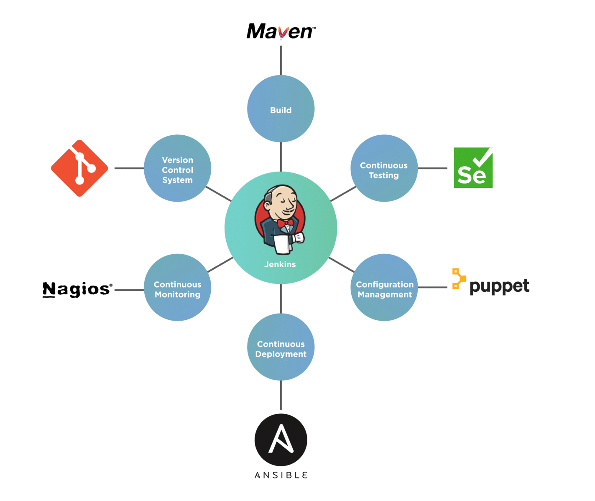
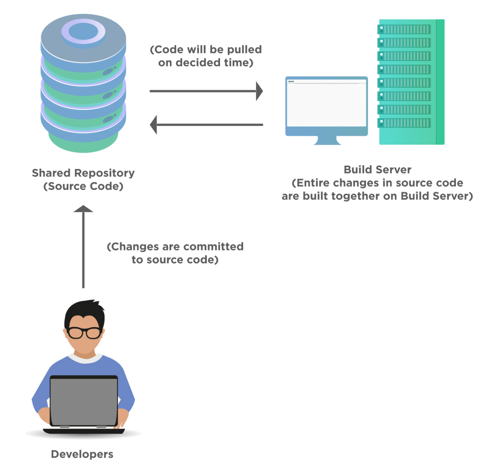
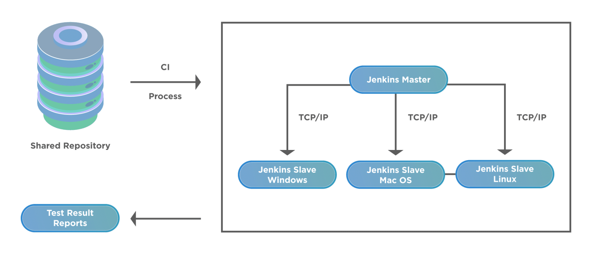

在自动化时代，我们执行软件项目以快速实现我们的目标。尽管如此，由于开发人员提供的新构建的快速部署，自动化构建过程是必不可少的。每当发生新的代码提交时，它会自动构建、测试并发布结果，因此Jenkins在这里出现了。**Jenkins**是最重要的**DevOps工具**之一，我们可以通过它构建、测试和发布测试结果，即自动化整个交付管道。在本文中，我们将学习Jenkins的基本介绍。让我们从了解以下细节开始：

-   什么是Jenkins？
-   在Jenkins之后软件交付发生了怎样的变化？
    -   传统的软件交付过程。
    -   使用Jenkins进行持续集成和交付。
-   了解Jenkins架构。
    -   什么是Jenkins Master？
    -   什么是Jenkins Slave？
-   另外，Jenkins提供了哪些独特的功能？

## 什么是Jenkins？

**Jenkins**是最著名的开源工具之一，它通过自动化软件开发管道的一部分，例如构建、测试和部署，帮助实施[持续集成(CI)](https://www.toolsqa.com/software-testing/continuous-integration/)和持续部署/持续交付(CD)的项目。它提供了一个集中式平台，有助于自动化完整的构建管道，从代码更改开始到自动创建新构建、自动执行所有测试层(单元、集成和端到端)，最后，自动部署成功的构建。通过这种方式，它可以让开发人员自由地进行更频繁的更改，并通过让最终用户更频繁地使用新功能来为他们提供自由。下图提供了对所有阶段的基本理解，它可以在其中集成并提供一种自动化的方式来交付和部署软件：

现在，让我们试着了解我们可以在[SDLC](https://www.toolsqa.com/software-testing/software-development-life-cycle/)的开发和测试阶段的哪些方面进行整合：

-   它可以帮助我们在项目的生命周期内实现**版本控制**。它支持不同类型的版本控制工具，如Git、SVN、Mercurial、CVS等。借助版本控制工具，可以轻松维护一个文件或一组文件随时间的变化。
-   我们还用它来自动构建和测试我们的软件项目。每当有新的构建出现时，它会自动触发并为用户提供一个全新的构建。因此，我们可以在Jenkins的帮助下添加“执行构建”功能。
-   它可以帮助实现持续测试。任何编程语言开发的脚本，都可以借助Jenkins快速执行，借助Jenkins提供的多种插件对应用进行测试，得到各种格式的结果。
-   它还支持使用许多流行的工具(如Chef/puppet)进行配置管理。在Jenkins中，我们可以通过其Web服务根据自定义配置管理选项来管理构建的触发。
-   它还可以支持许多持续部署工具。通过Jenkins，可以实现在生产服务器上以自动化方式持续发布软件项目。
-   它可用于持续监控性能或部署，或以自动化方式触发任何新构建。

因此，简而言之，它可以帮助自动化SDLC的任何阶段，从开发到部署，甚至在部署之后以监视的形式。

## Jenkins之后软件交付发生了怎样的变化？

我们知道，[持续集成](https://www.toolsqa.com/software-testing/continuous-integration/)是一个过程，一旦开发人员将他们的更改提交到某个共享仓库，就会按照计划的定期频率构建、测试和部署这些更改。Jenkins是简化SDLC所有这些阶段自动化的工具之一。最终目标是：“**每当开发人员提交任何代码时，应该自动触发构建并提供有关构建的反馈**。”

但是，情况并非总是如此。在传统的SDLC流程中，反馈回路非常长且缓慢。在Jenkins等工具出现之前，让我们快速了解一下传统的软件开发和交付方式。我们将能够理解这些CI工具在交付管道中带来的差异。

### 软件交付的传统流程

让我们借助下图了解传统的软件交付过程：

上述过程的完整功能如下：

-   通常，整个源代码将位于共享仓库中。
-   项目中的每个开发人员每天或在预定义的时间提交他们对共享仓库中源代码的更改。
-   与此同时，将有一个构建服务器能够在预定义的时间从共享仓库中提取代码。
-   每天晚上、每天或每周，开发团队将他们的代码推送到一个共享仓库，构建服务器从那里提取源代码中的提交。构建频率可以是任何预定义的频率。
-   我们在构建服务器上测试构建，结果将显示失败或通过。
-   如果我们构建通过，它就会部署到生产服务器上，如果失败，开发人员需要修复失败，修复后，他们需要重复同样的过程。

### 使用Jenkins进行持续集成和交付

在上面的部分中，我们看到了传统过程的功能，这需要大量的工作，因为每次都有一大块代码，构建服务器需要拉取然后构建。因此，我们需要一些自动化流程，只要发生代码提交，构建就应该立即自动触发。让我们了解Jenkins如何帮助实施这个自动化流程并简化实施持续集成流程的过程：

让我们了解上述过程的功能：

-   通常，我们可以没有任何开发人员，因此开发人员需要在共享仓库中提交或签入他们的代码。
-  Jenkins服务器经常或定期检查此共享仓库。一旦检测到新的提交，它将提取所有这些更改并开始准备最新的构建。
-   这里将存在两种可能性。要么构建失败，要么构建成功。如果构建失败，那么通知将立即发送给团队。
-   如果构建成功，Jenkins现在准备将这个成功的构建部署到测试服务器。
-   在测试服务器上运行构建后，团队将收到测试和构建结果的通知。
-   这将是一个持续的过程，团队将始终拥有每次成功提交的可部署构建。

现在我们已经了解了传统的软件部署过程和使用Jenkins持续集成的现代方式，让我们了解这两种方法之间的区别：

| 软件交付的传统流程                                           | 软件交付的持续集成流程                                       |
| ------------------------------------------------------------ | ------------------------------------------------------------ |
| 整个源代码将被处理，因此产生结果将花费很多时间。导致的是开发人员需要等待更长的时间，从而使反馈循环变得过长。 | 整个代码库每次都通过代码检查进行编译，因为在CI中，代码以较小的块提交，因此很容易诊断问题。 |
| 如果构建成功，那很好，但如果构建失败，开发人员修复这些错误将是一个挑战，因为构建中的代码将有多个开发人员提交，并且更改的大小也会太大。 | 如果构建失败，开发人员不需要查看整个代码。他们只需要查看他们在源代码中所做的最后一次提交。因此，在这种情况下，错误修复过程会简单得多。 |
| 如果客户想要对产品进行早期反馈，那么在这种情况下是不可能的，因为我们需要等到完整的应用程序开发完成。 | 如果客户对产品的早期反馈或产品开发的进展感兴趣，那么团队可以轻松提供此反馈，因为在这种情况下，我们在早期阶段就知道构建的确切状态。 |
| 在这种情况下，软件交付过程会很慢。                           | 快速的错误修复和定期部署将使软件交付速度更快。               |
| 此过程涉及大量手动工作。                                     | 除非有特定的要求或用例，否则几乎整个交付过程都是自动化的。   |

因此，在阅读了持续集成和交付过程自动化所提供的所有这些好处之后，让我们了解Jenkins的复杂性，以便在开始使用该工具之前更好地了解该工具。

## 了解Jenkins架构

Jenkins可以在所有编程语言和所有操作系统上自动化项目的构建过程。它通过使用客户端-服务器或主从架构在[分布式架构](https://blog.stackpath.com/distributed-system/)中工作。下图显示了Jenkins的高级架构：

如上图所示，此架构有两个主要组件：

-   **Jenkins Master**
-   **Jenkins Slave**

在继续描述组件之前，让我们先了解为什么需要分布式架构：

-   假设我们正在处理定期构建的更大、更重的项目，那么将全部负载放在中央Jenkins服务器上并不是一个好主意，因为这样效率不高。所以，这里我们需要配置不同的Jenkins机器作为Slave机器来承担Jenkins Master服务器的负载。
-   有时，我们需要在不同的环境/操作系统上构建或测试构建，因此在这种情况下，为每个环境分配每个Jenkins从机是分配负载并尽快获得结果的最佳想法。

我希望以上几点证明了分布式架构的必要性。现在，让我们了解Jenkins重要组件的细节和任务：

### 什么是Jenkins Master？

Jenkins Master是Jenkins分布式系统的核心组件，主要完成以下任务：

-   在主服务器本身或从服务器上安排和执行构建。
-   将构建分发和分派给Slave。
-   收集并显示从Slave收集的结果。
-   监控Slave，包括根据需要打开/关闭从机。
-   监控并从仓库中提取代码。

### 什么是Jenkins Slave？

Jenkins Slave是运行实际构建的从机/节点。Jenkins Master将作业分配给它运行的Jenkins Slave，并向Jenkins Master提供报告。以下几点给出了Jenkins Slave可以执行的所有活动的基本要点：

-  Jenkins Slave也称为节点或从属代理。
-  Jenkins Slave是一个在远程机器上运行的java可执行文件。所有这些节点都配置在任何服务器上，如Windows、Mac OS、Linux，因此很明显它是平台无关的。
-  Jenkins Slaves密切关注Jenkins Master以获取有关构建执行的说明。一旦Jenkins Master将一些构建分配给Jenkins Slave，它就会立即执行该构建并给出结果。
-   如果我们专门在特定的Slave上配置任何项目，那么只有该项目会在该特定的Slave上运行；否则，Jenkins Master将自动看到下一个可用的构建以供执行。

## Jenkins提供了哪些独特的功能？

Jenkins提供了各种独特的功能，这使其成为DevOps社区中的流行工具。下表列出了其中的一些功能：

| 特色                  | 说明                                               |
| ------------------------------- | ------------------------------------------------------------ |
| 操作系统                  | 在Windows、macOS和Unix等不同类型的操作系统上安装Jenkins毫不费力。 |
| 易于升级                  | 它有频繁的发布周期，因此升级Jenkins以获得新功能毫不费力。  |
| 插件功能                  | 它有1000多个第三方插件，我们可以关联这些插件以与任何工具集成。 |
| 开源                      | 它是得到社区广泛支持的开源工具。因此，如果有问题，可以直接排除故障。 |
| 分布式性质                | 由于其主从架构，它很容易分发，我们在上一节中看到了这一点。它可以跨多台机器分配工作，以高效地处理构建过程、测试和部署。 |
| Shell脚本和Windows命令 | 我们可以使用Jenkins执行shell脚本以及windows命令来执行特定操作。 |
| 通知支持                  | 它具有以电子邮件形式通知构建状态的功能。                     |
| 并行执行                  | 在管道功能的帮助下，在Jenkins中可以在单个工作流中并行执行构建。 |
| 简单的用户界面            | 它有一个简单的用户界面，因此任何人都可以轻松理解和使用它。   |

考虑到Jenkins提供的所有这些特性和好处，毫无疑问，Jenkins是所有正在移动/开始持续集成之旅的团队的首选之一。

## 要点

-  Jenkins是最流行的开源工具之一。它有助于实施项目的持续集成(CI)和持续部署/持续交付(CD)。
-   我们可以实现版本控制系统、构建过程、持续测试、持续监控、配置管理和持续部署。
-   它通过持续集成和交付功能改变了传统的软件交付流程。
-   此外，它还提供分布式架构来实现其扩展功能。我们通过主机调度作业并在从机上运行实际作业来实现。
