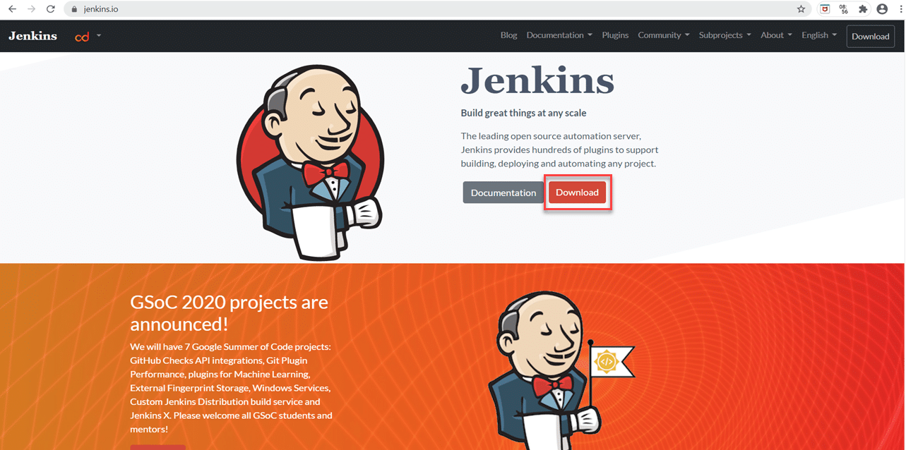
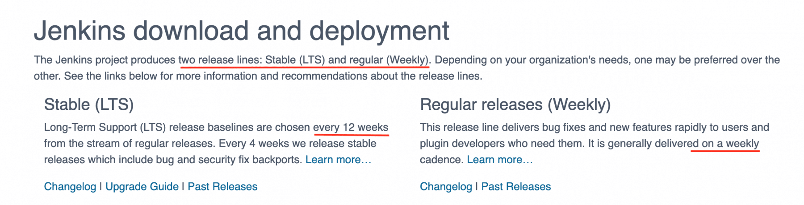
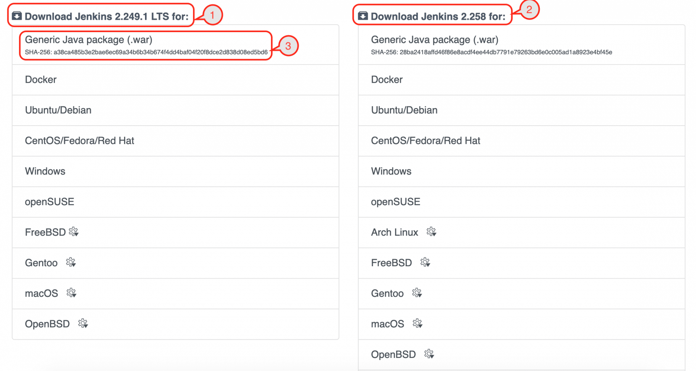

在上一篇关于[Jenkins概述的文章中](https://www.toolsqa.com/jenkins/what-is-jenkins/)，我们讨论了Jenkins的介绍方面。现在，让我们开始Jenkins的实际应用。作为其中的一部分，首先，我们需要根据自己的需要了解Jenkins在不同操作系统上的安装过程。让我们从了解如何安装Jenkins开始我们的旅程吧？通过涵盖以下主题下的详细信息：

-   安装Jenkins的先决条件是什么？
    -   硬件要求
    -   软件要求
-   如何安装Jenkins？
    -   如何在Windows上安装Jenkins？
    -   如何在macOS上安装Jenkins？
    -   如何在Linux上安装Jenkins？

## 安装Jenkins的先决条件是什么？

众所周知，在安装任何工具之前，我们都需要检查一些先决条件。那么，在安装Jenkins之前，我们先来了解一下Jenkins成功安装和使用所需要的前置条件：

### 硬件要求

下表列出了我们计划安装Jenkins的机器上需要具备的最低硬件要求：

| 资源           | 要求                                                 |
| ---------------- | ------------------------------------------------------ |
| 内存       | 256MB                                                  |
| 驱动器空间 | 1GB(如果Jenkins作为Docker容器运行则为10GB) |

但这些是最低要求，当我们在Jenkins上运行多个作业时，这将永远不够，因此通常以下是推荐的最低硬件配置，它可以与小团队一起工作：

| 资源       | 要求 |
| ---------------- | ---------- |
| 内存       | 1GB        |
| 驱动器空间 | 50GB       |

尽管如此，需要指出的是，这些要求对于每个团队来说都是不同的，具体取决于团队的规模、Jenkins的并行用户以及在Jenkins服务器上运行的作业数量。

### 软件要求

下表列出了我们计划安装Jenkins的机器上需要具备的最低软件要求：

|                  |                                                              |
| ---------------- | ------------------------------------------------------------ |
| JAVA       | Java开发工具包(JDK)或Java运行时环境(JRE)。 |
| 网页浏览器 | 任何浏览器，例如Google Chrome、Mozilla Firefox、Microsoft Internet Explorer、Microsoft Edge、Safari。 |
| 操作系统   |Jenkins支持几乎所有现代操作系统，例如Windows、macOS、 Linux系统(例如Red Hat、Ubuntu、OpenSUSE、Gentoo等)。 |

## 如何安装Jenkins？

那么，让我们开始Jenkins的安装过程。请按照以下步骤操作：

第1步：首先，转到[Jenkins官方网站](https://www.jenkins.io/)并单击“Download”按钮。



第2步：其次，点击Download按钮后，我们将被重定向到下载页面。另外，在这里我们可以看到所有下载相关的信息，如下图：



正如我们所见，Jenkins发布了两个版本，一个是稳定版本，另一个是常规的错误修复，每周都会发布。在上面部分的正下方，它列出了所有平台的最新稳定版本(由标记1显示)和最新的修补程序版本(由标记2显示)，如下所示：



第3步：我们将看到Jenkins可用作安装程序的操作系统列表。根据操作系统，我们可以选择相应的选项。在这里，我们将使用通用Java包(.war)文件，这是一个通用文件，可以在所有安装了JAVA的操作系统上设置Jenkins。因此，单击下图中突出显示的通用Java包(.war)链接，然后它将下载文件。


第4步：将这个jenkins.war文件放在你机器的任何目录中，然后打开命令提示符并进入到该目录，输入以下命令：

```shell
Java –jar jenkins.war
```

第5步：输入上述命令后，按回车键。等待一段时间，屏幕大概如下所示，你将看到类似“**Jenkins Initial setup is required. An admin user creation completes and a password generates**“的信息。


复制该密码并将其保存在你机器上的某个位置。另外请注意，这个密码因人而异，而且只需要输入一次。最后，你将看到一条消息，指示“Jenkins is fully up and running”。

注意：在使用Jenkins之前不要关闭此终端窗口，因为我们是从命令行运行Jenkins，如果我们关闭它，该服务将被终止。

但是，如果我们想在后台运行Jenkins服务，请使用以下命令，即使我们关闭终端窗口，该进程也会继续运行。

java –jar Jenkins.war &

第6步： 现在打开浏览器，导航到URL：http://localhost:8080/之后，按回车键，第一次默认会看到如下页面。


第7步： 在这里，我们需要输入我们从上一步复制的密码，然后单击继续按钮。


第8步：单击“继续”按钮后，你将被重定向到建议你安装建议插件的页面。之后，单击“安装建议的插件”。请注意，如果用户只想安装所需的选定插件，建议选择“选择要安装的插件”选项。


第9步： 点击建议插件按钮后，标准插件安装会自动开始，如下图所示：


第10步：最后，在安装所有建议的插件后，你将被重定向到用户帐户页面，如下所示：


这里我们需要做以下事情：

-   输入用户名，你要输入的新密码。
-   输入确认密码、全名、电子邮件地址，然后单击“保存并继续” 按钮。
-   你可以选择“保存并继续”按钮 旁边的“跳过并以管理员身份继续”选项，在这种情况下，你需要输入与之前步骤相同的密码。始终建议你根据自己的选择输入新密码。

第11步： 单击“保存并继续按钮”后，你将被重定向到实例配置屏幕。在这里单击“保存并完成按钮”。


第12步： 点击后，你将被重定向到一个新屏幕，该屏幕将显示一条消息，如“Jenkins 已准备就绪”。现在单击“开始使用 Jenkins” 按钮。


第13步： 单击“开始使用 Jenkins”按钮后，你将被重定向到Jenkins仪表板。


好了，至此我们成功安装了 Jenkins。上面介绍如何安装Jenkins的方法对所有平台/操作系统都是通用的。因此，无论我们计划安装和设置Jenkins的操作系统是什么，我们都可以下载 war 文件并运行它来启动和运行Jenkins。

除了这种通用的方式，Jenkins 还提供了针对特定操作系统的安装程序，它只能在特定的操作系统上安装 Jenkins。让我们看看其中的一些，我们如何使用它们在特定平台/操作系统上安装Jenkins

### 如何在Windows上安装Jenkins？

正如我们上面提到的，Jenkins还提供特定于操作系统的安装程序。要在Windows上安装Jenkins ，请按照以下步骤操作：

1.  首先，导航到[Jenkins 下载页面。](https://www.jenkins.io/download/)
2.  其次，单击链接下载Jenkinsfor Windows，如下所示：


1.  第三，单击 Windows 链接将下载Jenkins的“msi”安装程序，如下所示：


1.  第四，双击安装程序，开始安装Jenkins；它将显示第一个屏幕，如下所示：


1.  第五，点击“Next” 按钮开始安装，指定Jenkins的安装路径，如下图：


1.  之后，单击“下一步”按钮并指定登录类型。由于我们在本地机器上安装，我们选择了“以 LocalSyste 身份运行服务”选项。此外，如果你想使用组织凭据运行 Jenkins，你可以指定/提及域用户名和密码：


1.  第七，单击“下一步”按钮并指定Jenkins将运行的端口：


1.  之后，单击“测试端口”按钮以验证指定端口是否在你的计算机上可用。因此，如果端口空闲，它将显示一个绿色勾号，如下所示：


1.  第九，单击“下一步”按钮将检查你机器上的“JAVA” ，如果所需版本在你的机器上不可用，将要求安装“JDK” ：


1.  单击“Next”按钮并选择其他需要安装Jenkins的服务：


1.  单击“安装”按钮开始安装 Jenkins：


1.  另外，点击“安装”按钮会出现安装进度条，如下图：


1.  安装完成后，点击“完成”按钮完成安装：


1. Jenkins将作为“Windows 服务”安装。你可以通过浏览“服务”部分来验证相同的内容，如下所示：


1.  因此，一旦安装完成并且Jenkins将启动并运行，当你浏览链接“http://localhost:8080”时，它将显示初始屏幕，如下所示：


从这里开始，你可以按照我们在使用war文件安装Jenkins时所做的相同步骤进行操作。

### 如何在 macOS 上安装 Jenkins？

在macOS 上，除了使用“war”文件的通用方式安装和运行Jenkins之外，我们还可以使用[包管理器 brew 安装 Jenkins。](https://brew.sh/)按照下面提到的步骤在macOS上安装Jenkins ：

1.  首先，导航到[Jenkins 下载页面。](https://www.jenkins.io/download/)
2.  其次，单击链接下载适用于macOS 的 Jenkins，如下所示：


1.  第三，它会列出安装Jenkins所需的所有brew命令，如下所示：


1.  因此，要在macOS上安装 Jenkins，请在终端上执行以下命令：

brew 安装 jenkins-lts

1.  第五，执行上面的命令会显示输出，如下图：


1.  第六，安装完成后，你可以通过键入以下命令将Jenkins作为服务启动：

>brew 服务启动 jenkins-lts

1.  之后，它将启动Jenkins作为服务并显示输出，如下所示：


1.  安装完成后，当你浏览“http://localhost:8080”链接时，Jenkins 将启动并运行，它将显示初始屏幕，如下所示：


从这里开始，你可以按照我们在使用 war 文件安装Jenkins时所做的相同步骤进行操作。

### 如何在Linux上安装Jenkins？

在Linux上的安装取决于你使用的Linux版本。根据Linux的类型，你可以使用[wget包管理器](https://www.gnu.org/software/wget/)来下载Jenkins，步骤如下：

1.  首先，导航到[Jenkins下载页面。](https://www.jenkins.io/download/)
2.  其次，根据风格(例如Ubuntu、Centos等)，单击链接下载适用于Linus的Jenkins，如下所示：


1.  第三，假设我们点击Ubuntu选项，它会列出所有安装Jenkins的命令，如下图：


1.  第四，在终端一一 输入上述命令，如下 ：sudo apt-key 添加 -

//在 /etc/apt/sources.list 中添加以下条目： deb https://pkg.jenkins.io/debian-stable binary/

// 更新本地包 sudo apt-get update

// 安装Jenkinssudo apt-get install jenkins

1.  最后，安装完成后，当你浏览“http://localhost:8080”链接时，Jenkins 将启动并运行。

此外，我们可以使用在所有平台上运行“war”文件的通用方式，或者根据平台/操作系统的选择使用相应的安装程序来成功安装 Jenkins。

## 要点：

-   在安装Jenkins之前，请检查以上部分中提到的硬件和软件要求。
-   此外，在Jenkins的下载页面，下载 Jenkins.war 文件，我们可以使用这个 WAR 文件在任何操作系统上运行 Jenkins。
-   最后，如果我们要下载特定操作系统的安装程序，我们需要进入Jenkins的下载页面，然后根据你的操作系统下载并安装相应的安装程序。