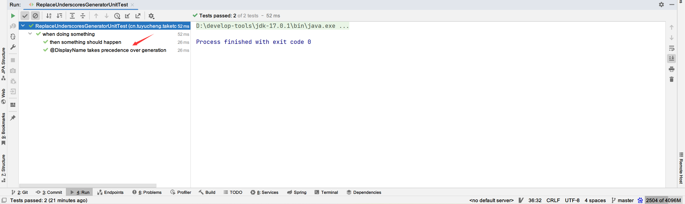
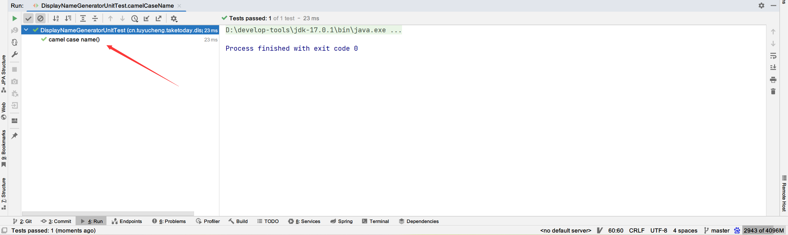
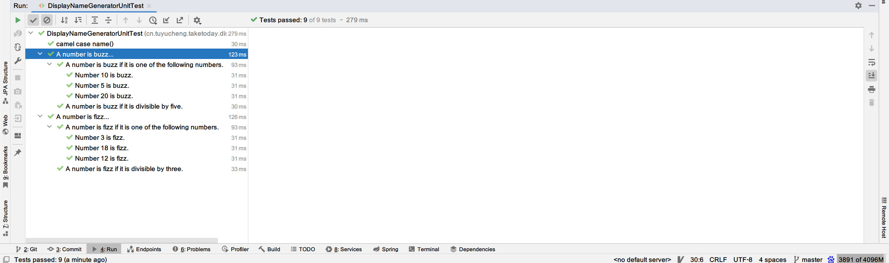

## 1. 概述

JUnit 5很好地支持自定义测试类和测试方法的名称。在本文中，我们介绍如何通过@DisplayNameGeneration注解使用JUnit 5自定义显示名称生成器。

## 2. 显示名称生成器

**我们可以通过@DisplayNameGeneration注解配置自定义显示名称生成器。
不过，值得注意的是，@DisplayName注解始终优先于任何显示名称生成器。**

首先，JUnit 5提供了一个DisplayNameGenerator.ReplaceUnderscores类，该类将名称中的任何下划线替换为空格。让我们看一个例子：

```java

@DisplayNameGeneration(DisplayNameGenerator.ReplaceUnderscores.class)
class ReplaceUnderscoresGeneratorUnitTest {

    @Nested
    class when_doing_something {

        @Test
        void then_something_should_happen() {

        }

        @Test
        @DisplayName("@DisplayName takes precedence over generation")
        void override_generator() {

        }
    }
}
```

当我们运行测试时，我们可以看到测试的名称更具可读性：



## 3. 自定义名称生成器

为了实现自定义名称生成器，我们必须**编写一个类来实现DisplayNameGenerator接口中的方法**。该接口包含用于生成类，嵌套测试类和方法名称的方法。

### 3.1 驼峰规范

让我们从一个简单的名称生成器开始，它用更可读的句子替换驼峰大小写名称。首先，我们可以继承DisplayNameGenerator.Standard：

```java
static class ReplaceCamelCase extends DisplayNameGenerator.Standard {

    @Override
    public String generateDisplayNameForClass(Class<?> testClass) {
        return replaceCamelCase(super.generateDisplayNameForClass(testClass));
    }

    @Override
    public String generateDisplayNameForNestedClass(Class<?> nestedClass) {
        return replaceCamelCase(super.generateDisplayNameForNestedClass(nestedClass));
    }

    @Override
    public String generateDisplayNameForMethod(Class<?> testClass, Method testMethod) {
        return this.replaceCamelCase(testMethod.getName()) + DisplayNameGenerator.parameterTypesAsString(testMethod);
    }

    String replaceCamelCase(String camelCase) {
        StringBuilder result = new StringBuilder();
        result.append(camelCase.charAt(0));
        for (int i = 1; i < camelCase.length(); i++) {
            if (Character.isUpperCase(camelCase.charAt(i))) {
                result.append(' ');
                result.append(Character.toLowerCase(camelCase.charAt(i)));
            } else {
                result.append(camelCase.charAt(i));
            }
        }
        return result.toString();
    }
}
```

在上面的示例中，我们可以看到生成显示名称不同部分的方法。

让我们为我们的生成器编写一个测试：

```java

@DisplayNameGeneration(DisplayNameGeneratorUnitTest.ReplaceCamelCase.class)
class DisplayNameGeneratorUnitTest {

    @Test
    void camelCaseName() {
    }
}
```

在运行测试时，我们可以看到驼峰大小写已被更直观的名称替换：



### 3.2 创意命名

到目前为止，我们介绍了非常简单的用例。我们还可以让生成的名称变得更有创意：

```java
static class IndicativeSentences extends ReplaceCamelCase {

    @Override
    public String generateDisplayNameForNestedClass(Class<?> nestedClass) {
        return super.generateDisplayNameForNestedClass(nestedClass) + "...";
    }

    @Override
    public String generateDisplayNameForMethod(Class<?> testClass, Method testMethod) {
        return replaceCamelCase(testClass.getSimpleName() + " " + testMethod.getName()) + ".";
    }
}
```

**这里的想法是从嵌套类和测试方法中创建显示名**。换句话说，嵌套测试类名将添加到测试方法名称之前：

```java
class DisplayNameGeneratorUnitTest {

    @Nested
    @DisplayNameGeneration(IndicativeSentences.class)
    class ANumberIsFizzTest {
        @Test
        void ifItIsDivisibleByThree() {

        }

        @ParameterizedTest(name = "Number {0} is fizz.")
        @ValueSource(ints = {3, 12, 18})
        void ifItIsOneOfTheFollowingNumbers(int number) {

        }
    }

    @Nested
    @DisplayNameGeneration(IndicativeSentences.class)
    class ANumberIsBuzzTest {
        @Test
        void ifItIsDivisibleByFive() {

        }

        @ParameterizedTest(name = "Number {0} is buzz.")
        @ValueSource(ints = {5, 10, 20})
        void ifItIsOneOfTheFollowingNumbers(int number) {
        }
    }
}
```

这个例子中，我们使用嵌套类作为测试方法的上下文：



如我们所见，生成器将嵌套类和测试方法名称组合在一起。

## 4. 总结

在本教程中，我们了解了如何使用@DisplayNameGeneration注解为我们的测试生成显示名称。
此外，我们编写了自己的DisplayNameGenerator来自定义显示名称生成器。