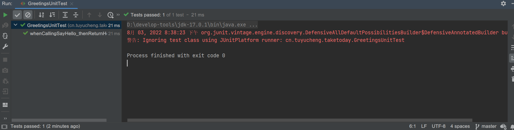

## 1. 概述

在本教程中，我们介绍如何在JUnit 5框架中使用@RunWith注解。

在JUnit 5中，@RunWith注解已被更强大的@ExtendWith注解所取代。

但是，为了兼容性，在JUnit 5中仍然可以使用@RunWith注解。

## 2. 使用基于JUnit 4的Runner运行测试

我们可以使用@RunWith注解在任何较老的JUnit版本环境中运行JUnit 5测试。

首先，让我们创建我们要测试的类：

```java
public class Greetings {

    public static String sayHello() {
        return "Hello";
    }
}
```

然后我们创建这个类的JUnit 5测试类：

```java
class GreetingsUnitTest {

    @Test
    void whenCallingSayHello_thenReturnHello() {
        assertEquals("Hello", Greetings.sayHello());
    }
}
```

最后，让我们添加以下注解，以便我们能够运行测试：

```java

@RunWith(JUnitPlatform.class)
public class GreetingsUnitTest {
    // ...
}
```

JUnitPlatform类是一个基于JUnit 4的Runner，它允许我们在JUnit Platform上运行JUnit 4测试。

**记住，JUnit 4并不支持新JUnit Platform的所有功能，因此该runner的功能有限**。

如果我们在IDEA中观察测试结果，我们可以看到使用了JUnit 4 runner：



## 3. 在JUnit 5环境中运行测试

现在让我们在支持JUnit 5的版本中运行相同的测试。在这种情况下，我们不再需要@RunWith注解，我们可以在没有runner的情况下编写测试：

```java
class GreetingsUnitTest {

    @Test
    void whenCallingSayHello_thenReturnHello() {
        assertEquals("Hello", Greetings.sayHello());
    }
}
```

## 4. 从基于JUnit 4的runner迁移

现在让我们将使用基于JUnit 4的runner的测试迁移到JUnit 5。

我们以Spring测试为例：

```java

package cn.tuyucheng.taketoday.junit.spring;

import cn.tuyucheng.taketoday.junit5.Greetings;
import org.junit.Test;
import org.junit.runner.RunWith;
import org.springframework.test.context.ContextConfiguration;
import org.springframework.test.context.junit4.SpringJUnit4ClassRunner;

import static org.junit.jupiter.api.Assertions.assertEquals;

@RunWith(SpringJUnit4ClassRunner.class)
@ContextConfiguration(classes = {SpringTestConfiguration.class})
public class GreetingsSpringUnitTest {

    @Test
    public void whenCallingSayHello_thenReturnHello() {
        assertEquals("Hello", Greetings.sayHello());
    }
}
```

**如果我们想将此测试迁移到JUnit 5，我们需要用新的@ExtendWith替换@RunWith注解**：

```java

package cn.tuyucheng.taketoday.junit.spring;

import cn.tuyucheng.taketoday.junit5.Greetings;
import org.junit.Test;
import org.junit.jupiter.api.extension.ExtendWith;
import org.springframework.test.context.ContextConfiguration;
import org.springframework.test.context.junit.jupiter.SpringExtension;

import static org.junit.jupiter.api.Assertions.assertEquals;

@ExtendWith(SpringExtension.class)
@ContextConfiguration(classes = {SpringTestConfiguration.class})
class GreetingsSpringUnitTest {

    @Test
    void whenCallingSayHello_thenReturnHello() {
        assertEquals("Hello", Greetings.sayHello());
    }
}
```

SpringExtension类由Spring 5提供，并将Spring TestContext Framework集成到JUnit 5中。
@ExtendWith注解接收任何实现Extension接口的类。

## 5. 总结

在这篇简短的文章中，我们介绍了JUnit 4的@RunWith注解在JUnit5框架中的使用。