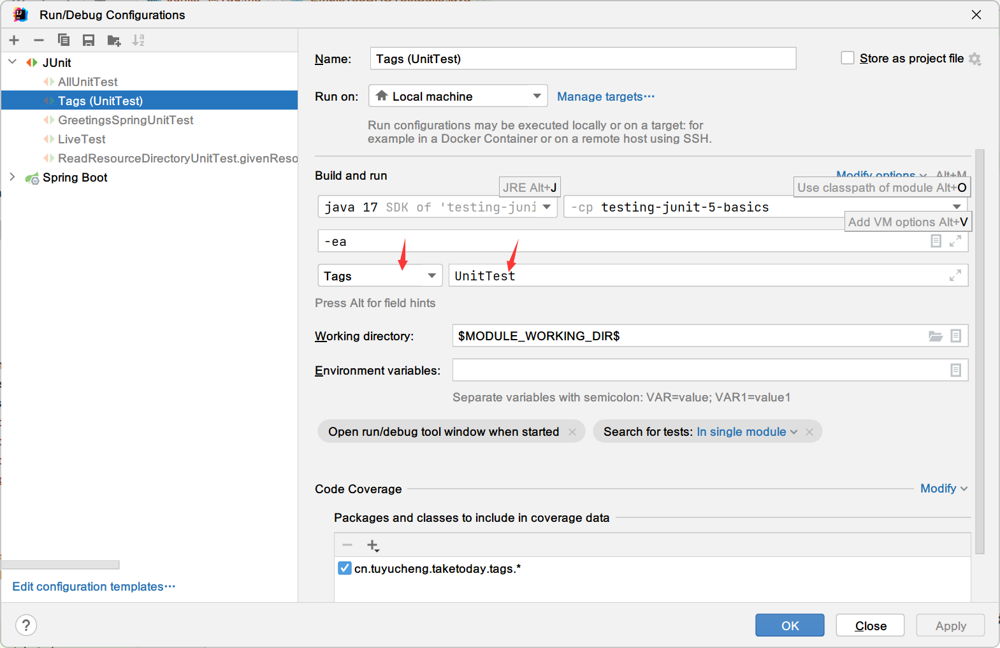

## 1. 概述

作为使用Maven的CI构建的一部分，自动执行所有JUnit测试是很常见的。然而，这通常是耗时的。

**因此，我们通常希望过滤测试，并在构建过程的各个阶段执行单元测试或集成测试，或者两者都执行**。

在本教程中，我们将介绍JUnit 5测试用例的一些过滤技术。在接下来的部分中，我们还将研究JUnit 5之前的各种过滤机制。

## 2. Junit 5 Tags

### 2.1 用@Tag标注Junit测试

使用JUnit 5，我们可以通过在唯一的标签名称下标记测试的子集来过滤测试。
例如，假设我们使用JUnit 5实现了单元测试和集成测试。我们可以在两组测试用例上添加标签：

```java

@ExtendWith(SpringExtension.class)
@ContextConfiguration(classes = {SpringJdbcConfig.class}, loader = AnnotationConfigContextLoader.class)
@DirtiesContext(classMode = ClassMode.BEFORE_EACH_TEST_METHOD)
class EmployeeDAOIntegrationTest {

    @Autowired
    private EmployeeDAO employeeDao;

    @Mock
    private JdbcTemplate jdbcTemplate;
    private EmployeeDAO employeeDAO;

    @BeforeEach
    void setup() {
        MockitoAnnotations.openMocks(this);
        employeeDAO = new EmployeeDAO();
        employeeDAO.setJdbcTemplate(jdbcTemplate);
    }

    @Test
    @Tag("IntegrationTest")
    void testAddEmployeeUsingSimpleJdbcInsert() {
        final Employee emp = new Employee();
        emp.setId(12);
        emp.setFirstName("testFirstName");
        emp.setLastName("testLastName");
        emp.setAddress("testAddress");

        assertEquals(employeeDao.addEmployeeUsingSimpleJdbcInsert(emp), 1);
    }

    @Test
    @Tag("UnitTest")
    void givenNumberOfEmployeeWhenCountEmployeeThenCountMatch() {
        // given
        Mockito.when(jdbcTemplate.queryForObject(Mockito.any(String.class), Mockito.eq(Integer.class))).thenReturn(1);

        // when
        int countOfEmployees = employeeDAO.getCountOfEmployees();

        // then
        assertEquals(1, countOfEmployees);
    }
}
```

**此后，我们可以单独执行特定标签下的所有测试**。我们还可以标记类而不是方法。从而在一个标签下包含一个类中的所有测试。

在接下来的几节中，我们将介绍过滤和执行标签的JUnit测试的各种方法。

### 2.2 使用测试套件过滤标签

JUnit 5允许我们实现测试套件，通过它我们可以执行标签的测试用例：

```java

@SelectPackages("cn.tuyucheng.taketoday.tags")
@IncludeTags("UnitTest")
public class EmployeeDAOSuiteTest {

}
```

**如果我们运行这个套件，将执行标签UnitTest下的所有JUnit测试**。同样，我们可以使用ExcludeTags注解排除测试。

### 2.2 使用Maven Surefire插件过滤标签

为了在Maven构建的各个阶段过滤JUnit测试，我们可以使用Maven Surefire插件。Surefire插件允许我们在插件配置中包含或排除标签：

```xml

<plugin>
    <artifactId>maven-surefire-plugin</artifactId>
    <version>2.22.2</version>
    <configuration>
        <groups>UnitTest</groups>
    </configuration>
</plugin>
```

如果我们现在执行这个插件，它将执行所有标记为UnitTest的测试。同样，我们可以排除标签名下的测试用例：

```xml

<excludedGroups>IntegrationTest</excludedGroups>
```

### 2.3 使用IDEA过滤Tags

IDEA允许按标签名过滤JUnit测试。这样我们就可以直接从我们的IDEA执行一组特定的标记测试。

IntelliJ允许通过自定义Run/Debug配置进行此类过滤：



如上图所示，我们选择使用Tags来执行测试，并在标签表达式中选择了要执行的标签。

JUnit 5允许使用各种标签表达式来过滤标签。
**例如，要运行除集成测试之外的所有内容，我们可以使用!IntegrationTest作为标签表达式**。
或者为了同时执行UnitTest和IntegrationTest，我们可以使用UnitTest|IntegrationTest。

## 3. Junit 4 Categories

### 3.1 Junit 4测试分类

JUnit 4允许我们通过将它们添加到不同的类别来执行JUnit测试的子集。因此，我们可以执行特定类别的测试用例，同时排除其他类别。

**我们可以通过实现标记接口来创建尽可能多的类别，其中标记接口的名称代表类别的名称**。对于我们的示例，我们将实现两个类别，UnitTest：

```java
public interface UnitTest {

}
```

和IntegrationTest：

```java
public interface IntegrationTest {

}
```

现在，我们可以通过使用@Category注解来对JUnit 4的测试进行分类：

```java

@RunWith(SpringJUnit4ClassRunner.class)
@ContextConfiguration(classes = {SpringJdbcConfig.class}, loader = AnnotationConfigContextLoader.class)
public class EmployeeDAOCategoryIntegrationTest {

    @Autowired
    private EmployeeDAO employeeDao;

    @Mock
    private JdbcTemplate jdbcTemplate;
    private EmployeeDAO employeeDAO;

    @Before
    public void setup() {
        MockitoAnnotations.openMocks(this);
        employeeDAO = new EmployeeDAO();
        employeeDAO.setJdbcTemplate(jdbcTemplate);
    }

    @Test
    @Category(IntegrationTest.class)
    public void testAddEmployeeUsingSimpleJdbcInsert() {
        final Employee emp = new Employee();
        emp.setId(12);
        emp.setFirstName("testFirstName");
        emp.setLastName("testLastName");
        emp.setAddress("testAddress");

        Assert.assertEquals(employeeDao.addEmployeeUsingSimpleJdbcInsert(emp), 1);
    }

    @Test
    @Category(UnitTest.class)
    public void givenNumberOfEmployeeWhenCountEmployeeThenCountMatch() {
        // given
        Mockito.when(jdbcTemplate.queryForObject(Mockito.any(String.class), Mockito.eq(Integer.class))).thenReturn(1);

        // when
        int countOfEmployees = employeeDAO.getCountOfEmployees();

        // then
        assertThat(countOfEmployees, CoreMatchers.is(1));
    }
}
```

在我们的示例中，我们将@Category注解放在测试方法上。同样，我们也可以在测试类上添加这个注解，从而将该类中的所有测试方法归为一个分类。

### 3.2 Categories Runner

为了执行一个分类中的JUnit测试，我们需要实现一个测试套件类：

```java

@RunWith(Categories.class)
@IncludeCategory(UnitTest.class)
@SuiteClasses(EmployeeDAOCategoryIntegrationTest.class)
public class EmployeeDAOUnitTestSuite {

}
```

该测试套件可以从IDE中执行，并将执行UnitTest类别下的所有JUnit测试。同样，我们也可以在套件中排除一类测试：

```java

@RunWith(Categories.class)
@ExcludeCategory(IntegrationTest.class)
@SuiteClasses(EmployeeDAOCategoryIntegrationTest.class)
public class EmployeeDAOUnitTestSuite {

}
```

### 3.3 在maven中排除或包含类别

最后，我们还可以在Maven中包含或排除JUnit测试的类别。因此，我们可以在不同的Maven profile中执行不同类别的JUnit测试。

我们将为此使用Maven Surefire插件：

```xml

<plugin>
    <artifactId>maven-surefire-plugin</artifactId>
    <version>2.22.2</version>
    <configuration>
        <groups>cn.tuyucheng.taketoday.categories.UnitTest</groups>
    </configuration>
</plugin>
```

同样，我们可以从Maven构建中排除一个分类：

```xml

<plugin>
    <artifactId>maven-surefire-plugin</artifactId>
    <version>2.22.2</version>
    <configuration>
        <excludedGroups>cn.tuyucheng.taketoday.categories.IntegrationTest</excludedGroups>
    </configuration>
</plugin>
```

**这类似于我们在上一节介绍的标签。唯一的区别是我们将标签名称替换为Category实现的完全限定名称**。

## 4. 使用Maven Surefire插件过滤JUnit测试

我们上面讨论的两种方法都是用JUnit库实现的。过滤测试用例的一种与实现无关的方法是遵循命名约定。
对于我们的示例，我们将使用UnitTest作为单元测试的类名后缀，使用IntegrationTest作为集成测试的类名后缀。

现在我们将使用Maven Surefire插件来执行单元测试或集成测试：

```xml

<plugin>
    <artifactId>maven-surefire-plugin</artifactId>
    <version>2.22.2</version>
    <configuration>
        <excludes>
            **/*IntegrationTest.java
        </excludes>
    </configuration>
</plugin>
```

**这里的excludes标签过滤所有集成测试并仅执行单元测试**。这样的配置将节省大量的构建时间。

此外，我们可以在具有不同排除或包含的各种Maven profile中执行Surefire插件。

**虽然Surefire非常适合用于过滤测试，但建议使用Failsafe插件在Maven中执行集成测试**。

## 5. 总结

在本文中，我们介绍了一种使用JUnit 5标记和过滤测试用例的方法。
**我们使用了@Tag注解，还介绍了通过IDEA或在使用Maven的构建过程中过滤具有特定标签的JUnit测试的各种方法**。

同时还演示了JUnit 5之前的一些过滤机制。