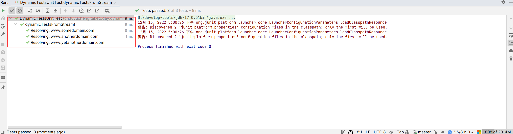
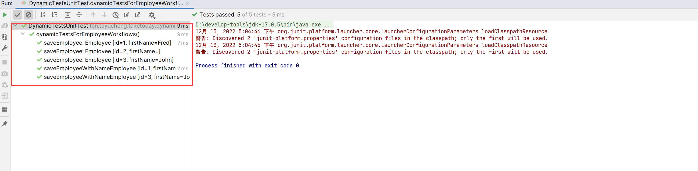

## 1. 概述

动态测试是JUnit 5中引入的一种新的编程模型。在本文中，我们将了解什么是动态测试以及如何创建它们。

## 2. 什么是动态测试

带有@Test注解的标准测试是在编译时完全指定的静态测试，**动态测试是在运行时生成的测试**，这些测试由带有@TestFactory注解的工厂方法生成。

使用@TestFactory注解标注的方法必须返回DynamicTest实例的Stream、Collection、Iterable或Iterator形式。返回任何其他内容都会导致JUnitException，因为在编译时无法检测到无效的返回类型。除此之外，使用@TestFactory标注的方法不能是静态的或私有的。

**动态测试的执行方式与标准测试方法不同，并且不支持生命周期回调，这意味着不会为动态测试调用@BeforeEach和@AfterEach方法**。

## 3. 创建动态测试

首先，让我们看看创建动态测试的不同方法。下面这个例子本质上不是动态的，但它们将为创建真正动态的示例提供一个良好的起点。

我们首先创建一个DynamicTest集合：

```java
class DynamicTestsUnitTest {

    @TestFactory
    Collection<DynamicTest> dynamicTestsWithCollections() {
        return List.of(
                DynamicTest.dynamicTest("Add test", () -> assertEquals(2, Math.addExact(1, 1))),
                DynamicTest.dynamicTest("Multiply test", () -> assertEquals(4, Math.multiplyExact(2, 2))));
    }
}
```

@TestFactory注解告诉JUnit这是一个用于创建动态测试的工厂方法。正如我们所看到的，我们只是返回一个DynamicTest的集合，**每个DynamicTest由两部分组成：测试名称，以及一个Executable对象**。

输出将包含我们传递给DynamicTest的显示名称：

```shell
Add test(dynamicTestsWithCollection())
Multiply Test(dynamicTestsWithCollection())
```

我们也可以修改上面的例子，以返回不同的容器类型：

```java
@TestFactory
Iterable<DynamicTest> dynamicTestsWithIterable() {
    return Arrays.asList(
            DynamicTest.dynamicTest("Add test", () -> assertEquals(2, Math.addExact(1, 1))),
            DynamicTest.dynamicTest("Multiply Test", () -> assertEquals(4, Math.multiplyExact(2, 2))));
}

@TestFactory
Iterator<DynamicTest> dynamicTestsWithIterator() {
    return Arrays.asList(
            DynamicTest.dynamicTest("Add test", () -> assertEquals(2, Math.addExact(1, 1))),
            DynamicTest.dynamicTest("Multiply Test", () -> assertEquals(4, Math.multiplyExact(2, 2)))
    ).iterator();
}

@TestFactory
Stream<DynamicTest> dynamicTestFromIntStream() {
    return IntStream.iterate(0, n -> n + 2).limit(10)
            .mapToObj(n -> DynamicTest.dynamicTest("test" + n, () -> assertEquals(0, n % 2)));
}
```

请注意，如果@TestFactory方法返回一个Stream，那么一旦所有测试执行完毕，它将自动关闭。

输出与第一个案例几乎相同，它包含我们传递给DynamicTest的显示名称。

## 4. 创建DynamicTest流

出于演示目的，我们编写一个DomainNameResolver类，它根据我们传递的域名返回一个对应的IP地址。

为了简单起见，让我们看一下测试工厂方法的结构：

```java
class DynamicTestsUnitTest {

    @TestFactory
    Stream<DynamicTest> dynamicTestsFromStream() {
        // sample input and output
        List<String> inputList = Arrays.asList("www.somedomain.com", "www.anotherdomain.com", "www.yetanotherdomain.com");
        List<String> outputList = Arrays.asList("154.174.10.56", "211.152.104.132", "178.144.120.156");

        // input generator that generates inputs using inputList
        /*...code here...*/

        // a display name generator that creates a different name based on the input
        /*...code here...*/

        // the test executor, which actually has the logic to execute the test case
        /*...code here...*/

        // combine everything and return a Stream of DynamicTest
        /*...code here...*/
    }

    private static class DomainNameResolver {
        private final Map<String, String> ipByDomainName = new HashMap<>();

        DomainNameResolver() {
            this.ipByDomainName.put("www.somedomain.com", "154.174.10.56");
            this.ipByDomainName.put("www.anotherdomain.com", "211.152.104.132");
            this.ipByDomainName.put("www.yetanotherdomain.com", "178.144.120.156");
        }

        public String resolveDomain(String domainName) {
            return ipByDomainName.get(domainName);
        }
    }
}
```

除了我们已经知道的@TestFactory注解之外，这里没有太多与DynamicTest相关的代码。

这两个ArrayList将分别用作DomainNameResolver的输入和对应的预期输出。

现在让我们看一下输入生成器：

```java
Iterator<String> inputGenerator = inputList.iterator();
```

输入生成器只不过是String类型的迭代器，它使用我们的inputList并逐个返回域名。

显示名称生成器相当简单：

```java
Function<String, String> displayNameGenerator = (input) -> "Resolving: " + input;
```

显示名称生成器的任务只是为了在Intellij IDEA中运行测试时在运行窗口中显示测试名称。

在这里，我们只是根据域名为每个测试生成唯一的名称。我们并不需要创建唯一的名称，但如果出现任何测试失败，它会有所帮助。这样，我们就可以知道测试用例失败的域名。

**现在让我们看看测试的核心部分-测试执行代码**：

```java
DomainNameResolver resolver = new DomainNameResolver();
ThrowingConsumer<String> testExecutor = (input) -> {
    int id = inputList.indexOf(input);
    assertEquals(outputList.get(id), resolver.resolveDomain(input));
};
```

我们使用了ThrowingConsumer，它是一个用于编写测试用例的函数式接口。对于inputGenerator生成的每个输入，我们从outputList中获取相应的预期输出，并从DomainNameResolver实例中获取实际输出。

最后我们需要做的只是将以上这些步骤组合起来并作为DynamicTest流返回：

```java
return DynamicTest.stream(inputGenerator, displayNameGenerator, testExecutor);
```

于是，当我们运行测试时，IDEA会显示根据我们的名称生成器生成的测试名：



## 5. 使用Java 8优化

通过使用Java 8的新特性，可以极大地改进上一节中编写的测试工厂方法，生成的代码可以更加简洁、优雅：

```java
@TestFactory
Stream<DynamicTest> dynamicTestsFromStreamInJava8() {
    DomainNameResolver resolver = new DomainNameResolver();

    List<String> inputList = Arrays.asList("www.somedomain.com", "www.anotherdomain.com", "www.yetanotherdomain.com");
    List<String> outputList = Arrays.asList("154.174.10.56", "211.152.104.132", "178.144.120.156");
	
    return inputList.stream().map(domain -> DynamicTest.dynamicTest("Resolving: " + domain, () -> {
        int id = inputList.indexOf(domain);
		
        assertEquals(outputList.get(id), resolver.resolveDomain(domain));
    }));
}
```

inputList.stream().map()提供输入流(输入生成器)，dynamicTest()的第一个参数是我们的显示名称生成器("Resolving: " + domain)，而第二个参数lambda是我们的测试执行器。最后的输出结果与上一小节完全相同。

## 6. 附加示例

在本例中，我们进一步探索动态测试的功能，以根据测试用例过滤输入：

```java
public class Employee {
    private long id;
    private String firstName;
    // getters setters and constructors ...
}
```

```java
public class EmployeeDao {

    public Employee save(long id) {
        return new Employee(id);
    }

    public Employee save(long id, String firstName) {
        return new Employee(id, firstName);
    }

    public Employee update(Employee employee) {
        return employee;
    }
}
```

```java
class DynamicTestsUnitTest {

    @TestFactory
    Stream<DynamicTest> dynamicTestsForEmployeeWorkflows() {
        List<Employee> inputList = Arrays.asList(
                new Employee(1, "Fred"),
                new Employee(2),
                new Employee(3, "John")
        );
        EmployeeDao employeeDao = new EmployeeDao();

        Stream<DynamicTest> saveEmployeeStream = inputList.stream()
                .map(employee -> DynamicTest.dynamicTest("saveEmployee: " + employee, () -> {
                    Employee returned = employeeDao.save(employee.getId());
                    assertEquals(returned.getId(), employee.getId());
                }));

        Stream<DynamicTest> saveEmployeeWithFirstNameStream = inputList.stream()
                .filter(employee -> !employee.getFirstName().isEmpty())
                .map(employee -> DynamicTest.dynamicTest("saveEmployeeWithName: " + employee, () -> {
                    Employee returned = employeeDao.save(employee.getId(), employee.getFirstName());
                    assertEquals(returned.getId(), employee.getId());
                    assertEquals(returned.getFirstName(), employee.getFirstName());
                }));
        return Stream.concat(saveEmployeeStream, saveEmployeeWithFirstNameStream);
    }
}
```

save(long id)方法只需要employeeId参数，因此，saveEmployeeStream会为所有Employee实例生成测试。而save(long id, String firstName)方法需要firstName和employeeId。因此，它会过滤掉firstName为null的Employee实例。

最后，我们使用Stream.concat()合并两个流并将所有测试作为单个流返回。

现在，让我们看看运行结果：



## 7. 总结

本文中的许多例子也可以使用参数化测试实现，但是，**动态测试与参数化测试不同，因为动态测试不支持完整的测试生命周期，而参数化测试则支持**。

此外，动态测试在如何生成输入以及如何执行测试方面提供了更大的灵活性。

JUnit 5更倾向扩展而不是特性原则。因此，动态测试的主要目的是为第三方框架或扩展提供一个扩展点。