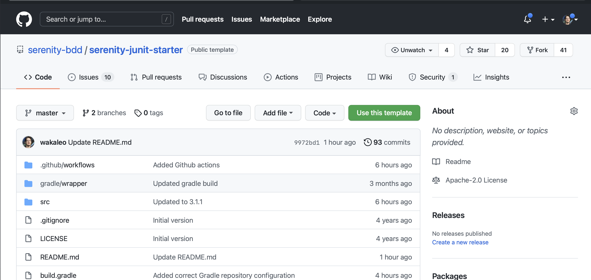
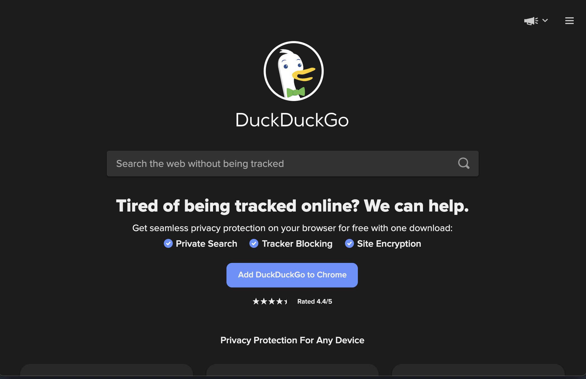
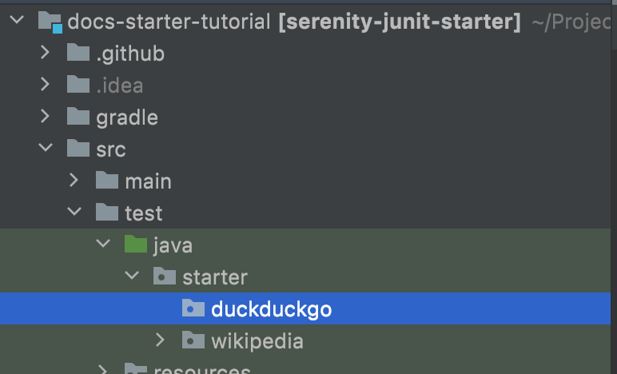
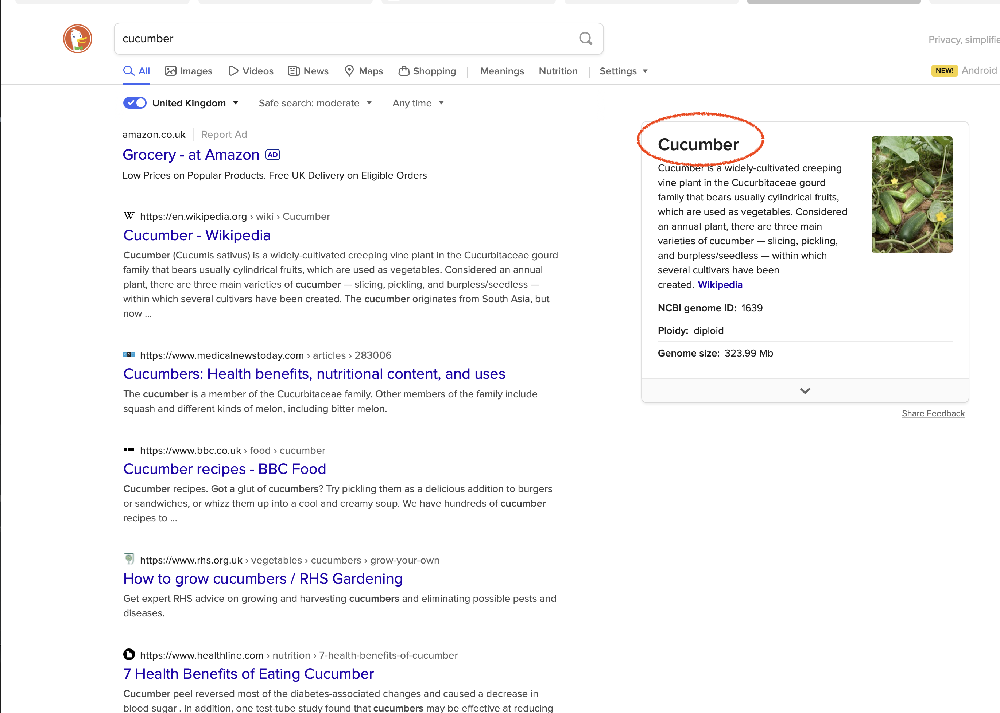
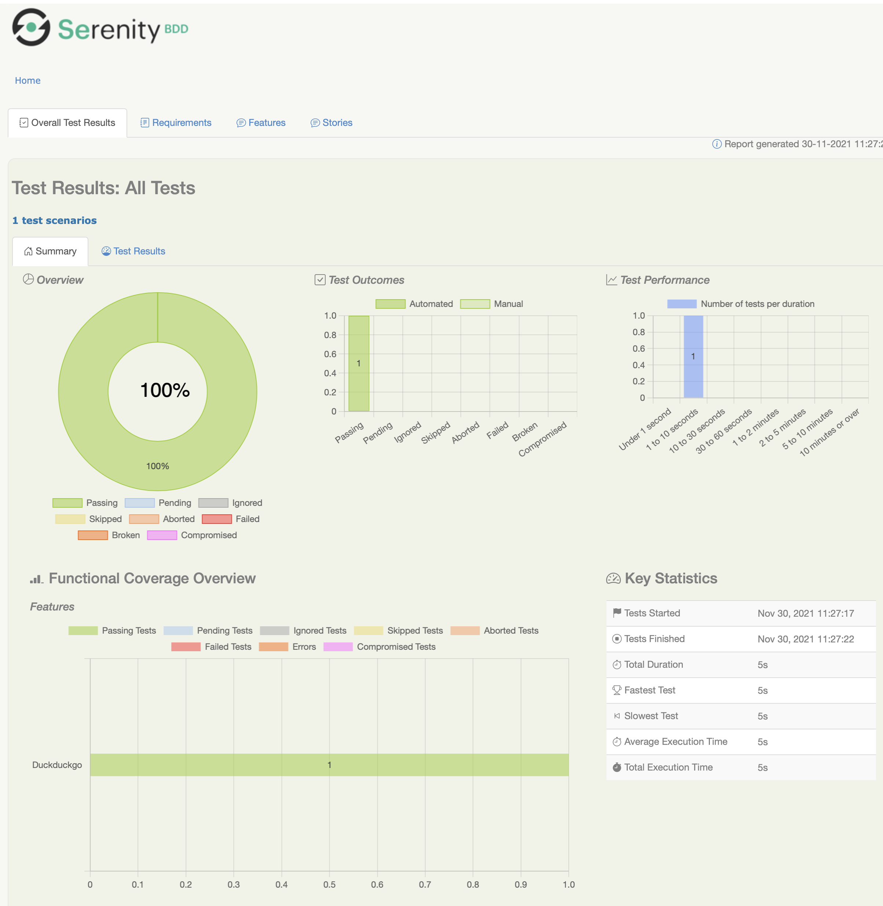
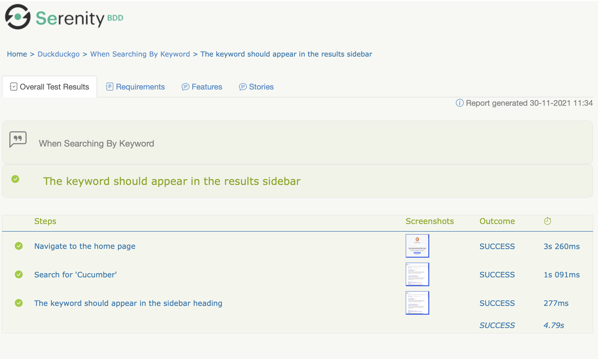

## 1. 你的第一次网络测试

在本教程中，你将使用JUnit 5和Selenium编写你的第一个Serenity BDD测试。我们将从简单开始，然后探索使Serenity BDD变得特别的一些功能。让我们开始吧！

## 2. 先决条件

要运行本教程，你需要在计算机上安装一些东西：

- **Java**：Serenity BDD是一个Java库，因此你需要安装最新的JDK。JDK 1.8或更高版本应该没问题。
- **Java IDE**：你还需要一个Java开发环境，例如IntelliJ或Eclipse(以及Java的应用知识)。
- **Git**：我们将在Github上使用一个入门项目，该项目的示例代码也位于Github上，因此我假设你对Git有基本的了解。

## 3. 创建你的第一个Serenity BDD项目

我们将使用**[带有JUnit和Screenplay](https://github.com/serenity-bdd/serenity-junit-screenplay-starter)**模板项目的Serenity BDD来快速启动和运行一个简单的项目。

> NOTE：我们将在本教程中使用相当传统的测试自动化样式，使用动作类和页面对象。在下一个教程中，我们将看到如何使用Screenplay Pattern来完成所有这些工作。

转到[Github上的项目模板页面](https://github.com/serenity-bdd/serenity-junit-screenplay-starter)，然后单击[Use This Template](https://github.com/serenity-bdd/serenity-junit-screenplay-starter/generate)。



## 4. 写一个简单的测试

让我们从一个简单的测试开始，我们将在DuckDuckGo搜索引擎上运行关键字“Cucumber”的简单搜索：



首先，我们为DuckDuckGo测试创建一个新包。Serenity测试报告反映了我们用来组织测试的目录结构，因此有助于使结构和包名称有意义。



### 4.1 基本测试结构

现在我们创建一个新的测试类(我们称之为“WhenSearchingByKeyword”)和一个空测试用例(我们可以称之为“theKeywordShouldAppearInTheResultsSidebar”)。

```java
package cn.tuyucheng.taketoday.duckduckgo;

import net.serenitybdd.junit5.SerenityJUnit5Extension;
import org.junit.jupiter.api.Test;
import org.junit.jupiter.api.extension.ExtendWith;

@ExtendWith(SerenityJUnit5Extension.class)
class WhenSearchingByKeyword {
    
    @Test
    void theKeywordShouldAppearInTheResultsSidebar() {
    }
}
```

这里有几点需要注意：

- `@ExtendWith`注解告诉JUnit此测试使用Serenity，不要忘记此注解，否则你的测试将不会被识别为Serenity测试
- `@Test`注解使用来自JUnit 5的`org.junit.jupiter.api.Test`类，注意不要将其与同名(`org.junit.Test`)的JUnit 4注解混淆，否则你的测试将不会运行。

### 4.2 设置WebDriver

接下来，让我们添加Serenity运行所需的代码。首先，由于这将是一个Web测试，我们需要添加一个WebDriver字段。Serenity为我们管理WebDriver生命周期(它甚至为我们下载WebDriver二进制文件)，所以我们需要做的就是声明一个`WebDriver`字段，并用`@Managed`注解对其进行标注。在下面的代码中，我还添加了`driver`属性和`options`属性以确保浏览器以无头模式打开：

```java
@ExtendWith(SerenityJUnit5Extension.class)
class WhenSearchingByKeyword {
    
    @Managed(driver = "chrome", options = "headless")
    WebDriver driver;

    @Test
    void theKeywordShouldAppearInTheResultsSidebar() {
    }
}
```

该驱动程序将在整个测试过程中使用，包括在作为测试的一部分创建的任何页面对象或操作类中(稍后将详细介绍)。

### 4.3 创建动作类

我们可以简单地开始使用这个`driver`变量来与浏览器交互，那会很好用。但是保持测试代码井井有条和结构良好对于降低维护成本至关重要，Serenity BDD为我们提供了多种方法来做到这一点。

执行此操作的最简单方法之一称为Action Classes。动作类是小型的、可重用的类，带有封装关键用户操作的方法。

例如，我们可以将此测试分解为三个步骤：

- 导航到DuckDuckGo主页
- 按关键字“Cucumber”搜索
- 检查结果页面上的主要主题标题是否为“Cucumber”

让我们从第一个动作开始：导航到DuckDuckGo主页，在同一个包中创建一个名为`NavigateActions`的新类并添加以下内容：

```java
import net.serenitybdd.core.steps.UIInteractions;

public class NavigateActions extends UIInteractions {
    public void toTheDuckDuckGoSearchPage() {
        openUrl("https://duckduckgo.com/");
    }
}
```

UIInteractions类是包含可以与网页交互的方法的类。当我们扩展这个`UIInteractions`类时，只要我们在测试中使用这个类的实例，Serenity就会自动注入我们之前看到的`@Managed` WebDriver实例。

该`UIInteractions`类使你可以访问一系列可用于与页面交互的方法。例如，正如我们在这个例子中看到的，该`openUrl()`方法用于打开位于指定URL的页面。

接下来，让我们继续执行第二个操作，我们需要在其中搜索特定术语。创建一个名为`SearchActions`的新类，并使其扩展`UIInteractions`类。

```java
import net.serenitybdd.core.steps.UIInteractions;

public class SearchActions extends UIInteractions {
}
```

现在添加一个方法来按给定关键字搜索，称为`byKeyword`，它将执行实际搜索。在这个方法中，我们可以使用`$`符号来使用CSS或XPath定位器搜索页面上的元素，如下所示：

```java
import net.serenitybdd.core.steps.UIInteractions;

public class SearchActions extends UIInteractions {
    public void byKeyword(String keyword) {
        $("#search_form_input_homepage").sendKeys(keyword);
        $(".search__button").click();
    }
}
```

### 4.4 创建页面组件类

我们测试的第三步是读取搜索结果侧边栏的标题并检查它是否是我们期望的值。



我们可以使用Page Component对象来做到这一点。页面组件(扩展`PageComponent`类)类似于动作类，但它专注于从网页的特定部分读取信息，而不是建模用户交互。

要读取此屏幕上侧边栏的标题，我们创建一个名为`SearchResultSidebar`的新类，并包含以下代码：

```java
import net.serenitybdd.core.pages.PageComponent;

public class SearchResultSidebar extends PageComponent {
    public String heading() {
        return $(".module__title").getText();
    }
}
```

我们再次使用`$`运算符和CSS选择器定位元素，并返回我们找到的元素的文本值。

### 4.5 在测试中使用动作类和页面组件

现在我们已经为前两个步骤创建了动作类，让我们将它们添加到我们的测试中。Serenity识别动作类和页面组件对象并使用@Managed WebDriver实例自动实例化它们，所以我们只需要将它们声明为类字段，然后在我们的测试中使用它们。

```java
import net.serenitybdd.junit5.SerenityJUnit5Extension;
import org.junit.jupiter.api.Test;
import net.thucydides.core.annotations.Managed;
import org.junit.jupiter.api.extension.ExtendWith;
import org.openqa.selenium.WebDriver;

import static org.assertj.core.api.Assertions.assertThat;

@ExtendWith(SerenityJUnit5Extension.class)
class WhenSearchingByKeyword {

    @Managed(driver = "chrome", options = "headless")
    WebDriver driver;

    NavigateActions navigate;
    SearchActions search;
    SearchResultSidebar searchResultSidebar;

    @Test
    void theKeywordShouldAppearInTheResultsSidebar() {
        navigate.toTheDuckDuckGoSearchPage();
        search.byKeyword("Cucumber");
        assertThat(searchResultSidebar.heading()).isEqualTo("Cucumber");
    }
}
```

### 4.6 报告步骤

我们现在有一个可以运行的测试，你可以从IDE中运行它，也可以在命令行上通过`mvn verify`运行它。

然而，我们还可以做一步。Serenity BDD是一个动态文档工具，这意味着它不仅旨在记录执行了哪些测试，还记录了它们是如何执行的。

我们可以使用`@Step`注解控制Serenity如何报告`UIInteractions`类中的每个方法，当你在`UIInteractions`类方法上放置`@Step`注解时，只要调用此方法，它就会出现在Serenity报告中。

让我们看看它是如何工作的，更新`NaviagateActions`和`SearchActions`类以包含如下`@Step`注解：

```java
import net.serenitybdd.core.steps.UIInteractions;
import net.thucydides.core.annotations.Step;

public class NavigateActions extends UIInteractions {
    @Step("Navigate to the home page")
    public void toTheDuckDuckGoSearchPage() {
        openUrl("https://duckduckgo.com/");
    }
}
```

```java
import net.serenitybdd.core.steps.UIInteractions;
import net.thucydides.core.annotations.Step;

public class SearchActions extends UIInteractions {
    @Step("Search for '{0}'")
    public void byKeyword(String keyword) {
        $("#search_form_input_homepage").sendKeys(keyword);
        $(".search__button").click();
    }
}
```

### 4.7 报告断言

我们测试的最后一步是断言，我们可以通过将断言包装在`Serenity.reportThat()`方法中来报告断言，使用Lambda表达式作为实际断言：

```java
@Test
void theKeywordShouldAppearInTheResultsSidebar() {
	navigate.toTheDuckDuckGoSearchPage();
	search.byKeyword("Cucumber");
    
	Serenity.reportThat("The keyword should appear in the sidebar heading",
		() -> assertThat(searchResultSidebar.heading()).isEqualTo("Cucumber")
	);
}
```

## 5. 生成报告

让我们运行测试，看看报告是什么样的，删除项目自带的`wikipedia`包(我们不再需要示例测试)，然后从命令行运行`mvn verify`，你应该看到以下几行的输出：

```bash
$ mvn verify
...
[INFO] | SERENITY TESTS:               | SUCCESS
[INFO] ------------------------------------------------
[INFO] | Test scenarios executed       | 1
[INFO] | Test cases executed           | 1
[INFO] | Tests passed                  | 1
[INFO] | Tests failed                  | 0
[INFO] | Tests with errors             | 0
[INFO] | Tests compromised             | 0
[INFO] | Tests aborted                 | 0
[INFO] | Tests pending                 | 0
[INFO] | Tests ignored/skipped         | 0
[INFO] ------------------------------- | --------------
[INFO] | Total Duration| 30s 371ms
[INFO] | Fastest test took| 13s 922ms
[INFO] | Slowest test took| 16s 449ms
[INFO] ------------------------------------------------
[INFO]
[INFO] SERENITY REPORTS
[INFO]   - Full Report: file:///D:/workspace/intellij/taketoday-tutorial4j/software.test/serenity-junit-5/target/site/serenity/index.html
[INFO] 
[INFO] --- maven-failsafe-plugin:3.0.0-M5:verify (default) @ serenity-junit-5 ---
[INFO] ------------------------------------------------------------------------
[INFO] BUILD SUCCESS
[INFO] ------------------------------------------------------------------------
[INFO] Total time:  31.030 s
[INFO] Finished at: 2023-01-16T06:02:42+08:00
[INFO] ------------------------------------------------------------------------
```

现在打开目录`target/site/serenity`中的`index.html`文件，你应该看到这样的东西：



单击“Test Results”选项卡并打开“When Searching By Keyword”场景，这应该向你显示测试的逐步详细信息：



## 6. 总结

恭喜！你已经编写了你的第一个Serenity BDD测试，并看到了一些Serenity BDD的功能！