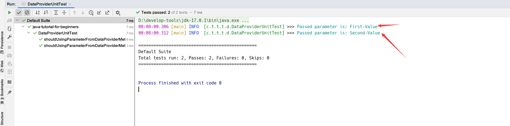
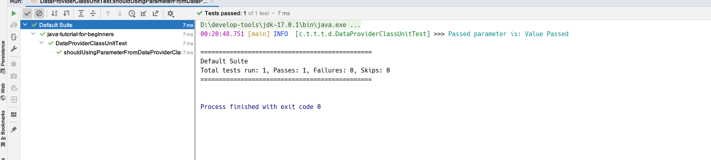
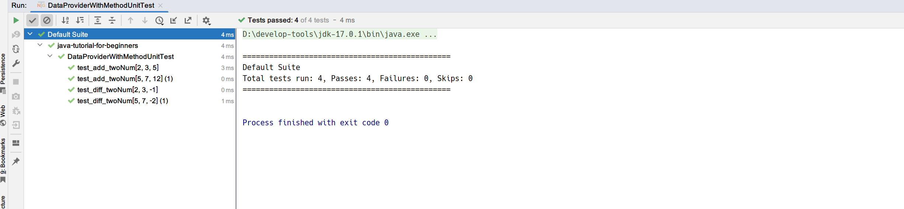

## 1. 概述

在上一个教程中，我们介绍了TestNG参数以及如何使用它们将值从XML文件传递给你的测试方法。但是，这种方式存在问题。尽管这成功地传递了值并运行了测试，但每次执行只发生一次。如果我想用多个值运行相同的测试怎么办？我们没法使用参数来实现这一点，但因为这是测试时非常常见的操作；因此需要有一个标准的方法来实现这个目标，这就是DataProviders发挥作用的地方。

## 2. 什么是DataProviders

TestNG中的DataProviders是另一种在测试方法中传递参数的方式。DataProvider以TestNG注解的形式在单个执行中将不同的值传递给TestNG测试用例。它是TestNG内置的数据驱动测试的一部分。DataProviders有助于以不同的方式传递参数。

## 3. DataProvider语法

TestNG DataProvider的使用方式如下：

```java
@DataProvider(name = "name_of_data_provider")
public Object[][] dataProviderMethod() {
    return new Object[][]{values};
}
```

在编写测试用例之前，你应该注意以下几点：

+ @DataProvider包含一个属性name。它本质上始终是字符串类型。例如，“name_of_data_provider”，如上所述。
+ @DataProvider注解不是在测试方法上声明的，而是在单独的方法上声明。这些方法称为data provider方法，例如这里的dataProviderMethod。
+ 如果你没有指定data provider的名字，那么方法名默认成为data provider的名字。
+ data provider方法返回一个Object二维数组。
+ 然后，该方法对你指定的每个值执行数据驱动测试。
+ data provider名称调用data provider方法，如果你没有指定名称，则data provider方法是接收@Test案例中使用的默认名称。

## 4. 在TestNG中使用DataProvider

如果你已经理解了上述几点，那么使用DataProvider就很容易了。我们从一个简单的例子说起：

```java
@Slf4j
public class DataProviderUnitTest {

    @DataProvider(name = "data-provider")
    public Object[][] dataProviderMethod() {
        return new Object[][]{
                {"First-Value"},
                {"Second-Value"}
        };
    }

    @Test(dataProvider = "data-provider")
    public void shouldUsingParameterFromDataProviderMethod(String val) {
        log.info("Passed parameter is: {}", val);
    }
}
```

在上面的代码中，通过dataProviderMethod方法将值“First-Value”和“Second-Value”传递给测试方法。

当我们运行该测试类时，控制台的输出如下：



**注意：与TestNG中的@Parameters不同，@DataProvider可以直接通过测试类运行**。

但是，现在我们的data provider方法写在测试类中，这无疑会污染我们的测试源代码。如果我们可以在另一个类中声明data provider方法是最好的。

## 5. TestNG中继承的DataProvider

@DataProvider注解方法和测试用例方法可以在两个不同的类中，我们可以稍微改进上面的代码：

```java
public class DataProviderClassUnitTest {

    @Test(dataProvider = "data-provider", dataProviderClass = DataProviderClass.class)
    public void shouldUsingParameterFromDataProviderClass(String val) {
        log.info("Passed parameter is: {}", val);
    }
}
```

这里唯一的区别是我们还指定了dataProviderClass属性。也就是说，提供给该测试方法的data provider方法为DataProviderClass类中@DataProvider注解name属性指定为data-provider的方法：

```java
public class DataProviderClass {

    @DataProvider(name = "data-provider")
    public static Object[][] dataProviderMethod() {
        return new Object[][]{{"Value Passed"}};
    }
}
```

当我们运行该测试方法时，控制台的输出如下：



如果你注意到，在上面的代码中，我们只是在每次执行测试用例时传递了一个参数。实际上，我们经常需要更多参数。

## 6. 在TestNG DataProvider中传递多个参数

传递多个参数与单个参数类似，我们在单个参数中提供多个值：

```java
public class MultipleParameterUnitTest {

    @DataProvider(name = "data-provider")
    public Object[][] dpMethod() {
        return new Object[][]{{2, 3, 5}, {5, 7, 12}};
    }

    @Test(dataProvider = "data-provider")
    public void shouldUsingMultiplePar(int a, int b, int result) {
        int sum = a + b;
        assertEquals(result, sum);
    }
}
```

## 7. 接收Method作为参数的DataProvider

在上述情况下，我们使用一种方法将data provider方法提供给另一个测试类，即为每个将调用它的方法创建一个data provider方法。这样我们会不必要地增加java类中的代码行数，这被认为是一种不好的编码习惯。如果我能用更少的代码行数去实现相同的目的，那么我就应该这么做。这就是data provider也接收Method作为参数的原因，然后我们可以获取方法名称并根据它提供参数。

观察以下代码：

```java
@Slf4j
public class DataProviderWithMethodUnitTest {

    @DataProvider(name = "data-provider")
    public Object[][] dataProviderMethod(Method method) {
        return switch (method.getName()) {
            case "test_add_twoNum" -> new Object[][]{{2, 3, 5}, {5, 7, 12}};
            case "test_diff_twoNum" -> new Object[][]{{2, 3, -1}, {5, 7, -2}};
            default -> null;
        };
    }

    @Test(dataProvider = "data-provider")
    public void test_add_twoNum(int a, int b, int result) {
        int sum = a + b;
        assertEquals(sum, result);
    }

    @Test(dataProvider = "data-provider")
    public void test_diff_twoNum(int a, int b, int result) {
        int diff = a - b;
        assertEquals(diff, result);
    }
}
```

dataProviderMethod方法中通过switch来检查方法名，并根据不同的方法名返回参数。

当我们运行该测试类时，控制台的输出如下：



## 8. 总结

总之，在TestNG中传递参数给测试方法有两种方式：@Parameters注解以及@DataProvider注解。

**@DataProvider在单次测试中传递不同的参数，而@Parameters每次执行时只传递一次参数**。