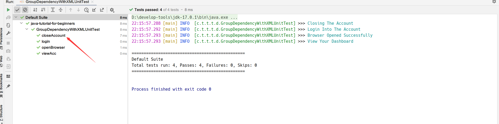
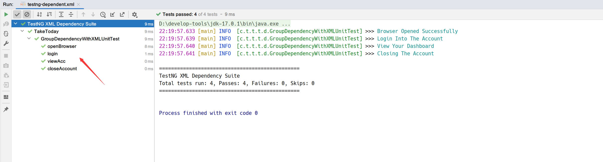

## 1. 概述

在上一个教程中，我们介绍了TestNG中组的概念以及如何在TestNG中以不同的方式使用它们。在单元测试中，我们经常需要以特定的顺序运行测试。

除此之外，我们可能希望一个测试必须仅在另一个测试运行时才运行。例如，当testA已经运行后，我们希望运行testB。也就是说testB依赖于testA，这些在TestNG中称为依赖测试。有不同类型的TestNG依赖测试，因此在本文中我们重点介绍他们。

## 2. 什么是依赖测试？

通常，我们希望在TestNG中以特定的顺序运行我们的测试用例。毫无疑问，我们可以为此使用priority参数，但priority会运行所有用例，而不是根据我们想要定义的关系(按字母顺序表示相同的优先级)。TestNG中的依赖测试决定了一个测试对单个或一组测试的依赖。在这种情况下，我们说一个测试依赖于另一个测试。

这类似于说浏览器依赖于互联网。没有互联网意味着运行浏览器没有意义。在测试之间提供依赖关系也有助于我们在方法之间共享状态或数据。

## 3. TestNG中dependsOn属性的使用

TestNG允许你通过以下两种方式指定依赖关系：

+ **在@Test注解中使用属性dependsOnMethods**

  dependsOnMethods允许我们可以使测试依赖于特定的方法。例如：
  ```java
  @Slf4j
  public class DependentWithMethodUnitTest {
  
      @Test(dependsOnMethods = {"openBrowser"})
      public void signIn() {
          log.info("This will execute second (SignIn)");
      }
  
      @Test
      public void openBrowser() {
          log.info("This will execute first (Open Browser)");
      }
  }
  ```
  在这里，我们的方法signIn()依赖于方法openBrowser()。

+ **在@Test注解中使用属性dependsOnGroups**

  dependsOnGroups属性允许我们可以使测试依赖于整个组而不是单个测试。例如：
  ```java
  @Slf4j
  public class DependentWithGroupUnitTest {
  
      @Test(dependsOnGroups = {"SignIn"})
      public void viewAcc() {
          log.info("SignIn Successful");
      }
  
      @Test(groups = {"SignIn"})
      public void login() {
          log.info("Logging In Success");
      }
  }
  ```
  这里，我们的测试方法“viewAcc()”依赖于组“SignIn”。

## 4. TestNG中的单一依赖测试方法

当单个测试依赖于另一个测试时，可以在TestNG中声明单个依赖测试。它类似于我们在上面给出的案例。我们使用dependsOnMethods来达到同样的目的。

看看下面的例子：

```java
@Slf4j
public class SingleDependentUnitTest {

    @Test(dependsOnMethods = {"openBrowser"})
    public void signIn() {
        log.info("User has signed in successfully");
    }

    @Test
    public void openBrowser() {
        log.info("The browser is opened");
    }

    @Test(dependsOnMethods = {"signIn"})
    public void logout() {
        log.info("The user logged out successfully");
    }
}
```

上述代码包含三个测试方法：

+ signIn()：该方法依赖于方法openBrowser。
+ openBrowser()：该方法不依赖于任何方法；因此它是一个标准的测试用例。
+ logout()：该方法依赖于方法signIn()。

通过使一个测试依赖于另一个测试，我们可以确保登录在浏览器打开之后才进行。仅当登录之后才会允许注销。你可以使用这些类型的逻辑在你的测试中充分利用TestNG。

当我们运行该测试类时：控制台的输出如下：

```shell
21:29:04.293 [main] INFO  [c.t.t.t.d.SingleDependentUnitTest] >>> The browser is opened 
21:29:04.299 [main] INFO  [c.t.t.t.d.SingleDependentUnitTest] >>> User has signed in successfully 
21:29:04.300 [main] INFO  [c.t.t.t.d.SingleDependentUnitTest] >>> The user logged out successfully 
```

结果与我们的预期相符。但这给我们带来了下一个问题，我们是否可以让一个测试依赖于多个测试？

## 5. TestNG中的多个依赖测试方法

单个测试依赖于TestNG中的多个测试。我们只需在dependsOnMethods属性中指定多个方法名即可：

```java
@Slf4j
public class MultipleDependentUnitTest {

    @Test
    public void openBrowser() {
        log.info("Opening The Browser");
    }

    @Test(dependsOnMethods = {"signIn", "openBrowser"})
    public void logout() {
        log.info("Logging Out");
    }

    @Test
    public void signIn() {
        log.info("Signing In");
    }
}
```

在上面的例子中，我们指定“logout”依赖于两个不同的测试，即“signIn”和“openBrowser”。logout()方法被有意的放置在三个方法中间以演示在TestNG中的依赖测试。从逻辑上讲，它会在最后运行：

```shell
21:39:21.668 [main] INFO  [c.t.t.t.d.MultipleDependentUnitTest] >>> Opening The Browser 
21:39:21.671 [main] INFO  [c.t.t.t.d.MultipleDependentUnitTest] >>> Signing In 
21:39:21.677 [main] INFO  [c.t.t.t.d.MultipleDependentUnitTest] >>> Logging Out 
```

## 6. TestNG中继承的依赖测试方法

继承是面向对象编程中的一个核心概念，尤其是如果你使用Java这种经典的面向对象语言，那么你一定听说过并经常使用它。
在之前给出的代码示例中，我们所有的测试方法都是放在同一个测试类中。

**在TestNG的继承依赖测试方法中，我们可以在属于不同类的方法之间建立依赖关系，其中一个类继承另一个类的方法**：

```java
@Slf4j
public class SuperUnitTest {

    @Test
    public void openBrowser() {
        log.info("Browser Opened");
    }
}

@Slf4j
public class InheritedDependencyUnitTest extends SuperUnitTest {

    @Test(dependsOnMethods = "openBrowser")
    public void login() {
        log.info("Logged In");
    }
}
```

从上面的代码中可以看出，InheritedDependencyUnitTest类继承了SuperUnitTest，因此可以依赖于SuperUnitTest中包含的任何方法：

```shell
21:49:06.276 [main] INFO  [c.t.t.testng.dependent.SuperUnitTest] >>> Browser Opened 
21:49:06.282 [main] INFO  [c.t.t.t.d.InheritedDependencyUnitTest] >>> Logged In 
```

## 7. TestNG中的分组依赖测试

在上面的部分中，我们只是建立了一个测试对另一个测试(单个或多个)的依赖关系。在多个测试中创建依赖关系时，我们必须手动编写每个测试方法名。例如，如果我想让一个测试依赖于其他三个测试，我需要在dependsOnMethod属性中指定所有三个方法的名称。如果我们想创建一个依赖于一组测试的依赖测试怎么办？如果我们能做到这一点，我们可以在此测试之前运行一组测试，然后我们只需要指定单个组名称而不是多个测试方法名称。

幸运的是，TestNG提供了使测试依赖于一组测试的功能：

```java
@Slf4j
public class GroupDependentUnitTest {

    @Test(dependsOnGroups = "signIn")
    public void viewAcc() {
        log.info("View Your Dashboard");
    }

    @Test(groups = "signIn")
    public void openBrowser() {
        log.info("Browser Opened Successfully");
    }

    @Test(groups = "signIn")
    public void login() {
        log.info("Login Into The Account");
    }
}
```

在上面的代码中，我们创建了一个名为signIn的组和一个依赖于该组的测试方法viewAcc。signIn组下包含两个测试，分别为openBrowser()和login。

当我们运行该测试类时：控制台的输出如下：

```java
22:01:24.732 [main] INFO  [c.t.t.t.d.GroupDependentUnitTest] >>> Login Into The Account 
22:01:24.735 [main] INFO  [c.t.t.t.d.GroupDependentUnitTest] >>> Browser Opened Successfully 
22:01:24.741 [main] INFO  [c.t.t.t.d.GroupDependentUnitTest] >>> View Your Dashboard 
```

正如我们预期的那样，viewAcc在它所依赖的所有组测试都运行后才运行。

但是，请注意在组signIn中运行的测试，我们预期先运行openBrowser测试，然后再运行login。但是在上面的输出结果中，login已经在openBrowser方法之前运行了。这显然是不正常的。

那么，你能猜到为什么会这样吗？

**由于组和注解一样，TestNG将按字母顺序运行方法**。如果我们将login重命名为test_login()，由于t在o之后，因此openBrowser会首先运行。

## 8. XML套件中的TestNG依赖测试

之前我们提到的方式都是在Java测试类中配置的。在本节中，我们看看如何在XML文件中实现这一点。

TestNG允许你在XML文件中的groups之间创建依赖关系。因此，如果你在TestNG XML文件中有多个组，你可以在XML文件中创建它们之间的依赖测试。

首先，我们编写一个测试类：

```java
@Slf4j
public class GroupDependencyWithXMLUnitTest {

    @Test(groups = {"viewacc"})
    public void viewAcc() {
        log.info("View Your Dashboard");
    }

    @Test(groups = {"openbrowser"})
    public void openBrowser() {
        log.info("Browser Opened Successfully");
    }

    @Test(groups = {"login"})
    public void login() {
        log.info("Login Into The Account");
    }

    @Test(groups = {"logout"})
    public void closeAccount() {
        log.info("Closing The Account");
    }
}
```

在上面的代码中创建了四个组并在每个组中声明了一个方法。请注意，这里还不包含任何依赖关系，因此该测试类目前会按字母顺序运行测试方法，如下所示：



从逻辑上来说，这里的运行顺序并不是我们想要的，因此我们可以在TestNG XML文件中指定它们的依赖关系：

```xml
<!DOCTYPE suite SYSTEM "https://testng.org/testng-1.0.dtd" >
<suite name="TestNG XML Dependency Suite">
    <test name="TakeToday">
        <groups>
            <dependencies>
                <group depends-on="openbrowser" name="login"/>
                <group depends-on="login" name="viewacc"/>
                <group depends-on="viewacc" name="logout"/>
            </dependencies>
        </groups>
        <classes>
            <class name="cn.tuyucheng.taketoday.testng.dependent.GroupDependencyWithXMLUnitTest"/>
        </classes>
    </test>
</suite>
```

在“dependencies”标签中，我们指定了三个组和它们的依赖关系。例如，上面的代码指出名为“login”的组应该依赖于名为“openbrowser”的组。

运行这个测试套件，控制台的输出如下：



## 9. 总结

到目前为止，已经介绍了很多内容，包括单个测试依赖、多个测试依赖、依赖测试组、以及继承依赖等。