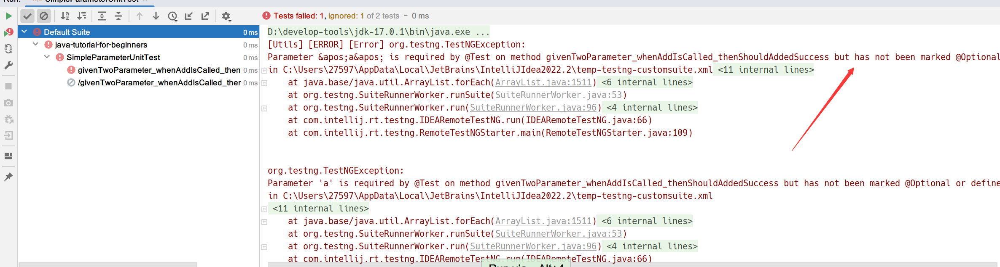
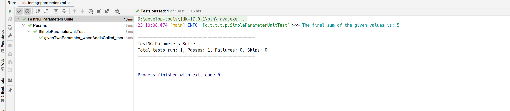
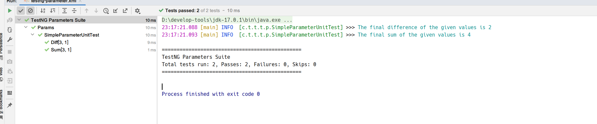
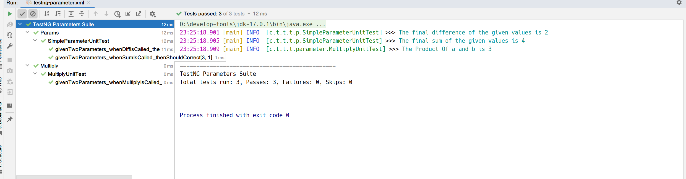
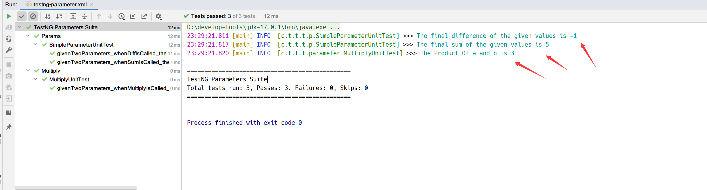
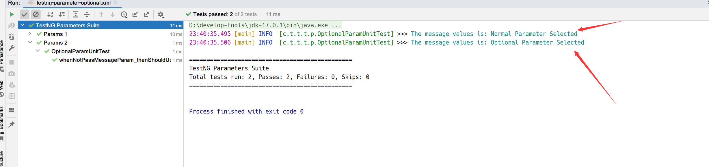

## 1. 概述

在测试环境以及开发环境中，我们经常编写方法。这样我们就不必一次又一次地运行或编写相同的代码，这些代码在结构上相似，只是传递不同的值作为输入参数。
同样的逻辑也适用于TestNG，我们可以指定一个测试方法接收参数，它接收不同的值来运行测试，例如输入不同的用户名等。

## 2. TestNG参数

TestNG中的参数类似于TestNG中的注解。与任何其他编程语言中的参数类似，它们被声明为将一些值传递给方法。使用参数的一个简单原因是，他们允许我们使用不同的值多次运行一个方法，或者使用相同的值运行不同的方法。参数在运行时传递值，在TestNG中使用参数的一个简单例子是在输入框中输入不同的值。

语法：

```java
@Parameters ({"a", "b"})
```

其中a和b是传递给方法的值。现在让我们看看一个简单的例子：

```java
@Slf4j
public class SimpleParameterUnitTest {

    @Test
    @Parameters({"a", "b"})
    public void givenTwoParameter_whenAddIsCalled_thenShouldAddedSuccess(int a, int b) {
        int finalSum = a + b;
        log.info("The final sum of the given values is: " + finalSum);
    }
}
```

当然，你可能会疑惑测试方法形参中的a和b的值为多少？事实上当我们运行该测试时，我们会得到错误：



**注意**：TestNG参数通过TestNG XML文件指定，而不是直接来自测试用例类。

因此我们需要添加以下的TestNG XML文件：

```xml
<?xml version="1.0" encoding="UTF-8"?>
<!DOCTYPE suite SYSTEM "https://testng.org/testng-1.0.dtd">
<suite name="TestNG Parameters Suite">
    <test name="Params">
        <parameter name="a" value="2"/>
        <parameter name="b" value="3"/>
        <classes>
            <class name="cn.tuyucheng.taketoday.testng.parameter.SimpleParameterUnitTest"/>
        </classes>
    </test>
</suite>
```

在上面的XML文件中，我们定义了一个名为parameters的标签：

+ **name**：你在测试类中声明的变量的名称，如上例中的a和b。
+ **value**：传递给变量的实际值。

现在，我们可以运行这个TestNG XML测试套件，运行结果显示通过：



## 3. 在套件级别定义TestNG中的参数

我们可以在TestNG中提供套件和测试级别的参数。在上面的例子中，我们在测试用例级别声明了参数。

在下面的代码中，我们将在套件级别声明它们。为了直观的观察这种行为，我们将定义两个不同的测试以及参数：

```java
@Slf4j
public class SimpleParameterUnitTest {

    @Test
    @Parameters({"a", "b"})
    public void givenTwoParameters_whenSumIsCalled_thenShouldCorrect(int a, int b) {
        int finalSum = a + b;
        log.info("The final sum of the given values is " + finalSum);
    }

    @Test
    @Parameters({"a", "b"})
    public void givenTwoParameters_whenDiffIsCalled_thenShouldCorrect(int a, int b) {
        int finalDiff = a - b;
        log.info("The final difference of the given values is " + finalDiff);
    }
}
```

在这两个方法中使用了相同的变量名。当我们在套件级别定义参数时，我们的XML文件如下所示：

```xml
<?xml version="1.0" encoding="UTF-8"?>
<!DOCTYPE suite SYSTEM "https://testng.org/testng-1.0.dtd">
<suite name="TestNG Parameters Suite">
    <test name="Params">
        <classes>
            <class name="cn.tuyucheng.taketoday.testng.parameter.SimpleParameterUnitTest"/>
        </classes>
    </test>

    <parameter name="a" value="3"/>
    <parameter name="b" value="1"/>
</suite>
```

**注意**：parameter标签的定义从<test\>移至<suite\>。

运行这个XML文件，可以看到这两个方法都成功执行，它们的值分别为4和2。



我们通过只定义一次值来实现这一点。通过在套件级别定义参数，不仅可以在同一个类的不同方法中传递相同的值，还可以在不同类的不同方法中传递相同的值。

下面我创建了另一个测试类，其中包含一个测试将两个数字相乘的方法：

```java
@Slf4j
public class MultiplyUnitTest {

    @Test
    @Parameters({"a", "b"})
    public void givenTwoParameters_whenMultiplyIsCalled_thenShouldCorrect(int a, int b) {
        int prod = a * b;
        log.info("The Product Of a and b is " + prod);
    }
}
```

**注意**：该类中测试方法指定的参数名与上一个测试类相同。

如果我们想使用相同的两个参数运行这三个测试方法，我们需要修改XML文件：

```xml
<?xml version="1.0" encoding="UTF-8"?>
<!DOCTYPE suite SYSTEM "https://testng.org/testng-1.0.dtd">
<suite name="TestNG Parameters Suite">
    <test name="Params">
        <classes>
            <class name="cn.tuyucheng.taketoday.testng.parameter.SimpleParameterUnitTest"/>
        </classes>
    </test>
    <test name="Multiply">
        <classes>
            <class name="cn.tuyucheng.taketoday.testng.parameter.MultiplyUnitTest"/>
        </classes>
    </test>

    <parameter name="a" value="3"/>
    <parameter name="b" value="1"/>
</suite>
```

执行这个TestNG套件，即使这三个测试方法位于不同的类中，它们也都成功运行：



因此，我们只需在一个地方声明、传递变量，就可以在任何测试类中使用它们。但是如果我们在两个级别上声明相同的变量会怎样？

## 4. TestNG XML中的执行顺序

我们可以在套件级别和测试级别声明变量，但这会使其中一个变得不起作用。

```xml
<?xml version="1.0" encoding="UTF-8"?>
<!DOCTYPE suite SYSTEM "https://testng.org/testng-1.0.dtd">
<suite name="TestNG Parameters Suite">
    <test name="Params">
        <parameter name="a" value="2"/>
        <parameter name="b" value="3"/>
        <classes>
            <class name="cn.tuyucheng.taketoday.testng.parameter.SimpleParameterUnitTest"/>
        </classes>
    </test>
    <test name="Multiply">
        <classes>
            <class name="cn.tuyucheng.taketoday.testng.parameter.MultiplyUnitTest"/>
        </classes>
    </test>

    <parameter name="a" value="3"/>
    <parameter name="b" value="1"/>
</suite>
```

执行TestNG测试套件并观察结果：



通过这个结果，我们可以得出结论，**TestNG优先考虑使用在测试级别定义的参数，然后才是在套件级别定义的参数**。

## 5. TestNG中的可选参数

可选参数是另一种类型的参数，其作用类似于编程语言中switch的“default”关键字。因此，如果未指定参数值，则采用可选参数值。可选参数的定义与@Parameters注解类似，但它们所处的位置不同。

在下面的代码中，包含一个OP方法，它有一个可选的参数message，并通过@Optional("Optional Parameter Selected")标注了该参数。因此，如果没有传递给message参数的值，则使用默认值“Optional Parameter Selected”：

```java
@Slf4j
public class OptionalParamUnitTest {

    @Test
    @Parameters("message")
    public void whenNotPassMessageParam_thenShouldUsingTheDefaultValue(@Optional("Optional Parameter Selected") String message) {
        log.info("The message values is: {}", message);
    }
}
```

在XML文件中，我只在第二个方法中传递了参数：

```xml
<?xml version="1.0" encoding="UTF-8"?>
<!DOCTYPE suite SYSTEM "https://testng.org/testng-1.0.dtd">
<suite name="TestNG Parameters Suite">
    <test name="Params 1">
        <parameter name="message" value="Normal Parameter Selected"/>
        <classes>
            <class name="cn.tuyucheng.taketoday.testng.parameter.OptionalParamUnitTest"/>
        </classes>
    </test>
    <test name="Params 2">
        <classes>
            <class name="cn.tuyucheng.taketoday.testng.parameter.OptionalParamUnitTest"/>
        </classes>
    </test>
</suite>
```

执行这个TestNG套件，对于其中的第二个测试，它会将默认值传递给message参数：



## 6. 总结

@Parameters允许我们能够通过仅声明一次变量值来执行大量不同的测试。它使我们的测试部分变得简单高效。你可以将@Parameters注解与任何带有@Test、@Before/@After或@Factory注解的方法一起使用。