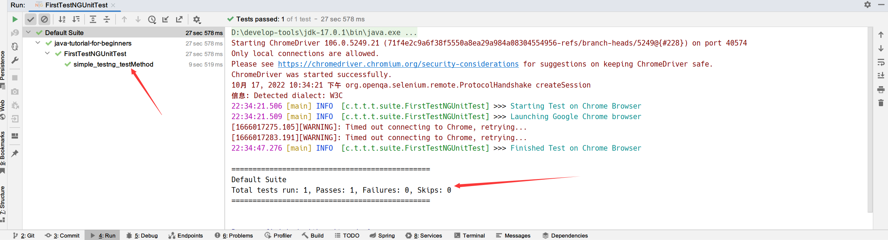

## 1. 概述

当我们在TestNG或测试套件中运行测试用例时，运行结果会显示在Intellij IDEA的Run工具窗口中。这些结果以报告的形式出现，TestNG报告非常详细、明确和复杂，因此这里单独编写一篇文章来介绍。除此之外，TestNG有自己的默认方式来开发可传输格式的报告。

## 2. Intellij IDEA中的Run窗口

我们借用前面使用过的一个TestNG测试类：

```java
@Slf4j
public class FirstTestNGUnitTest {

    WebDriver driver;

    @BeforeMethod
    public void beforeMethod() {
        System.setProperty("webdriver.chrome.driver", "D:\\chromedriver.exe");
        driver = new ChromeDriver();
        log.info("Starting Test on Chrome Browser");
    }

    @Test
    public void simple_testng_testMethod() {
        log.info("Launching Google Chrome browser");

        driver.get("https://www.toolsqa.com");
        String testTitle = "Tools QA";
        String originalTitle = driver.getTitle();

        assertEquals(originalTitle, testTitle);
    }

    @AfterMethod
    public void afterMethod() {
        driver.close();
        log.info("Finished Test on Chrome Browser");
    }
}
```

当我们运行这个测试时，Intellij IDEA中Run工具窗口可以看到这些报告：



这些报告只是显示在你的开发工具上，但最终，我们还需要将这些报告通过电子邮件发送给其他团队成员。为此，我们需要利用TestNG中所谓的“emailable-report”，让我们看看如何生成它。

## 3. 在TestNG中生成可发送电子邮件的报告

可通过电子邮件发送的报告在TestNG中生成，以便用户将他们的测试报告发送给其他团队成员。
可通过电子邮件发送的报告不需要测试人员做任何额外的工作，它们是整个测试执行的一部分。
要生成可通过电子邮件发送的报告，首先，你需要运行TestNG测试类。

运行测试用例后，会在同一目录中生成一个名为test-output的新文件夹。