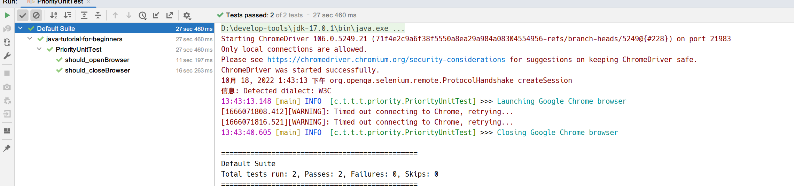
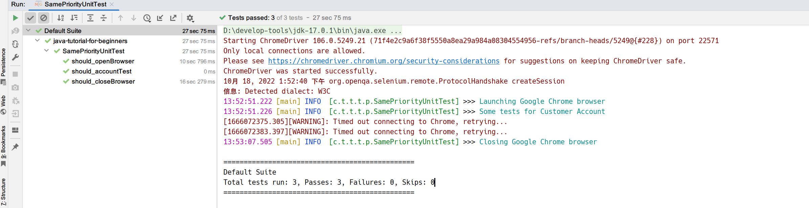
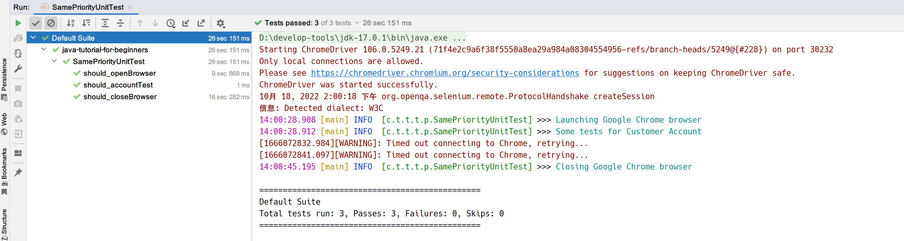
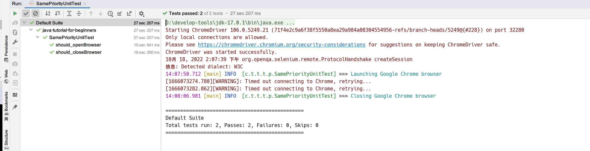

## 1. 概述

在之前的文章中，我们了解到测试用例按字母顺序串行运行。这里的一个常见问题是，我们不能一直根据这个规则运行我们的测试。
假设我有一个名为productTest的测试，并且在consumerTest之前定义它，但我希望先运行productTest，但目前来说这是不行的，根据TestNG的默认规则，consumerTest会首先运行。
因此，能够通过我们自己的想要的执行顺序定义测试的优先级至关重要，让我们看看TestNG如何为我们提供这个功能。

## 2. TestNG中的优先级

TestNG中的优先级是一种为方法提供执行顺序的方式，以便它们不会乱序运行。由于在TestNG中按字母顺序运行的测试用例没有逻辑顺序(关于测试和代码)，因此为这些测试用例提供优先级有助于我们管理测试的执行。

TestNG测试用例中的优先级是一个属性为“priority”的参数。

## 3. 在TestNG测试中给予优先级

以下是为测试用例方法分配优先级的语法：

```java
@Test (priority = 1)
public void func(){
   // test code
}
```

这里测试方法func的优先级为1，关于优先级，有几点需要注意：

+ TestNG测试方法中优先级的定义只能是@Test方法。
+ priority属性值越低，测试用例方法的优先级越高。
+ TestNG中的优先级仅包含整数值。该值可以是负数、零或正数。
+ 在TestNG中，一个方法只允许有一个优先级。
+ 优先级不能通过XML文件定义。

## 4. 使用Selenium在TestNG中运行优先级测试

在TestNG中编写具有优先级的测试用例很简单，只需要在@Test注解中指定“priority”属性。

观察下面的代码，它有两个方法should_closeBrowser和should_openBrowser：

```java
@Slf4j
public class PriorityUnitTest {
    static {
        System.setProperty("webdriver.chrome.driver", "D:\\chromedriver.exe");
    }

    WebDriver driver = new ChromeDriver();

    @Test(priority = 1)
    public void should_closeBrowser() {
        driver.close();
        log.info("Closing Google Chrome browser");
    }

    @Test(priority = 0)
    public void should_openBrowser() {
        log.info("Launching Google Chrome browser");
        driver.get("https://demoqa.com");
    }
}
```

should_openBrowser的priority属性设置为0，should_closeBrowser设置为1，因此should_openBrowser方法首先运行：



如果没有在这里声明优先级，它会按字母顺序运行，即首先运行should_closeBrowser，然后是should_openBrowser。

## 5. TestNG中具有相同优先级的测试

如果对TestNG中的所有测试声明相同的优先级怎么办？让我们通过观察以下代码来看看这个案例：

```java
@Slf4j
public class SamePriorityUnitTest {
    static {
        System.setProperty("webdriver.chrome.driver", "D:\\chromedriver.exe");
    }

    WebDriver driver = new ChromeDriver();

    @Test(priority = 1)
    public void should_closeBrowser() {
        driver.close();
        log.info("Closing Google Chrome browser");
    }

    @Test(priority = 0)
    public void should_openBrowser() {
        driver.get("https://demoqa.com");
        log.info("Launching Google Chrome browser");
    }

    @Test(priority = 1)
    public void should_accountTest() {
        log.info("Some tests for Customer Account");
    }
}
```

在上面的代码中，我们将should_closeBrowser和should_accountTest的优先级设置为1，而should_openBrowser保持其优先级为0。运行此测试的输出为：



should_openBrowser首先运行，没有问题。但是对于另外两个声明为同优先级的测试方法，似乎有点不一样。尽管首先声明了should_closeBrowser方法，但should_accountTest是在should_closeBrowser之前运行的方法。出现这种情况的原因是，如果两个或多个方法在TestNG中具有相同的优先级，那么它们的运行测试顺序是按字母顺序排列的。由于“a”在“c”之前，因此should_accountTest方法首先运行。

但是，所有没有指定优先级的测试用例都按字母顺序运行，并且所有指定相同优先级的测试用例也按字母顺序运行，那么这两种情况之间一定存在某种关系。

**没有指定优先级的测试方法的默认优先级等于0**。这意味着如果我们没有定义优先级，则所有测试方法都将被分配优先级0，

## 6. 分析优先级测试的顺序

下面给出的代码与我们上面使用的代码相同。但这次，我重新分配了所有方法的优先级：

```java
@Slf4j
public class SamePriorityUnitTest {
    static {
        System.setProperty("webdriver.chrome.driver", "D:\\chromedriver.exe");
    }

    WebDriver driver = new ChromeDriver();

    @Test(priority = 0)
    public void should_closeBrowser() {
        driver.close();
        log.info("Closing Google Chrome browser");
    }

    @Test(priority = -1)
    public void should_openBrowser() {
        driver.get("https://demoqa.com");
        log.info("Launching Google Chrome browser");
    }

    @Test
    public void should_accountTest() {
        log.info("Some tests for Customer Account");
    }
}
```

在上面的测试代码中，方法should_openBrowser指定的优先级为-1，should_closeBrowser为0，并且should_accountTest没有明确指定优先级。

以下是测试运行的结果：



通过这个测试结果，我们可以总结出以下几点：

+ 我们可以为方法指定负优先级。
+ 对于没有优先级的方法，优先级默认设置为0。

即使没有指定任何优先级，should_accountTest方法也会在should_closeBrowser之前运行，因为两者都设置优先级为0，因此它们按字母顺序运行。

## 7. TestNG中跳过测试执行

到目前为止，我们可以优先考虑测试用例并更改测试方法执行的顺序。否则，TestNG将优先级默认分配为0。但是，不管有没有指定优先级，该方法都会执行。通常，我们还可以通过enabled属性指定要跳过执行的测试方法。

例如，下面的代码意味着should_accountTest不会执行：

```java
public class SamePriorityUnitTest {
    static {
        System.setProperty("webdriver.chrome.driver", "D:\\chromedriver.exe");
    }

    WebDriver driver = new ChromeDriver();

    @Test(priority = 0)
    public void should_closeBrowser() {
        driver.close();
        log.info("Closing Google Chrome browser");
    }

    @Test(priority = -1)
    public void should_openBrowser() {
        driver.get("https://demoqa.com");
        log.info("Launching Google Chrome browser");
    }

    @Test(enabled = false)
    public void should_accountTest() {
        log.info("Some tests for Customer Account");
    }
}
```



## 8. 总结

测试优先级对于按照我们想要的顺序运行代码非常有用，它是TestNG中一个轻量级但功能强大的主题。