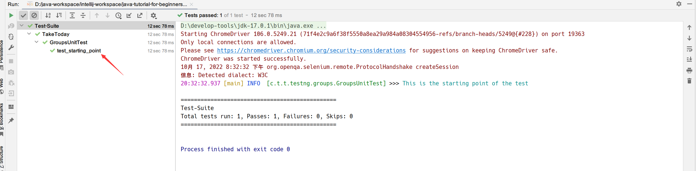

## 1. 概述

在上一篇文章中，我们介绍了TestNG中的注解以及如何在我们的测试中使用它们，并且如何同时运行多个测试，即运行一个TestNG测试套件。

TestNG还可以将测试分组，让测试人员选择运行哪些测试以及忽略哪些测试。除此之外，我们可以在TestNG中组合不同的组，使用正则表达式等等。

## 2. 什么是TestNG Groups？

TestNG中的组表示将不同的测试分组到一个简单的组中，并通过运行该组来一起运行这些该组中的所有测试。它们是否属于不同的类别甚至都没有关系。

举个例子，假设你有一个类有一百个测试，其中有十个前端测试方法，十个功能测试方法，等等。你可能希望批量运行所有前端测试。并且你希望所有这些都在一个测试套件中。在分组的帮助下，你可以通过将所有前端测试包含在一个组中来轻松克服这种情况。

TestNG还允许我们在组内对测试进行分组，我们会在本教程的后面部分介绍这一点。分组可以避免在测试源代码中定义许多类，然后分别运行这些类，从而避免浪费我们的时间。这种情况也有助于我们根据需要防止一次又一次地重新编译测试用例。

**需要注意的是，组是在TestNG的XML文件中声明的，并且一般在<test\>标签或<suite\>标签中指定**。

另外，请记住，<test\>标签中定义的组仅适用于该特定<test\>标签，但<suite\>标签中定义的组适用于XML文件中的所有<test\>标签。

例如，在下面的第一种情况下，我们在<suite\>标签内定义了组：

```xml
<!DOCTYPE suite SYSTEM "https://testng.org/testng-1.0.dtd" >
<suite name="TestNG-Groups">
    <groups>
        <run>
            <include name="UI Test"/>
        </run>
    </groups>
    <test name="Check Login Page">
        <classes>
            <class name="cn.tuyucheng.taketoday.testng.groups.GroupFirstTest"/>
        </classes>
    </test>
    <test name="Response Status">
        <classes>
            <class name="cn.tuyucheng.taketoday.testng.groups.GroupSecondTest"/>
        </classes>
    </test>
</suite>
```

由于<groups\>定义在<suite\>标签内，因此它将运行XML文件中的所有测试。对于第二种情况，请参阅上述代码中的以下调整：

```xml
<suite name="TestNG-Groups">
    <test name="Check Login Page">
        <groups>
            <run>
                <include name="UI Test"/>
            </run>
        </groups>
        <classes>
            <class name="cn.tuyucheng.taketoday.testng.groups.GroupFirstTest"/>
        </classes>
    </test>
    <test name="Response Status">
        <classes>
            <class name="cn.tuyucheng.taketoday.testng.groups.GroupSecondTest"/>
        </classes>
    </test>
</suite>
```

现在，这些组将仅在名称为GroupFirstTest的<test\>标签内生效。

## 3. 如何创建组？

在介绍更复杂的内容之前，让我们创建一个在上一节中讨论过的简单分组测试。在下面的代码中，我们将检查：

+ 是否正确获取了网页的标题。
+ 在网站上找到一个元素“Sortable”并单击该元素。

```java
@Slf4j
public class GroupsUnitTest {

    WebDriver driver;
    String title = "ToolsQA";

    @BeforeClass
    public void setUp() {
        System.setProperty("webdriver.chrome.driver", "D:\\chromedriver.exe");
        driver = new ChromeDriver();
    }

    @Test
    public void test_starting_point() {
        log.info("This is the starting point of the test");
        driver.get("https://demoqa.com");
    }

    @Test(groups = "demo", priority = 1)
    public void test_check_title() {
        String testTitle = "ToolsQA";
        String originalTitle = driver.getTitle();
        assertEquals(originalTitle, testTitle);
    }

    @Test(groups = "demo", priority = 2)
    public void test_check_element() {
        driver.findElement(By.className("banner-image")).click();
        log.info("Home Page heading is displayed");
    }
}
```

在上面的代码中，我们定义了三个测试方法：

+ **test_starting_point()**：它将初始化Chrome驱动程序并自动输入URL “https://demoqa.com”。
+ **test_check_title()**：它将检查网页的标题是否等于变量“testTitle”。
+ **test_check_element()**：此方法通过XPath在网页上找到一个名为“banner-image”的元素并单击它。

我们在其中两个方法上指定了groups属性为“demo”。现在我们需要新建一个XML文件，并在其中配置该组(如果我们想根据组运行)：

```xml
<!DOCTYPE suite SYSTEM "https://testng.org/testng-1.0.dtd" >
<suite name="Test-Suite">
    <test name="TakeToday">
        <groups>
            <run>
                <include name="demo"/>
            </run>
        </groups>
        <classes>
            <class name="cn.tuyucheng.taketoday.testng.groups.GroupsUnitTest"/>
        </classes>
    </test>
</suite>
```

我们在“include”标签中指定了组“demo”的名称。这样，我们希望只运行两个测试，因为“demo”组中只包含两个测试。

当我们运行该TestNG XML文件时，由于我们只是在第一个测试中初始化Chromedriver，因此这两个测试肯定都会失败。
但不用担心，我们可以通过在组中包含组来解决此问题。

## 4. TestNG嵌套组

TestNG提供了在另一个组内提供组并根据你的需要运行它们的灵活性。我们可以称它们为“嵌套组”，但这不是官方术语。

看看下面的XML文件：

```xml
<!DOCTYPE suite SYSTEM "https://testng.org/testng-1.0.dtd" >
<suite name="Test-Suite">
    <test name="TakeToday">
        <groups>
            <define name="SuperGroup">
                <include name="demo"/>
            </define>
            <run>
                <include name="SuperGroup"/>
            </run>
        </groups>
        <classes>
            <class name="cn.tuyucheng.taketoday.testng.groups.GroupsUnitTest"/>
        </classes>
    </test>
</suite>
```

我们创建了一个名为“SuperGroup”的新组，并将我们的demo组包含在其中。然后我们通过将新创建的组(SuperGroup)包含在run标签中来调用它来执行。

当我们运行它时，将与之前的输出相同。作为一种实践，你可以创建多个组并将所有组都包含在这个组中。你可以尝试不同的场景。

上面的部分只是告诉我们在TestNG组中如何包含其他组。如果我们想排除特定组并运行其余组怎么办？不用担心，他们也提供了相应的解决方案。

## 5. 如何在TestNG中排除组

到目前为止，为了运行这些组，我们将它们包含在“include”标签中，这很明显，因为我们想在我们的测试运行中“包含”它们。
与此类似，我们可以通过将它们放在“exclude”标签下来忽略这些组：

```xml
<!DOCTYPE suite SYSTEM "https://testng.org/testng-1.0.dtd" >
<suite name="Test-Suite">
    <test name="TakeToday">
        <groups>
            <run>
                <exclude name="demo"/>
            </run>
        </groups>
        <classes>
            <class name="cn.tuyucheng.taketoday.testng.groups.GroupsUnitTest"/>
        </classes>
    </test>
</suite>
```

通过将我们的组“demo”放在exclude标签中，我们告诉TestNG忽略组“demo”下的测试用例。因此，当我们运行该TestNG XML文件，我们可以看到只运行了第一个测试方法，因此测试通过：



在创建组时还需要记住一点，我们可以使用正则表达式定义组名的模式。

## 6. 如何在TestNG组中使用正则表达式

TestNG组允许我们自由地在include/exclude标签中包含正则表达式。这样，我们可以定义一个通用模式，它存在于多个组中，这样我们就不需要编写完整的组名。
为此，我们将test_check_title()和test_check_element()方法的组名分别更改为demo1和demo2：

```java
public class GroupsUnitTest {

    @Test(groups = "demo1", priority = 1)
    public void test_check_title() {
        // ...
    }

    @Test(groups = "demo2", priority = 2)
    public void test_check_element() {
        // ...
    }
}
```

现在，我们就可以在XML文件中使用正则表达式指定这两个组的通用模式：

```xml
<!DOCTYPE suite SYSTEM "https://testng.org/testng-1.0.dtd" >
<suite name="Test-Suite">
    <test name="TakeToday">
        <groups>
            <run>
                <exclude name="demo.*"/>
            </run>
        </groups>
        <classes>
            <class name="cn.tuyucheng.taketoday.testng.groups.GroupsUnitTest"/>
        </classes>
    </test>
</suite>
```

注意exclude标签中的正则表达式，“demo.*”表示任何以demo开头的组名都不应该包含在测试中。当我们运行测试时，可以看到这两个测试都不会执行。

## 7. 总结

TestNG中的组非常重要，因为你总是需要将测试分组到不同的测试套件中，而不是一个一个地执行它们。因此，熟练的掌握如何分组，以及如何包含、排除、使用正则表达式指定组是至关重要的。