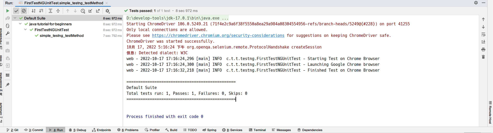
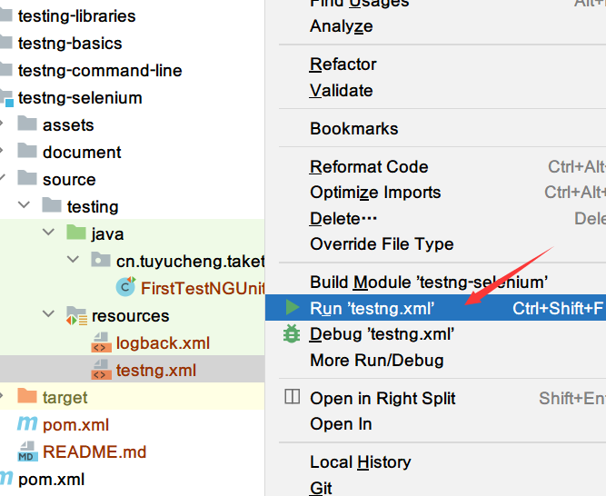
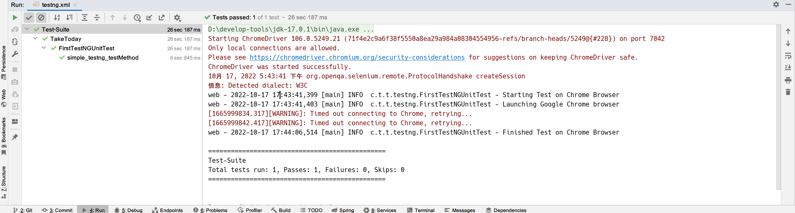

## 1. 简介

### 1.1 什么是TestNG？

TestNG是一个受JUnit和NUnit启发的测试框架，但引入了一些新的功能，使其更强大，更容易使用。

它是一个开源的自动化测试框架；其中TestNG的NG表示下一代(Next Generation)。TestNG类似于JUnit，但它比JUnit强大得多，受益于JUnit。它被设计成比JUnit更好，特别是在测试集成类时。

TestNG消除了旧框架的大部分限制，让开发人员能够通过简单的注解、分组、排序和参数化编写更灵活、更强大的测试。

### 1.2 TestNG的好处是什么？

从Selenium的角度来看，TestNG的主要好处是：

1. 它能够生成执行的HTML报告
2. 我们可以更简单的使用注解
3. 可以更容易地对测试用例进行分组和优先级排序
4. 可以进行并行测试
5. 生成日志
6. 可以进行数据参数化

### 1.3 TestNG中的测试用例编写过程

在TestNG中编写测试非常简单，主要包括以下步骤：

1. 编写测试的业务逻辑
2. 在代码中添加TestNG注解
3. 在testng.xml文件中添加关于测试的信息(例如类名、方法名、组名等)
4. 运行TestNG

### 1.4 TestNG中的注解

+ **@BeforeSuite**：在此套件中的所有测试运行之前，将运行带注解的方法。
+ **@AfterSuite**：在此套件中的所有测试运行后，将运行带注解的方法。
+ **@BeforeTest**：在运行属于标记内类的任何测试方法之前，将运行带注解的方法。
+ **@AfterTest**：在属于标签内类的所有测试方法运行后，将运行注解方法。
+ **@BeforeGroups**：带注解的方法在属于任何这些组的第一个测试方法被调用前运行。
+ **@AfterGroups**：带注解的方法在属于任何这些组的最后一个测试方法被调用后运行。
+ **@BeforeClass**：在调用当前类中的第一个测试方法之前，将运行带注解的方法。
+ **@AfterClass**：在当前类中的所有测试方法运行之后，将运行带注解的方法。
+ **@BeforeMethod**：带注解的方法将在每个测试方法之前运行。
+ **@AfterMethod**：带注解的方法将在每个测试方法之后运行。
+ **@Test**：带注解的方法是测试用例的一部分。

### 1.5 使用注解的好处

+ 它通过查找注解来标识感兴趣的方法。因此，方法名不受任何模式或格式的限制。
+ 我们可以向注解传递额外参数。
+ 注解是强类型的，因此编译器会立即标记任何错误。
+ 测试类不再需要继承任何东西(例如JUnit 3的TestCase)。

## 2. TestNG测试

### 2.1 Maven依赖

```xml
<dependencies>
    <dependency>
        <groupId>org.testng</groupId>
        <artifactId>testng</artifactId>
        <version>7.4.0</version>
        <scope>test</scope>
    </dependency>
</dependencies>
```

### 2.2 第一个TestNG测试类

```java
public class FirstTestNGUnitTest {

    @BeforeMethod
    public void beforeMethod() {
    }

    @Test
    public void simple_testng_testMethod() {
    }

    @AfterMethod
    public void afterMethod() {
    }
}
```

通过创建第一个测试类，我们现在可以继续编写第一个TestNG测试用例。

在下面我们编写了一个简单的TestNG测试用例代码，其中使用到的是Selenium：

```java
@Slf4j
public class FirstTestNGUnitTest {

    WebDriver driver;

    @BeforeMethod
    public void beforeMethod() {
        System.setProperty("webdriver.chrome.driver", "D:\\chromedriver.exe");
        driver = new ChromeDriver();
        log.info("Starting Test on Chrome Browser");
    }

    @Test
    public void simple_testng_testMethod() {
        log.info("Launching Google Chrome browser");

        driver.get("https://www.toolsqa.com");
        String testTitle = "Tools QA";
        String originalTitle = driver.getTitle();

        assertEquals(originalTitle, testTitle);
    }

    @AfterMethod
    public void afterMethod() {
        driver.close();
        log.info("Finished Test on Chrome Browser");
    }
}
```

当我们在Intellij IDEA中运行该类时，它将成功运行你的测试。请注意与上述测试用例有关的几点：

+ **main方法对于TestNG测试来说不是必需的**。
+ **此外，TestNG类中的方法不必是静态的**。
+ **@Test注解告诉TestNG被标注方法是一个测试方法**。
+ **@BeforeMethod表示被标注方法应该在测试方法之前运行**。
+ **@AfterMethod表示被标注方法应该在测试方法之后运行**。

下面是Intellij IDEA中控制台中执行结果：



## 3. TestNG测试套件

通常情况下，我们在项目中会包含很多的测试类。为了测试软件或项目的行为，我们需要同时运行多个测试。此外，手动一个一个地运行它们并不是正确的方法。
这种一次运行多个测试的过程称为测试套件，在TestNG中执行该过程称为TestNG测试套件。

### 3.1 什么是测试套件

TestNG测试的集合称为测试套件。通过执行测试套件，测试套件可以一次运行多个测试。此外，这些测试用例可以彼此依赖，也可以按照特定的顺序独立执行。此外，运行TestNG测试套件使我们能够管理我们的测试执行。

**重要的是要记住，TestNG不允许我们在测试代码或主测试源代码中定义测试套件。
因此，我们需要为此创建一个TestNG XML文件并执行该文件**。

### 3.2 如何创建和运行TestNG测试套件？

在TestNG中运行测试套件需要我们创建一个TestNG XML文件并执行它来实现目标。只有通过这个TestNG XML文件，我们才能够在TestNG框架中创建和处理多个测试类。除此之外，XML文件将是你配置测试运行、设置测试依赖关系、包含或排除任何测试、方法、类或包以及设置优先级等的目标文件。

要创建用于运行TestNG测试套件的TestNG XML文件，我们可以在resources目录中新建一个testng-suite.xml文件：

```xml
<!DOCTYPE suite SYSTEM "https://testng.org/testng-1.0.dtd" >
<suite name="Test-Suite">
    <test name="TakeToday">
        <classes>
            <class name="cn.tuyucheng.taketoday.testng.suite.FirstTestNGUnitTest"/>
        </classes>
    </test>
</suite>
```

**注意：TestNG XML文件的名字可以任意**。该文件中涉及到的一些标签：

+ <suite\>：suite标签可以指定任何名称，并表示测试套件名称。
+ <test\>：test标签可以指定任何名称，并指示你的测试集。
+ <classes\>：这是包名和测试用例名的组合，不能编写任何其他内容。

**注意**：我们的测试类位于cn.tuyucheng.taketoday.testng包中，因此我们指定name属性的值为“cn.tuyucheng.taketoday.testng.suite.FirstTestNGUnitTest”。

现在我们可以运行该测试套件，在Intellij IDEA中，我们右键该文件，选择Run：



启动TestNG执行引擎需要几秒钟的时间。在此之后，一旦执行完成，就可以在控制台中看到测试的执行结果：



现在，我们可以新添加一个测试类，并在testng-suite.xml文件中新增一个<class\>标签的定义：

```java
@Slf4j
public class SecondTestNGUnitTest {

    @BeforeMethod
    public void setUp() {
        log.info("before test case executing...");
    }

    @Test
    public void simple_testng_case() {
        log.info("executing the testng test case");
    }

    @AfterMethod
    public void tearDown() {
        log.info("after test case executing...");
    }
}
```

```xml
<!DOCTYPE suite SYSTEM "https://testng.org/testng-1.0.dtd" >
<suite name="Test-Suite">
    <test name="TakeToday">
        <classes>
            <class name="cn.tuyucheng.taketoday.testng.suite.FirstTestNGUnitTest"/>
            <class name="cn.tuyucheng.taketoday.testng.suite.SecondTestNGUnitTest"/>
        </classes>
    </test>
</suite>
```

上面的测试套件会执行那些在<classes\>标签中指定的所有测试用例。当你再次运行该测试套件时，你可以看到上面的两个测试类都成功执行。
此外，TestNG是一个直接而健壮的框架，它的功能来源于它提供的注解。

## 4. TestNG注解

TestNG注解是在源测试代码逻辑中编写的代码，用于控制测试执行的流程。在TestNG中使用注解标注你的方法以运行测试是必不可少的。
TestNG将忽略不包含注解的方法，因为它不知道何时执行该方法。

### 4.1 TestNG注解的类型

+ **@BeforeSuite**：TestNG中的@BeforeSuite方法在所有其他测试方法执行之前运行。
+ **@AfterSuite**：TestNG中的@AfterSuite方法在所有其他测试方法执行之后运行。
+ **@BeforeTest**：TestNG中的@BeforeTest方法在执行该文件夹内的所有测试方法之前运行。
+ **@AfterTest**：TestNG中的@AfterTest方法在该文件夹内的所有测试方法执行后执行。
+ **@BeforeClass**：TestNG中的@BeforeClass方法将在当前类的第一个测试方法执行之前运行。
+ **@AfterClass**：TestNG中的@AfterClass方法将在当前类的所有测试方法执行后执行。
+ **@BeforeMethod**：TestNG中的@BeforeMethod方法将在每个测试方法之前执行。
+ **@AfterMethod**：TestNG中的@AfterMethod方法将在每个测试方法执行之后执行。
+ **@BeforeGroups**：TestNG中的@BeforeGroups方法在该组的测试用例执行之前运行，它只执行一次。
+ **@AfterGroups**：TestNG中的@AfterGroups方法在该组的测试用例执行后运行，它只执行一次。

### 4.2 使用注解的好处

+ 易于学习：注解非常易于学习。没有预定义的规则或格式，测试人员只需要使用他们的判断来注解方法。
+ 可以参数化：注解也可以参数化，就像Java中的任何其他方法一样。
+ 强类型：在编译器为你指出任何可能的错误。
+ 无需继承任何类：使用注解时，测试类不需要继承任何其他类。

### 4.3 TestNG注解的运行顺序

TestNG提供了许多注解来在测试软件时编写测试源代码。那么，TestNG如何确定先运行哪个测试用例？
一般来说，TestNG中注解方法的运行顺序为：

+ @BeforeSuite
+ @BeforeTest
+ @BeforeClass
+ @BeforeMethod
+ @Test
+ @AfterMethod
+ @AfterClass
+ @AfterTest
+ @AfterSuite

我们可以通过一个简单的测试用例，来证明这一点：

```java
@Slf4j
public class AnnotationMethodExecutedOrderTest {

    @Test
    public void simple_testng_testcase_1() {
        log.info("5. test method 1");
    }

    @BeforeMethod
    public void beforeMethod() {
        log.info("4. beforeMethod");
    }

    @AfterMethod
    public void afterMethod() {
        log.info("6. afterMethod");
    }

    @BeforeClass
    public void beforeClass() {
        log.info("3. beforeClass");
    }

    @AfterClass
    public void afterClass() {
        log.info("7. afterClass");
    }

    @BeforeTest
    public void beforeTest() {
        log.info("2. beforeTest");
    }

    @AfterTest
    public void afterTest() {
        log.info("8. afterTest");
    }

    @BeforeSuite
    public void beforeSuite() {
        log.info("1. beforeSuite");
    }

    @AfterSuite
    public void afterSuite() {
        log.info("9. afterSuite");
    }
}
```

当我们运行上述测试类时：控制台的输出如下：

```shell
18:17:25.138 [main] INFO  [c.t.t.t.e.AnnotationMethodExecutedOrderTest] >>> 1. beforeSuite 
18:17:25.142 [main] INFO  [c.t.t.t.e.AnnotationMethodExecutedOrderTest] >>> 2. beforeTest 
18:17:25.155 [main] INFO  [c.t.t.t.e.AnnotationMethodExecutedOrderTest] >>> 3. beforeClass 
18:17:25.167 [main] INFO  [c.t.t.t.e.AnnotationMethodExecutedOrderTest] >>> 4. beforeMethod 
18:17:25.168 [main] INFO  [c.t.t.t.e.AnnotationMethodExecutedOrderTest] >>> 5. test method 1 
18:17:25.170 [main] INFO  [c.t.t.t.e.AnnotationMethodExecutedOrderTest] >>> 6. afterMethod 
18:17:25.172 [main] INFO  [c.t.t.t.e.AnnotationMethodExecutedOrderTest] >>> 7. afterClass 
18:17:25.174 [main] INFO  [c.t.t.t.e.AnnotationMethodExecutedOrderTest] >>> 8. afterTest 
18:17:25.175 [main] INFO  [c.t.t.t.e.AnnotationMethodExecutedOrderTest] >>> 9. afterSuite 
```

### 4.4 多个测试用例

如果有多个@Test测试方法，TestNG将按字母顺序运行测试用例。因此，测试对于测试方法：

```java
@Test
public void alpha(){
}
```

将在以下测试方法之前运行：

```java
@Test
public beta(){
}
```

### 4.5 TestNG中的测试优先级

priority是我们可以与@Test注解一起使用的额外参数。该属性决定测试方法的优先级。priority数字越大，其优先级越低。所以priority为1的方法将在priority为0的测试之后运行。了解这一点后，一个真正的问题是，如果两种方法的优先级相同，该怎么办？

测试人员可能会(有意或无意地)为TestNG注解下的不同方法提供相同的优先级。在这种情况下，TestNG按字母顺序运行测试用例。所以下面的测试用例：

```java
@Slf4j
public class ExecutedPriorityTest {

    @Test(priority = 1)
    public void b_method() {
        log.info("B method");
    }

    @Test(priority = 1)
    public void a_method() {
        log.info("A method");
    }
}
```

执行后的输出如下：

```shell
19:02:07.199 [main] INFO  [c.t.t.t.e.ExecutedPriorityTest] >>> A method 
19:02:07.204 [main] INFO  [c.t.t.t.e.ExecutedPriorityTest] >>> B method 
```

两个没有指定优先级的测试将按字母顺序运行，具有相同优先级的测试用例也按字母顺序运行。但是，它们的组合呢？

我们需要解释TestNG如何在有和没有优先级配置的情况下执行测试用例。为此，我们在之前的代码中添加另外两个方法：

```java
public class ExecutedPriorityTest {

    @Test
    public void d_method() {
        log.info("D method");
    }

    @Test
    public void c_method() {
        log.info("C method");
    }
}
```

当我们运行该测试类时：控制台的输出如下：

```shell
19:05:48.717 [main] INFO  [c.t.t.t.e.ExecutedPriorityTest] >>> C method 
19:05:48.722 [main] INFO  [c.t.t.t.e.ExecutedPriorityTest] >>> D method 
19:05:48.723 [main] INFO  [c.t.t.t.e.ExecutedPriorityTest] >>> A method 
19:05:48.724 [main] INFO  [c.t.t.t.e.ExecutedPriorityTest] >>> B method 
```

没有指定priority属性的测试用例在配置了priority属性的方法之前执行。此外，它们按字母顺序运行。注解是TestNG的核心，掌握它们就意味着掌握了TestNG。因此，你需要不断的练习TestNG中注解的使用，以便更好的使用TestNG。

### 4.6 常见问题

使用参数是使用注解的一种非常常见的方式。参数的使用与Java中的方法类似。下面是一个使用参数的例子：

```java
@Slf4j
public class ParameterUnitTest {

    @Test
    @Parameters({"suite-param"})
    public void test_parameter_1(String param) {
        log.info("Test one suite param is: {}", param);
    }
}
```

## 5. 总结

在本文中，我们介绍了TestNG是什么，并编写了第一个TestNG测试用例。之后我们演示了TestNG中的测试套件、以及TestNG中核心注解的使用。最后，通过@Test注解priority属性，我们可以指定测试方法的执行顺序。