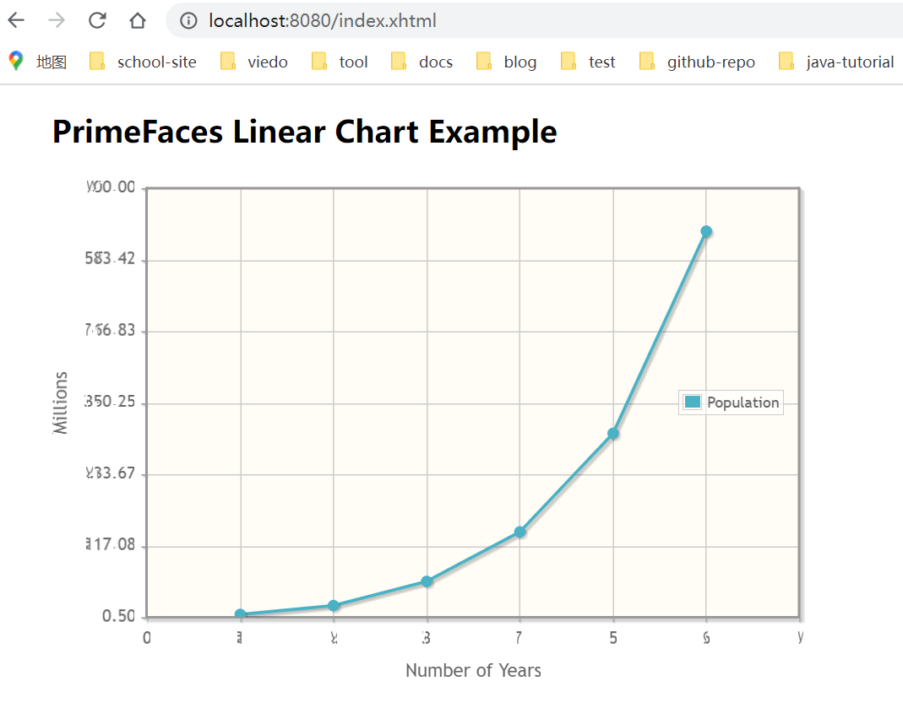

## 1. Maven依赖

```xml
<dependency>
	<groupId>org.primefaces</groupId>
	<artifactId>primefaces</artifactId>
	<version>8.0</version>
</dependency>
<dependency>
	<groupId>com.sun.faces</groupId>
	<artifactId>jsf-api</artifactId>
	<version>2.2.20</version>
</dependency>
<dependency>
	<groupId>com.sun.faces</groupId>
	<artifactId>jsf-impl</artifactId>
	<version>2.2.20</version>
</dependency>
<dependency>
	<groupId>javax.annotation</groupId>
	<artifactId>javax.annotation-api</artifactId>
	<version>1.3.2</version>
</dependency>
<dependency>
	<groupId>org.apache.tomcat.embed</groupId>
	<artifactId>tomcat-embed-jasper</artifactId>
	<scope>provided</scope>
</dependency>
```

## 2. Managed Bean

在Spring Boot应用程序中，一个JSF托管bean也是一个Spring bean。

```java
@Component
@ManagedBean
@ViewScoped
public class LineChartBean {
    @Autowired
    private DataService dataService;
    private LineChartModel lineModel;

    @PostConstruct
    public void init() {
        lineModel = new LineChartModel();
        LineChartSeries s = new LineChartSeries();
        s.setLabel("Population");

        dataService.getLineChartData().forEach(s::set);

        lineModel.addSeries(s);
        lineModel.setLegendPosition("e");
        Axis y = lineModel.getAxis(AxisType.Y);
        y.setMin(0.5);
        y.setMax(700);
        y.setLabel("Millions");

        Axis x = lineModel.getAxis(AxisType.X);
        x.setMin(0);
        x.setMax(7);
        x.setTickInterval("1");
        x.setLabel("Number of Years");
    }

    public LineChartModel getLineModel() {
        return lineModel;
    }
}
```

## 3. DataService

```java
@Service
public class DataService {

    public Map<Integer, Double> getLineChartData() {
        Map<Integer, Double> map = new LinkedHashMap<>();
        map.put(1, 5.20);
        map.put(2, 19.63);
        map.put(3, 59.01);
        map.put(4, 139.76);
        map.put(5, 300.4);
        map.put(6, 630.0);
        return map;
    }
}
```

## 4. Spring ELResolver

SpringBeanFacesELResolver允许我们将JSF管理的bean用作Spring bean，并在那里注入其他Spring bean。

```xml
<?xml version="1.0" encoding="UTF-8"?>
<faces-config xmlns="http://xmlns.jcp.org/xml/ns/javaee"
              xmlns:xsi="http://www.w3.org/2001/XMLSchema-instance"
              xsi:schemaLocation="http://xmlns.jcp.org/xml/ns/javaee/web-facesconfig_2_2.xsd"
              version="2.2">
    <application>
        <el-resolver>org.springframework.web.jsf.el.SpringBeanFacesELResolver
        </el-resolver>
    </application>
</faces-config>
```

## 5. JSF页面

```xhtml
<?xml version="1.0" encoding="UTF-8"?>
<!DOCTYPE html PUBLIC "-//W3C//DTD XHTML 1.0 Transitional//EN"
		"http://www.w3.org/TR/xhtml1/DTD/xhtml1-transitional.dtd">
<html xmlns="http://www.w3.org/1999/xhtml"
	  xmlns:h="http://java.sun.com/jsf/html"
	  xmlns:p="http://primefaces.org/ui"
	  xmlns:ui="http://java.sun.com/jsf/facelets">
<h:head>
</h:head>
<h:body style="margin-left:50px">
	<h2>PrimeFaces Linear Chart Example</h2>
	<p:chart type="line" model="#{lineChartBean.lineModel}" style="height:400px;width:600px"/>
</h:body>
</html>
```

## 6. Spring Boot主类

```java
@SpringBootApplication
public class Main{

    public static void main (String[] args) {
        SpringApplication.run(Main.class, args);
    }

    @Bean
    ServletRegistrationBean jsfServletRegistration (ServletContext servletContext) {
        // spring boot only works if this is set
        servletContext.setInitParameter("com.sun.faces.forceLoadConfiguration", Boolean.TRUE.toString());

        // registration
        ServletRegistrationBean srb = new ServletRegistrationBean();
        srb.setServlet(new FacesServlet());
        srb.setUrlMappings(Arrays.asList("*.xhtml"));
        srb.setLoadOnStartup(1);
        return srb;
    }
}
```

## 7. 启动应用程序

```she
mvn spring-boot:run
```

-----------------------------------------------------------

