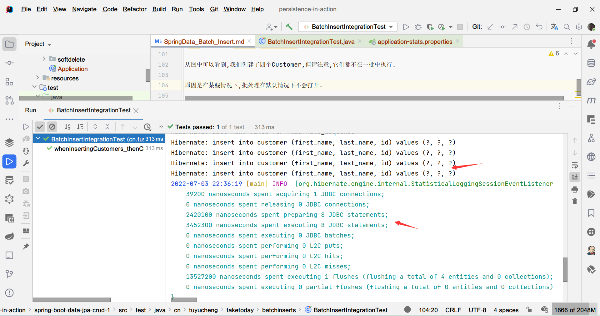
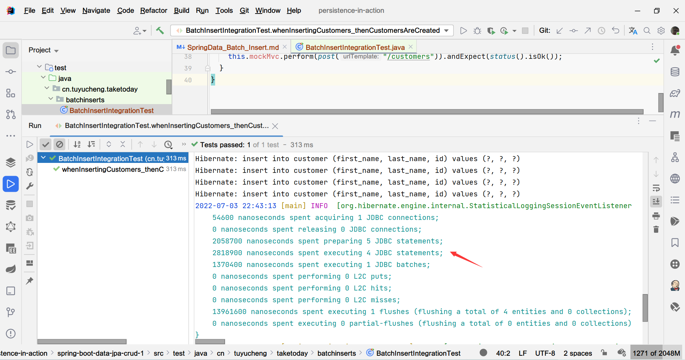

## 1. 概述

访问数据库的代价是很大的，我们可以通过将多个插入批处理到一个插入中来提高性能和一致性。

在本教程中，我们将了解如何使用Spring Data JPA实现这一点。

## 2. Spring JPA Repository

首先，我们需要一个简单的实体，假如为Customer：

```java
@Entity
public class Customer {

    @Id
    @GeneratedValue(strategy = GenerationType.AUTO)
    private Long id;
    private String firstName;
    private String lastName;
    // constructor, getters, setters ...
}
```

然后，我们需要一个对应的Repository接口：

```java
@Repository
public interface CustomerRepository extends CrudRepository<Customer, Long> {

}
```

**通过继承CrudRepository接口，我们可以直接使用一个saveAll()方法，它将多个插入批处理到一个插入中**。

然后，我们可以在控制器中使用该方法：

```java
@RestController
public class CustomerController {
    CustomerRepository customerRepository;

    public CustomerController(CustomerRepository customerRepository) {
        this.customerRepository = customerRepository;
    }

    @PostMapping("/customers")
    public ResponseEntity<List<Customer>> insertCustomers() {
        Customer c1 = new Customer("James", "Gosling");
        Customer c2 = new Customer("Doug", "Lea");
        Customer c3 = new Customer("Martin", "Fowler");
        Customer c4 = new Customer("Brian", "Goetz");
        List<Customer> customers = Arrays.asList(c1, c2, c3, c4);
        customerRepository.saveAll(customers);
        return ResponseEntity.ok(customers);
    }
}
```

## 3. 测试我们的端点

使用MockMvc测试我们的代码很简单：

```java
@ExtendWith(SpringExtension.class)
@SpringBootTest(classes = JpaInsertApplication.class)
@AutoConfigureMockMvc
class BatchInsertIntegrationTest {

    @Autowired
    private CustomerRepository customerRepository;
    private MockMvc mockMvc;

    @BeforeEach
    void setUp() {
        mockMvc = MockMvcBuilders.standaloneSetup(new CustomerController(customerRepository))
                .build();
    }

    @Test
    void whenInsertingCustomers_thenCustomersAreCreated() throws Exception {
        this.mockMvc.perform(post("/customers"))
                .andExpect(status().isOk());
    }
}
```

## 4. 什么时候使用批处理执行

**实际上，我们还有一点配置要做**，让我们通过一个例子来说明区别。

首先，我们将以下属性添加到application.properties中，用于记录一些统计信息：

```properties
spring.jpa.properties.hibernate.generate_statistics=true
```

此时，如果我们运行测试，我们可以在控制台看到如下统计信息：



从图中可以看到，我们创建了四个Customer，**但请注意，它们都不在一批中执行**。**原因是在某些情况下，批处理默认情况下不会开启**。

**在我们的例子中，这是因为我们使用id的生成策略为auto-generation。因此，默认情况下，saveAll()会分别执行每个插入操作**。

所以我们必须手动开启：

```properties
spring.jpa.properties.hibernate.jdbc.batch_size=4
spring.jpa.properties.hibernate.order_inserts=true
```

第一个属性告诉Hibernate以四个为一批收集插入语句。order_inserts属性告诉Hibernate按实体对插入进行分组，从而创建更大的批次。

**当我们再次运行测试时，我们会看到插入操作被分批处理**：



我们可以对delete和update使用相同的方法(**Hibernate也包含order_updates属性**)。

## 5. 总结

通过批量插入，我们可以换来性能的提升。当然，我们需要知道的是批处理在某些情况下会自动禁用。